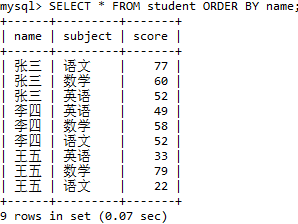
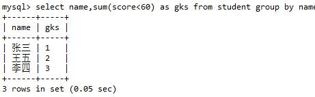

1.15-滴滴云

作者：venturekwok
链接：https://www.nowcoder.com/discuss/588686
来源：牛客网


## 一面

## 先项目介绍，然后两个算法题目

- [反转链表](https://www.nowcoder.com/practice/75e878df47f24fdc9dc3e400ec6058ca?tpId=117&&tqId=23286)

```java
/*
public class ListNode {
    int val;
    ListNode next = null;

    ListNode(int val) {
        this.val = val;
    }
}*/
public class Solution {
    public ListNode ReverseList(ListNode head) {
        //判断链表是否为空，或者链表长度为1
        if(head == null || head.next == null){
            return head;
        }
        ListNode pre = null; //当前节点的前一个节点
        ListNode next = null; //当前节点的下一个节点
        while(head != null){
            next = head.next; //记录当前节点的下一个节点
            head.next = pre; //让当前节点的next指针指向前一个节点，完成反转
            pre = head; //pre往右走
            head = next; //当前节点继续往右走
        }
        return pre;
    }
}
```


- [二分查找有序重复数组](https://www.nowcoder.com/practice/7bc4a1c7c371425d9faa9d1b511fe193?tpId=117&&tqId=1024577)
  - 追问， 如果有很多重复数字怎么办？
  - 解决方案 继续二分

```java
import java.util.*;

public class Solution {
    public int upper_bound_ (int n, int v, int[] a) {
        // 升序数组中所有的数都比给定的数字小
        if(a[n-1] < v){
            return n + 1;
        }
        int left = 0;
        int right = n-1;
        while(left < right){
            int mid = left + (right - left)/2; //中间点
            if(a[mid] >= v){
                right = mid;
            }else{
                left = mid + 1;
            }
        }
        return left + 1; //输出位置是从1
        
    }
}
```


- ## **数据库为什么是 B+ 树而不是hash表等等**

  1. hash表只能匹配是否相等，**不能实现范围查找**

     由于 Hash 索引比较的是进行 Hash 运算之后的 Hash 值，所以它只能用于等值的过滤，不能用于基于范围的过滤，因为经过相应的 Hash 算法处理之后的 Hash 值的大小关系，并不能保证和Hash运算前完全一样。例如：select * from xx where id > 23; 这时就没办法索引了。

  2. 当需要按照索引进行order by排序操作时，hash值**没办法支持排序**。

     特别是在有大量重复键值的情况下，哈希索引的效率是非常低的

  3. Hash 索引**不能利用部分索引键查询**。

     组合索引可以支持部分索引查询，如(a,b,c)的组合索引，查询中只用到了a和b也可以查询的，而Hash 索引在计算 Hash 值的时候，是组合索引键合并后再一起计算 Hash 值，而不是单独计算 Hash 值，没办法支持部分索引。

  4. 当数据量很大时，**hash冲突的概率也会非常大**。

     特别是在有大量重复键值的情况下，哈希索引的效率是非常低的

  [参考1](https://www.jianshu.com/p/2bb912caa3b1)

  [参考2](https://blog.csdn.net/Alen_xiaoxin/article/details/104753391)

  

- ## **进程和线程介绍一下**

  *(我这里写的是进程和线程的区别)*

  1. 拥有资源：进程是资源分配的基本单位，但是线程不拥有资源，一个进程可以包括多个线程，这些线程共享进程资源。
  2. 调度：线程是独立调度的基本单位，同一进程中，线程的切换不会引起进程切换，从一个进程内的线程切换到另一个进程内的线程会引起进程切换。
  3. 系统开销：创建和撤销进程时，系统都要为之分配或回收资源，所付出的开销远大于创建或撤销线程时的开销。同样的在进程切换时，也会涉及当前执行进程 CPU 环境的保存以及新调度进程 CPU 环境的设置，而线程的切换只需保存和设置少量寄存器的内容，开销很小。
  4. 通信方面：进程间通信需要进程同步和互斥手段的辅助，以保证数据的一致性。而线程间可以通过直接读/写同意进程中的数据段（如全局变量）来进行通信。

  [参考](https://juejin.cn/post/6844903809081163790)

  

- ## **进程之间通信方式**

  1. 管道/匿名管道(pipe)：管道是一种**半双工**的通信方式，数据只能单向流动，而且只能在**具有亲缘关系**的进程间使用。进程的亲缘关系通常是指父子进程关系。

     

  2. 命名管道FIFO：有名管道也是**半双工**的通信方式，但是它**允许无亲缘关系**进程间的通信。

  3. 消息队列MessageQueue：消息队列是由**消息的链表**，存放在内核中并由消息队列标识符标识。消息队列克服了信号传递信息少、管道只能承载无格式字节流以及缓冲区大小受限等缺点。

  4. 共享内存SharedMemory：共享内存就是映射一段**能被其他进程**所访问的内存，这段共享内存由一个进程创建，但多个进程都可以访问。共享内存是**最快**的 IPC(InterProcess Communication,进程通信) 方式，它是针对其他进程间通信方式运行效率低而专门设计的。它往往与其他通信机制，如信号两两配合使用，来实现进程间的同步和通信。

     

  5. 信号量Semaphore：信号量是一个计数器，可以用来控制**多个进程对共享资源**的访问。它常作为一种**锁机制**，防止某进程正在访问共享资源时，其他进程也访问该资源。因此，主要作为进程间以及同一进程内不同线程之间的同步手段。

     

  6. 套接字Socket：套接字是一种通信机制，凭借这种机制，客户/服务器（即要进行通信的进程）系统的开发工作既可以在本地单机上进行，也可以跨网络进行，即可以让通过网络连接的计算机上的进程进行通信。套接字是支持TCP/IP的网络通信的基本操作单元，可以看做是不同主机之间进程进行双向通信的端点。

     

  7. 信号 ( sinal ) ： 信号是Linux系统中用于进程间互相通信或者操作的一种机制，信号可以在任何时候发给某一进程，而无需知道该进程的状态。信号是一种比较复杂的通信方式，用于通知接收进程某个事件已经发生。

  [参考1](https://www.jianshu.com/p/c1015f5ffa74)

  [参考2](https://blog.csdn.net/yang_teng_/article/details/53325280)

  

- ## **键盘按下一个键，之后发生了什么？**

  （不会）

  按下按键，触发中断，中断服务程序获取上下文查找中断向量表，然后执行中断处理程序，进行对应的io操作得到按键码，查找*key_layout.kl文件得到key_event然后返回。

  应用程序调用系统接口得到key down的event触发调用应用程序的处理函数(假定是渲染字符)，调用系统图形库或直接调用freetype等，执行对应字符的渲染，流程结束。

  

- ## 如果一个进程2GB， fork 之后这两个进程占用多少内存？

  还是占有2GB。

  fork（）会产生一个和父进程**完全相同**的子进程。fork()的时候，父进程的虚拟地址映射着物理内存的实际的物理地址，克隆子进程的时候，并不是在物理地址中直接再复制一份和父进程一样的物理内存块，而是子进程的虚拟地址也直接映射到同一物理内存块中，这就是**读时共享**。

  当你操作这个物理内存块时（比如修改变量的值），再复制该部分的实际物理内存到子进程中，并不是全部复制。这就是**写时复制**。所以，当你在后面的程序中操作遍历n时，就会另辟内存块给子进程，表示这两者的独立。这就是**读时共享，写时复制。**

  [参考](https://zhuanlan.zhihu.com/p/53527981)

  

- ## mysql 写查询：给定name， subject ，score， 查挂了两门课程以上学生的个数

  

  ```sql
  select name,sum(score<60) as gks from student group by name;
  ```

  

  ```sql
  select name,sum(score<60) as gks from student group by name having gks>2;
  ```

  

  ```sql
   select count(name) from(select name,sum(score<60) as gks from student group by name having gks>2)as a;
  ```
  
  
  
  [参考](https://blog.csdn.net/qq_41051690/article/details/98749438)


## 二面

上来自我介绍 + 询问项目

> **JUC 问了很多**

java.util.concurrent 包是专为 Java`并发编程`而设计的包。

## **Concurrent 包下的东西**

- locks部分：显式锁(互斥锁和速写锁)相关；

- atomic部分：原子变量类相关，是构建非阻塞算法的基础；

- executor部分：线程池相关；

- collections部分：并发容器相关；

- tools部分：同步工具相关，如信号量、闭锁、栅栏等功能；

  [参考](https://blog.csdn.net/wbwjx/article/details/57856045)

## **ConcurrentHashMap 底层**

**HashTable**使用的是**Synchronize**关键字，是对一个大的数组加一把锁，其实是对对象加锁，锁住的是对象整体，性能较差，现在**ConcurrentHashMap**采用的是分段式锁，可以理解为把一个大的**Map**拆封成**N**个小的**Segment**，在**put**数据时会根据**hash**来确定具体存放在哪个**Segment**中，每一个**Segment**都会分配一把锁，当线程占用锁访问其中一段数据时，其他段的数据也能被其他线程访问，实现并发访问。


**ConcurrentHashMap**在**JDK1.7**和**JDK1.8**之间是有区别的.

**JDK1.7中**数据结构是由一个**Segment数组**和多个**HashEntry数组**组成的，每一个**Segment**元素中存储的是**HashEntry数组**+**链表**，而且每个Segment均继承自可重入锁**ReentrantLock**，有了锁的功能，当线程执行put的时候，只锁住对应的那个Segment 对象，对其他的 Segment 的 get和put 互不干扰，提升了效率，做到了线程安全。ConcurrentHashMap 定位一个元素的过程需要进行两次Hash操作，第一次 Hash 定位到 Segment，第二次 Hash 定位到元素所在的链表的头部。ConcurrentHashMap 扩容时只是针对 Segment 对象中的 HashEntry 数组进行扩容。

JDK1.7中ConcurrentHashMap 的缺点是查询遍历链表效率太低。因此**JDK1.8中**  做了一些数据结构上的调整。在 JAVA8 中它摒弃了 Segment的概念，而是启用了一种全新的方式实现，利用 **Synchronized 和 CAS算法**控制并发。底层依然由Node 数组+链表/红黑树的方式思想。

二者加锁力度不同，在**JDK1.7**中加锁的力度是基于**Segment**的，包含多个HashEntry，而JDK1.8锁的粒度就是HashEntry（首节点），也就是1.8中加锁力度更低了，更加灵活。

[参考1](https://www.cnblogs.com/niceyoo/p/12819236.html)

[参考2](https://juejin.cn/post/6844904018729254926)


CAS(Compare and Swap)算法--乐观锁

CAS是一种无锁算法，CAS有3个操作数，要更新的变量V，旧的预期值E，要修改的新值N。当且仅当变量值和预期值相同时，将其修改为新值，否则什么都不做。


## **锁的几种方式**

有的人说锁的类型分为：

- **可重入锁：**  在执行对象中所有同步方法不用再次获得锁。可重入性是指它可以由上次成功锁定但还未解锁的线程拥有。

  ```java
  public void m() {
      lock.lock();
      lock.lock();
      try {
        // ... method body
      } finally {
        lock.unlock()
        lock.unlock()
      }
  }
  ```

  当前线程可以反复加锁，但也需要释放同样加锁次数的锁，即重入了多少次，就要释放多少次，不然也会导入锁不被释放。

  

- **可中断锁：** 在等待获取锁过程中可中断。

  如果某一线程A正在执行锁中的代码，另一线程B正在等待获取该锁，可能由于等待时间过长，线程B不想等待了，想先处理其他事情，我们可以让它中断自己或者在别的线程中中断它，这种就是可中断锁。

- **公平锁：** 按等待获取锁的线程的等待时间进行获取，等待时间长的具有优先获取锁权利。

  非公平锁即无法保证锁的获取是按照请求锁的顺序进行的。这样就可能导致某个或者一些线程永远获取不到锁。

- **读写锁：** 对资源读取和写入的时候拆分为2部分处理，读的时间可以多线程一起读，写的时候必须同步的写。

  

有的人说

- 从线程是否需要对资源加锁可以分为 `悲观锁` 和 `乐观锁`

- 从资源已被锁定，线程是否阻塞可以分为 `自旋锁`

  自旋锁基本作用是用于线程（进程）之间的同步。与普通锁不同的是，一个线程A在获得普通锁后，如果再有线程B试图获取锁，那么这个线程B将会挂起（阻塞）；但是如果两个线程资源竞争不是特别激烈，而处理器阻塞一个线程引起的线程上下文的切换的代价高于等待资源的代价的时候（锁的已保持者保持锁时间比较短），那么线程B可以不放弃CPU时间片，而是在“原地”忙等，直到锁的持有者释放了该锁，这就是自旋锁的原理，可见自旋锁是一种非阻塞锁。

- 从多个线程并发访问资源，也就是 Synchronized 可以分为 `无锁`、`偏向锁`、 `轻量级锁` 和 `重量级锁`

  偏向锁是指一段同步代码一直被一个线程所访问，那么该线程会自动获取锁。降低获取锁的代价。
  轻量级锁是指当锁是偏向锁的时候，被另一个线程所访问，偏向锁就会升级为轻量级锁，其他线程会通过自旋的形式尝试获取锁，不会阻塞，提高性能。
  重量级锁是指当锁为轻量级锁的时候，另一个线程虽然是自旋，但自旋不会一直持续下去，当自旋一定次数的时候，还没有获取到锁，就会进入阻塞，该锁膨胀为重量级锁。重量级锁会让其他申请的线程进入阻塞，性能降低。

- 从锁的公平性进行区分，可以分为`公平锁` 和 `非公平锁`

- 从根据锁是否重复获取可以分为 `可重入锁` 和 `不可重入锁`

- 从那个多个线程能否获取同一把锁分为 `共享锁` 和 `排他锁`

  排他锁是指该锁一次只能被一个线程所持有。共享锁是指该锁可被多个线程所持有。

  [参考](https://zhuanlan.zhihu.com/p/99182601)

  

但是据说面试官想要考察的是 **synchronize和Lock**。[参考1](https://blog.csdn.net/u013044811/article/details/77839534) [参考2](https://juejin.cn/post/6844903983476129800)

##### synchronized 与 lock 的区别

| 类别     | synchronized                                                 | lock                                                         |
| -------- | ------------------------------------------------------------ | ------------------------------------------------------------ |
| 存在层次 | java内置关键字，在jvm层面                                    | Lock是个java类                                               |
| 锁状态   | 无法判断是否获取锁的状态                                     | 可以判断是否获取到锁                                         |
| 锁的释放 | 会自动释放锁 <br/>（a线程执行完同步代码会释放锁）<br/>（b线程执行过程中发生异常会释放锁） | 需要在finally中手动释放锁 <br/>（unlock()方法释放锁） <br/>否则会造成线程死锁 |
| 锁的获取 | 使用关键字的两个线程1和线程2<br/>如果当前线程1获得锁，线程2等待 <br/>如果线程1阻塞，线程2则会一直等待下去 | 如果尝试获取不到锁 <br/>线程可以不用一直等待就结束了         |
| 锁类型   | 可重入，不可中断，非公平                                     | 可重入，可判断，可公平                                       |
| 性能     | 适合代码少量的同步问题                                       | 适合大量同步代码的同步问题                                   |
| ------   | ------------                                                 | ------------                                                 |

 synchronize： 可以放在方法前面；也可以放在代码块前面，但需要指定上锁的对象。通常和wait，notify，notifyAll一块使用。

wait：释放CPU，释放占有的对象锁。  

sleep：则是释放CPU，但是不释放占有的对象锁。

notify：唤醒等待队列中的一个线程，使其获得锁进行访问。

notifyAll：唤醒等待队列中等待该对象锁的全部线程，让其竞争去获得锁。


 Lock：拥有synchronize相同的语义，但是添加一些其他特性，如中断锁等候和定时锁等候，所以可以使用lock代替synchronize。提供的方法有：

 lock()：以阻塞式获取锁，没有获取到一直等待，不会被中断。

 tryLock(): 获取一下，获取到就返回true，没获取到就返回false。

 tryLock(long timeout,TimeUnit unit):获取到返回true，没获取到就等待给定的时间，还没获取到就返回false。

 lockInterruptibly() : 与lock类似，但是没有获取锁会进入到休眠状态，直到获得锁或者当前线程被别的线程中断。


## **锁 静态类和 锁 实例对象 会互斥吗**

不会。

对象锁是用来控制实例方法之间的同步，类锁是用来控制静态方法（或静态变量互斥体）之间的同步。其实类锁只是一个**概念上**的东西，并不是真实存在的，它只是用来帮助我们理解锁定实例方法和静态方法的区别的。

java中类可能会有很多个对象，但是只有1个Class对象，也就是说类的不同实例之间共享该类的Class对象。Class对象其实也仅仅是1个java对象，只不过有点特殊而已。

由于每个java对象都有1个互斥锁，而类的静态方法是需要Class对象。所以所谓的类锁，不过是Class对象的锁而已。

**不会相互影响**：类锁和对象锁不是同一个东西，一个是类的Class对象的锁，一个是类的实例的锁。也就是说：1个线程访问静态synchronized的时候，允许另一个线程访问对象的实例synchronized方法。反过来也是成立的，因为他们需要的锁是不同的。

[参考](https://www.huaweicloud.com/articles/0a27c44628a7d38aa03b1b448858813e.html)


## **voltaile 关键字含义**

一旦一个共享变量（类的成员变量、类的静态成员变量）被volatile修饰之后，那么就具备了两层语义：

1. 保证了不同线程对这个变量进行操作时的**可见性**，即一个线程修改了某个变量的值，这新值对其他线程来说是立即可见的。
2. 禁止进行指令重排序


Java虚拟机规范试图定义一种**Java内存模型（JMM）**,来屏蔽掉各种硬件和操作系统的内存访问差异，让Java程序在各种平台上都能达到一致的内存访问效果。

在Java内存模型里，JMM规定所有变量都是存在主存中的，类似于普通内存，每个线程又包含自己的工作内存，可以理解为CPU上的寄存器或者高速缓存(速度比较快)。所以线程的操作都是以工作内存为主，它们只能访问自己的工作内存，且工作前后都要把值在同步回主内存。

在线程执行时，首先会从主存中read变量值，再load到工作内存中的副本中，然后再传给处理器执行，执行完毕后再给工作内存中的副本赋值，随后工作内存再把值传回给主存，主存中的值才更新。这里可能会产生多线程的并发问题。

JMM主要就是围绕着如何在并发过程中如何处理原子性、可见性和有序性这3个特征来建立的，通过解决这三个问题，可以解除缓存不一致的问题。而volatile跟可见性和有序性都有关。

**1 . 原子性(Atomicity)：** Java中，对基本数据类型的读取和赋值操作是原子性操作，所谓原子性操作就是指这些操作是不可中断的，要做一定做完，要么就没有执行。

**2 . 可见性(Visibility)：**Java就是利用volatile来提供可见性的。 当一个变量被volatile修饰时，那么对它的修改会立刻刷新到主存，当其它线程需要读取该变量时，会去内存中读取新值。而普通变量则不能保证这一点。

**3 . 有序性（Ordering）**：JMM是允许编译器和处理器对指令重排序的，但是规定了as-if-serial语义，即不管怎么重排序，程序的执行结果不能改变。JMM保证了重排序不会影响到单线程的执行，但是在**多线程**中却容易出问题。

[参考](https://juejin.cn/post/6844903520760496141)


## **进程间通信的方式有哪些**

（上面有）


## **线程池相关参数**

```java
public ThreadPoolExecutor(int corePoolSize,  // 线程池的核心线程数
                          int maximumPoolSize, // 线程池的最大线程数
                          long keepAliveTime, // 存活时间
                          TimeUnit unit, // keepAliveTime的时间单位
                          ThreadFactory threadFactory, // 线程工厂
                          BlockingQueue<Runnable> workQueue,// 用来储存等待执行任务的队列
                          RejectedExecutionHandler handler // 拒绝策略
                          ) 

```

**1. corePoolSize**：核心线程数大小，不管它们创建以后是不是空闲的。线程池需要保持 corePoolSize 数量的线程，除非设置了 allowCoreThreadTimeOut。

**2. maximumPoolSize**：最大线程数，线程池中允许拥有的最大线程数。

**3. keepAliveTime**：存活时间，如果经过 keepAliveTime 时间后，超过核心线程数的线程还没有接受到新的任务，那就回收。

**4. unit**：keepAliveTime 的时间单位。

**5. threadFactory**：工厂设计模式。使用默认的即可。如这里面可以自定义线程名称

**6. workQueue**：存放待执行任务的队列，当提交的任务数超过核心线程数大小后，再提交的任务就存放在这里。它仅仅用来存放被 execute 方法提交的 Runnable 任务。


7. **handler**：拒绝策略：当队列里面放满了任务、最大线程数的线程都在工作时，这时继续提交的任务线程池就处理不了，应该执行怎么样的拒绝策略。

   有以下四种取值：
   AbortPolicy（默认）：丢弃任务并抛出RejectedExecutionException异常。
   CallerRunsPolicy：由调用线程处理该任务。(例如io操作，线程消费速度没有NIO快，可能导致阻塞队列一直增加，此时可以使用这个模式)
   DiscardPolicy：丢弃任务，但是不抛出异常。 （可以配合这种模式进行自定义的处理方式）
   DiscardOldestPolicy：丢弃队列最早的未处理任务，然后重新尝试执行任务（重复执行）

   

**参数可视化**


**线程执行流程图**


（线程池创建线程需要获取mainlock这个全局锁，会影响并发效率，所以使用阻塞队列把第一步创建核心线程与第三步创建最大线程隔离开来，起一个缓冲的作用。）

[参考1](https://www.cnblogs.com/thisiswhy/p/12690630.html)

[参考2](https://zhuanlan.zhihu.com/p/112527671)


> **mysql**

## 底层B+树， 为什么不用B树?

我认为最关键的是应用场景，因为mysql场景里，有很多例如: score > 90 and score< 120 范围查询。
而B+树这种数据结构能更好满足这种**范围查询**输出。理论上，**单个节点**的查找，B树性能可能要高于B+

##### **B和B+树核心区别**

B+树的非叶子节点只保存key值，而B-树存储key值和data值，这样B+树每次读取时可以读取到更多的key值；

- mysql进行**区间访问**时，由于B+树叶子节点之间用指针相连，只需要遍历所有的叶子节点即可；而B-树则需要中序遍历那样遍历
- B+树非叶子节点只存储key值，而B-树存储key值和data值，导致B+树的层级更少，查询效率更高
- B+树所有关键词地址都存在叶子节点上，所以每次查询次数都相同，比B-树稳定

[参考](https://zhuanlan.zhihu.com/p/158205230)


## 组合索引（=联合索引=复合索引）

（索引是对数据库表中一列或多列的值进行排序的一种结构，使用索引可快速访问数据库表中的特定信息。

索引是一种数据结构）

**两个或更多个列上的索引被称作联合索引。**对于复合索引:Mysql从左到右的使用索引中的字段，一个查询可以只使用索引中的一部份，但只能是最左侧部分。例如索引是key index (a,b,c). 可以支持a | a,b| a,b,c 3种组合进行查找，但不支持 b,c进行查找 .

最左匹配
所谓最左原则指的就是如果你的 SQL 语句中用到了联合索引中的最左边的索引，那么这条 SQL 语句就可以利用这个联合索引去进行匹配，值得注意的是，当遇到范围查询(>、<、between、like)就会停止匹配。

最左匹配原则：如果SQL 语句中用到了联合索引中的最左边的索引，那么这条 SQL 语句就可以利用这个联合索引去进行匹配，值得注意的是，当遇到范围查询(>、<、between、like)就会停止匹配。

应用的时候，重点要的是将区分度高的字段放在前面，区分度低的字段放后面。


## having 和 where 的区别

“Where” 是一个约束声明，使用Where来约束来自数据库的数据，Where是在**结果返回之前**起作用的，且**Where中不能使用聚合函数**（聚合函数可以用来统计、求和、求最值等）。
 “Having”是一个过滤声明，是在查询**返回结果集以后**对查询结果进行的过滤操作，在Having中**可以使用**聚合函数。

having可以让我们筛选成组后的各组数据，where在聚合前先筛选记录。也就是说where是作用在group by和having之前，而having是在聚合后对组记录进行筛选。

```csharp
select region,sum(population),sum(area) from bbc group by region having sum(population) > 1000000
```

注意：在这里，我们不能用where来筛选超过1000000的地区，因为表中不存在这样一条记录。相反，having子句可以让我们筛选成组后的各组数据。

[参考](https://www.jianshu.com/p/fbf5d6376f9d)

 

>  **计网**

## 四次挥手，2MSL  (为什么TCP4次挥手时要等待为2MSL？)


TCP四次挥手：

主动断开的一侧为A，被动断开的一侧为B。

第一个消息：A发FIN

第二个消息：B回复ACK

第三个消息：B发出FIN

**第四个消息：A发出ACK，用于确认收到B的FIN**

当B接收到此消息，即认为双方达成了同步：双方都知道连接可以释放了，此时B可以安全地释放此TCP连接所占用的内存资源、端口号。所以**被动关闭的B无需任何wait time，直接释放资源。**

但，A并不知道B是否接到自己的ACK，A是这么想的：

1）如果B没有收到自己的ACK，会超时重传FIN。那么A再次接到重传的FIN，会再次发送ACK

2）如果B收到自己的ACK，也不会再发任何消息

无论是1还是2，A都需要等待，要取这两种情况等待时间的最大值，**以应对最坏的情况发生**，这个最坏情况是：

去向ACK消息最大存活时间（MSL) + 来向FIN消息的最大存活时间(MSL)。

这恰恰就是**2MSL( Maximum Segment Life)。**

等待2MSL时间，A就可以放心地释放TCP占用的资源、端口号，**此时可以使用该端口号连接任何服务器。**

**为何一定要等2MSL？**
**如果不等，释放的端口可能会重连刚断开的服务器端口，这样依然存活在网络里的老的TCP报文可能与新TCP连接报文冲突，造成数据冲突，为避免此种情况，需要耐心等待网络老的TCP连接的活跃报文全部死翘翘，2MSL时间可以满足这个需求（尽管非常保守）！**

[参考](https://www.zhihu.com/question/67013338)


## epoll

**epoll是linux环境下的一种IO多路复用机制。**（共有3种实现方式：select,poll,epoll）

IO多路复用是一种同步IO模型，实现一个线程可以监视多个文件句柄；一旦某个文件句柄就绪，就能够通知应用程序进行相应的读写操作；没有文件句柄就绪时会阻塞应用程序，交出cpu。多路是指网络连接，复用指的是同一个线程。

**epoll**可以监视的文件描述符数量突破了1024的限制（十万）**，同时**不需要通过轮询遍历的方式去检查文件描述符上是否有事件发生，因为epoll_wait返回的就是有事件发生的文件描述符。本质上是事件驱动。

具体是通过**红黑树和就绪链表**实现的，红黑树存储所有的文件描述符，就绪链表存储有事件发生的文件描述符；

- **epoll_ctl**可以对文件描述符结点进行增、删、改、查，并且**告知内核注册回调函数（事件）**。
- 一旦**文件描述符上有事件发生时，那么内核将该文件描述符节点插入到就绪链表里面**
- 这时候epoll_wait将会接收到消息，并且**将数据拷贝到用户空间**。


[参考](https://blog.csdn.net/daaikuaichuan/article/details/88735256)


> **消息队列， redis， zookeeper**

聊了聊我在B 站的视频， 我自己在B站讲了100多道[leetcode]() 的题目


**消息队列**是一种异步的服务间通信方式，适用于无服务器和微服务架构。消息在被处理和删除之前一直存储在队列上。每条消息仅可被一位用户处理一次。消息队列可被用于分离重量级处理、缓冲或批处理工作以及缓解高峰期工作负载。


## 三面

聊[项目]()，聊经历

## 操作系统：进程和线程

## **计网中的四元组？**

TCP套接字由四元组标识。

**四元组：源IP地址、目的IP地址、源端口、目的端口**

五元组：源IP地址、目的IP地址、协议号、源端口、目的端口

七元组：源IP地址、目的IP地址、协议号、源端口、目的端口，服务类型以及接口索引


协议号:IP是网络层协议，IP头中的协议号用来说明IP报文中承载的是哪种协议,协议号标识上层是什么协议（一般是传输层协议，比如6 TCP，17 UDP；但也可能是网络层协议，比如1  ICMP(互联网控制消息协议,ping可以说是ICMP的最著名的应用)；也可能是应用层协议，比如89 OSPF(开放式最短路径优先，一种路由协议)）。

## 三挥四握


## 算法题

- [计算类似"(1+2)*3+4/5"的题目](https://www.nowcoder.com/practice/c215ba61c8b1443b996351df929dc4d4?tpId=117&&tqId=1076787)
  - 以及判定是否合法 
  - 口述 + 伪代码

```java
import java.util.*;

public class Solution {
    public int solve(String s) {
    Stack<Integer> stack = new Stack<>();//使用栈来存储
    int sum = 0; //和
    int number = 0; //运算数字
    char sign = '+';
    char[] charArray = s.toCharArray(); //把字符串变成字符数组
    //遍历表达式
    for (int i = 0; i < charArray.length; i++) {
        char c = charArray[i];
        //遇到小括号时，递归
        if (c == '(') {
            int j = i + 1;
            int counterPar = 1; //记录左括号的个数
            while (counterPar > 0) { //一直寻找到匹配的右括号。注意是while不是if
                if (charArray[j] == '(') {
                    counterPar++;
                }
                if (charArray[j] == ')') {
                    counterPar--;
                }
                j++; //j用来计算右括号持续到哪一位。注意最后一次j到达右括号下一位了
            }
            number = solve(s.substring(i + 1, j - 1));//对括号内的计算式进行递归
            i = j - 1; //右括号之后的下一位
        }
        //如果该字符是数字
        if (Character.isDigit(c)) {
            number = number * 10 + c - '0'; //将char变成int
        }
        //如果该字符不是数字,或者已经到了末尾
        if (!Character.isDigit(c) || i == charArray.length - 1) {
            if (sign == '+') {//如果是+，不要计算，push进去
                stack.push(number); 
            } else if (sign == '-') {
                stack.push(-1 * number); //如果是-，push进去负的当前数
            } else if (sign == '*') { //如果是×、÷，pop出一个运算数和当前数作计算
                stack.push(stack.pop() * number);
            } else if (sign == '/') {
                stack.push(stack.pop() / number);
            }
            number = 0;//运算数字位清零
            sign = c; //注意：是进栈之后再后切换标志位
        }
    }
    while (!stack.isEmpty()) {//注意是while不是if
        sum += stack.pop();//相加
    }
    return sum;
}
}
```


- [写个类似 atoi (ascii to integer)的代码](https://www.nowcoder.com/practice/44d8c152c38f43a1b10e168018dcc13f?tpId=117)

  （是C/C++中的函数，将字符串转化为整型）


1. 处理空字符串
2. 忽略前置空格
3. 保存符号
4. 处理非法输入
5. 处理溢出

```java
import java.util.*;

public class Solution {
    public int atoi (String str) {
        char[] charArray = str.toCharArray();
        int idx = 0; //记录字符串的索引
        int sign = 1; //标志位，记录正负
        int val = 0;
        //1.空字符串
        if(str.length() == 0) {return 0;}
        //2.忽略前置空格
        while(charArray[idx] == ' ') {idx++;}
        //3.记录符号
        if(charArray[idx] == '-'){
            sign = -1;
            idx++;
        }
        if(charArray[idx] == '+'){idx++;}
        while(idx < charArray.length){
            //4.处理非法值
            if( charArray[idx] > '9'){break;}
            //5.处理溢出.Integer.MAX_VALUE=2147483647,Integer.MIN_VALUE=-2147483648.
            //第一种情况是val > Integer.MAX_VALUE / 10，不除以10的话将在下一个语句的时候溢出
            //第二种情况是val = Integer.MAX_VALUE /10，这里证明val和最大值的十位数和之前的都相等
            //需要再比较一下--个位数，如果个位数比最大值的个位数更大，就会溢出
            if (val > Integer.MAX_VALUE / 10 || (val == Integer.MAX_VALUE / 10 && charArray[idx] - '0' > Integer.MAX_VALUE % 10)){
                return sign == 1? Integer.MAX_VALUE: Integer.MIN_VALUE;
            }
            val = val * 10 + charArray[idx] - '0';
            idx++;
        }
        return val * sign;
    }
}
```

