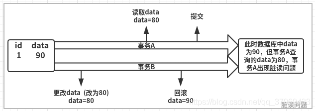
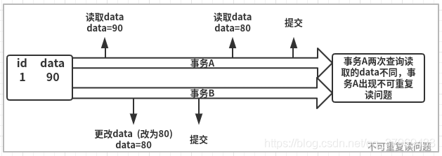
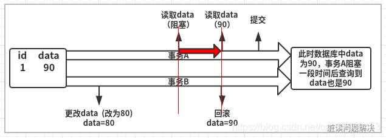
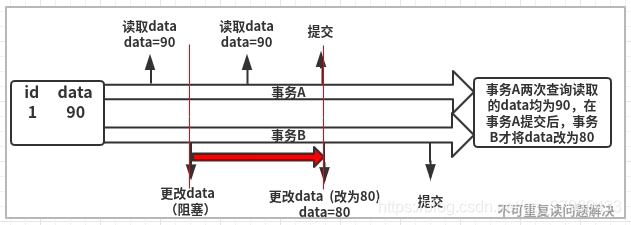
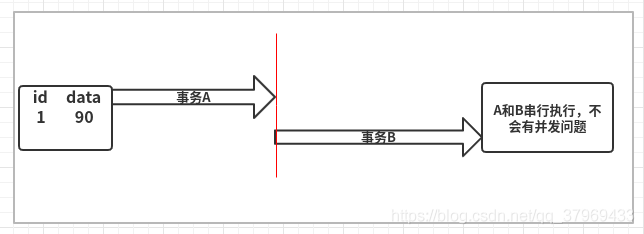
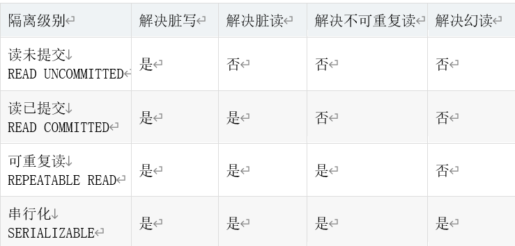
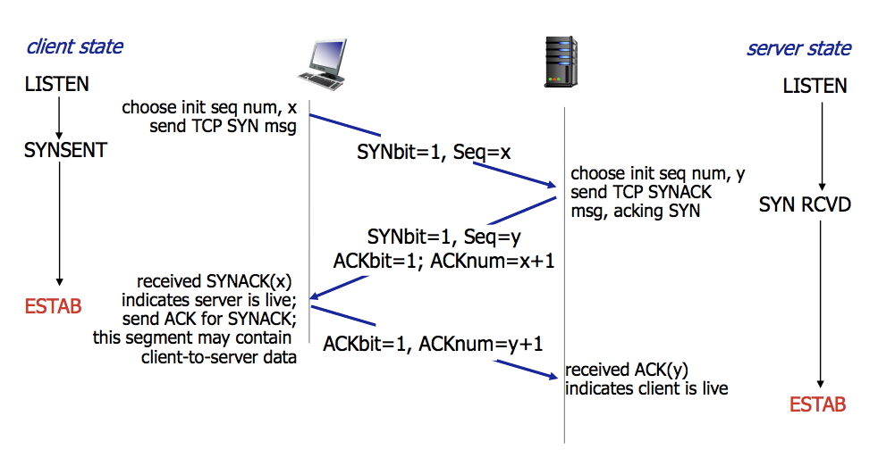
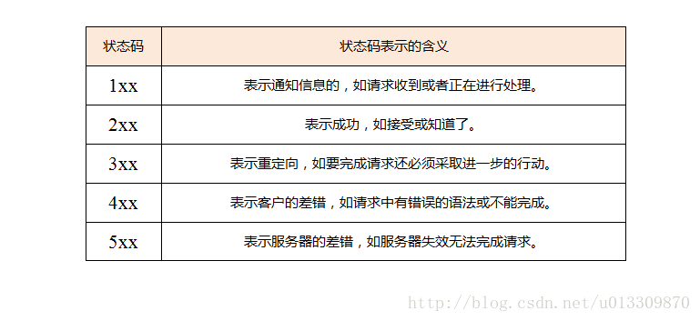

作者：finecola

链接：https://www.nowcoder.com/discuss/586789

来源：牛客网

 问有没有其他offer, 简单说了一下.

 问项目.巴拉巴拉....


# 数据结构


## **1.** **平衡二叉树（AVL树）**

（没有具体说考察的平衡二叉树的哪一方面）

* 产生原因：

  二叉树的深度会影响搜索的效率，有时存储的序列非常有序，可能会退化成单链表形式，查找效率为O(N)，而平衡二叉树以一种高度平衡的结构，使二叉树的深度保持在一个很短的范围内，查找效率为O(logN)。

  [参考](https://zhuanlan.zhihu.com/p/56066942)

* 定义：

  它是一棵空树或它的左右两个子树的高度差的绝对值不超过1，并且左右两个子树都是一棵平衡二叉树   

* 衍生：（LeetCode110）**判断平衡二叉树** 

  解法：[自顶向下的递归或自顶向上的递归](https://leetcode-cn.com/problems/balanced-binary-tree/solution/ping-heng-er-cha-shu-by-leetcode-solution/)
  
   ```java
  class Solution {
      public boolean isBalanced(TreeNode root) {
          if(root==null){
              return true;
          }
  
          if(Math.abs(getHight(root.left,0)-getHight(root.right,0))<=1){
              return isBalanced(root.left)&&isBalanced(root.right);
          }else{
              return false;
          }
      }
  
  
      public int getHight(TreeNode root,int height){
          if(root==null){
              return 0;
          }
          return Math.max(getHight(root.left,0),getHight(root.right,0))+1;
      }
  }
   ```
  
* 增、删

  **平衡因子：**某一个节点左右子树的**高度差**。值为0,1，-1，对应等高，左比右搞，右比左高。如果平衡因子绝对值超过1，则失衡。

  **最小失衡子树：**在新插入的结点向上查找，以第一个平衡因子的绝对值超过 1 的结点为根的子树称为最小不平衡子树。

   **增加节点：**

  先寻找**最小不平衡树**，然后寻找所属的不平衡类别，再**根据4种类别进行固定化程序的操作。**

  LL | 在 A 的左子树根节点的左子树上插入节点而破坏平衡 | 右旋转

  RR | 在 A 的右子树根节点的右子树上插入节点而破坏平衡 | 左旋转

  LR | 在A的左子树根节点的右子树上插入节点而破坏平衡 | 先左旋后右旋

  RL | 在 A 的右子树根节点的左子树上插入节点而破坏平衡 | 先右旋后左旋

  具体如何旋转：[参考](https://zhuanlan.zhihu.com/p/56066942)

   **删除节点**

  注意：插入操作后只需要对插入栈中的弹出的第一个非平衡节点进行修正，而**删除操作需要修正栈中的所有非平衡节点**。

  对于删除操作造成的非平衡状态的修正，可以这样理解：对左或者右子树的删除操作相当于对右或者左子树的插入操作，然后再对应上插入的四种情况选择相应的旋转就好了。
  [参考](https://zhuanlan.zhihu.com/p/56066942)
  
  具体删除代码可参考下面的博客。
  [参考](https://blog.csdn.net/fxkcsdn/article/details/81674653)

* 优缺点：
	由于维护这种高度平衡所付出的代价比从中获得的效率收益还大，故而实际的应用不多，更多的地方是用追求局部而不是非常严格整体平衡的红黑树。当然，如果**应用场景**中对插入删除不频繁，只是对查找要求较高，那么AVL还是较优于红黑树。
	
	（简短:优点是查找速度快，缺点是旋转代价高）
	 [参考](https://marian5211.github.io/2018/03/09/B%E6%A0%91%E3%80%81B-%E6%A0%91%E3%80%81AVL%E6%A0%91%E3%80%81Trie%E6%A0%91%E5%8F%8A%E5%85%B6%E5%BA%94%E7%94%A8%E5%9C%BA%E6%99%AF/)

# java

## 1.Hashmap

**问题：HashMap的实现原理？**

(1) HashMap是基于hashing的原理，底层使用哈希表实现。里边最重要的两个方法put、get，使用put(key, value)存储对象到HashMap中，使用get(key)从HashMap中获取对象。

(2) 存储对象时，我们将K/V传给put方法时，它调用hashCode计算hash从而得到bucket位置，进一步存储，HashMap会根据当前bucket的占用情况自动调整容量(超过负载因子Load Facotr则resize扩容为原来的2倍)。

(3) 获取对象时，我们将K传给get，它调用hashCode计算hash从而得到bucket位置，并进一步调用equals()方法确定键值对。

(4) 如果发生碰撞的时候，Hashmap通过链表将产生碰撞冲突的元素组织起来，在Java 8中，如果一个bucket中碰撞冲突的元素超过某个限制(默认是8)，则使用红黑树来替换链表，从而提高速度。

注：

在Java 7中，hashmap的实现框架是：数组+链表/ 哈希表+链表

在Java 8之后，变成了：数组+链表+红黑树 / 哈希表+链表+红黑树

负载因子Load Facotr默认是0.75

如果链表中元素超过某个限制(默认是8)，用红黑树来替换链表

 **put函数大致的思路为：**

(1) 对key的hashCode()做hash，然后确定bucket的index；

(2) 如果没碰撞直接放到bucket里；

(3) 如果碰撞了，以链表的形式存在buckets后；

(4) 如果碰撞导致链表过长(大于等于TREEIFY_THRESHOLD，一般是8)，就把链表转换成红黑树；

(5) 如果节点已经存在就替换old value(保证key的唯一性)

**(6)** 如果bucket满了(超过负载因子*当前容量)，就要resize扩容。

**get函数大致的思路为：**

(1) bucket里的第一个节点，直接命中；

(2) 如果有冲突，则通过key.equals(k)去查找对应的entry

若为树，则在树中通过key.equals(k)查找，---O(logn)

若为链表，则在链表中通过key.equals(k)查找，----O(n)

 **hash函数的实现**

```java
static final int hash(Object key) {
    int h;
    return (key == null) ? 0 : (h = key.hashCode()) ^ (h >>> 16);
}

```


这个函数大概的作用就是：高16bit不变，低16bit和高16bit做了一个异或

**比较详细的讲了hashmap的工作原理**（上文主要参考此篇[博客](https://yikun.github.io/2015/04/01/Java-HashMap%E5%B7%A5%E4%BD%9C%E5%8E%9F%E7%90%86%E5%8F%8A%E5%AE%9E%E7%8E%B0/)）

非常详细了解其中各个步骤如何操作，参考[b站视频](https://www.bilibili.com/video/BV14z4y1d7Wa)
简洁，有很多[相关问题](https://blog.csdn.net/u012512634/article/details/72735183)

## 2.线程状态


[参考](https://blog.csdn.net/Weixiaohuai/article/details/104235537)

## 3.栈和队列的区别
* 队列先进先出，栈先进后出。
* 栈的插入和删除操作都是在一端进行的，而队列的操作却是在两端进行的。
* 栈只允许在表尾一端进行插入和删除，而队列只允许在表尾一端进行插入，在表头一端进行删除。

## 4.事务的问题及隔离级别
**事务**： 一个或多个原子操作组合而成的执行单元，即一条或多条不可再分的数据操作指令组合而成的执行单元。
事务的四个特性，即原子性（Atomicity）、一致性（Consistency）、隔离性（Isolation）、持久性（Durability），这也就是所称的ACID事务。

一个叫事务的**提交**，即在事务成功执行后提交结束事务；
一个叫事务的**回滚**，即在事务执行过程中某个操作出现问题，恢复到事务执行之前的那个一致性状态。

**事务并发问题：脏写、脏读、不可重复读、幻读**

(1)	**脏写**：指两个事务A、B，A更新数据还未提交，B也来更新数据。对于A来讲，最终的数据不是自己想要更新的值。
脏写问题使用**行级排它锁**即可解决，在一条记录被一个事务更新时，另外的事务是无法更新这条事务的。

(2)	**脏读**:是指两个事务A、B，A读取了B更新尚未提交的内容，B事务回滚，导致A读取的内容错误。



(3)	**不可重复读**：是指两个事务A、B，A读取一个字段，B更新了这个字段，A再读取一次这个字段，两次读取的结果不同。如图



(4)	**幻读**：是指两个事务A、B，A读取一个字段的行数，B插入或删除了某些记录，A再读取这个字段的行数，行数不同了。


不可重复读和幻读问题十分相似：
不可重复读是并发事务B的UPDATE操作对事务A带来的问题
幻读是并发事务B的INSERT和DELETE操作对事务A带来的问题。

**隔离级别：读未提交、读已提交、可重复读、串行化/序列化**

**(1)	读未提交（READ UNCOMMITTED）**
允许事务A读取事务B未提交的更新。自然，事务的并发工作流程是与以上三幅图片所示的流程一样的，脏读、不可重复读、幻读问题均不可实现。

**(2)	读已提交（READ COMMITTED）**
只允许事务A读取事务B已经提交的更新。若B事务更改某条记录未结束（提交或回滚），A事务读取相应记录会阻塞至B事务结束。在个隔离级别下，脏读问题图示会变为：



**(3)	可重复读（REPEATABLE READ）**
A事务读取某个字段，在A事务操作期间，禁止B事务对该字段的更新。可重复读解决事务的不可重复读问题，这样，流程图变为：



**(4)	串行化（SERIALIZABLE）**
串行化即舍弃事务的并发处理能力，将所有事务串行执行，这样虽然避免了所有的并发问题，但性能效率实在太低，一般不用。



四个隔离级别解决并发问题总结如下：



四个隔离级别解决问题程度的递增，是用牺牲数据库的并发性能来得到的，如串行化级别，解决了所有的并发问题，但却没有任何并发能力。所以需要根据实际业务情况选择合适的隔离级别。
还需要清楚，四个隔离级别只是SQL给出的规范，包括前面所讲的ACID事务的实现，每个数据库存储引擎对这些的实现技术都是不同的，所有引擎都在追求更高的隔离级别下的更高的并发能力。比如MySQL默认使用的InnoDB引擎，使用MVCC技术在可重复读级别下，不用阻塞事务B的写操作就可以解决不可重复读甚至是幻读问题。

[参考](https://blog.csdn.net/qq_37969433/article/details/103247421)

## 5.乐观锁和悲观锁
乐观锁和悲观锁是两种思想，用于解决并发场景下的数据竞争问题。

* **乐观锁**：乐观锁在操作数据时非常乐观，认为别人不会同时修改数据。因此乐观锁不会上锁，只是在执行更新的时候判断一下在此期间别人是否修改了数据：如果别人修改了数据则放弃操作，否则执行操作。
* **悲观锁**：悲观锁在操作数据时比较悲观，认为别人会同时修改数据。因此操作数据时直接把数据锁住，直到操作完成后才会释放锁；上锁期间其他人不能修改数据。

* 实现方式：
	* (1)	悲观锁的实现方式是加锁，加锁既可以是对代码块加锁（如Java的synchronized关键字），也可以是对数据加锁（如MySQL中的排它锁）。
	* (2)	乐观锁的实现方式主要有两种：CAS机制和版本号机制

[参考](https://www.cnblogs.com/kismetv/p/10787228.html#t4)

## 6.线程和进程区别
* (1)	**拥有资源：进程是资源分配的基本单位**，但是线程不拥有资源，一个进程可以包括多个线程，这些线程共享进程资源
* (2)	**调度：线程是独立调度的基本单位**，同一进程中，线程的切换不会引起进程切换，从一个进程内的线程切换到另一个进程内的线程会引起进程切换
* (3)	**系统开销**：创建和撤销进程时，系统都要为之分配或回收资源，所付出的开销远大于创建或撤销线程时的开销。同样的在进程切换时，也会涉及当前执行进程 CPU 环境的保存以及新调度进程 CPU 环境的设置，而线程的切换只需保存和设置少量寄存器的内容，开销很小
* (4)	**通信方面**：进程间通信需要进程同步和互斥手段的辅助，以保证数据的一致性。而线程间可以通过直接读/写同意进程中的数据段（如全局变量）来进行通信。

[参考](https://juejin.cn/post/6844903809081163790)


## 7.进程通信
共7种：
*	管道( pipe )：管道是一种半双工的通信方式，数据只能单向流动，而且只能在具有亲缘关系的进程间使用。进程的亲缘关系通常是指父子进程关系。
*	有名管道 (namedpipe) ：有名管道也是半双工的通信方式，但是它允许无亲缘关系进程间的通信。
*	信号量(semophore ) ：信号量是一个计数器，可以用来控制多个进程对共享资源的访问。它常作为一种锁机制，防止某进程正在访问共享资源时，其他进程也访问该资源。因此，主要作为进程间以及同一进程内不同线程之间的同步手段。
*	消息队列( messagequeue ) ：消息队列是由消息的链表，存放在内核中并由消息队列标识符标识。消息队列克服了信号传递信息少、管道只能承载无格式字节流以及缓冲区大小受限等缺点。
*	信号 (sinal ) ：信号是一种比较复杂的通信方式，用于通知接收进程某个事件已经发生。
*	共享内存(shared memory ) ：共享内存就是映射一段能被其他进程所访问的内存，这段共享内存由一个进程创建，但多个进程都可以访问。共享内存是最快的 IPC 方式，它是针对其他进程间通信方式运行效率低而专门设计的。它往往与其他通信机制，如信号两，配合使用，来实现进程间的同步和通信。
*	套接字(socket ) ：套接口也是一种进程间通信机制，与其他通信机制不同的是，它可用于不同设备及其间的进程通信。

[更具体](https://blog.csdn.net/zycxnanwang/article/details/106977385)
[更简洁](https://www.cnblogs.com/jiading/articles/12508177.html)


## 8.开启线程的方式

**(1)	继承 Thread 类**
通过继承 Thread 类，并重写它的 run 方法，我们就可以创建一个线程。

*	首先定义一个类来继承 Thread 类，重写 run 方法。
*	然后创建这个子类对象，并调用 start 方法启动线程。

**(2)	实现 Runnable 接口**
通过实现 Runnable ，并实现 run 方法，也可以创建一个线程。

*	首先定义一个类实现 Runnable 接口，并实现 run 方法。
*	然后创建 Runnable 实现类对象，并把它作为 target 传入 Thread 的构造函数中
*	最后调用 start 方法启动线程。

**(3)	实现 Callable 接口，并结合 Future 实现**

*	首先定义一个 Callable 的实现类，并实现 call 方法。call 方法是带返回值的。
*	然后通过 FutureTask 的构造方法，把这个 Callable 实现类传进去。
*	把 FutureTask 作为 Thread 类的 target ，创建 Thread 线程对象。
*	通过 FutureTask 的 get 方法获取线程的执行结果。

**(4)	通过线程池创建线程**
此处用 JDK 自带的 Executors 来创建线程池对象。

*	首先，定一个 Runnable 的实现类，重写 run 方法。
*	然后创建一个拥有固定线程数的线程池。
*	最后通过 ExecutorService 对象的 execute 方法传入线程对象

[参考](https://www.cnblogs.com/starry-skys/p/13869221.html)


## 9.gc算法, 堆内存模型
**堆内存模型**
1，年轻代。年轻代内部又分成了两个区，一个是 Eden 区，一个是 Survivor 区。Survivor 区又划分成两块，一块是 from 区，一块是 to 区；
2，老年代。

 

**gc（Garbage Collection）垃圾回收算法：**

**(1)	标记清除算法**
标记清除（Mark-Sweep）算法，包含“标记”和“清除”两个阶段：**首先标记出所有需要回收的对象，在标记完成后统一回收掉所有被标记的对象。**

**主要缺点**：**一个是效率问题**，标记和清除过程的效率都不高；另外是**空间问题**，标记清除之后**会产生大量不连续的内存碎片**，空间碎片太多可能会导致，当程序在以后的运行过程中需要分配较大对象时，无法找到足够的连续内存，而不得不提前触发另一次垃圾收集动作。

**(2)	复制算法**
复制（Copying）算法：将可用内存按容量划分为大小相等的两块，每次只使用其中的一块。当一块内存用完了，就将还存活着的对象复制到另外一块上，然后清理掉前一块。

 

**优点**：每次对半区内存回收时、内存分配时就不用考虑内存碎片等复杂情况，只要移动堆顶指针，按顺序分配内存即可，实现简单，运行高效。
缺点：将内存缩小为一半，性价比低，持续复制长生存期的对象则导致效率低下。
JVM堆中新生代便采用复制算法。

 

在GC回收过程中，当Eden区满时，还存活的对象会被复制到其中一个Survivor区；当回收时，会将Eden和使用的Survivor区还存活的对象，复制到另外一个Survivor区，然后对Eden和用过的Survivor区进行清理。
如果另外一个Survivor区没有足够的内存存储时，则会进入老年代。
这里针对哪些对象会进入老年代有这样的机制：**对象每经历一次复制，年龄加1，达到晋升年龄阈值后，转移到老年代。**
在这整个过程中，由于Eden中的对象属于像浮萍一样“瞬生瞬灭”的对象，所以并不需要1：1的比例来分配内存，而是采用了8：1：1的比例来分配。
而针对那些历经多次清理依旧存活的对象，则会进入老年代，而**老年的清理算法则采用下面要讲到的“标记整理算法”。**

**(3)	标记整理算法**
标记整理（Mark-Compact）算法：标记过程与“标记-清除”算法一样，但后续步骤不是直接对可回收对象进行清理，**而是让所有存活的对象都向一端移动，然后直接清理掉端边界以外的内存。**
优点：这种算法不既不用浪费50%的内存，也解决了复制算法在对象存活率较高时的效率低下问题。

 

**(4)	分代收集算法**
分代收集算法，基本思路：将Java的堆内存逻辑上分成两块，新生代和老年代，针对不同存活周期、不同大小的对象采取不同的垃圾回收策略。
**而在新生代中大多数对象都是瞬间对象，只有少量对象存活，复制较少对象即可完成清理，因此采用复制算法。**
**而针对老年代中的对象，存活率较高，又没有额外的担保内存，因此采用标记整理算法**。
其实，回头看，分代收集算法就是对新生代和老年代算法从策略维度的规划而已。

[参考](https://blog.csdn.net/wo541075754/article/details/102647652)

## 10.	二叉树的遍历方式有哪几种,口诉层序遍历
前序，中序，后序，层序


## 11.	快排,及其时间复杂度

**快排思路：**
1.选择基准值：在待排序列中，按照某种方式挑出一个元素，作为基准值。
2.分割操作：以该基准值在序列中的实际位置，把序列分成两个子序列，一边是比它大的值，另外一边是比它小的值。
3.递归：对两个子序列进行快排，直到序列为空或者只有一个元素。
时间复杂度：平均O(nlogn),最坏O(n2)，最好O(nlogn)
```java
1.	public class QuickSort {  
2.	public static void main(String[] args) {  
3.	    int[] arr = new int[] {9,4,6,8,3,10,4,6};  
4.	    quickSort(arr,0,arr.length - 1);  
5.	    System.out.println(Arrays.toString(arr));  
6.	      
7.	}  
8.	public static void quickSort(int[] arr,int low,int high) {  
9.	    int p,i,j,temp;  
10.	      
11.	    if(low >= high) {  
12.	        return;  
13.	    }  
14.	    //p就是基准数,这里就是每个数组的第一个  
15.	    p = arr[low];  
16.	    i = low;  
17.	    j = high;  
18.	    while(i < j) {  
19.	        //右边当发现小于p的值时停止循环  
20.	        while(arr[j] >= p && i < j) {  
21.	            j--;  
22.	        }  
23.	                          
24.	        //这里一定是右边开始，上下这两个循环不能调换   
25.	  
26.	        //左边当发现大于p的值时停止循环  
27.	        while(arr[i] <= p && i < j) {  
28.	            i++;  
29.	        }  
30.	            temp = arr[j];  
31.	            arr[j] = arr[i];  
32.	            arr[i] = temp;  
33.	    }  
34.	    arr[low] = arr[i];//这里的arr[i]一定是停小于p的，经过i、j交换后i处的值一定是小于p的(j先走)  
35.	    arr[i] = p;   
36.	    quickSort(arr,low,j-1);  //对左边快排  
37.	    quickSort(arr,j+1,high); //对右边快排  
38.	      
39.	    }  
40.	} 
```
[参考](https://blog.csdn.net/pange1991/article/details/85460755)

# 计算机网络

## 1.tcp的三次握手

 

[参考](https://hit-alibaba.github.io/interview/basic/network/TCP.html)
[b站视频，讲得很通俗易懂](https://www.bilibili.com/video/BV1bi4y1x7m5)

## 2.状态码

**HTTP状态码（HTTP Status Code）**是用以表示网页服务器HTTP响应状态的**3位数字代码**。每一个请求报文发出后，都能收到一个响应报文。响应报文的第一行就是状态行。状态行包含三项内容，HTTP的版本、状态码、以及解释状态码的简单短语。状态码共分为5大类33种。如：

 

下面是在状态行中常见的状态码：
* **100 Continue**
客户端应当继续发送请求。这个临时响应是用来通知客户端它的部分请求已经被服务器接收，且仍未被拒绝。客户端应当继续发送请求的剩余部分，或者如果请求已经完成，忽略这个响应。服务器必须在请求完成后向客户端发送一个最终响应。
* **101 Switching Protocols**
服务器已经理解了客户端的请求，并将通过Upgrade 消息头通知客户端采用不同的协议来完成这个请求。在发送完这个响应最后的空行后，服务器将会切换到在Upgrade 消息头中定义的那些协议。
* **200 OK**
请求已成功，请求所希望的响应头或数据体将随此响应返回。
* **201 Created**
请求已经被实现，而且有一个新的资源已经依据请求的需要而建立，且其 URI 已经随Location 头信息返回。假如需要的资源无法及时建立的话，应当返回 ‘202 Accepted’。
* **202 Accepted**
服务器已接受请求，但尚未处理。正如它可能被拒绝一样，最终该请求可能会也可能不会被执行。在异步操作的场合下，没有比发送这个状态码更方便的做法了。
* **300 Multiple Choices**
被请求的资源有一系列可供选择的回馈信息，每个都有自己特定的地址和浏览器驱动的商议信息。用户或浏览器能够自行选择一个首选的地址进行重定向。
* **301 Moved Permanently**
被请求的资源已永久移动到新位置，并且将来任何对此资源的引用都应该使用本响应返回的若干个 URI 之一。如果可能，拥有链接编辑功能的客户端应当自动把请求的地址修改为从服务器反馈回来的地址。除非额外指定，否则这个响应也是可缓存的。
* **400 Bad Request**
1、语义有误，当前请求无法被服务器理解。除非进行修改，否则客户端不应该重复提交这个请求。
2、请求参数有误。
* **404 Not Found**
请求失败，请求所希望得到的资源未被在服务器上发现。没有信息能够告诉用户这个状况到底是暂时的还是永久的。假如服务器知道情况的话，应当使用410状态码来告知旧资源因为某些内部的配置机制问题，已经永久的不可用，而且没有任何可以跳转的地址。404这个状态码被广泛应用于当服务器不想揭示到底为何请求被拒绝或者没有其他适合的响应可用的情况下。出现这个错误的最有可能的原因是服务器端没有这个页面。

[参考](https://hanking.blog.csdn.net/article/details/77822665?utm_medium=distribute.pc_relevant.none-task-blog-OPENSEARCH-1.control&depth_1-utm_source=distribute.pc_relevant.none-task-blog-OPENSEARCH-1.control)

## 3.TCP,UDP的区别

**用户数据报协议 UDP（User Datagram Protocol）**
是无连接的，尽最大可能交付，没有拥塞控制，面向报文（对于应用程序传下来的报文不合并也不拆分，只是添加 UDP 首部），支持一对一、一对多、多对一和多对多的交互通信。

**传输控制协议 TCP（Transmission Control Protocol）**
是面向连接的，提供可靠交付，有流量控制，拥塞控制，提供全双工通信，面向字节流（把应用层传下来的报文看成字节流，把字节流组织成大小不等的数据块），每一条 TCP 连接只能是点对点的（一对一）。

[参考](https://zhuanlan.zhihu.com/p/108822858)

# 算法题: 合并两个数组 NC22

 

**方法：遍历数组，依次比较**
**解题思路**：先定义一个数组res用来存放A和B中的元素。遍历数组A、B中元素，如果A[i]<=B[j]则将A的元素加入res中，如果A[i]>B[j]则将B的元素加入res中。如果A，B其中有一个遍历完，另一个没遍历完，则将未遍历完的数组中的元素全部加入res中，最后再将res中的数据存入数组A中。

```java
1.	public class Solution {  
2.	    public void merge(int A[], int m, int B[], int n) {  
3.	        int[] res = new int[m+n];    
4.	        int i=0,j=0,r=0;  
5.	        while(i<m && j<n){      //遍历A.B中的元素  
6.	            if(A[i]<=B[j]){    //如果A<=B,A先放  
7.	                res[r++] = A[i++];  
8.	            }else{             //如果A>B，B先放  
9.	                res[r++] = B[j++];  
10.	            }  
11.	        }  
12.	        //如果A，B其中有一个遍历完，另一个没遍历完，则将未遍历完的数组中的元素全部加入res中  
13.	        while(i<m){     //当A中的元素未遍历完时，将A中剩下的元素全部放入res中  
14.	            res[r++]=A[i++];  
15.	        }  
16.	        while(j<n){     //当B中的元素未遍历完时，将B中剩下的元素全部放入res中  
17.	            res[r++]=B[j++];  
18.	        }  
19.	        for(int k=0;k<res.length;k++){ //最后将数组res中的元素全部存入数组A中  
20.	            A[k]=res[k];  
21.	        }  
22.	    }  
23.	}  
```
[参考](https://blog.nowcoder.net/n/ae6927468572437aa47131e2c052e677)


