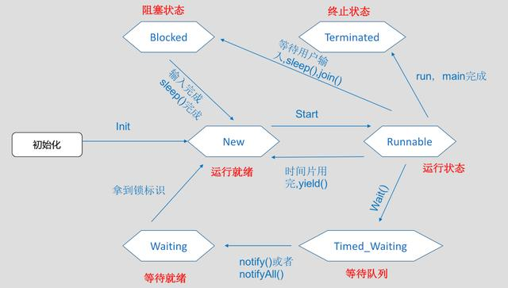
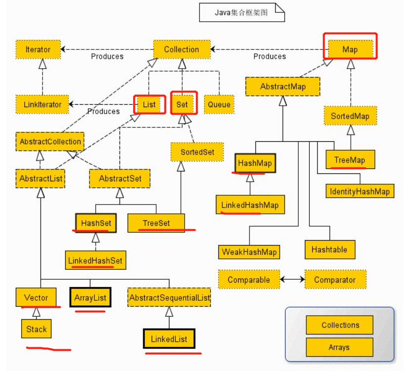
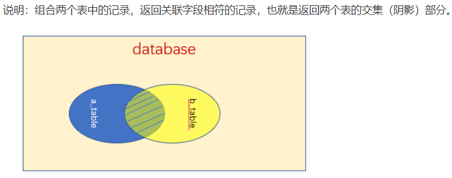
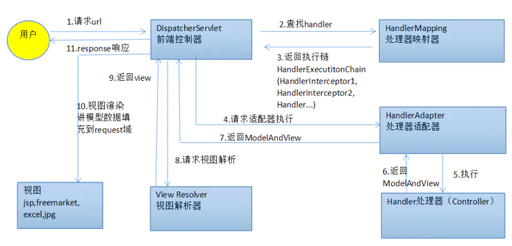

作者：搓泥大师
链接：https://www.nowcoder.com/discuss/590834
来源：牛客网

网易
# 一面
## 1 final关键字的作用

　　在Java中，final关键字可以用来修饰**类、方法和变量（包括成员变量和局部变量）**。下面就从这三个方面来了解一下final关键字的基本用法。

* 修饰类

  　　当用final修饰一个类时，表明这个类不能被继承。也就是说，**如果一个类你永远不会让他被继承**，就可以用final进行修饰。final类中的成员变量可以根据需要设为final，但是要注意final类中的所有成员方法都会被隐式地指定为final方法。

* 修饰方法

  ​	只有在想明确禁止该方法在子类中被覆盖的情况下才将方法设置为final的。

* 修饰变量

   对于一个final变量。

  * 如果是基本数据类型的变量，则其数值一旦在初始化之后便不能更改；
  * 如果是引用类型的变量，则在对其初始化之后便不能再让其指向另一个对象。

[参考](https://www.cnblogs.com/dolphin0520/p/3736238.html)

## 2 sleep wait的区别

- **1.** 对于锁资源的处理方式不同
  - 每个对象都有一个锁来控制同步访问，Synchronized关键字可以和对象的锁交互，来实现同步方法或同步块。
  - **sleep()方法**正在执行的线程主动让出CPU（然后CPU就可以去执行其他任务），在sleep指定时间后CPU再回到该线程继续往下执行(注意：sleep方法只让出了CPU，而并不会释放同步资源锁)；
  - **wait()方法**则是指当前线程让自己暂时退让出同步资源锁，以便其他正在等待该资源的线程得到该资源进而运行，只有调用了notify()方法，之前调用wait()的线程才会解除wait状态，可以去参与竞争同步资源锁，进而得到执行。（注意：notify的作用相当于叫醒睡着的人，而并不会给他分配任务，就是说notify只是让之前调用wait的线程有权利重新参与线程的调度）；
- **2. **使用范围：
  - **sleep()**方法可以在任何地方使用；
  - **wait()方法**则只能在同步方法或同步块中使用；
- **3. **所属的类不同：
  - **sleep()**是线程线程类（Thread）的静态方法调用会暂停此线程指定的时间，但监控依然保持，不会释放对象锁，到时间自动恢复；
  - **wait()**是Object的实例方法，调用会放弃对象锁，进入等待队列，待调用notify()/notifyAll()唤醒指定的线程或者所有线程，才会进入锁池，再次获得对象锁才会进入运行状态；
- **4.** 生命周期
  - **sleep():** 调用此方法让当前线程暂停执行指定的时间(**进入阻塞状态指定毫秒**)，将执行机会（CPU）让给其他线程，但是对象的锁依然保持，因此休眠时间结束后会自动恢复（**当前线程会从新进入Runnable(就绪)状态，等待划分时间片**）
  - **wait():**调用对象的wait()方法导致当前线程放弃对象的锁（线程暂停执行），进入对象的**等待池（wait pool**），只有调用对象的notify()方法（或notifyAll()方法）时才能唤醒等待池中的线程进入**等锁池（lockpool**），如果线程重新获得对象的锁就可以进入**就绪状态**

[参考](https://blog.csdn.net/u012050154/article/details/50903326)



## 3 i++是原子性的么？怎么保证原子性？（JUC中的Atomic，或者使用锁）

* i++的操作不是原子的，因为它不会作为一个不可分割的操作来执行。它实际包含了三个独立的操作，读取i的值，将值加1，然后将计算结果写入i。这是一个**读取—修改—写入**的操作序列，并且其结果状态依赖于之前的状态。

* 使用AtomicInteger类的getAndIncrement()方法实现i++

  ```java
  public final int getAndIncrement() {
      for (;;) {
          int current = get();  // 取得AtomicInteger里存储的数值
          int next = current + 1;  // 加1
          if (compareAndSet(current, next))   // 调用compareAndSet执行原子更新操作
              return current;
      }
  }
  ```

  其核心原理是CAS（compareAndSwap）原理

  通过内存值V 预期值A 更新值B  先对v和A进行比较 如果相等 则将v更新为B 如果不相等则不更新。

  CAS的操作虽然也是多个步骤，但**CAS是通过硬件命令保证了原子性**。
  
* 当然也可以通过synchronized和Lock来保证其原子性

## 4 集合框架说一哈（Set，Map，List中的实现类大概介绍了下）




**Set、List和Map可以看做集合的三大类**

### （一）List

**List集合代表一个有序集合，集合中每个元素都有其对应的顺序索引。List集合允许使用重复元素，可以通过索引来访问指定位置的集合元素，实现List接口的集合主要有：`ArrayList、LinkedList、Vector、Stack`。**

#### ArrayList

**ArrayList是一个动态数组，擅长于随机访问。**同时ArrayList是非同步的。

#### LinkedList

**LinkedList是一个双向链表**，**LinkedList不能随机访问**，它所有的操作都是要按照双重链表的需要执行。在列表中索引的操作将从开头或结尾遍历列表（从靠近指定索引的一端）。这样做的好处就是可以通过较低的代价在List中进行插入和删除操作。**LinkedList也是非同步的**。

#### Vector

与ArrayList相似，但是Vector是同步的。所以说**Vector是线程安全的动态数组**。它的操作与ArrayList几乎一样。

#### Stack

Stack继承自Vector，实现一个**后进先出的堆栈**。

### （二）Map接口

Map与List、Set接口不同，它是由一系列键值对组成的集合，提供了key到Value的映射。在Map中它保证了key与value之间的一一对应关系。也就是说一个key对应一个value，所以它**不能存在相同的key值，当然value值可以相同**。

#### HashMap

以哈希表数据结构实现，查找对象时通过哈希函数计算其位置，它是为快速查询而设计的，其内部定义了一个hash表数组（Entry[] table），元素会通过哈希转换函数将元素的哈希地址转换成数组中存放的索引，如果有冲突，则使用散列链表的形式将所有相同哈希地址的元素串起来，可能通过查看HashMap.Entry的源码它是一个单链表结构。

#### LinkedHashMap

LinkedHashMap是HashMap的一个子类，它保留插入的顺序，如果需要输出的顺序和输入时的相同，那么就选用LinkedHashMap，且实现不是同步的

#### TreeMap

**TreeMap 是一个有序的key-value集合，非同步，基于红黑树（Red-Black tree）实现，每一个key-value节点作为红黑树的一个节点。**TreeMap存储时会进行排序的，会根据key来对key-value键值对进行排序，其中排序方式也是分为两种，一种是自然排序，一种是定制排序，具体取决于使用的构造方法。

**自然排序：**TreeMap中所有的key必须实现Comparable接口，并且所有的key都应该是同一个类的对象，否则会报ClassCastException异常。

**定制排序：**定义TreeMap时，创建一个comparator对象，该对象对所有的treeMap中所有的key值进行排序，采用定制排序的时候不需要TreeMap中所有的key必须实现Comparable接口。


### (三) Set接口

**Set是一种不包含重复的元素的Collection，无序，即任意的两个元素e1和e2都有e1.equals(e2)=false，Set最多有一个null元素。**

#### HashSet

HashSet 是一个没有重复元素的集合。它是由HashMap实现的，不保证元素的顺序(这里所说的没有顺序是指：元素插入的顺序与输出的顺序不一致)，而且HashSet允许使用null 元素。HashSet是非同步的

#### LinkedHashSet

LinkedHashSet继承自HashSet，其底层是**基于LinkedHashMap来实现的**，有序，非同步。**LinkedHashSet将会以元素的添加顺序访问集合的元素。**

#### TreeSet

TreeSet是一个有序集合，其底层是基于TreeMap实现的，非线程安全。TreeSet可以确保集合元素处于排序状态。**TreeSet支持两种排序方式，自然排序和定制排序，其中自然排序为默认的排序方式。**当我们构造TreeSet时，若使用不带参数的构造函数，则TreeSet的使用自然比较器；若用户需要使用自定义的比较器，则需要使用带比较器的参数。

[参考](https://www.javazhiyin.com/61290.html)

## 5 死锁的产生和预防

### 1.死锁发生的情形：

（1）一个线程两次申请锁。

（2）两个线程互相申请对方的锁，但是对方都不释放锁。


### 2.死锁产生的必要条件：

（1）互斥：一次只有一个进程可以使用一个资源。其他进程不能访问已分配给其他进程的资源。

（2）占有且等待：当一个进程在等待分配得到其他资源时，其继续占有已分配得到的资源。

（3）非抢占：不能强行抢占进程中已占有的资源。

（4）循环等待：存在一个封闭的进程链，使得每个资源至少占有此链中下一个进程所需要的一个资源。


### 3.处理死锁的四种方法：

（1）**死锁预防：通过确保死锁的一个必要条件不会满足，保证不会发生死锁**

（2）死锁检测：允许死锁的发生，但是可以通过系统设置的检测结构及时的检测出死锁的发生，采取一些措施，将死锁清除掉

（3）死锁避免：在资源分配过程中，使用某种方法避免系统进入不安全的状态，从而避免发生死锁

（4）死锁解除：与死锁检测相配套的一种措施。当检测到系统中已发生死锁，需将进程从死锁状态中解脱出来。

**常用方法：撤销或挂起一些进程，以便回收一些资源，再将这些资源分配给已处于阻塞状态的进程。**

[参考](https://blog.csdn.net/hj605635529/article/details/69214903)

## 6 mysql 内连接外连接

* 内连接

  关键字：inner join on

  语句：select * from a_table a inner join b_table b on a.a_id = b.b_id;

  

  

* 外连接

  * 左连接（左外连接）
  
    关键字：left join on / left outer join on
  
    语句：select * from a_table a left join b_table b on a.a_id = b.b_id;
  
    
  
  * 右外连接
  
    关键字：right join on / right outer join on
  
    语句：select * from a_table a right outer join b_table b on a.a_id = b.b_id;
  
    说明：
  
    right join是right outer join的简写，它的全称是右外连接，是外连接中的一种。
  
    与左(外)连接相反，右(外)连接，左表(a_table)只会显示符合搜索条件的记录，而**右表(b_table)的记录将会全部表示出来。左表记录不足的地方均为NULL。**
  
    

## 7 redis对象，雪崩

### redis 对象

   	redis使用对象来表示数据库中的键和值，每次当我们在redis的数据库中新创建一个键值对时，我们至少会创建两个对象，一个对象用作键值对的键(键对象)，另一个对象用作键值对的值(值对象)。 

   	redis的每种对象都由**对象结构**(redisObject)与对应编码的**数据结构**组合而成，**redis支持5种对象类型，分别是字符串(string)、列表(list)、哈希(hash)、集合(set)、有序集合(zset)**

​	redis中的键和值都是由对象组成的，而对象是由**对象结构**和**数据结构**共同组成的。redis中的键，都是用字符串来存储的，即对于redis数据库中的键值对来说，**键总是一个字符串对象**，而**值可以是字符串对象、列表对象、哈希对象、集合对象或者有序集合对象中的其中一种。**

[参考](https://developer.aliyun.com/article/710228)

### redis 雪崩

## 8 session和cookie区别

### **一、Session的概念**

Session 是存放在服务器端的，类似于Session结构来存放用户数据。

* 当浏览器 第一次发送请求时，**服务器自动生成了一个Session和一个Session ID用来唯一标识这个Session**，并将其（**Session ID**）通过响应发送到浏览器。
* 当浏览器第二次发送请求，会将**前一次服务器响应中的Session ID放在请求中一并发送到服务器**上，服务器从请求中提取出Session ID，并和保存的所有Session ID进行对比，找到这个用户对应的Session。

一般情况下，服务器会在一定时间内（默认30分钟）保存这个 Session，过了时间限制，就会销毁这个Session。在销毁之前，程序员可以将用户的一些数据以Key和Value的形式暂时存放在这个 Session中。

### 二 Cookie

- 通俗讲，是访问某些网站后在本地存储的一些网站相关信息，下次访问时减少一些步骤。更准确的说法是：Cookies是服务器在本地机器上存储的小段文本并随**每一个请求发送至同一服务器**，是在客户端保持状态的方案。

- **使用Cookie来保存Session ID**，“记住我的登录状态”功能的实现正式基于这种方式的。服务器通过设置Cookie的方式将Session ID发送到浏览器。如果我们不设置这个过期时间，那么这个Cookie将不存放在硬盘上，当浏览器关闭的时候，Cookie就消失了，这个Session ID就丢失了。如果我们设置这个时间为若干天之后，那么这个Cookie会保存在客户端硬盘中，即使浏览器关闭，这个值仍然存在，下次访问相应网站时，同 样会发送到服务器上。

### 三 区别
- 存储数据量方面：session 能够存储任意的 java 对象，cookie 只能存储 String 类型的对象
- 一个在客户端一个在服务端。因Cookie在客户端所以可以编辑伪造，不是十分安全。
- Session过多时会消耗服务器资源，大型网站会有专门Session服务器，Cookie存在客户端没问题。
- 域的支持范围不一样，比方说a.com的Cookie在a.com下都能用，而`www.a.com`的Session在`api.a.com`下都不能用，解决这个问题的办法是JSONP或者跨域资源共享。

[参考](https://blog.csdn.net/liyifan687/article/details/80077928?utm_medium=distribute.pc_relevant.none-task-blog-BlogCommendFromMachineLearnPai2-2.control&depth_1-utm_source=distribute.pc_relevant.none-task-blog-BlogCommendFromMachineLearnPai2-2.control)

[参考](https://blog.csdn.net/duan1078774504/article/details/51912868)

## 9 写一个单例模式

### 懒汉式单例

懒惰模式又称为懒汉模式, 指的是在**真正需要的时候**再完成类对象的创建:

1、适用于单线程环境（不推荐,线程不安全）
2、适用于多线程环境，但效率不高（不推荐，当某个线程访问这个方法时, 其它所有的线程都要处于挂起等待状态.）
3、双重检验锁

```java
/**
 * Title：Singleton1<br>
 * Description：单例模式——懒汉式
 */
public class Singleton1 {

    private static Singleton1 instance = null;

    private Singleton1() {
    }

    /**
     * 1、适用于单线程环境（不推荐）
     *此方式在单线程的时候工作正常，但在多线程的情况下就有问题了。如果两个线程同时运行到判断instance是否为null的if语句，并且instance的确没有被创建时，那么两个线程都会创建一个实例，此时类型Singleton1就不再满足单例模式的要求了。
     */
    public static Singleton1 getInstanceA() {
        if (null == instance) {
            instance = new Singleton1();
        }
        return instance;
    }

    /**
     * 2、适用于多线程环境，但效率不高（不推荐） 为了保证在多线程环境下我们还是只能得到该类的一个实例，只需要在getInstanceB()方法加上同步关键字sychronized，就可以了。但每次调用getInstanceB()方法时都被synchronized关键字锁住了，会引起线程阻塞，影响程序的性能。
     */
    public static synchronized Singleton1 getInstanceB() {
        if (instance == null) {
            instance = new Singleton1();
        }
        return instance;
    }

    /**
     * 3、双重检查加锁（推荐）
     */
    public static Singleton1 getInstanceC() {
        // 先判断实例是否存在，若不存在再对类对象进行加锁处理
        //为了在多线程环境下，不影响程序的性能，不让线程每次调用getInstanceC()方法时都加锁，而只是在实例未被创建时再加锁，在加锁处理里面还需要判断一次实例是否已存在。
        // 先判断实例是否存在
        if (instance == null) {
            // 加锁创建实例
            synchronized (Singleton1.class) {
               //获取锁之前为null，现在未必为null
                if (instance == null) {
                    instance = new Singleton1();
                }
            }
        }
        return instance;
    }
}
```
### 饿汉式单例

是JVM在加载类的时候就完成类对象的创建, JVM层面的线程安全.

```java
/**
 * Title：Singleton2<br>
 * Description：单例模式——饿汉式
 * 
 */
public class Singleton2 {

    private static final Singleton2 instance = new Singleton2();

    private Singleton2() {
    }

    public static Singleton2 getInstance() {
        return instance;
    }
}
```

[参考](https://blog.csdn.net/u011595939/article/details/79972371)

[参考](https://www.cnblogs.com/shoufeng/p/10820964.html#11--%E4%BB%80%E4%B9%88%E6%98%AF%E5%8D%95%E4%BE%8B%E6%A8%A1%E5%BC%8F)

## 10 mybatis #{} ${}的区别

* **#将传入的数据都当成一个字符串**，会对自动传入的数据加一个双引号。

  如：order by #user_id#，如果传入的值是111,那么解析成sql时的值为order by "111", 如果传入的值是id，则解析成的sql为order by "id".
   **$将传入的数据直接显示生成在sql中**。如：order by $user_id$，如果传入的值是111,那么解析成sql时的值为order by user_id, 如果传入的值是id，则解析成的sql为order by id.

* **\#方式能够很大程度防止sql注入。$方式无法防止Sql注入。**

  \#类似jdbc中的PreparedStatement，对于传入的参数，在预处理阶段会使用?代替，比如：

  ```sql
  select * from student where id = ?;
  ```

  待真正查询的时候即在数据库管理系统中（DBMS）才会代入参数。

  ${}则是**简单的替换**，如下：

  ```sql
  select * from student where id = 2;
  ```

## 11 Spring 注入方式，注解，平时xml使用的多么

控制反转（**Inversion of Control**），是一种设计思想，而依赖注入（**DI**)是一种实现的方法。原本对象的创建是依靠程序员来创建，通过依赖注入的方法来改造后，对象的创建是依赖IOC容器,对象的属性依赖IOC容器注入。
**依赖注入：**set注入
**依赖：**Bean对象的创建依赖容器
**注入：**Bean对象所有属性由容器注入

### Set方式注入（Setter Injection）

Setter方法注入实例化bean之后，**调用该bean的setter方法，即实现了基于setter的依赖注入。**

### 构造器注入（Constructor Injection）

构造器依赖注入通过容器触发一个类的构造器来实现的

### 注解方式

@Autowired默认按类型装配
@Qualifier和Autowired配合使用，指定bean的名称
@Resource默认按名称装配，当找不到与名称匹配的bean时，才会按类型装配。

[参考](https://segmentfault.com/a/1190000023309818)

## 13 项目 线程池，用户登录，下单过程
# 二面

## 1 项目，redis项目中的使用。如何使用redis进行分页

## 2 redis对象有什么，说了一下底层，渐进式rehash
## 3 缓存穿透，击穿，雪崩，解决方法
## 4 项目中用到的RocketMQ，事务型消息，应用场景
## 5 线程池的参数，拒绝策略
## 6 MQ的应用场景
## 7 项目中多级缓存有哪几级

## 8 布隆过滤器原理，误判
## 9 怎么解决线程安全

## 10 volatile

## 11 jvm垃圾回收算法，如何确定哪些对象是可以回收的对象，什么可以作为GCROOT，堆存放是什么，对象分配

判断对象是否能够被回收呢？主要有两种方式：**引用计数法和可达性分析**

* **引用计数法（Reference Counting）**：给对象中添加一个引用计数器，每当有一个地方引用它时，计数器就加1；当引用失效时，计数器就减1；当计数器为0时对象就是不再被使用的。

* **可达性分析（Reachability Analysis）**：通过一系列的称为 "GC Roots" （GC根）的对象作为起点，从这些节点开始向下搜索，搜索所走过的路径称为引用链（Reference Chain），当一个对象倒GC Roots没有任何引用链相连（就是从GC Roots到对象不可达）时，则证明此对象是不可用的

* Java中可以作为**GC Roots的对象主要有**：

  - 虚拟机栈（栈帧中的本地变量表）中引用对象
  - 方法区中的类静态属性引用的对象
  - 方法区中常量引用的对象
  - 本地方法栈JNI的引用对象
  - 激活状态的线程
  - 正在被用于同步的各种锁对象
  - Class 由系统类加载器(system class loader)加载的对象，这些类不可以被回收，他们可以以静态字段的方式持有其它对象。

  [参考](https://blog.csdn.net/u012988901/article/details/100117719)
  
 * **堆内存用于存放由new创建的对象和数组。在堆中分配的内存，由java虚拟机自动垃圾回收器来管理。**在堆中产生了一个数组或者对象后，还可以在栈中定义一个特殊的变量，这个变量的取值等于数组或者对象在堆内存中的首地址，在栈中的这个特殊的变量就变成了数组或者对象的引用变量，以后就可以在程序中使用栈内存中的引用变量来访问堆中的数组或者对象，引用变量相当于为数组或者对象起的一个别名，或者代号。

   [参考](https://www.cnblogs.com/whgw/archive/2011/09/29/2194997.html)
* 对象分配~

## 12 springmvc过程，注解，具体注解的作用是什么，springboot和spring与springmvc的关系是什么

### SpringMVC过程


**SpringMVC执行流程:**
 1.用户发送请求至前端控制器DispatcherServlet
 2.DispatcherServlet收到请求调用处理器映射器HandlerMapping。
 3.处理器映射器HandlerMapping根据请求url**找到具体的处理器**，生成处理器执行链HandlerExecutionChain(包括处理器对象和处理器拦截器)一并返回给DispatcherServlet。
 4.DispatcherServlet根据处理器Handler获取处理器适配器HandlerAdapter执行HandlerAdapter处理一系列的操作，如：参数封装，数据格式转换，数据验证等操作
 5.执行处理器Handler(Controller，也叫页面控制器)。
 6.Handler执行完成返回ModelAndView
 7.HandlerAdapter将Handler执行结果ModelAndView返回到DispatcherServlet
 8.DispatcherServlet将ModelAndView传给ViewReslover视图解析器
 9.ViewReslover解析后返回具体View
 10.DispatcherServlet对View进行渲染视图（即将模型数据model填充至视图中）。
 11.DispatcherServlet响应用户。

**组件介绍:**

1.DispatcherServlet：前端控制器。用户请求到达前端控制器，它就相当于mvc模式中的c，dispatcherServlet是整个流程控制的中心，由它调用其它组件处理用户的请求，dispatcherServlet的存在降低了组件之间的耦合性,系统扩展性提高。由框架实现
 2.HandlerMapping：处理器映射器。HandlerMapping负责根据用户请求的url找到Handler即处理器，springmvc提供了不同的映射器实现不同的映射方式，根据一定的规则去查找,例如：xml配置方式，实现接口方式，注解方式等。由框架实现
 3.Handler：处理器。Handler 是继DispatcherServlet前端控制器的后端控制器，在DispatcherServlet的控制下Handler对具体的用户请求进行处理。由于Handler涉及到具体的用户业务请求，所以一般情况需要程序员根据业务需求开发Handler。
 4.HandlAdapter：处理器适配器。通过HandlerAdapter对处理器进行执行，这是适配器模式的应用，通过扩展适配器可以对更多类型的处理器进行执行。由框架实现。
 5.ModelAndView是springmvc的封装对象，将model和view封装在一起。
 6.ViewResolver：视图解析器。ViewResolver负责将处理结果生成View视图，ViewResolver首先根据逻辑视图名解析成物理视图名即具体的页面地址，再生成View视图对象，最后对View进行渲染将处理结果通过页面展示给用户。
 7 View:是springmvc的封装对象，是一个接口, springmvc框架提供了很多的View视图类型，包括：jspview，pdfview,jstlView、freemarkerView、pdfView等。一般情况下需要通过页面标签或页面模版技术将模型数据通过页面展示给用户，需要由程序员根据业务需求开发具体的页面。

[参考](https://www.jianshu.com/p/8a20c547e245)

### SpringMVC 具体注解及其作用

#### @Controller

SpringMVC 中，控制器Controller 负责处理由DispatcherServlet 分发的请求，它把用户请求的数据经过业务处理层处理之后封装成一个Model ，然后再把该Model 返回给对应的View 进行展示。在SpringMVC 中提供了一个非常简便的定义Controller 的方法，你无需继承特定的类或实现特定的接口，只需使用@Controller 标记一个类是Controller 

#### @RequestMapping

RequestMapping是一个用来处理请求地址映射的注解，可用于类或方法上。用于类上，表示类中的所有响应请求的方法都是以该地址作为父路径。

#### @Resource和@Autowired

@Resource和@Autowired都是做bean的注入时使用，其实@Resource并不是Spring的注解，它的包是javax.annotation.Resource，需要导入，但是Spring支持该注解的注入。

#### @PathVariable

用于将请求URL中的模板变量映射到功能处理方法的参数上，即取出uri模板中的变量作为参数

#### @ResponseBody

作用： 该注解用于将Controller的方法返回的对象，通过适当的HttpMessageConverter转换为指定格式后，写入到Response对象的body数据区,使用时机：返回的数据不是html标签的页面，而是其他某种格式的数据时（如json、xml等）使用；

```java
 @ResponseBody  
    @RequestMapping("/pay/tenpay")  
    public String tenpayReturnUrl(HttpServletRequest request, HttpServletResponse response) throws Exception {  
        unpackCookie(request, response);  
        payReturnUrl.payReturnUrl(request, response);  
        return "pay/success";  
    }  
```

[参考](https://blog.csdn.net/fuyuwei2015/article/details/71486842)

[参考](https://www.cnblogs.com/leskang/p/5445698.html)

### Springboot和spring与springmvc的关系是什么

Spring 最初利用“工厂模式”（DI）和“代理模式”（AOP）解耦应用组件。

大家觉得挺好用，于是按照这种模式搞了一个 MVC框架（一些用Spring 解耦的组件），用开发 web 应用（ SpringMVC ）。Spring MVC提供了一种轻度耦合的方式来开发web应用。Spring MVC是Spring的一个模块，式一个web框架

然后有发现每次开发都写很多样板代码，为了简化工作流程，于是开发出了一些“懒人整合包”（starter），这套就是 Spring Boot。Spring Boot实现了自动配置


## 13 网络通信协议（只说了个RPC）

#### TCP连接过程

建立一个TCP连接的过程为（三次握手的过程）


**第一次握手**

客户端向服务端发送连接请求报文段。该报文段中包含自身的数据通讯初始序号。**请求发送后，客户端便进入 SYN-SENT 状态。**

**第二次握手**

服务端收到连接请求报文段后，如果同意连接，则会发送一个应答，该应答中也会包含自身的数据通讯初始序号**，发送完成后便进入 SYN-RECEIVED 状态。**

**第三次握手**

当客户端收到连接同意的应答后，还要向服务端发送一个确认报文。**客户端发完这个报文段后便进入 ESTABLISHED 状态**，**服务端收到这个应答后也进入 ESTABLISHED 状态，此时连接建立成功。**

#### TCP断开链接


**第一次握手**

若客户端 A 认为数据发送完成，则它需要向服务端 B 发送连接释放请求。

**第二次握手**

B 收到连接释放请求后，会告诉应用层要释放 TCP 链接。然后会发送 ACK 包，并进入 CLOSE_WAIT 状态，**此时表明 A 到 B 的连接已经释放**，不再接收 A 发的数据了。但是因为 TCP 连接是双向的，所以 B 仍旧可以发送数据给 A。

**第三次握手**

B 如果此时还有没发完的数据会继续发送，完毕后会向 A 发送连接释放请求，然后 B 便进入 LAST-ACK 状态。

**第四次握手**

A 收到释放请求后，向 B 发送确认应答，此时 A 进入 TIME-WAIT 状态。该状态会持续 2MSL（最大段生存期，指报文段在网络中生存的时间，超时会被抛弃） 时间，若该时间段内没有 B 的重发请求的话，就进入 CLOSED 状态。**当 B 收到确认应答后，也便进入 CLOSED 状态**。

## 14 TCP，UDP的区别，是哪个层的协议，HTTP是哪个层的协议，它的传输层协议是什么

[小米一面](https://github.com/xinguohua/InterviewSummary/blob/main/1.21%E5%B0%8F%E7%B1%B3%E4%B8%80%E9%9D%A2.md)

**用户数据报协议 UDP（User Datagram Protocol）** 是无连接的，尽最大可能交付，没有拥塞控制，面向报文（对于应用程序传下来的报文不合并也不拆分，只是添加 UDP 首部），支持一对一、一对多、多对一和多对多的交互通信。

**传输控制协议 TCP（Transmission Control Protocol）** 是面向连接的，提供可靠交付，有流量控制，拥塞控制，提供全双工通信，面向字节流（把应用层传下来的报文看成字节流，把字节流组织成大小不等的数据块），每一条 TCP 连接只能是点对点的（一对一）。

#### HTTP工作原理(属于应用层,传输层协议是TCP)

HTTP协议定义Web客户端如何从Web服务器请求Web页面，以及服务器如何把Web页面传送给客户端。HTTP协议采用了请求/响应模型。客户端向服务器发送一个请求报文，请求报文包含请求的方法、URL、协议版本、请求头部和请求数据。服务器以一个状态行作为响应，响应的内容包括协议的版本、成功或者错误代码、服务器信息、响应头部和响应数据。

以下是 HTTP 请求/响应的步骤：

###### 1、客户端连接到Web服务器

一个HTTP客户端，通常是浏览器，与Web服务器的HTTP端口（默认为80）**建立一个TCP套接字**连接。例如，[http://www.oakcms.cn](https://link.jianshu.com?t=http://www.oakcms.cn)。

###### 2、发送HTTP请求

通过TCP套接字，客户端向Web服务器发送一个文本的请求报文，一个请求报文由请求行、请求头部、空行和请求数据4部分组成。

###### 3、服务器接受请求并返回HTTP响应

Web服务器解析请求，定位请求资源。服务器将资源复本写到TCP套接字，由客户端读取。一个响应由状态行、响应头部、空行和响应数据4部分组成。

###### 4、释放连接[TCP连接](https://www.jianshu.com/p/ef892323e68f)

若connection 模式为close，则服务器主动关闭[TCP连接](https://www.jianshu.com/p/ef892323e68f)，客户端被动关闭连接，释放[TCP连接](https://www.jianshu.com/p/ef892323e68f);若connection 模式为keepalive，则该连接会保持一段时间，在该时间内可以继续接收请求;

###### 5、客户端浏览器解析HTML内容

客户端浏览器首先解析状态行，查看表明请求是否成功的状态代码。然后解析每一个响应头，响应头告知以下为若干字节的HTML文档和文档的字符集。客户端浏览器读取响应数据HTML，根据HTML的语法对其进行格式化，并在浏览器窗口中显示。


