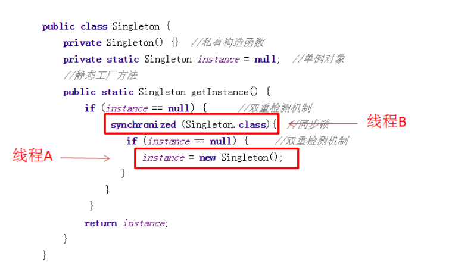
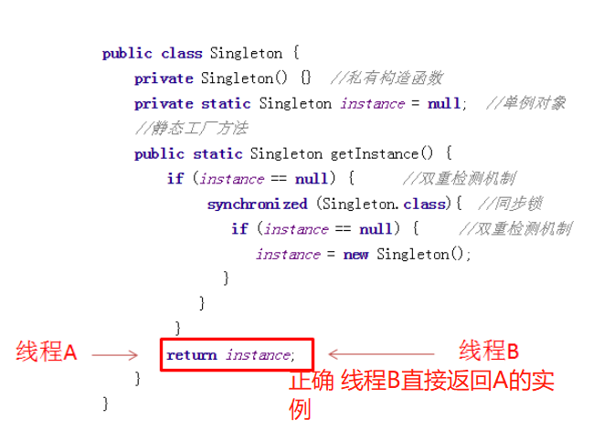

https://www.nowcoder.com/discuss/607156?source_id=discuss_experience_nctrack&channel=-1
https://www.nowcoder.com/discuss/607106?source_id=discuss_experience_nctrack&channel=-1
https://www.nowcoder.com/discuss/606744?source_id=discuss_experience_nctrack&channel=-1
https://www.nowcoder.com/discuss/603222?source_id=discuss_experience_nctrack&channel=-1
https://www.nowcoder.com/discuss/573163?source_id=discuss_experience_nctrack&channel=-1


# 设计模式
## 单例模式
了解哪些设计模式？写一个双重检测的单例模式，为什么要加synchronized？因为要考虑线程安全，加在类方法和普通方法有什么区别？加在类方法是锁住类的class对象，而普通方法是锁住类的对象。

### （一）懒汉式单例

懒汉式单例模式在第一次调用的时候进行实例化。

#### 1、适用于单线程环境（线程不安全）

>* 要想让一个类只能构建一个对象，自然不能让它随便去做new操作，因此Signleton的构造方法是私有的。
>* instance是Singleton类的静态成员，也是我们的单例对象。它的初始值可以写成Null，也可以写成new Singleton()。
>    * 如果单例初始值是null，还未构建，则构建单例对象并返回。这个写法属于单例模式当中的**懒汉模式。**
>    * 如果单例对象一开始就被new Singleton()主动构建，则不再需要判空操作，这种写法属于**饿汉模式。**
>* getInstance是获取单例对象的方法。

```java
public class Singleton{

    private static Singleton instance = null; //私有构造函数
	
    //私有构造函数
    private Singleton() {
    }

    /**
     * 1、适用于单线程环境（不推荐）
     */
    //静态工厂方法
    public static Singleton1 getInstance() {
        if (null == instance) {
            instance = new Singleton();
        }
        return instance;
    }
}
```
**为什么线程不安全？**

假设Singleton类刚刚被初始化，instance对象还是空，这时候两个线程同时访问getInstance方法


显然instance被构建了两次

> 此方式在单线程的时候工作正常，但在多线程的情况下就有问题了。如果两个线程同时运行到判断instance是否为null的if语句，并且instance的确没有被创建时，那么两个线程都会创建一个实例，此时类型Singleton就不再满足单例模式的要求了。

#### 2、适用于多线程环境（效率不高）

>为了保证在多线程环境下我们还是只能得到该类的一个实例，只需要在getInstance()方法加上同步关键字sychronized，就可以了。**但**每次调用getInstance()方法时都被synchronized关键字锁住了，会引起线程阻塞，影响程序的性能。

```java
public class Singleton{

    private static Singleton instance = null;

    private Singleton() {
    }

    /**
     * 2、适用于多线程环境，但效率不高（不推荐）
     */
    public static synchronized Singleton getInstance() {
        if (instance == null) {
            instance = new Singleton();
        }
        return instance;
    }
  
}

```
#### 3、双重检验锁（存在指令重排问题）

>为了在多线程环境下，不影响程序的性能，不让线程每次调用getInstance()方法时都加锁，而只是在实例未被创建时再加锁，在加锁处理里面还需要判断一次实例是否已存在。

```java
public class Singleton{
	//单例对象
    private static Singleton instance = null;
	
    //私有构造函数
    private Singleton() {
    }

    /**
     * 3、双重检查加锁（推荐）
     */
    //静态工厂方法
    public static Singleton getInstance() {
        // 先判断实例是否存在，若不存在再对类对象进行加锁处理
        if (instance == null) { //双重检测机制
            synchronized (Singleton.class) { //同步锁
                if (instance == null) { //双重检测机制
                    instance = new Singleton();
                }
            }
        }
        return instance;
    }
}
```
* 为了防止new Singleton被执行多次，因此在new操作之前加上Synchronized 同步锁，**锁住整个类（注意，这里不能使用对象锁）。**

* 进入Synchronized 临界区以后，还要再做一次判空。因为当两个线程同时访问的时候，线程A构建完对象，**线程B也已经通过了最初的判空验证**，不做第二次判空的话，线程B还是会再次构建instance对象。

* 正确流程

  

  

  

  

  

  **为什么存在指令重排问题？**

  假设这样的场景，当两个线程一先一后访问getInstance方法的时候，当A线程正在构建对象，B线程刚刚进入方法：

  

  * 要么Instance还没被线程A构建，线程B执行 if（instance == null）的时候得到true；
  * 要么Instance已经被线程A构建完成，线程B执行 if（instance == null）的时候得到false。

  * 但是由于**指令重排**会出现**Instance还没被线程A构建完成**，但线程B执行 if（instance == null）的时候得到**false**,从而**返回半成品。**

指令重排是什么意思呢？

比如java中简单的一句 instance = new Singleton()，会被编译器编译成如下JVM指令：

```java
memory =allocate(); //1：分配对象的内存空间

ctorInstance(memory); //2：初始化对象

instance =memory; //3：设置instance指向刚分配的内存地址
```

但是这些指令顺序并非一成不变，有可能会经过JVM和CPU的优化，**指令重排成下面的顺序**：

```java
memory =allocate(); //1：分配对象的内存空间

instance =memory; //3：设置instance指向刚分配的内存地址

ctorInstance(memory); //2：初始化对象
```

当线程A执行完1,3,时，instance对象还未完成初始化，但已经不再指向null。此时如果线程B抢占到CPU资源，执行 if（instance == null）的结果会是false，从而返回一个**没有初始化完成的instance对象**。


#### 4、双重校验volatile方式（解决指令重排问题）

在instance对象前面增加一个修饰符**volatile。**

```java
public class Singleton {
    private Singleton() {}  //私有构造函数
    private volatile static Singleton instance = null;  //单例对象
    //静态工厂方法
    public static Singleton getInstance() {
          if (instance == null) {      //双重检测机制
         synchronized (Singleton.class){  //同步锁
           if (instance == null) {     //双重检测机制
             instance = new Singleton();
                }
             }
          }
          return instance;
      }
}
```

经过volatile的修饰，当线程A执行instance = new Singleton( )的时候，JVM执行顺序是什么样？始终保证是下面的顺序：

```java
memory =allocate(); //1：分配对象的内存空间

ctorInstance(memory); //2：初始化对象

instance =memory; //3：设置instance指向刚分配的内存地址
```

**如此在线程B看来，instance对象的引用要么指向null，要么指向一个初始化完毕的Instance，而不会出现某个中间态，保证了安全。**

#### 5、静态内部类方式（存在反射重复构建对象的问题）

```java
public class SingleTon{
  private SingleTon(){}
 
  private static class SingleTonHoler{
     private static SingleTon INSTANCE = new SingleTon();
 }
 
  public static SingleTon getInstance(){
    return SingleTonHoler.INSTANCE;
  }
}
```

静态内部类的优点是：外部类加载时并不需要立即加载内部类，内部类不被加载则不去初始化INSTANCE，故而不占内存。即当SingleTon第一次被加载时，并不需要去加载SingleTonHoler，只有当getInstance()方法第一次被调用时，才会去初始化INSTANCE,第一次调用getInstance()方法会导致虚拟机加载SingleTonHoler类，这种方法不仅**能确保线程安全，也能保证单例的唯一性，同时也延迟了单例的实例化。**

* **延迟了单例的实例化。**即当SingleTon第一次被加载时，并不需要去加载SingleTonHoler，只有当getInstance()方法第一次被调用时，虚拟机加载SingleTonHoler类。

  **静态内部类就属于被动引用**

  类加载时机：JAVA虚拟机在有且仅有的5种场景下会对类进行初始化。
  1.遇到new、getstatic、setstatic或者invokestatic这4个字节码指令时，对应的java代码场景为：new一个关键字或者一个实例化对象时、读取或设置一个静态字段时(final修饰、已在编译期把结果放入常量池的除外)、调用一个类的静态方法时。
  2.使用java.lang.reflect包的方法对类进行反射调用的时候，如果类没进行初始化，需要先调用其初始化方法进行初始化。
  3.当初始化一个类时，如果其父类还未进行初始化，会先触发其父类的初始化。
  4.当虚拟机启动时，用户需要指定一个要执行的主类(包含main()方法的类)，虚拟机会先初始化这个类。
  5.当使用JDK 1.7等动态语言支持时，如果一个java.lang.invoke.MethodHandle实例最后的解析结果REF_getStatic、REF_putStatic、REF_invokeStatic的方法句柄，并且这个方法句柄所对应的类没有进行过初始化，则需要先触发其初始化。
  这5种情况被称为是类的主动引用，注意，**这里《虚拟机规范》中使用的限定词是"有且仅有"，那么，除此之外的所有引用类都不会对类进行初始化，称为被动引用。静态内部类就属于被动引用的行列。**

* **保证单例的唯一性**

  我们再回头看getInstance()方法，调用的是SingleTonHoler.INSTANCE，取的是SingleTonHoler里的INSTANCE对象，不管多少个线程去调用getInstance()方法，取的都是同一个INSTANCE对象，而不用去重新创建。当getInstance()方法被调用时，SingleTonHoler才在SingleTon的运行时常量池里，把符号引用替换为直接引用（类加载过程的 `解析` 阶段），这时静态对象INSTANCE也真正被创建，然后再被getInstance()方法返回出去。

* **保证线程安全**

   虚拟机会保证一个类的<clinit>()方法在多线程环境中被正确地加锁、同步，如果多个线程同时去初始化一个类，那么只会有一个线程去执行这个类的<clinit>()方法，其他线程都需要阻塞等待，直到活动线程执行<clinit>()方法完毕。如果在一个类的<clinit>()方法中有耗时很长的操作，就可能造成多个进程阻塞(需要注意的是，其他线程虽然会被阻塞，但如果执行<clinit>()方法后，其他线程唤醒之后不会再次进入<clinit>()方法。同一个加载器下，一个类型只会初始化一次。

  >`<clinit>()` 方法是由编译器按照语句在源文件中出现的顺序，依次自动收集类中的所有**类变量**的赋值动作和静态代码块中的语句合并产生的

[参考](https://blog.csdn.net/mnb65482/article/details/80458571)

**如何通过反射打破单例模式只能构建一个对象实例的约束（单例模式共同问题）？**

第一步，获得单例类的构造器。

第二步，把构造器设置为可访问。

第三步，使用newInstance方法构造对象。

```java
//获得构造器
Constructor con = SingleTon.class.getDeclaredConstructor();
//设置为可访问
con.setAccessible(true);
//构造两个不同的对象
SingleTon singleton1 = (SingleTon)con.newInstance();
SingleTon singleton2 = (SingleTon)con.newInstance();
//验证是否是不同对象 比较结果是false。
System.out.println(singleton1.equals(singleton2));
```

### （二）饿汉式单例

> 饿汉式单例类:在类初始化时，已经自行实例化。

#### 1、 普通

```java
public class Singleton2 {

    private static final Singleton2 instance = new Singleton2();

    private Singleton2() {
    }

    public static Singleton2 getInstance() {
        return instance;
    }
}
```

#### 2、枚举方式（解决反射和序列化的问题） 

```java
public enum EnumSingleton {
    INSTANCE;    
}
```

使用枚举实现的单例模式，不但可以防止利用**反射强行构建单例对象**，而且可以在枚举类对象被**反序列化**的时候，保证反序列的返回结果是同一对象。

**反射攻击**

```java
public class Singleton implements Serializable {  
    private static Singleton instance = new Singleton();  
    private Singleton (){}  
    public static Singleton getInstance() {  
    	return instance;  
    }  
}

public class Main {

    public static void main(String[] args) throws Exception {
        Singleton s = Singleton.getInstance();

        // 拿到所有的构造函数，包括非public的
        Constructor<Singleton> constructor = Singleton.class.getDeclaredConstructor();
        constructor.setAccessible(true);
        // 使用空构造函数new一个实例。即使它是private的~~~
        Singleton sReflection = constructor.newInstance();

        System.out.println(s); //com.fsx.bean.Singleton@1f32e575
        System.out.println(sReflection); //com.fsx.bean.Singleton@279f2327
        System.out.println(s == sReflection); // false
    }

}
```

**序列化反序列化攻击**

```java
public class Main {

    public static void main(String[] args) throws Exception {
        Singleton s = Singleton.getInstance();

        byte[] serialize = SerializationUtils.serialize(s);
        Object deserialize = SerializationUtils.deserialize(serialize);


        System.out.println(s); //com.fsx.bean.Singleton@452b3a41
        System.out.println(deserialize); //com.fsx.bean.Singleton@6193b845
        System.out.println(s == deserialize); //false

    }

}
```

**枚举防御反射攻击**

```java
public class Main {

    public static void main(String[] args) throws Exception {
        EnumSingleton s = EnumSingleton.INSTANCE;

        // 拿到所有的构造函数，包括非public的
        Constructor<EnumSingleton> constructor = EnumSingleton.class.getDeclaredConstructor(String.class, int.class);// 拿到有参的构造器
        constructor.setAccessible(true);
        // 使用空构造函数new一个实例。即使它是private的~~~
        System.out.println("拿到了构造器：" + constructor);
        EnumSingleton sReflection = constructor.newInstance("testInstance", 1);

        System.out.println(s); 
        System.out.println(sReflection); 
        System.out.println(s == sReflection); 
    }

}
```

运行报错

```javascript
拿到了构造器：private com.fsx.bean.EnumSingleton(java.lang.String,int)
Exception in thread "main" java.lang.IllegalArgumentException: Cannot reflectively create enum objects
	at java.lang.reflect.Constructor.newInstance(Constructor.java:417)
	at com.fsx.maintest.Main.main(Main.java:22)
```

第一句输出了，表示我们是成功拿到了构造器`Constructor`对象的，只是在执行`newInstance`时候报错了。并且也提示报错在`Constructor`的417行，看看`Constructor`的源码处：

```java
public final class Constructor<T> extends Executable {
	...
    public T newInstance(Object ... initargs) throws InstantiationException, IllegalAccessException, IllegalArgumentException, InvocationTargetException {
		...
        if ((clazz.getModifiers() & Modifier.ENUM) != 0)
            throw new IllegalArgumentException("Cannot reflectively create enum objects");
		...
	}
	...
}
```

主要是这一句：`(clazz.getModifiers() & Modifier.ENUM) != 0`。说明：`反射在通过newInstance创建对象时，会检查该类是否ENUM修饰，如果是则抛出异常，反射失败`，因此**枚举类型对反射是绝对安全的。**

**枚举防御序列化问题**

```java
public class Main {

    public static void main(String[] args) {
        EnumSingleton s = EnumSingleton.INSTANCE;

        byte[] serialize = SerializationUtils.serialize(s);
        Object deserialize = SerializationUtils.deserialize(serialize);
        System.out.println(s == deserialize); //true
    }

}
```

**其他单例防御序列化攻击必须实现readResolve方法**

当把 MySingleton对象(通过getInstance方法获得的那个单例对象)序列化后再从内存中读出时, 就有一个全新但跟原来一样的MySingleton对象存在了

```java
public final class MySingleton implements Serializable {
     private MySingleton() { }
     private static final MySingleton INSTANCE = new MySingleton();
     public static MySingleton getInstance() { return INSTANCE; }
}
```
这样当JVM从内存中反序列化地"组装"一个新对象时,就**会自动调用这个 readResolve方法来返回我们指定好的对象了, 单例规则也就得到了保证.**
```java
public final class MySingleton implements Serializable{
    private MySingleton() { }
    private static final MySingleton INSTANCE = new MySingleton();
    public static MySingleton getInstance() { return INSTANCE; }
    private Object readResolve() throws ObjectStreamException {
       // instead of the object we're on,
       // return the class variable INSTANCE
      return INSTANCE;
   }
}
```

[参考](https://blog.csdn.net/huangbiao86/article/details/6896565)

[参考](https://cloud.tencent.com/developer/article/1497592)

[参考](https://blog.csdn.net/u011595939/article/details/79972371)  [参考](https://zhuanlan.zhihu.com/p/33102022)


# I/0
## Linux(UNIX)操作系统中五种IO模型

### (一）什么是I0

我们都知道unix世界里、一切皆文件、而文件是什么呢？文件就是一串二进制流而已、不管socket、还是FIFO、管道、终端、对我们来说、**一切都是文件、一切都是流**、在信息交换的过程中、我们都是对这些流进行数据的收发操作、简称为I/O操作(input and output)、往流中读出数据、系统调用read、写入数据、系统调用write、不过话说回来了、计算机里有这么多的流、我怎么知道要操作哪个流呢？**做到这个的就是文件描述符、即通常所说的fd、一个fd就是一个整数、所以对这个整数的操作、就是对这个文件（流）的操作**、我们创建一个socket、通过系统调用会返回一个文件描述符、那么剩下对socket的操作就会转化为对这个描述符的操作、不能不说这又是一种分层和抽象的思想。

### (二) I0交互

通常用户进程中的一个完整IO分为两个阶段：

设备空间<-------------> 内核空间、

内核空间<------------->用户空间、


对于一个输入操作来说、进程IO系统调用后、内核会先看缓冲区中有没有相应的缓存数据、没有的话再到设备中读取、因为设备IO一般速度较慢、需要等待、内核缓冲区有数据则直接复制到进程空间

### (三) 同步模型

分为两个步骤：1、数据准备。2、数据拷贝，同步模型通过`recvfrom`操作进行数据拷贝，必须等待数据拷贝完成

#### 1、阻塞模型

阻塞 I/O 是最简单的 I/O 模型，一般表现为进程或线程等待某个条件，如果条件不满足，则一直等下去。条件满足，则进行下一步操作。


应用进程通过系统调用 `recvfrom` 接收数据，但由于内核还未准备好数据报，应用进程就会阻塞住，直到内核准备好数据报，`recvfrom` 完成数据报复制工作，应用进程才能结束阻塞状态。

#### 2、非阻塞模型

应用进程与内核交互，目的未达到之前，不再一味的等着，而是直接返回。然后通过轮询的方式，不停的去问内核数据准备有没有准备好。如果某一次轮询发现数据已经准备好了，那就把数据拷贝到用户空间中。


应用进程通过 `recvfrom` 调用不停的去和内核交互，直到内核准备好数据。如果没有准备好，内核会返回`error`，应用进程在得到`error`后，过一段时间再发送`recvfrom`请求。在两次发送请求的时间段，进程可以先做别的事情。

#### 3、信号驱动IO模型

应用进程在读取文件时通知内核，如果某个 socket 的某个事件发生时，请向我发一个信号。在收到信号后，信号对应的处理函数会进行后续处理。


应用进程预先向内核注册一个信号处理函数，然后用户进程返回，并且不阻塞，当内核数据准备就绪时会发送一个信号给进程，用户进程便在信号处理函数中开始把数据拷贝的用户空间中。

#### 4、IO复用模型

多个进程的IO可以注册到同一个管道上，这个管道会统一和内核进行交互。当管道中的某一个请求需要的数据准备好之后，进程再把对应的数据拷贝到用户空间中。


IO多路转接是多了一个`select`函数，多个进程的IO可以注册到同一个`select`上，当用户进程调用该`select`，`select`会监听所有注册好的IO，如果所有被监听的IO需要的数据都没有准备好时，`select`调用进程会阻塞。当任意一个IO所需的数据准备好之后，`select`调用就会返回，然后进程在通过`recvfrom`来进行数据拷贝。

**这里的IO复用模型，并没有向内核注册信号处理函数，所以，他并不是非阻塞的。**进程在发出`select`后，要等到`select`监听的所有IO操作中至少有一个需要的数据准备好，才会有返回，并且也需要再次发送请求去进行文件的拷贝。

### (四) 异步IO模型

应用进程把IO请求传给内核后，完全由内核去操作文件拷贝。内核完成相关操作后，会发信号告诉应用进程本次IO已经完成。


用户进程发起`aio_read`操作之后，给内核传递描述符、缓冲区指针、缓冲区大小等，告诉内核当整个操作完成时，如何通知进程，然后就立刻去做其他事情了。当内核收到`aio_read`后，会立刻返回，然后内核开始等待数据准备，数据准备好以后，直接把数据拷贝到用户控件，然后再通知进程本次IO已经完成。

### (五) 五种IO模型对比


[参考](https://mp.weixin.qq.com/s?__biz=Mzg3MjA4MTExMw==&mid=2247484746&idx=1&sn=c0a7f9129d780786cabfcac0a8aa6bb7&source=41#wechat_redirect)

### (六) IO多路复用之select、poll、epoll

select, poll, epoll 都是I/O 多路复用模型。其中 select, poll 是 POSIX 规定的，而 epoll 是 Linux 专门有的特性，在 Linux 2.6 后加入的。select 和 poll 都是采用轮询的方式检查`fd`，而 epoll 使用事件的就绪通知方式。

进程可以通过 select、poll、epoll 发起 I/O 多路复用的系统调用，这些系统调用都是同步阻塞的：**如果传入的多个文件描述符中，有描述符就绪，则返回就绪的描述符；否则如果所有文件描述符都未就绪，就阻塞调用进程，直到某个描述符就绪，或者阻塞时长超过设置的 timeout 后，再返回**。

>如果 `timeout` 参数设为 NULL，会无限阻塞直到某个描述符就绪；如果 `timeout` 参数设为 0，会立即返回，不阻塞。

使用非阻塞 I/O 检查每个描述符的就绪状态。

#### 为什么 I/O 多路复用内部需要使用非阻塞 I/O

I/O 多路复用**内部**会遍历集合中的每个文件描述符，判断其是否就绪：

```java
for fd in read_set
    if（ readable(fd) ) // 判断 fd 是否就绪
        count++
        FDSET(fd, &res_rset) // 将 fd 添加到就绪集合中
        break
...
return count
```

这里的 `readable(fd)` 就是一个非阻塞 I/O 调用。试想，如果这里使用阻塞 I/O，那么 `fd` 未就绪时，`select` 会阻塞在这个文件描述符上，无法检查下个文件描述符。

#### 什么是文件描述符 fd

文件描述符（file descriptor）是一个非负整数，从 0 开始。进程使用文件描述符来标识一个打开的文件。

系统为每一个进程维护了一个文件描述符表，表示该进程打开文件的记录表，而**文件描述符实际上就是这张表的索引**。当进程打开（`open`）或者新建（`create`）文件时，内核会在该进程的文件列表中新增一个表项，同时返回一个文件描述符 —— 也就是新增表项的下标。

一般来说，每个进程最多可以打开 64 个文件，`fd ∈ 0~63`。在不同系统上，最多允许打开的文件个数不同，Linux 2.4.22 强制规定最多不能超过 1,048,576。

[参考](https://github.com/labuladong/fucking-algorithm/blob/master/%E6%8A%80%E6%9C%AF/linux%E8%BF%9B%E7%A8%8B.md)

#### socket 与 fd 的关系

socket 是 Unix 中的术语。socket 可以用于同一台主机的不同进程间的通信，也可以用于不同主机间的通信。一个 socket 包含地址、类型和通信协议等信息，通过 `socket()` 函数创建：

```
int socket(int domain, int type, int protocol)
```

返回的就是这个 socket 对应的文件描述符 `fd`。

可以这样理解：**socket 是进程间通信规则的高层抽象，而 fd 提供的是底层的具体实现**。socket 与 fd 是一一对应的。**通过 socket 通信，实际上就是通过文件描述符 `fd` 读写文件**。这也符合 Unix“一切皆文件”的哲学。

后面可以将 socket 和 fd 视为同义词。

#### select

##### 函数签名与参数

```c++
int select(int nfds,
            fd_set *restrict readfds,
            fd_set *restrict writefds,
            fd_set *restrict errorfds,
            struct timeval *restrict timeout);
```

`readfds`、`writefds`、`errorfds` 是三个文件描述符集合。`select` 会遍历每个集合的前 `nfds` 个描述符，分别找到可以读取、可以写入、发生错误的描述符，统称为“就绪”的描述符。然后用找到的子集替换参数中的对应集合，**返回所有就绪描述符的总数。**

`timeout` 参数表示调用 `select` 时的阻塞时长。如果所有文件描述符都未就绪，就阻塞调用进程，直到某个描述符就绪，或者阻塞超过设置的 timeout 后，返回。如果 `timeout` 参数设为 NULL，会无限阻塞直到某个描述符就绪；如果 `timeout` 参数设为 0，会立即返回，不阻塞。

**函数返回值int**表示： 就绪描述符的数量，如果为-1表示产生错误 。

##### fd_set 文件描述符集合

参数中的 `fd_set` 类型表示文件描述符的集合。

由于文件描述符 `fd` 是一个从 0 开始的无符号整数，所以可以使用 `fd_set` 的**二进制每一位**来表示一个文件描述符。某一位为 1，表示对应的文件描述符已就绪。比如比如设 `fd_set` 长度为 1 字节，则一个 `fd_set` 变量最大可以表示 8 个文件描述符。当 `select` 返回 `fd_set = 00010011` 时，表示文件描述符 `1`、`2`、`5` 已经就绪。

`fd_set` 的使用涉及以下几个 API：

```c++
#include <sys/select.h>   
int FD_ZERO(int fd, fd_set *fdset);  // 将 fd_set 所有位置 0
int FD_CLR(int fd, fd_set *fdset);   // 将 fd_set 某一位置 0
int FD_SET(int fd, fd_set *fd_set);  // 将 fd_set 某一位置 1
int FD_ISSET(int fd, fd_set *fdset); // 检测 fd_set 某一位是否为 1
```

##### 运行机制

Select会将全量`fd_set`从用户空间拷贝到内核空间，并注册回调函数， 在内核态空间来判断每个请求是否准备好数据 。select在没有查询到有文件描述符就绪的情况下，将一直阻塞（I/O多路复用中提过：select是一个阻塞函数）。如果有一个或者多个描述符就绪，那么select将就绪的文件描述符置位，通过select返回。返回后，由程序遍历查看哪个请求有数据。

#####  select 使用

1. 先声明一个 `fd_set` 类型的变量 `readFDs`
2. 调用 `FD_ZERO`，将 `readFDs` 所有位置 0
3. 调用 `FD_SET`，将 `readFDs` 感兴趣的位置 1，表示要监听这几个文件描述符
4. 将 `readFDs` 传给 `select`，调用 `select`
5. `select` 会将 `readFDs` 中就绪的位置 1，未就绪的位置 0，返回就绪的文件描述符的数量
6. 当 `select` 返回后，调用 `FD_ISSET` 检测给定位是否为 1，表示对应文件描述符是否就绪

比如进程想监听 1、2、5 这三个文件描述符，就将 `readFDs` 设置为 `00010011`，然后调用 `select`。

如果 `fd=1`、`fd=2` 就绪，而 `fd=5` 未就绪，`select` 会将 `readFDs` 设置为 `00000011` 并返回 2。

如果每个文件描述符都未就绪，`select` 会阻塞 `timeout` 时长，再返回。这期间，如果 `readFDs` 监听的某个文件描述符上发生可读事件，则 `select` 会将对应位置 1，并立即返回。

##### select 的缺点

1. 性能开销大
   1. 调用 `select` 时会陷入内核，这时需要将参数中的 `fd_set` 从用户空间拷贝到内核空间
   2. 内核需要遍历传递进来的所有 `fd_set` 的每一位，不管它们是否就绪
2. 同时能够监听的文件描述符数量太少。受限于 `sizeof(fd_set)` 的大小，在编译内核时就确定了且无法更改。一般是 1024，不同的操作系统不相同

#### poll

poll 和 select 几乎没有区别。poll 采用链表的方式存储文件描述符，没有最大存储数量的限制（**Poll机制突破了Select机制中的文件描述符数量最大为1024的限制**）。

从性能开销上看，poll 和 select 的差别不大。

##### 函数签名与参数

```c++
int poll(struct pollfd fds[], nfds_t nfds, int timeout);
    Return number of ready file descriptors, 0 on timeout, -1 on error.
```

其中参数`fds`是一个链表，`pollfd`的结构定义为：

```
struct pollfd {
    int    fd;        /* File descriptor */
    short  events;    /* Requested events bit mask */
    short  revents;   /* Returned events bit mast */
}
```

结构体中fd为需要监听的文件描述符，events为需要监听的事件类型，而revents为经过poll调用之后返回的事件类型，在调用poll的时候，一般会传入一个pollfd的结构体数组，数组的元素个数表示监控的描述符个数。


可以看到，不同于 select，poll 里每个`fd`只需要在链表里存在一个就够了。

##### select 和 poll 的区别

- select 参数使用的类型是`fd_set`，而 poll 使用的是链表。前者由上限值而后者没有。
- 在循环调用中，由于 select 的参数 `fd_set` 是参数同时也是保存结果的地方，所以每次调用前都需要重新初始化参数，而 poll 则不需要。
- select 使用的 `timeout` 为微秒，而 poll 为毫秒。
- 如果其中一个`fd`关闭了，poll 可以通过`revents`字段设定`POLLNVAL`标记，而 select 会返回 -1。

[参考](https://medium.com/@hxueh18/select-poll-epoll-e80e6af61511)

##### Poll的缺陷

Poll机制相较于Select机制中，解决了文件描述符数量上限为1024的缺陷。但另外两点缺陷依然存在：

- 每次调用poll，都需要把fd集合从用户态拷贝到内核态，fd越多开销则越大；
- 每次调用poll，都需要在内核遍历传递进来的所有fd，这个开销在fd很多时也很大

#### epoll

epoll 是对 select 和 poll 的改进，避免了“性能开销大”和“文件描述符数量少”两个缺点。

简而言之，epoll 有以下几个特点：

- 使用**红黑树**存储文件描述符集合
- 使用**队列**存储就绪的文件描述符
- 每个文件描述符只需在添加时传入一次；通过事件更改文件描述符状态

select、poll 模型都只使用一个函数，而 epoll 模型使用三个函数：`epoll_create`、`epoll_ctl` 和 `epoll_wait`。

##### epoll_create

```c++
int epoll_create(int size);
```

`epoll_create` 会创建一个 `epoll` 实例，同时返回一个引用该实例的文件描述符。

返回的文件描述符仅仅指向对应的 `epoll` 实例，并不表示真实的磁盘文件节点。其他 API 如 `epoll_ctl`、`epoll_wait` 会使用这个文件描述符来操作相应的 `epoll` 实例。

当创建好 epoll 句柄后，它会占用一个 fd 值，在 linux 下查看 `/proc/进程id/fd/`，就能够看到这个 fd。所以在使用完 epoll 后，必须调用 `close(epfd)` 关闭对应的文件描述符，否则可能导致 fd 被耗尽。当指向同一个 `epoll` 实例的所有文件描述符都被关闭后，操作系统会销毁这个 `epoll` 实例。

`epoll` 实例内部存储：

- 监听列表：所有要监听的文件描述符，使用红黑树
- 就绪列表：所有就绪的文件描述符，使用链表

##### epoll_ctl

```c+
int epoll_ctl(int epfd, int op, int fd, struct epoll_event *event);
```

`epoll_ctl` 会监听文件描述符 `fd` 上发生的 `event` 事件（向epoll中注册事件，该函数如果调用成功返回0，否则返回-1）。

参数说明：

- `epfd` 即 `epoll_create` 返回的文件描述符，指向一个 `epoll` 实例
- `fd` 表示要监听的目标文件描述符
- `event` 表示要监听的事件（可读、可写、发送错误…）
- `op`表示要对`fd`执行的操作，有以下几种：
  - `EPOLL_CTL_ADD`：为 `fd` 添加一个监听事件 `event`
  - `EPOLL_CTL_MOD`：Change the event event associated with the target file descriptor fd（`event` 是一个结构体变量，这相当于变量 `event` 本身没变，但是更改了其内部字段的值）
  - `EPOLL_CTL_DEL`：删除 `fd` 的所有监听事件，这种情况下 `event` 参数没用

返回值 0 或 -1，表示上述操作成功与否。

`epoll_ctl` 会将文件描述符 `fd` 添加到 `epoll` 实例的监听列表里，同时为 `fd` 设置一个回调函数，并监听事件 `event`。当 `fd` 上发生相应事件时，会调用回调函数，将 `fd` 添加到 `epoll` 实例的就绪队列上。

#####  epoll_wait

```c++
int epoll_wait(int epfd, struct epoll_event *events,int maxevents, int timeout);
```

这是 epoll 模型的主要函数，类似与select机制中的select函数、poll机制中的poll函数，等待内核返回监听描述符的事件产生。该函数返回已经就绪的事件的数量，如果为-1表示出错。

参数说明：

- `epfd` 即 `epoll_create` 返回的文件描述符，指向一个 `epoll` 实例
- `events` 是一个数组，保存就绪状态的文件描述符，其空间由调用者负责申请
- `maxevents` 指定 `events` 的大小
- `timeout` 类似于 `select` 中的 timeout。如果没有文件描述符就绪，即就绪队列为空，则 `epoll_wait` 会阻塞 timeout 毫秒。如果 timeout 设为 -1，则 `epoll_wait` 会一直阻塞，直到有文件描述符就绪；如果 timeout 设为 0，则 `epoll_wait` 会立即返回

返回值表示 `events` 中存储的就绪描述符个数，最大不超过 `maxevents`。

##### epoll 的优点

epoll 是对 select 和 poll 的改进，避免了“性能开销大”和“文件描述符数量少”两个缺点。

对于“文件描述符数量少”，select 使用整型数组存储文件描述符集合，而 epoll 使用红黑树存储，数量较大。

对于“性能开销大”，`epoll_ctl` 中为每个文件描述符指定了回调函数，并在就绪时将其加入到就绪列表，因此 epoll 不需要像 `select` 那样遍历检测每个文件描述符，只需要判断就绪列表是否为空即可。这样，在没有描述符就绪时，epoll 能更早地让出系统资源。

> 相当于时间复杂度从 O(n) 降为 O(1)

此外，每次调用 `select` 时都需要向内核拷贝所有要监听的描述符集合，而 epoll 对于每个描述符，只需要在 `epoll_ctl` 传递一次，之后 `epoll_wait` 不需要再次传递。这也大大提高了效率。

#### 水平触发、边缘触发

`select` 只支持水平触发，`epoll` 支持水平触发和边缘触发。

水平触发（LT，Level Trigger）：当文件描述符就绪时，会触发通知，如果用户程序没有一次性把数据读/写完，下次还会发出可读/可写信号进行通知。

边缘触发（ET，Edge Trigger）：仅当描述符从未就绪变为就绪时，通知一次，之后不会再通知。

区别：边缘触发效率更高，**减少了事件被重复触发的次数**，函数不会返回大量用户程序可能不需要的文件描述符。

>水平触发、边缘触发的名称来源：数字电路当中的电位水平，高低电平切换瞬间的触发动作叫边缘触发，而处于高电平的触发动作叫做水平触发。

#### Epoll的工作模式

相较于Select和Poll，Epoll内部还分为两种工作模式： **LT水平触发（level trigger）**和**ET边缘触发（edge trigger）**。

- **LT模式：** 默认的工作模式，即当epoll_wait检测到某描述符事件就绪并通知应用程序时，应用程序**可以不立即处理**该事件；事件会被放回到就绪链表中，下次调用epoll_wait时，会再次通知此事件。
- **ET模式：** 当epoll_wait检测到某描述符事件就绪并通知应用程序时，应用程序**必须立即处理**该事件。如果不处理，下次调用epoll_wait时，不会再次响应并通知此事件。

由于上述两种工作模式的区别，**LT模式同时支持block和no-block socket两种，而ET模式下仅支持no-block socket**。即**epoll工作在ET模式的时候，必须使用非阻塞套接口**，以避免由于一个fd的阻塞I/O操作把多个处理其他文件描述符的任务饿死。**ET模式在很大程度上减少了epoll事件被重复触发的次数，因此效率要比LT模式高。**

#### 为什么边缘触发必须使用非阻塞 I/O？

- 每次通过 `read` 系统调用读取数据时，最多只能读取缓冲区大小的字节数；如果某个文件描述符一次性收到的数据超过了缓冲区的大小，那么需要对其 `read` 多次才能全部读取完毕
- `select` **可以使用阻塞 I/O**。通过 select获取到所有可读的文件描述符后，遍历每个文件描述符，read**一次**数据 
  - 这些文件描述符都是可读的，因此即使 `read` 是阻塞 I/O，也一定可以读到数据，不会一直阻塞下去
  - `select` 采用水平触发模式，因此如果第一次 `read` 没有读取完全部数据，那么下次调用 `select` 时依然会返回这个文件描述符，可以再次 `read`
  - **`select` 也可以使用非阻塞 I/O**。当遍历某个可读文件描述符时，使用 `for` 循环调用 `read` **多次**，直到读取完所有数据为止（返回 `EWOULDBLOCK`）。这样做会多一次 `read` 调用，但可以减少调用 `select` 的次数
- 在`epoll`的边缘触发模式下，只会在文件描述符的可读/可写状态发生切换时，才会收到操作系统的通知
  - 因此，如果使用 `epoll` 的**边缘触发模式**，在收到通知时，**必须使用非阻塞 I/O，并且必须循环调用 `read` 或 `write` 多次，直到返回 `EWOULDBLOCK` 为止**，然后再调用 `epoll_wait` 等待操作系统的下一次通知
  - 如果没有一次性读/写完所有数据，那么在操作系统看来这个文件描述符的状态没有发生改变，将不会再发起通知，调用 `epoll_wait` 会使得该文件描述符一直等待下去，服务端也会一直等待客户端的响应，业务流程无法走完
  - 这样做的好处是每次调用 `epoll_wait` 都是**有效**的——保证数据全部读写完毕了，等待下次通知。在水平触发模式下，如果调用 `epoll_wait` 时数据没有读/写完毕，会直接返回，再次通知。因此边缘触发能显著减少事件被触发的次数
  - 为什么 `epoll` 的**边缘触发模式不能使用阻塞 I/O**？很显然，边缘触发模式需要循环读/写一个文件描述符的所有数据。如果使用阻塞 I/O，那么一定会在最后一次调用（没有数据可读/写）时阻塞，导致无法正常结束

#### 三者对比

- `select`：调用开销大（需要复制集合）；集合大小有限制；需要遍历整个集合找到就绪的描述符
- `poll`：poll 采用链表的方式存储文件描述符，没有最大存储数量的限制，其他方面和 select 没有区别
- `epoll`：调用开销小（不需要复制）；集合大小无限制；采用回调机制，不需要遍历整个集合

`select`、`poll` 都是在用户态维护文件描述符集合，因此每次需要将完整集合传给内核；`epoll` 由操作系统在内核中维护文件描述符集合，因此只需要在创建的时候传入文件描述符。

此外 `select` 只支持水平触发，`epoll` 支持边缘触发。


#### 适用场景

当连接数较多并且有很多的不活跃连接时，epoll 的效率比其它两者高很多。当连接数较少并且都十分活跃的情况下，由于 epoll 需要很多回调，因此性能可能低于其它两者。

[参考](https://imageslr.github.io/2020/02/27/select-poll-epoll.html#%E4%BB%8E%E9%98%BB%E5%A1%9E-io-%E5%88%B0-io-%E5%A4%9A%E8%B7%AF%E5%A4%8D%E7%94%A8)

[参考](https://zhuanlan.zhihu.com/p/95872805)

### (七) JAVA的IO模型

**Java中提供的IO有关的API，在文件处理的时候，其实依赖操作系统层面的IO操作实现的。**比如在Linux 2.6以后，Java中NIO和AIO都是通过epoll来实现的，而在Windows上，AIO是通过IOCP来实现的。

可以把Java中的BIO、NIO和AIO理解为是Java语言对操作系统的各种IO模型的封装。程序员在使用这些API的时候，不需要关心操作系统层面的知识，也不需要根据不同操作系统编写不同的代码。只需要使用Java的API就可以了。

#### 概述

**Java BIO**：`同步并阻塞`（传统阻塞型），服务器实现模式为**一个连接一个线程**，即客户端有连接请求时服务器端就需要启动一个线程进行处理，如果这个连接不作任何事情会造成不必要的线程开销。


**Java NIO**：`同步非阻塞`，服务器实现模式为**一个线程处理多个请求(连接)**，即客户端发送的连接请求会被注册到多路复用器上，多路复用器轮询到有 I/O 请求就会进行处理。


**Java AIO**：`异步非阻塞`，AIO 引入了异步通道的概念，采用了 Proactor 模式，简化了程序编写，有效的请求才启动线程，它的特点是先由操作系统完成后才通知服务端程序启动线程去处理，一般适用于连接数较多且连接时间较长的应用。

- `同步阻塞`：你到饭馆点餐，然后在那等着，还要一边喊：好了没啊！
- `同步非阻塞`：在饭馆点完餐，就去遛狗了。不过溜一会儿，就回饭馆喊一声：好了没啊！
- `异步阻塞`：遛狗的时候，接到饭馆电话，说饭做好了，让您亲自去拿。
- `异步非阻塞`：饭馆打电话说，我们知道您的位置，一会给你送过来，安心遛狗就可以了。

#### BIO、NIO、AIO 使用场景分析

- BIO 方式适用于`连接数比较小且固定`的架构，这种方式对服务器资源要求比较高，并发局限于应用中，JDK1.4 之前唯一的选择，程序较为简单容易理解。
- NIO 方式适用于`连接数目多且连接比较短`的架构，比如聊天服务器，弹幕系统，服务器间通讯等，编程比较复杂，JDK1.4 开始支持。
- AIO 方式适用于`连接数目多且连接比较长`的架构，比如相册服务器，充分调用 OS 参与并发操作，变成比较复杂，JDK7 开始支持。

#### BIO

##### BIO 基本介绍

- Java BIO 就是传统的 Java IO 编程，其相关的类和接口在 java.io 包下。
- BIO（Blocking I/O）：`同步阻塞`，服务器实现模式为一个连接一个线程，即客户端有连接请求时，服务器就会需要启动一个线程来进行处理。如果这个连接不作任何事情就会造成不必要的开销，可以通过线程池机制改善。

##### BIO 问题分析

1. 每个请求都需要创建独立的线程，与对应的客户端进行数据处理。
2. 当并发数大时，需要`创建大量线程来处理连接`，系统资源占用较大。
3. 连接建立后，如果当前线程暂时没有数据可读，则当**前线程会一直阻塞在 Read 操作上**，造成线程资源浪费。

#### NIO

##### NIO基本介绍

1. Java NIO 全称 Java non-blocking IO，指的是 JDK 提供的新 API。从 JDK 1.4 开始，Java 提供了一系列改进的输入/输出的新特性，被统称为 NIO，即 New IO，是`同步非阻塞`的。
2. NIO 相关类都放在 java.nio 包下，并对原 java.io 包中很多类进行了改写。
3. NIO 有**三大核心**部分：`Channel（管道）`、`Buffer（缓冲区）`、`Selector（选择器）`。
4. NIO 是面向`缓冲区`编程的。数据读取到了一个它稍微处理的缓冲区，需要时可在缓冲区中前后移动，这就增加了处理过程中的灵活性，使用它可以提供非阻塞的高伸缩性网络。
5. Java NIO 的非阻塞模式，使一个线程从某通道发送请求读取数据，但是它仅能得到目前可用数据，如果目前没有可用数据时，则说明都不会获取，而不是保持线程阻塞，所以直到数据变为可以读取之前，该线程可以做其他事情。非阻塞写入同理。

##### NIO和BIO对比

1. BIO 以流的方式处理数据，而 NIO 以块的方式处理数据，块 I/O 的效率比流 I/O 高很多。
2. BIO 是阻塞的，而 NIO 是非阻塞的。
3. BIO 基于字节流和字符流进行操作，而 NIO 基于 Channel（通道）和 Buffer（缓冲区）进行操作，数据总是从通道读取到缓冲区中，或者从缓冲区写入到通道中。Selector（选择器）用于监听多个通道事件（比如连接请求，数据到达等），因此`使用单个线程就可以监听多个客户端通道`。

##### NIO 三大核心组件关系


1. 每个 Channel 对应一个 Buffer。
2. Selector 对应一个线程，一个线程对应多个 Channel。
3. 该图反应了有三个 Channel 注册到该 Selector。
4. 程序切换到那个 Channel 是由`事件`决定的（Event）。
5. Selector 会根据不同的事件，在各个通道上切换。
6. Buffer 就是一个内存块，底层是有一个数组。
7. 数据的读取和写入是通过 Buffer，但是需要`flip()`切换读写模式。而 BIO 是单向的，要么输入流要么输出流。

##### NIO 三大核心理解


##### Selector 的基本介绍

1. Java 的 NIO 使用了非阻塞的 I/O 方式。可以用一个线程处理若干个客户端连接，就会使用到 Selector（选择器）。
2. **Selector 能够检测到多个注册通道上是否有事件发生(多个 Channel 以事件的形式注册到同一个 selector)**，如果有事件发生，便获取事件然后针对每个事件进行相应的处理。
3. 只有在连接真正有读写事件发生时，才会进行读写，减少了系统开销，并且不必为每个连接都创建一个线程，不用维护多个线程。
4. 避免了多线程之间上下文切换导致的开销。

##### Selector 特点

Netty 的 I/O 线程 NioEventLoop 聚合了 Selector(选择器 / 多路复用器)，可以并发处理成百上千个客户端连接。

当线程从某客户端 Socket 通道进行读写时，若没有数据可用，该线程可以进行其他任务。

线程通常将非阻塞 I/O 的空闲时间用于其他通道上执行 I/O 操作，所以单独的线程可以管理多个输入输出通道。

由于读写操作都是非阻塞的，就可以充分提高 I/O 线程的运行效率，避免由于频繁 I/O 阻塞导致的线程挂起。

一个 I/O 线程可以并发处理 N 个客户端连接和读写操作，这从根本上解决了传统同步阻塞 I/O 一连接一线程模型，架构性能、弹性伸缩能力和可靠性都得到极大地提升。

#### AIO

JDK 7 引入了 Asynchronous I/O，即 AIO。在进行 I/O 编程中，通常用到两种模式：Reactor 和 Proactor 。Java 的 NIO 就是 Reactor，当有事件触发时，服务器端得到通知，进行相应的处理。

AIO 叫做`异步非阻塞`的 I/O，引入了异步通道的概念，采用了 Proactor 模式，简化了程序编写，有效的请求才会启动线程，特点就是先由操作系统完成后才通知服务端程序启动线程去处理，一般用于连接数较多且连接时长较长的应用。

**Reactor 与 Proactor**

- 两种 IO 多路复用方案:Reactor and Proactor。
- Reactor 模式是基于同步 I/O 的，而 Proactor 模式是和异步 I/O 相关的。


