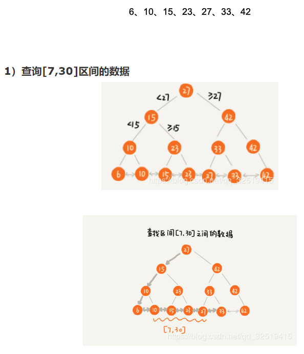

https://www.nowcoder.com/discuss/601110?source_id=discuss_experience_nctrack&channel=-1

https://www.nowcoder.com/discuss/601466?source_id=discuss_experience_nctrack&channel=-1

https://www.nowcoder.com/discuss/594039?source_id=discuss_experience_nctrack&channel=-1


# JVM

## Java类加载

### 一、定义

Class 文件中描述的各类信息都需要**加载**到虚拟机后才能使用。**JVM 把描述类的数据从 Class 文件加载到内存，并对数据进行验证、准备、解析和初始化，最终形成可以被虚拟机直接使用的 Java 类型**，这个过程称为虚拟机的**类加载机制**。

与编译时需要连接的语言不同，Java 中类型的加载、连接和初始化都是在**运行期间**完成的，这增加了性能开销，但却提供了极高的扩展性，Java 动态扩展的语言特性就是依赖运行期动态加载和连接实现的。

一个类从被加载到虚拟机内存开始，到卸载出内存为止，整个**生命周期**经历加载、验证、准备、解析、初始化、使用和卸载七个阶段，其中验证、准备、解析三个部分称为连接。


### 二、类加载的过程

#### **1.加载**

  加载主要完成三件事：

- 找到类文件（通过一个类的全限定类名来获取定义此类的二进制字节流）
- 放入方法区（将这个字节流所代表的静态存储结构转化为方法区的运行时数据结构）
- 开个入口（在内存中生成对应该类的java.lang.Class对象，作为方法区这些类的数据访问入口）

总的来讲，这一步就是通过类加载器**把类读入内存**。需要注意的是，第三步虽然生成了对象，但并不在堆里，而是在方法区里。

#### 2.**验证**

​       验证是连接阶段的第一步，目的是确保Class文件的字节流中包含的信息是否符合当前虚拟机的要求，并且不会危害虚拟机自身的安全。验证主要包含四个阶段：文件格式验证、元数据验证、字节码验证、符号引用验证。**验证重要但非必需**，因为只有通过与否的区别，通过后对程序运行期没有任何影响。

- 文件格式验证：如主、次版本号是否在当前虚拟机处理范围之内、常量合理性验证等。
  此阶段保证输入的字节流能正确地解析并存储于方法区之内，格式上符合描述一个 Java类型信息的要求。
- 元数据验证：是否存在父类，父类的继承链是否正确，抽象类是否实现了其父类或接口之中要求实现的所有方法，字段、方法是否与父类产生矛盾等。
  第二阶段，保证不存在不符合 Java 语言规范的元数据信息。
- 字节码验证：通过数据流和控制流分析，确定程序语义是合法的、符合逻辑的。例如保证跳转指令不会跳转到方法体以外的字节码指令上。
- 符号引用验证：在解析阶段中发生，保证可以将符号引用转化为直接引用

#### **3.准备**

​       为**类变量**（静态变量和静态常量）分配内存并设置**零值**。如果变量被 **final** 修饰，编译时 Javac 会为变量生成 ConstantValue 属性，准备阶段虚拟机会将变量值设为代码值。

​      

 需要注意的是，静态变量只会给默认值。比如下面这个例子，此时赋给value的值是0，不是123。

```java
public static int value = 123;
```

  静态常量（**static** **final修饰的**）则会直接赋值。比如下面这个，此时赋给value的值是123。

```java
public static final int value = 123;
```

#### **4.解析**

​       虚拟机将常量池内的**符号引用替换为直接引用**的过程。

- **符号引用**：以一组符号描述引用目标，可以是任何形式的字面量，只要使用时能无歧义地定位目标即可。与虚拟机内存布局无关，引用目标不一定已经加载到虚拟机内存。
- **直接引用**：是可以直接指向目标的指针、相对偏移量或能间接定位到目标的句柄。和虚拟机的内存布局相关，引用目标必须已在虚拟机的内存中存在。


假设有一个Worker类，包含了一个Car类的run()方法：

```
class Worker{
    ......
    public void gotoWork(){
        car.run(); //这段代码在Worker类中的二进制表示为符号引用        
    }
    ......
}
```

​       在解析阶段**之前**，Worker类并不知道car.run()这个方法内存的什么地方，于是只能用一个**字符串**来表示这个方法。该字符串包含了足够的信息，比如类的信息，方法名，方法参数等，以供实际使用时可以找到相应的位置。这个字符串就被称为**符号引用**。

​      在解析阶段，jvm根据字符串的内容找到内存区域中相应的地址，然后把符号引用替换成直接指向目标的指针、句柄、偏移量等，这之后就可以直接使用了。这些直接指向目标的指针、句柄、偏移量就被称为**直接引用**。

#### **5.初始化**

​       直到该阶段 JVM 才开始真正执行类中编写的代码。准备阶段时变量赋过零值，**初始化阶段会根据程序员的编码去初始化类变量和其他资源**。初始化阶段就是执行类构造方法中的 `<client>` 方法，该方法是 Javac 自动生成的。

​    `<clinit>()` 方法是由编译器按照语句在源文件中出现的顺序，依次自动收集类中的所有**类变量**的赋值动作和静态代码块中的语句合并产生的（不包括构造器中的语句，构造器是初始化对象的，类加载完成后，创建对象时候将调用的 `<init>()` 方法来初始化对象）。

`<clinit>()` 方法对于类或接口来说并不是必需的，如果一个类中没有静态语句块，也没有对变量的赋值操作，那么编译器可以不为这个类生成 `<clinit>()` 方法。

**总结：**


#### 补充：类初始化的条件（类加载的时机）

Java虚拟机规范中严格规定了**有且只有**五种情况必须对类进行初始化（（而加载、验证、准备自然需要在此之前开始））：

1. 遇到new、getstatic 和 putstatic 或 invokestatic 这4条字节码指令时，如果类没有进行过初始化，则需要先触发其初始化。对应场景是：使用 new 实例化对象、读取或设置一个类的静态字段、以及调用一个类的静态方法。
2. 对类进行反射调用的时候，如果类没有进行过初始化，则要首先进行初始化。
3. 初始化一个类的时候，如果发现其父类没有进行过初始化，则首先触发父类初始化。
4. 当虚拟机启动时，用户需要指定一个主类（包含main()方法的类），虚拟机会首先初始化这个类。
5. 使用jdk1.7的动态语言支持时，如果一个java.lang.invoke.MethodHandle实例最后的解析结果REF_getStatic、REF_putStatic、RE_invokeStatic的方法句柄，并且这个方法句柄对应的类没有进行初始化，则需要先触发其初始化。（不懂）

​        以上这 5 种场景中的行为称为对一个类进行**主动引用**。除此之外，所有引用类的方式都不会触发初始化，称为**被动引用**，比如下面这几种情况就不会触发类初始化：

1. 通过子类调用父类的静态字段。此时父类符合情况一，而子类不符合任何情况。所以只有父类被初始化，不会导致子类初始化。

2. 通过数组来引用类，不会触发类的初始化。例如：

   ```java
   MyClass[] cs = new MyClass[10];
   ```

3. 调用类的静态常量不会触发类的初始化，因为静态常量在编译阶段就会被存入调用类的常量池中，本质上并没有直接引用到定义常量的类，因此不会触发定义常量的类的初始化。

​        

​       **接口和类加载过程的区别**：初始化类时如果父类没有初始化需要初始化父类，但接口初始化时不要求父接口初始化，只有在真正使用父接口时（如引用接口中定义的常量）才会初始化。


### 三、类加载器类别

上面咱们曾经说到，加载阶段需要“通过一个类的全限定名来获取描述此类的二进制字节流”，这个动作的代码模块称为“**类加载器**”。

jvm自带三种类加载器，分别是：

- **启动类加载器**

  ​      在 JVM 启动时创建，负责加载**最核心的类**，例如 Object、System 等。无法被程序直接引用，如果需要把加载委派给启动类加载器，直接使用 null 代替即可，因为启动类加载器通常由操作系统实现，并不存在于 JVM 体系。

- **扩展类加载器（平台类加载器）**

  ​      从 JDK9 开始从扩展类加载器更换为平台类加载器，负载加载一些扩展的系统类，比如 XML、加密、压缩相关的功能类等。

- **应用程序类加载器**

  ​      也称**系统类加载器**，负责加载用户类路径上的类库，可以直接在代码中使用。**如果没有自定义类加载器，一般情况下应用类加载器就是默认的类加载器。**

  

  非自带的类加载器：**自定义类加载器**通过继承 ClassLoader 并重写 `findClass` 方法实现。


他们的层级关系如下图（并非继承关系）：


#### 补充：类的唯一性和类加载器

**对应问题：如何判断两个类是否相等？**

​       对于任意一个类，都需要由加载它的类加载器和这个类本身共同确立其在Java虚拟机中的**唯一性**。

​       两个类只有由同一类加载器加载才有比较意义，否则即使两个类来源于同一个 Class 文件，被同一个虚拟机加载，**只要加载它们的类加载器不同，那这两个类也不相等**。


**Spring的类用的是什么加载器？**

OverridingClassLoader 是 Spring 自定义的类加载器，默认会先自己加载(excludedPackages 或 excludedClasses 例外)，只有加载不到才会委托给双亲加载，这就破坏了 JDK 的双亲委派模式。

[参考](https://www.cnblogs.com/binarylei/p/10312531.html)


### 四、双亲委派机制

​       类加载器之间的父子关系一般不会以继承（Inheritance）的关系来实现，而是都使用组合（Composition）关系来复用父加载器的代码。双亲委派模型要求除了顶层的启动类加载器外，其余类加载器都应该有自己的父加载器。

​      **一个类加载器收到了类加载请求，它不会自己去尝试加载，而将该请求委派给父加载器，每层的类加载器都是如此，因此所有加载请求最终都应该传送到启动类加载器，只有当父加载器反馈无法完成请求时，子加载器才会尝试。**

​      


​      双亲委派模型对于**保证 Java 程序的稳定运作很重要**，例如类 `java.lang.Object`，它存放在 rt.jar 之中，无论哪一个类加载器要加载这个类，最终都是委派给处于模型最顶端的启动类加载器进行加载，因此 Object 类在程序的各种类加载器环境中都是同一个类。


**双亲委派机制工作过程如下：**

1. 当前ClassLoader首先从自己已经加载的类中查询是否此类已经加载，如果已经加载则直接返回原来已经加载的类。每个类加载器都有自己的加载缓存，当一个类被加载了以后就会放入缓存，等下次加载的时候就可以直接返回了。
2.  当前classLoader的缓存中没有找到被加载的类的时候，委托父类加载器去加载，父类加载器采用同样的策略，首先查看自己的缓存，然后委托父类的父类去加载，一直到bootstrp ClassLoader.
3.  当所有的父类加载器都没有加载的时候，再由当前的类加载器加载，并将其放入它自己的缓存中，以便下次有加载请求的时候直接返回。

双亲委派模型的加载类逻辑可参考如下代码：

```java
    // 代码摘自《深入理解Java虚拟机》
    protected synchronized Class<?> loadClass(String name, boolean resolve) throws ClassNotFoundException {
        // 首先，检查请求的类是否已经被加载过了
        Class c = findLoadedClass(name); //如果已经被加载了，就返回已经加载的类的二进制名字
        
        //如果未被加载，返回null
        if (c == null) {
            try {
                if (parent != null) {//父类加载器存在
                    c = parent.loadClass(name, false);//递归...一直到最顶层
                } else {
                    c = findBootstrapClassOrNull(name);//最顶层启动类加载器Bootstrap
                }
            } catch (ClassNotFoundException e) {
            // 如果父类加载器抛出ClassNotFoundException
            // 说明父类加载器无法完成加载请求
            }
            if (c == null) {
                // 在父类加载器无法加载的时候
                // 再调用本身的findClass方法来进行类加载
                c = findClass(name);
            }
        }
       
        if (resolve) { //是否需要在加载时进行解析
            resolveClass(c);
        }
        return c;
    }
```


**打破双亲委派**

“双亲委派”机制只是Java推荐的机制，并不是强制的机制。比如JDBC(Java数据库连接)就打破了双亲委派机制。它通过Thread.currentThread().getContextClassLoader()得到线程上下文加载器来加载Driver实现类，从而打破了双亲委派机制。


[参考](https://www.cnblogs.com/xichji/p/11909561.html)

[参考](https://www.cnblogs.com/czwbig/p/11127222.html)

[参考](https://www.nowcoder.com/discuss/447742?type=all&order=time&pos=&page=5&channel=-1&source_id=search_all_nctrack)


# 数据库

## 数据库事务

### 一、定义

**事务（transaction)：**是访问并可能操作各种数据项的**一个数据库操作序列**。这些操作要么全部执行,要么全部不执行，是一个不可分割的工作单位。

事务由事务开始与事务结束之间执行的**全部**数据库操作组成（数据库事务可以包含一个或多个数据库操作,但这些操作构成一个逻辑上的整体。）。一个典型的数据库事务如下所示：

```sql
BEGIN TRANSACTION  //事务开始
SQL1
SQL2
COMMIT/ROLLBACK   //事务提交或回滚
```


### 二、ACID特性

事务有ACID四大特性：

1. **原子性**(Atomicity):事务中的所有操作作为一个整体像原子一样不可分割，要么全部成功,要么全部失败。

2. **一致性**(Consistency):事务的执行结果必须使数据库从一个一致性状态到另一个一致性状态。

   一致性状态是指:

    1）系统的状态满足数据的完整性约束。

   ​		数据完整性约束指的是为了防止不符合规范的数据进入数据库，在用户对数据进行插入、修改、删除等操作时，DBMS自动按照一定的约束条件对数据进行监测，使不符合规范的数据不能进入数据库，以确保数据库中存储的数据正确、有效、相容。

   ​       数据完整性约束是一组完整性规则的集合。规则包含：实体完整性、参照完整性、用户定义完整性。三者都满足即满足了数据完整性约束。

    2）系统的状态反应数据库本应描述的**现实世界的真实状态**，比如转账前后两个账户的金额总和应该保持不变。

3. **隔离性**(Isolation):多个事务并发执行时，一个事务的执行不应影响其他事务的执行。

4. **持久性**(Durability):事务一旦提交，它对数据库的修改应该永久保存在数据库中。


举例：

用一个常用的“A账户向B账号汇钱”的例子来说明如何通过数据库事务保证数据的准确性和完整性。熟悉关系型数据库事务的都知道从帐号A到帐号B需要6个操作：

1、从A账号中把余额读出来（500）。
2、对A账号做减法操作（500-100）。
3、把结果写回A账号中（400）。
4、从B账号中把余额读出来（500）。
5、对B账号做加法操作（500+100）。
6、把结果写回B账号中（600）。

原子性：保证1-6所有过程要么都执行，要么都不执行。一旦在执行某一步骤的过程中发生问题，就需要执行回滚操作。 假如执行到第五步的时候，B账户突然不可用（比如被注销），那么之前的所有操作都应该回滚到执行事务之前的状态。

一致性：在转账之前，A和B的账户中共有500+500=1000元钱。在转账之后，A和B的账户中共有400+600=1000元。也就是说，数据的状态在执行该事务操作之后从一个状态改变到了另外一个状态。同时一致性还能保证账户余额不会变成负数等。

隔离性：在A向B转账的整个过程中，只要事务还没有提交（commit），查询A账户和B账户的时候，两个账户里面的钱的数量都不会有变化。如果在A给B转账的同时，有另外一个事务执行了C给B转账的操作，那么当两个事务都结束的时候，B账户里面的钱应该是A转给B的钱加上C转给B的钱再加上自己原有的钱。

持久性：一旦转账成功（事务提交），两个账户的里面的钱就会真的发生变化（会把数据写入数据库做持久化保存）


在事务的ACID特性中,C即**一致性是事务的根本追求**,而对数据一致性的破坏主要来自两个方面：（问题：怎么保证事务的一致性？）

1. 事务的并发执行
2. 事务故障或系统故障

数据库系统是通过**并发控制技术和日志恢复技术**来避免这种情况发生的。

**并发控制技术**：保证了事务的隔离性，使数据库的一致性状态不会因为并发执行的操作被破坏。
**日志恢复技术**：保证了事务的原子性，使一致性状态不会因事务或系统故障被破坏。同时使已提交的对数据库的修改不会因系统崩溃而丢失,保证了事务的持久性。


[参考1](https://www.cnblogs.com/takumicx/p/9998844.html)

[参考2](http://www.hollischuang.com/archives/898)


### 三、事务的隔离级别

**如果不考虑隔离性，事务并发访问时可能会出现3种问题：脏读、不可重复读、幻读**


 *注：事务的**提交**，即在事务成功执行后提交结束事务； 事务的**回滚**，即在事务执行过程中某个操作出现问题，恢复到事务执行之前的那个一致性状态。*

(1) **脏读**：A事务读取到了B事务**尚未提交**的数据。事务A读取了B更新尚未提交的内容，B事务回滚，导致A读取的内容错误。


(2) **不可重复读**：一个事务中两次读取的**数据的内容**不一致。事务A读取一个字段，B更新了这个字段，A再读取一次这个字段，两次读取的结果不同。


(3) **幻读**：一个事务中两次读取的**数据的数量**不一致。事务A读取一个字段的行数，B插入或删除了某些记录，A再读取这个字段的行数，行数不同了。


不可重复读和幻读问题十分相似： 不可重复读是并发事务B的**UPDATE操作**对事务A带来的问题，幻读是并发事务B的**INSERT和DELETE**操作对事务A带来的问题。


**四个隔离级别：读未提交、读已提交、可重复读、串行化/序列化**

1. **读未提交（READ UNCOMMITTED）**：在该级别中事务的修改即使没有被提交，对其他事务也是可见的。上述三个问题都不能被解决。
2. **读已提交（READ COMMITTED）** **：多数数据库系统默认的隔离级别（但不是MySQL默认的）**。满足了隔离性的简单定义：一个事务开始时只能"看见"已经提交的事务所做的修改。换句话说，一个事务从开始直到提交之前的任何修改对其他事务都是不可见的。只允许事务A读取事务B已经提交的更新。可以解决脏读问题。
3. **可重复读（REPEATABLE READ）** ：**（MySQL默认的隔离级别）**。A事务读取某个字段，在A事务操作期间，禁止B事务对该字段的**更新**。可以解决不可重复读问题。
4. **串行化（SERIALIZABLE）** ：串行化即舍弃事务的并发处理能力，将所有事务串行执行，这样虽然避免了所有的并发问题，但性能效率实在太低，一般不用。

| 隔离级别 | 解决脏读 | 解决不可重复读 | 解决幻读 |
| -------- | -------- | -------------- | -------- |
| 读未提交 | ×        | ×              | ×        |
| 读已提交 | √        | ×              | ×        |
| 可重复读 | √        | √              | ×        |
| 串行化   | √        | √              | √        |


​        四个隔离级别解决问题程度的递增，是用牺牲数据库的并发性能来得到的，如串行化级别，解决了所有的并发问题，

但却没有任何并发能力。所以需要根据实际业务情况选择合适的隔离级别。 还需要清楚，四个隔离级别只是SQL给出的规范，包括前面所讲的ACID事务的实现，每个数据库存储引擎对这些的实现技术都是不同的，所有引擎都在追求更高的隔离级别下的更高的并发能力。比如**MySQL默认使用的InnoDB引擎，使用MVCC技术在可重复读级别下，可以解决幻读问题。**

[参考](https://blog.csdn.net/qq_37969433/article/details/103247421)


### MYSQL **事务日志**

​       **事务日志**可以帮助提高事务的效率。使用事务日志，存储引擎在修改表的数据时，只需要修改其**内存**拷贝，再把该修改行为记录到持久在**硬盘**上的事务日志中，而不用每次都将修改的数据本身持久到磁盘。

​      事务日志采用的是**追加**的方式，因此写日志的操作是磁盘上一小块区域内的顺序I/O，而不像随机I/O需要在磁盘的多个地方移动磁头，所以采用事务日志的方式相对来说要快得多。

​      事务日志持久以后，**内存中被修改的数据在后台可以慢慢地刷回到磁盘**。目前大多数存储引擎都是这样实现的，我们通常称之为预写式日志（Write-Ahead Logging）。
​      如果数据的修改**已经记录到事务日志并持久化**，但数据本身还没有写回磁盘，此时系统崩溃，存储引擎在重启时能够自动恢复这部分修改的数据。

MySQL Innodb中跟数据持久性、一致性有关的日志，有以下几种：

- Bin Log:是mysql服务层产生的日志，常用来进行数据恢复、数据库复制，常见的mysql主从架构，就是采用slave同步master的binlog实现的。
- Redo Log:记录了数据操作在物理层面的修改，顺序记录。mysql中使用了大量缓存，修改操作时会直接修改内存，而不是立刻修改磁盘，事务进行中时会不断的产生redo log，在事务提交时进行一次flush刷新操作，保存到磁盘中。当数据库或主机失效重启时，会根据redo log进行数据的恢复，如果redo log中有事务提交，则进行事务提交修改数据。
- Undo Log: 除了记录redo log外，当进行数据修改时还会记录undo log，undo log用于数据的撤回操作，它记录了修改的反向操作，比如，插入对应删除，修改对应修改为原来的数据，通过undo log可以实现事务回滚，并且可以根据undo log回溯到某个特定的版本的数据，实现MVCC。


[参考](https://www.jianshu.com/p/f692d4f8a53e)
[参考](https://blog.csdn.net/lzw2016/article/details/89420391)


### MVCC(多版本并发控制)

​        MVCC (Multi-Version Concurrency Control)，即多版本并发控制。MVCC在InnoDB中的实现主要是为了提高数据库并发性能，用更好的方式去处理读-写冲突，在很多情况下避免加锁，大都实现了非阻塞的读操作，写操作也只锁定必要的行。（总之，MVCC就是因为大牛们，不满意只让数据库采用悲观锁这样性能不佳的形式去解决读-写冲突问题，而提出的解决方案）

**MVCC的实现：**       

InnoDB 的MVCC 通过**在每行记录后面保存两个隐藏的列来实现**，这两个列一个保存了行的**创建时间**，一个保存行的**过期时间**。不过存储的不是实际的时间值而是系统版本号，每开始一个新的事务系统版本号都会自动递增，事务开始时刻的系统版本号会作为事务的版本号，用来和查询到的每行记录的版本号进行比较。

下面看一下在REPEATABLE READ隔离级别下，MVCC具体是如何操作的。

- SELECT

  InnoDB会根据以下两个条件检查每行记录：

  1. InnoDB只**查找**版本**早于当前事务版本的数据行**（也就是，行的系统版本号小于或等于事务的系统版本号），这样可以确保事务读取的行，要么是在事务开始前已经存在的，要么是事务自身插入或者修改过的。
  2. **行的删除版本要么未定义，要么大于当前事务版本号。**这可以确保事务读取到的行，在事务开始之前未被删除。

  只有符合上述两个条件的记录，才能返回作为查询结果

- INSERT

  InnoDB为新插入的每一行保存当前系统版本号作为行版本号。

- DELETE

  InnoDB为删除的每一行保存当前系统版本号作为行删除标识。

- UPDATE

  InnoDB为插入一行新记录，保存当前系统版本号作为行版本号，同时保存当前系统版本号到原来的行作为行删除标识。
   保存这两个额外系统版本号，**使大多数读操作都可以不用加锁。这样设计使得读数据操作很简单，性能很好，**并且也能保证只会读取到符合标准的行，不足之处是每行记录都需要额外的存储空间，需要做更多的行检查工作，以及一些额外的维护工作

举例说明

```cpp
create table mvcctest( 
id int primary key auto_increment, 
name varchar(20));
```

**transaction 1:**

```csharp
start transaction;
insert into mvcctest values(NULL,'mi');
insert into mvcctest values(NULL,'kong');
commit;
```

假设系统初始事务ID为1；

| ID   | NAME | 创建时间 | 过期时间  |
| ---- | ---- | -------- | --------- |
| 1    | mi   | 1        | undefined |
| 2    | kong | 1        | undefined |

**transaction 2:**

```csharp
start transaction;
select * from mvcctest;  //(1)
select * from mvcctest;  //(2)
commit
```

SELECT

假设当执行事务2的过程中，准备执行语句(2)时，开始执行事务3：

**transaction 3:**

```csharp
start transaction;
insert into mvcctest values(NULL,'qu');
commit;
```

| ID   | NAME | 创建时间 | 过期时间  |
| ---- | ---- | -------- | --------- |
| 1    | mi   | 1        | undefined |
| 2    | kong | 1        | undefined |
| 3    | qu   | 3        | undefined |

事务3执行完毕，开始执行事务2 语句2，由于事务2只能查询创建时间小于等于2的，所以事务3新增的记录在事务2中是查不出来的，这就通过**乐观锁的方式避免了幻读的产生**

**UPDATE**

假设当执行事务2的过程中，准备执行语句(2)时，开始执行事务4：

**transaction session 4:**

```bash
start transaction;
update mvcctest set name = 'fan' where id = 2;
commit;
```

InnoDB执行UPDATE，实际上是新插入了一行记录，并保存其创建时间为当前事务的ID，同时保存当前事务ID到要UPDATE的行的删除时间

| ID   | NAME | 创建时间 | 过期时间  |
| ---- | ---- | -------- | --------- |
| 1    | mi   | 1        | undefined |
| 2    | kong | 1        | 4         |
| 2    | fan  | 4        | undefined |

事务4执行完毕，开始执行事务2 语句2，由于事务2只能查询创建时间小于等于2的，所以事务修改的记录在事务2中是查不出来的，这样就保证了事务在**两次读取时读取到的数据的状态是一致的（不可重复读问题解决）**

**DELETE**

假设当执行事务2的过程中，准备执行语句(2)时，开始执行事务5：

**transaction session 5:**

```csharp
start transaction;
delete from mvcctest where id = 2;
commit;
```

| ID   | NAME | 创建时间 | 过期时间  |
| ---- | ---- | -------- | --------- |
| 1    | mi   | 1        | undefined |
| 2    | kong | 1        | 5         |

事务5执行完毕，开始执行事务2 语句2，由于事务2只能查询创建时间小于等于2、并且过期时间大于等于2，所以id=2的记录在事务2 语句2中，也是可以查出来的,这样就保证了事务在两次读取时读取到的数据的状态是一致的


[参考](https://www.jianshu.com/p/f692d4f8a53e)


## 存储引擎

​        数据库存储引擎是数据库底层软件组织，数据库管理系统（DBMS）使用数据引擎进行创建、查询、更新和删除数据。不同的存储引擎提供不同的存储机制、索引技巧、锁定水平等功能，使用不同的存储引擎，还可以获得特定的功能。现在许多不同的数据库管理系统都支持多种不同的数据引擎。**MySql的核心就是存储引擎**。默认支持的也是 **InnoDB**。


常见的两种存储引擎是InnoDB和MyISAM。

### **1、InnoDB**

　　InnoDB是默认的数据库存储引擎，主要特点有：

　　**a、可以自动增长列**，方法是：auto_increment。

　　**b、支持事务。默认的事务隔离级别是可重复读，通过MVCC（并发版本控制）来实现。**【**重点**】

　　**c、使用的锁粒度为行级锁，可以支持更高的并发。**

　　**d、支持外键约束；**外键约束其实降低了表的查询速度，但是增加了表之间的耦合度。

　　**e、配合一些热备工具可以支持在线热备份。**

　　**f、在 InnoDB 中存着缓冲管理，通过缓冲池，将索引和数据全部缓存起来，加快查询的速度；**

　　**g、对于 InnoDB 类型的表，其数据的物理组织形式是聚簇表。**所有的数据按照主键来组织，数据和索引放在一块，都位于B+树的叶子节点上。

 

　　当然，InnoDB 的存储表和索引也有下面两种形式：

　　**（1）使用共享表空间存储：**所有的表和索引存放在同一个表空间中。

　　**（2）使用多表空间存储：**表结构放在frm文件，数据和索引放在IBD文件中。分区表的话，每个分区对应单独的IBD文件，分区表的定义可以查看我的其他文章。使用分区表的好处在于提升查询效率。

　　**对于InnoDB来说，最大的特点在于支持事务。但是这是以损失效率来换取的。**

　

### **2、MyISAM**

　　使用这个存储引擎，每个 MyISAM 在磁盘上存储形成3个文件：

　　　　a、frm文件：存储表的定义数据；

　　　　b、MYD文件：存放表具体记录的数据；

　　　　c、MYI文件：存储索引；

　　frm 和 MYI 可以存放在不同的目录下。MYI 文件用来存储索引，但仅保存记录所在页的指针，索引的结构是**B+树**结构。

　　下面这张图就是MYI文件保存的机制：


 　从这张图可以发现，这个存储引擎通过MYI的B+树结构来查找记录页，再根据记录页查找记录。并且支持全文索引、B树索引和数据压缩。

　　支持数据的类型也有三种：

　　**（1）静态固定长度表**

　　这种方式的优点在于存储速度非常快，容易发生缓存，而且表发生损坏后也容易修复。缺点是占空间。这也是默认的存储格式。

　　**（2）动态可变长表**

　　优点是节省空间，但是一旦出错恢复起来比较麻烦。

　　**（3）压缩表**

　　上面说到支持数据压缩，说明肯定也支持这个格式。在数据文件发生错误时候，可以使用check table工具来检查，而且还可以使用repair table工具来恢复。

　　有一个重要的特点那就是**不支持事务**，但是这也意味着他的存储速度更快。如果你的读写操作允许有错误数据的话，只是追求速度，可以选择这个存储引擎。


[参考](https://www.cnblogs.com/qiuhaitang/p/12574516.html)


#### **二者的区别**

**（更加详细的说明还待扩展）**

1. 事务安全（MyISAM不支持事务，INNODB支持事务）

2. 外键 （MyISAM 不支持外键， INNODB支持外键. 

3. 锁机制（MyISAM是表锁，innodb是行锁）

4. 查询和添加速度（MyISAM批量插入速度快）

5. 支持全文索引（MyISAM支持全文索引，INNODB不支持全文索引）

6. MyISAM内存空间使用率比InnoDB低


## 索引

### 一、定义

​       **索引**也叫**键**，是存储引擎用于快速找到记录的一种**数据结构**。索引对于良好的性能很关键，尤其是当表中数据量越来越大时，索引对性能的影响愈发重要。

​       索引大大减少了服务器需要扫描的数据量、可以帮助服务器避免排序和临时表、可以将随机 IO 变成顺序 IO。但索引并不总是最好的工具，对于非常小的表，大部分情况下会采用全表扫描。对于中到大型的表，索引就非常有效。但对于特大型的表，建立和使用索引的代价也随之增长，这种情况下应该使用分区技术。

​        在MySQL中，首先在索引中找到对应的值，然后根据匹配的索引记录找到对应的数据行。索引可以包括一个或多个列的值，如果索引包含多个列，那么列的顺序也十分重要，因为 MySQL 只能使用索引的最左前缀。

​       **缺点：**过多的使用索引将会造成滥用。虽然索引大大提高了查询速度，同时却会降低更新表的速度，如对表进行INSERT、UPDATE和DELETE。因为更新表时，MySQL不仅要保存数据，还要保存一下索引文件。而且建立索引会占用磁盘空间的索引文件。


### 二、索引的数据结构

索引存储在文件系统中，**索引**的文件存储形式与**存储引擎**相关。

常见的MySQL主要的索引文件结构：Hash索引，B-Tree索引，B+Tree索引，其中InnoDB引擎，默认的是B+树。


#### **常见面试问题**

**1、数据库为什么是 B+ 树而不是hash表？**

1. hash表只能匹配是否相等，**不能实现范围查找**

   由于 Hash 索引比较的是进行 Hash 运算之后的 Hash 值，所以它只能用于等值的过滤，不能用于基于范围的过滤，因为经过相应的 Hash 算法处理之后的 Hash 值的大小关系，并不能保证和Hash运算前完全一样。例如：select * from xx where id > 23; 这时就没办法索引了。

2. 当需要按照索引进行order by排序操作时，hash值**没办法支持排序**。

   特别是在有大量重复键值的情况下，哈希索引的效率是非常低的

3. Hash 索引**不能利用部分索引键查询**。

   组合索引可以支持部分索引查询，如(a,b,c)的组合索引，查询中只用到了a和b也可以查询的，而Hash 索引在计算 Hash 值的时候，是组合索引键合并后再一起计算 Hash 值，而不是单独计算 Hash 值，没办法支持部分索引。

4. 当数据量很大时，**hash冲突的概率也会非常大**。

   特别是在有大量重复键值的情况下，哈希索引的效率是非常低的

[参考1](https://www.jianshu.com/p/2bb912caa3b1)

[参考2](https://blog.csdn.net/Alen_xiaoxin/article/details/104753391)


**2.B+树和B树** 

* （一） **初始设计索引的数据结构（指导思想）**

  * 区域查询

    当查找到起点节点 10 后，再顺着链表进行遍历，直到链表中的节点数据大于区间的终止值为止。**所有遍历到的数据，就是符合区间值的所有数据**。

    

  * 优化树的高度

    为了节省内存，我们只能把树存储在硬盘中。那么，**每个节点的读取或者访问，都对应一次硬盘 IO 操作。每次查询数据时磁盘 IO 操作的次数，也叫做IO 渐进复杂度，也就是树的高度**。所以，我们要减少磁盘 IO 操作的次数，也就是 **要降低树的高度**。

    

    这里将二叉树变为了 M 叉树，降低了树的高度，那么这个 M 应该选择多少才合适呢？

    

    **关键：对于相同个数的数据构建 m 叉树索引，m 叉树中的 m 越大，那树的高度就越小，那 m 叉树中的 m 是不是越大越好呢？到底多大才合适呢？**

    不管是内存中的数据还是磁盘中的数据，操作系统都是按页（一页的大小通常是 4kb，这个值可以通过`getconfig(PAGE_SIZE)`命令查看）来读取的，一次只会读取一页的数据。

    如果要读取的数据量超过了一页的大小，就会触发多次 IO 操作。所以在选择 m 大小的时候，**要尽量让每个节点的大小等于一个页的大小。**

    **结论：一般实际应用中，出度 d（树的分叉数）是非常大的数字，通常超过 100；树的高度（h）非常小，通常不超过 3。**

* （二）B树（也就是 B-树）

  * 关键字分布在整棵树的所有节点。

  * 任何一个关键字 **出现且只出现在一个节点中。**

  * 搜索有可能在 **非叶子节点** 结束。

  * 其搜索性能等价于在关键字全集内做一次二分查找。

    

* （三）B+树

  * 非叶子节点的子树指针与关键字个数相同。

  * 非叶子节点的子树指针 P[i]，指向关键字属于 **[k[i],K[i+1])** 的子树（**注意：区间是前闭后开**)。

  * **为所有叶子节点增加一个链指针**。

  * **所有关键字都在叶子节点出现**。

    

  * 特性

    * 所有的关键字 **都出现在叶子节点的链表中**，且链表中的关键字是有序的。
    * **搜索只在叶子节点命中**。
    * 非叶子节点相当于是 **叶子节点的索引层**，叶子节点是 **存储关键字数据的数据层**。

* （四）相对 B 树，B+树做索引的优势

  - B+树的磁盘读写代价更低。**B+树的内部没有指向关键字具体信息的指针，所以其内部节点相对 B 树更小**，如果把所有关键字存放在同一块盘中，那么盘中所能容纳的关键字数量也越多，一次性读入内存的需要查找的关键字也就越多，**相应的，IO 读写次数就降低了**。
  - **树的查询效率更加稳定**。B+树所有数据都存在于叶子节点，所有关键字查询的路径长度相同，每次数据的查询效率相当。而 B 树可能在非叶子节点就停止查找了，所以查询效率不够稳定。
  - **B+树只需要去遍历叶子节点就可以实现整棵树的遍历**。

  [参考](https://www.infoq.cn/article/ojkwyykjoyc2ygb0sj2c)


**2.底层B+树， 为什么不用B树?**

我认为最关键的是应用场景，因为mysql场景里，有很多例如: score > 90 and score< 120 范围查询。
而B+树这种数据结构能更好满足这种**范围查询**输出。理论上，**单个节点**的查找，B树性能可能要高于B+

**B和B+树核心区别**

B+树的非叶子节点只保存key值，而B-树存储key值和data值，这样B+树每次读取时可以读取到更多的key值；

- mysql进行**区间访问**时，由于B+树叶子节点之间用指针相连，只需要遍历所有的叶子节点即可；而B-树则需要中序遍历那样遍历
- B+树非叶子节点只存储key值，而B-树存储key值和data值，导致B+树的层级更少，查询效率更高
- B+树所有关键词地址都存在叶子节点上，所以每次查询次数都相同，比B-树稳定

[参考](https://zhuanlan.zhihu.com/p/158205230)


**3.B+树的时间复杂度，为什么是log（N），B+树上查询数据的流程。** 

B+树的时间复杂度: 一棵含n个结点的**B树的高度**也为O（logn)   （二叉树 2^m = n ）

查询流程


### 三、索引分类

* 从存储结构上来划分

  * Btree 索引（B+tree，B-tree)
  * 哈希索引
  * full-index 全文索引
  * RTree -- 空间索引

* 从应用层次上来划分

  * 普通索引：即一个索引只包含单个列，一个表可以有多个单列索引。
  * 唯一索引：索引列的值必须唯一，但允许有空值。
  * 复合索引：一个索引包含多个列。

* 从表记录的排列顺序和索引的排列顺序是否一致来划分

  * 聚集索引：表记录的排列顺序和索引的排列顺序一致。

    聚集索引就是以**主键创建的索引**。

    聚集索引表记录的排列顺序和索引的排列顺序一致，所以查询效率快，因为只要找到第一个索引值记录，其余的连续性的记录在物理表中也会连续存放，一起就可以查询到。

    **缺点**：新增比较慢，因为为了保证表中记录的物理顺序和索引顺序一致，在记录插入的时候，会对数据页重新排序

  * 非聚集索引：表记录的排列顺序和索引的排列顺序不一致。

    非聚集索引就是以**非主键创建的索引（也叫做二级索引）**。

    **索引的逻辑顺序与磁盘上行的物理存储顺序不同**，非聚集索引在叶子节点存储的是主键和索引列，当我们使用非聚集索引查询数据时，需要拿到叶子上的主键再去表中查到想要查找的数据。这个过程就是我们所说的**回表**。

  * 区别

    - 聚集索引在叶子节点存储的是表中的数据。
    - 非聚集索引在叶子节点存储的是主键和索引列。

    [参考](https://www.infoq.cn/article/ojkwyykjoyc2ygb0sj2c)  


1.**普通索引** index : 是最基本的索引，它没有任何限制，目的是加速查找。

2.**唯一索引**：与前面的普通索引类似，不同的就是：索引列的值必须**唯一**，但允许有空值。
    **主键索引**：primary key ：加速查找+约束（不为空且唯一）
    唯一索引：unique：加速查找+约束 （唯一）

3.**联合索引**（组合索引）：可以使用多个列组合进行索引。
    -primary key(id,name):联合主键索引
    -unique(id,name):联合唯一索引
    -index(id,name):联合普通索引

4.**全文索引** (fulltext) :用于搜索很长一篇文章的时候，效果最好。

​       通过数值比较、范围过滤等就可以完成绝大多数需要的查询，但如果希望通过关键字匹配进行查询，就需要基于相似度的查询，而不是精确的数值比较，全文索引就是为这种场景设计的。

​       MyISAM 的全文索引是一种特殊的 B-Tree 索引，一共有两层。第一层是所有关键字，然后对于每一个关键字的第二层，包含的是一组相关的"文档指针"。全文索引不会索引文档对象中的所有词语，它会根据规则过滤掉一些词语，例如停用词列表中的词都不会被索引。

5.**空间索引** (spatial) :了解就好，几乎不用

​        MyISAM 表支持空间索引，可以用作地理数据存储。和 B-Tree 索引不同，这类索引无需前缀查询。空间索引会从所有维度来索引数据，查询时可以有效地使用任意维度来组合查询。必须使用 MySQL 的 GIS 即地理信息系统的相关函数来维护数据，但 MySQL 对 GIS 的支持并不完善，因此大部分人都不会使用这个特性。

#### 补充：联合索引的最左匹配

​       在创建多列索引时，根据需求，把使用最频繁的一列放在where子句中的最左边，因为MySQL索引查询会遵循最左前缀匹配的原则，即最左优先，在检索数据时从联合索引的最左边开始匹配。

​      所以当我们创建一个联合索引的时候，如(key1,key2,key3)，相当于创建了（key1）、(key1,key2)和(key1,key2,key3)三个索引，这就是最左匹配原则。


### 四、聚簇索引

​      聚簇索引不是一种索引类型，而**是一种数据存储方式**。InnoDB 的聚簇索引实际上在同一个结构中保存了 B-Tree 索引和数据行。当表有聚簇索引时，它的行数据实际上存放在索引的叶子页中，因为无法同时把数据行存放在两个不同的地方，所以一个表只能有一个聚簇索引。（非聚簇索引就是数据文件和索引文件分开）

优点：

① 可以把相关数据保存在一起。

② 数据访问更快，聚簇索引将索引和数据保存在同一个 B-Tree 中，因此获取数据比非聚簇索引要更快。

③ 使用覆盖索引扫描的查询可以直接使用页节点中的主键值。

缺点：

① 聚簇索引最大限度提高了 IO 密集型应用的性能，如果数据全部在内存中将会失去优势。

② 更新聚簇索引列的代价很高，因为会强制每个被更新的行移动到新位置。

③ 基于聚簇索引的表插入新行或主键被更新导致行移动时，可能导致页分裂，表会占用更多磁盘空间。

④ 当行稀疏或由于页分裂导致数据存储不连续时，全表扫描可能很慢。


### 五、覆盖索引

​        覆盖索引指一个索引包含或覆盖了**所有**需要查询的字段的值，不再需要根据索引**回表**查询数据（先定位主键值，再定位行记录）。覆盖索引必须要存储索引列的值，因此 MySQL 只能使用 B-Tree 索引做覆盖索引。（B-Tree 索引的数据和索引放在一起）

​      也就是说，当一条查询语句符合覆盖索引条件时，MySQL只需要通过索引就可以返回查询所需要的数据，这样避免了查到索引后再返回表操作，减少I/O提高效率。

 例子：

```sql
create table user(
  id int primary key,
  name varchar(20),
  sex varchar(5),
  index(name)
)engine=innodb;
```

第一个SQL语句：　　

 

```sql
select id,name from user where name='shenjian';　
```

能够命中name索引，索引叶子节点存储了主键id，通过name的索引树即可获取id和name，无需回表，符合索引覆盖，效率较高。

 

第二个SQL语句：         


```sql
select id,name,sex from user where name='shenjian';　
```

能够命中name索引，索引叶子节点存储了主键id，但sex字段必须回表查询才能获取到，不符合索引覆盖，需要再次通过id值扫码聚集索引获取sex字段，效率会降低。


**优点：**

① 索引条目通常远小于数据行大小，可以极大减少数据访问量。

② 因为索引按照列值顺序存储，所以对于 IO 密集型防伪查询回避随机从磁盘读取每一行数据的 IO 少得多。(不懂)

③ 由于 InnoDB 使用聚簇索引，覆盖索引对 InnoDB 很有帮助。InnoDB 的二级索引在叶子节点保存了行的主键值，如果二级主键能覆盖查询那么可以避免对主键索引的二次查询。


### 六、索引使用原则

- **建立索引**

  ​        对查询频次较高且数据量比较大的表建立索引。索引字段的选择，最佳候选列应当从 WHERE 子句的条件中提取，如果 WHERE 子句中的组合比较多，应当挑选最常用、过滤效果最好的列的组合。业务上具有唯一特性的字段，即使是多个字段的组合，也必须建成唯一索引。

- **使用前缀索引**

  ​       索引列开始的部分字符，索引创建后也是使用硬盘来存储的，因此短索引可以提升索引访问的 IO 效率。对于 BLOB、TEXT 或很长的 VARCHAR 列必须使用前缀索引，MySQL 不允许索引这些列的完整长度。前缀索引是一种能使索引更小更快的有效方法，但缺点是 MySQL 无法使用前缀索引做 ORDER BY 和 GROUP BY，也无法使用前缀索引做覆盖扫描。

- **选择合适的索引顺序**

  ​        当不需要考虑排序和分组时，将选择性最高的列放在前面。索引的选择性是指不重复的索引值和数据表的记录总数之比，索引的选择性越高则查询效率越高，唯一索引的选择性是 1，因此也可以使用唯一索引提升查询效率。

- **删除无用索引**

  ​       MySQL 允许在相同列上创建多个索引，重复的索引需要单独维护，并且优化器在优化查询时也需要逐个考虑，这会影响性能。重复索引是指在相同的列上按照相同的顺序创建的相同类型的索引，应该避免创建重复索引。如果创建了索引 (A,B) 再创建索引 (A) 就是冗余索引，因为这只是前一个索引的前缀索引，对于 B-Tree 索引来说是冗余的。解决重复索引和冗余索引的方法就是删除这些索引。除了重复索引和冗余索引，可能还会有一些服务器永远不用的索引，也应该考虑删除。


### 七、索引失效

​     索引失效的几种情况： 

- 如果索引列出现了隐式类型转换，则 MySQL 不会使用索引。
- 如果 WHERE 条件中含有 OR，除非 OR 前使用了索引列而 OR 之后是非索引列，索引会失效。
- MySQL 不能在索引中执行 LIKE 操作，这是底层存储引擎 API 的限制，最左匹配的 LIKE 比较会被转换为简单的比较操作，但如果是以通配符开头的 LIKE 查询，存储引擎就无法做比较。这种情况下 MySQL 只能提取数据行的值而不是索引值来做比较。
- 如果查询中的列不是独立的，则 MySQL 不会使用索引。独立的列是指索引列不能是表达式的一部分，也不能是函数的参数。
- 对于多个范围条件查询，MySQL 无法使用第一个范围列后面的其他索引列，对于多个等值查询则没有这种限制。
- 如果 MySQL 判断全表扫描比使用索引查询更快，则不会使用索引。
- 索引文件具有 B-Tree 的最左前缀匹配特性，如果左边的值未确定，那么无法使用此索引。


```
问题：
什么是数据库的事务？什么是事务的一致性？怎么保证事务的一致性？
MySQL数据库隔离的实现。
数据库索引命中和最左前缀，面试官给了一个学生表实例。
索引慢是怎么回事？如何解决？MySQL优化

MySQL表锁
死锁如何解决？并发条件下两方相互转账，A转账需要先锁定自己账户再锁定B账户，B转账需要先锁定自己账户再锁定A账户，两方同时操作如何解决死锁？我答了破坏不剥夺的条件，也就是说在transaction注解上加入超时判断，又问我还有别的办法吗？我说一次性获取所有资源（破坏请求与保持），又问如何一次性获取所有资源？愣了好久才想起来是表锁。。。
```

```
其他问题：
数据库的三大范式
数据库事务的特性
事务是如何实现隔离性的？
引入MVCC机制是为了实现什么？
B树和B+树的区别，能不能用二叉搜索树作为数据库的索引？

建立索引的注意事项
sql如何拼接语句
mysql的哈希索引说一下？
mysql的锁？表锁、行锁、间隙锁？
事务这部分mvcc讲一下？
事务隔离级别？默认是哪一级？
数据库的事务聊一下，mysql的隔离级别，各解决了什么问题，怎么解决的，mysql的索引了解么
innodb的undolog和redolog
mysql引擎有哪些？简单说下Innodb引擎把，innodb数据结构是什么？为什么使用B+树
MySQL innodb索引 聚簇/非聚簇索引 联合索引 order by 必须用非聚簇索引怎么加快效率
myisam和innodb区别
Innodb对比其他数据库引擎的优势是什么
innodb索引的结构
mysql索引聊聊吧？你们一般使用的是mysql还是其他的？有了解其他的吗？
mysql的事务？引擎，锁？
项目中用到了MySQL，你能说一下用的是哪个引擎吗？（InnoDB）为什么用InnoDB？InnoDB有什么好处？
你提到了索引，讲一下InnoDB的索引？在项目中有用到索引吗？
数据库索引为什么能加快搜索速度
主键索引和辅助索引的区别
聚族索引和非聚族索引
Mysql索引最左前缀匹配了解吗，讲了讲，问底层实现是什么
SQL语句中导致MySQL索引失效的场景？
索引失效的情况
MySQL innodb索引 聚簇/非聚簇索引 联合索引 order by 必须用非聚簇索引怎么加快效率
mysql聚簇索引，非聚簇索引里有哪些索引，覆盖索引。
二级索引和聚簇索引区别。
如果查询的速度比较慢，该怎么办？
向数据库中添加字段的时候，索引如何变化？
项目中有用到事务吗？你能说一下什么是事务吗？
事务的原子性是怎么实现的？
你能说一下事务的可重复度隔离级别吗？
你能说一下可重复读解决了什么问题？
什么是不可重复读？


问题和回答：
https://www.nowcoder.com/discuss/472041?type=post&order=time&pos=&page=3&channel=-1&source_id=search_post_nctrack&subType=2
```


# 算法


## 判断两链表是否有交点 lc160

[leetcode题目:相交链表](https://leetcode-cn.com/problems/intersection-of-two-linked-lists/)

[牛客网题目:两个链表的第一个交点](https://www.nowcoder.com/practice/6ab1d9a29e88450685099d45c9e31e46?tpId=190&tqId=35197&rp=1&ru=%2Factivity%2Foj&qru=%2Fta%2Fjob-code-high-rd%2Fquestion-ranking&tab=answerKey)


解题思路：

设「第一个公共节点」为 node ，「链表 headA」的节点数量为 a ，「链表 headB」的节点数量为 b ，「两链表的公共尾部」的节点数量为 c ，则有：


考虑构建两个节点指针 A , B 分别指向两链表头节点 headA , headB ，做如下操作：

指针 A 先遍历完链表 headA ，再开始遍历链表 headB ，当走到 node 时，共走步数为：a + (b - c)

指针 B 先遍历完链表 headB ，再开始遍历链表 headA ，当走到 node 时，共走步数为：b + (a - c)


如下式所示，此时指针 A , B 重合，并有两种情况：

a + (b - c) = b + (a - c)

若两链表 有 公共尾部 (即 c > 0 ) ：指针 A , B 同时指向「第一个公共节点」node 。
若两链表 无 公共尾部 (即 c = 0 ) ：指针 A , B 同时指向 null。
因此返回 A 即可。


```java

public ListNode getIntersectionNode(ListNode headA, ListNode headB) {
    //排除空链表
    if (headA == null || headB == null) return null;
    
    ListNode pA = headA, pB = headB;
    while (pA != pB) {
        //简洁写法
        pA = pA == null ? headB : pA.next;
        pB = pB == null ? headA : pB.next;
    }
    return pA;
}
```


```java
public ListNode getIntersectionNode(ListNode headA, ListNode headB) {
        if (headA == null || headB == null) return null;
        ListNode pA = headA, pB = headB;
    	//循环条件：两个节点不重合
        while (pA != pB) {
            //不简洁写法
            if(pA != null){
                pA = pA.next;
            }else{
                //已经遍历完链表A，开始遍历链表B
                pA = headB;
            }
            if(pB != null){
                pB = pB.next;
            }else{
                //已经遍历完链表B，开始遍历链表A
                pB = headA;
            }
        }
        return pA;
    }
```


## 查找峰值 lc162

[查找最大峰值](https://www.nowcoder.com/practice/1af528f68adc4c20bf5d1456eddb080a?tpId=190&tqId=35434&rp=1&ru=%2Factivity%2Foj&qru=%2Fta%2Fjob-code-high-rd%2Fquestion-ranking&tab=answerKey)

题目描述：山峰元素是指其值大于或等于左右相邻值的元素。给定一个输入数组nums，任意两个相邻元素值不相等，数组可能包含多个山峰。找到**索引最大**的那个山峰元素并返回其索引。

假设 nums[-1] = nums[n] = -∞。

```java
public class Solution {
    //从后遍历数组。注意判断边界
    public int solve (int[] a) {
        int len = a.length;
        for(int i = len - 1; i >= 0; i--){
            if(i == len - 1){//峰值在最后一个元素
                if(a[i] >= a[i - 1]) return i;
            }else if(i == 0){//峰值在第一个元素
                if(a[i] >= a[i + 1]) return i;
            }else{
                if(a[i] >= a[i - 1] && a[i] >= a[i + 1]) return i;
            }
        }
        return -1;
    }
}
```


[查找峰值](https://leetcode-cn.com/problems/find-peak-element)

峰值元素是指其值大于左右相邻值的元素。

给你一个输入数组 nums，找到峰值元素并返回其索引。数组可能包含多个峰值，在这种情况下，返回 **任何一个峰值** 所在位置即可。

你可以假设 nums[-1] = nums[n] = -∞ 。


解题：从前向后遍历。数组分为三种情况：

1.所有的数字以降序排列。这种情况下，第一个元素即为峰值。我们首先检查当前元素是否大于下个元素。第一个元素满足这一条件，因此被正确判断为峰值。

2.所有的数字以升序排列。这种情况下，我们会一直比较 nums[i] 与 nums[i+1] 以判断 nums[i]是否是峰值元素。没有元素符合这一条件，说明处于上坡而非峰值。于是，在结尾，我们返回末尾元素作为峰值元素，得到正确结果。

3.峰值出现在中间某处。

```java
//时间复杂度O(N)
public class Solution {
    //从头遍历数组
    public int findPeakElement(int[] nums) {
        for (int i = 0; i < nums.length - 1; i++) {
            //不进入if语句，证明数组内元素一直处于上升状态
            
            if (nums[i] > nums[i + 1]) //开始处于下降状态
                return i; //转折点
        }
        //一直处于上升状态，则峰值为最后一个元素
        return nums.length - 1;
    }
}

```

