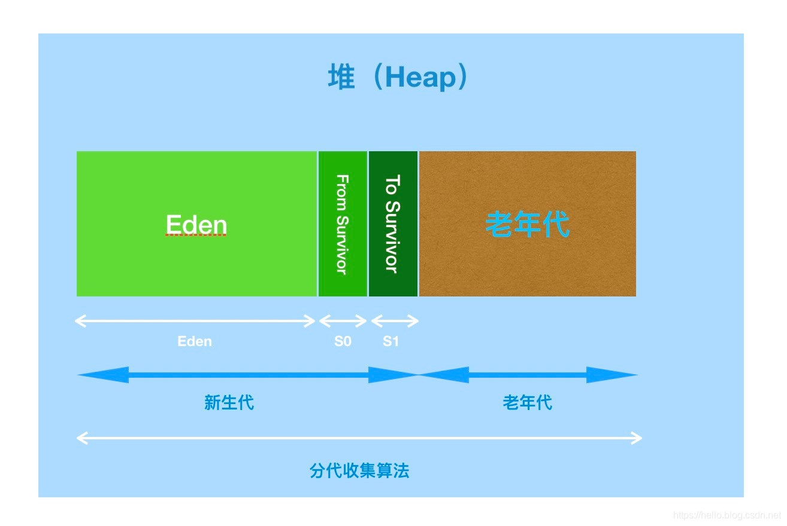
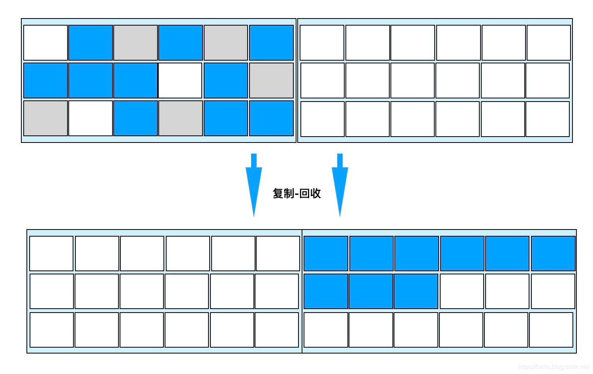
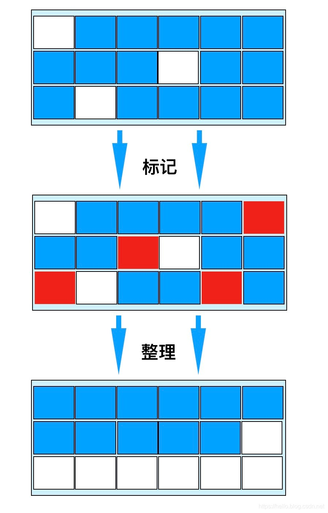

# JVM
## gc算法, 堆内存模型

**堆内存模型**
1，年轻代。年轻代内部又分成了两个区，一个是 Eden 区，一个是 Survivor 区。Survivor 区又划分成两块，一块是 from 区，一块是 to 区；
2，老年代。

 

**gc（Garbage Collection）垃圾回收算法：**

**(1)	标记清除算法**
标记清除（Mark-Sweep）算法，包含“标记”和“清除”两个阶段：**首先标记出所有需要回收的对象，在标记完成后统一回收掉所有被标记的对象。**

**主要缺点**：**一个是效率问题**，标记和清除过程的效率都不高；另外是**空间问题**，标记清除之后**会产生大量不连续的内存碎片**，空间碎片太多可能会导致，当程序在以后的运行过程中需要分配较大对象时，无法找到足够的连续内存，而不得不提前触发另一次垃圾收集动作。

**(2)	复制算法**
复制（Copying）算法：将可用内存按容量划分为大小相等的两块，每次只使用其中的一块。当一块内存用完了，就将还**存活**着的对象复制到另外一块上，然后清理掉前一块。

 

**优点**：每次对半区内存回收时、内存分配时就不用考虑内存碎片等复杂情况，只要移动堆顶指针，按顺序分配内存即可，实现简单，运行高效。
缺点：将内存缩小为一半，性价比低，持续复制长生存期的对象则导致效率低下。
**JVM堆中新生代便采用复制算法。**

 

在GC回收过程中，当Eden区满时，还存活的对象会被复制到其中一个Survivor区；当回收时，会将Eden和使用的Survivor区还存活的对象，复制到另外一个Survivor区，然后对Eden和用过的Survivor区进行清理。
如果另外一个Survivor区没有足够的内存存储时，则会进入老年代。
这里针对哪些对象会进入老年代有这样的机制：**对象每经历一次复制，年龄加1，达到晋升年龄阈值后，转移到老年代。**
在这整个过程中，由于Eden中的对象属于像浮萍一样“瞬生瞬灭”的对象，所以并不需要1：1的比例来分配内存，而是采用了**8：1：1**的比例来分配。
而针对那些历经多次清理依旧存活的对象，则会进入老年代，而**老年的清理算法则采用下面要讲到的“标记整理算法”。**

**(3)	标记整理算法**
标记整理（Mark-Compact）算法：标记过程与“标记-清除”算法一样，但后续步骤不是直接对可回收对象进行清理，**而是让所有存活的对象都向一端移动，然后直接清理掉端边界以外的内存。**
优点：这种算法不既不用浪费50%的内存，也解决了复制算法在对象存活率较高时的效率低下问题。

 

**(4)	分代收集算法**
分代收集算法，基本思路：将Java的堆内存逻辑上分成两块，新生代和老年代，针对不同存活周期、不同大小的对象采取不同的垃圾回收策略。
**而在新生代中大多数对象都是瞬间对象，只有少量对象存活，复制较少对象即可完成清理，因此采用复制算法。**
**而针对老年代中的对象，存活率较高，又没有额外的担保内存，因此采用标记整理算法**。
其实，回头看，分代收集算法就是对新生代和老年代算法从策略维度的规划而已。

[参考](https://blog.csdn.net/wo541075754/article/details/102647652)


## jvm垃圾回收算法，如何确定哪些对象是可以回收的对象，什么可以作为GCROOT，堆存放是什么

判断对象是否能够被回收呢？主要有两种方式：**引用计数法和可达性分析**

* **引用计数法（Reference Counting）**：给对象中添加一个引用计数器，每当有一个地方引用它时，计数器就加1；当引用失效时，计数器就减1；当计数器为0时对象就是不再被使用的。

* **可达性分析（Reachability Analysis）**：通过一系列的称为 "GC Roots" （GC根）的对象作为起点，从这些节点开始向下搜索，搜索所走过的路径称为引用链（Reference Chain），当一个对象倒GC Roots没有任何引用链相连（就是从GC Roots到对象不可达）时，则证明此对象是不可用的

* Java中可以作为**GC Roots的对象主要有**：

  - 虚拟机栈（栈帧中的本地变量表）中引用对象
  - 方法区中的类静态属性引用的对象
  - 方法区中常量引用的对象
  - 本地方法栈JNI的引用对象
  - 激活状态的线程
  - 正在被用于同步的各种锁对象
  - Class 由系统类加载器(system class loader)加载的对象，这些类不可以被回收，他们可以以静态字段的方式持有其它对象。

  [参考](https://blog.csdn.net/u012988901/article/details/100117719)
  
 * **堆内存用于存放由new创建的对象和数组。在堆中分配的内存，由java虚拟机自动垃圾回收器来管理。**在堆中产生了一个数组或者对象后，还可以在栈中定义一个特殊的变量，这个变量的取值等于数组或者对象在堆内存中的首地址，在栈中的这个特殊的变量就变成了数组或者对象的引用变量，以后就可以在程序中使用栈内存中的引用变量来访问堆中的数组或者对象，引用变量相当于为数组或者对象起的一个别名，或者代号。


# JVM 内存模型

2.对象的创建过程（这个问题我不太懂具体该怎么回答，没有get到面试官的点，所以面试官不太满意）

4. volatile关键字 我自己扯到了单例（结果说到了内存屏障，我不太懂，面试官给我讲解了）
ps：过程要求是在jvm中的过程
3.介绍一下java的内存模型（八股），讲一下线程的工作内存（回答了栈，再回去复盘）


## 一、JVM运行时区域（内存结构）（内存区域划分）

虚拟机在执行 Java 程序的过程中会把它所管理的内存划分为若干不同的数据区，这些区域有各自的用途、创建和销毁时间。

线程私有：程序计数器、Java 虚拟机栈、本地方法栈。

线程共享：Java 堆、方法区　

　

### 1 程序计数器

　　程序计数器是一块较小的内存空间。主要有两个作用：

1. 字节码解释器可以看作是当前线程所执行的字节码的行号指示器。当它工作时，通过改变这个计数器的值来选取**下一条需要执行的字节码指令**，分支、循环、跳转、异常处理、线程恢复等功能都需要依赖这个计数器来完。
2. 在**多线程**的情况下(通过线程轮流切换并分配CPU的时间片的方式实现的，因此在任何时刻一个cpu都只会处理一个线程)，程序计数器用于**记录当前线程执行的位置**，从而当线程被切换回来的时候能能恢复到正确的执行位置。所以每条线程都需要有一个独立的程序计数器，各线程之间计数器互不影响，独立存储，因此这类内存区域为“线程私有”的内存。

　　**注意：**程序计数器是**唯一不会**出现 OutOfMemoryError 的内存区域，它的生命周期随着线程的创建而创建，随着线程的结束而死亡。


### 2 Java 虚拟机栈

　　Java虚拟机栈也是线程私有的，它的生命周期和线程相同，描述的是 **Java 方法执行的内存模型**。Java虚拟机栈是由一个个栈帧组成，线程在执行一个方法时，便会向栈中放入一个栈帧，**每个栈帧中都拥有局部变量表、操作数栈、动态链接、方法出口信息。**局部变量表主要存放了编译器可知的各种基本数据类型和对象引用。每个方法从调用到执行完成，就是栈帧从入栈到出栈的过程。

​         Java 虚拟机栈有两类异常：① 线程请求的栈深度大于虚拟机允许的深度抛出 StackOverflowError。② 如果 JVM 栈容量可以动态扩展，栈扩展无法申请足够内存抛出 OutOfMemoryError（HotSpot 不可动态扩展，不存在此问题）。


### 3 本地方法栈

　　和虚拟机栈所发挥的作用非常相似，区别是： 虚拟机栈为虚拟机执行 Java 方法 （也就是字节码）服务，而**本地方法栈则为虚拟机使用到的 Native 方法服务**。 

　　本地方法被执行的时候，在本地方法栈也会创建一个栈帧，用于**存放该本地方法的局部变量表、操作数栈、动态链接、出口信息**。方法执行完毕后相应的栈帧也会出栈并释放内存空间，本地方法栈在栈深度异常和栈扩展失败时分别抛出 StackOverflowError 和 OutOfMemoryError。

​        虚拟机规范对本地方法栈中方法的语言与数据结构无强制规定，虚拟机可自由实现，例如 HotSpot 将虚拟机栈和本地方法栈合二为一。


### 4 堆

　　**堆**是虚拟机所管理的内存中最大的一块，被所有线程共享的，在虚拟机启动时创建。堆用来存放对象实例，Java 里几乎所有**对象实例**都在堆分配内存。堆可以处于物理上不连续的内存空间，逻辑上应该连续，但对于例如**数组**这样的大对象，多数虚拟机实现出于简单、存储高效的考虑会要求连续的内存空间。

堆既可以被实现成固定大小，也可以是可扩展的，可通过 `-Xms` 和 `-Xmx` 设置堆的最小和最大容量，当前主流 JVM 都按照可扩展实现。如果堆没有内存完成实例分配也无法扩展，抛出 OutOfMemoryError


　　Java 堆是垃圾收集器管理的主要区域，因此也被称作GC堆（Garbage Collected Heap）。从垃圾回收的角度，由于现在收集器基本都采用分代垃圾收集算法，所以Java堆还可以细分为：新生代和老年代。

　　 

　　如图所示，JVM内存主要由新生代、老年代、永久代构成。

　　① 新生代（Young Generation）：大多数对象在新生代中被创建，其中很多对象的生命周期很短。每次新生代的垃圾回收（又称Minor GC）后只有少量对象存活。

　　新生代内又分三个区：一个Eden区，两个Survivor区（一般而言），大部分对象在Eden区中生成。当Eden区满时，还存活的对象将被复制到两个Survivor区（中的一个）。当这个Survivor区满时，此区的存活且不满足“晋升”条件的对象将被复制到另外一个Survivor区。对象每经历一次Minor GC，年龄加1，达到“晋升年龄阈值”后，被放到老年代。

　　② 老年代（Old Generation）：在新生代中经历了N次垃圾回收后仍然存活的对象，就会被放到年老代，该区域中对象存活率高。

　　③ 永久代（Perm Generation）：主要存放元数据，例如Class、Method的元信息，与垃圾回收要回收的Java对象关系不大。相对于新生代和年老代来说，该区域的划分对垃圾回收影响比较小。

　　在 JDK 1.8中移除整个永久代，取而代之的是一个叫**元空间**（Metaspace）的区域（永久代使用的是JVM的堆内存空间，而元空间使用的是物理内存，直接受到本机的物理内存限制）。


### 5 方法区

​       方法区与 Java 堆一样，是各个线程**共享的内存区域**。**方法区**用于存储被虚拟机加载的类型信息、常量、静态变量、即时编译器编译后的代码缓存等数据。

​          JDK8 之前使用永久代实现方法区，容易内存溢出，因为永久代有 `-XX:MaxPermSize` 上限，即使不设置也有默认大小。JDK7 把放在永久代的字符串常量池、静态变量等移出，JDK8 中永久代完全废弃，改用在本地内存中实现的元空间代替，把 JDK 7 中永久代剩余内容（主要是类型信息）全部移到元空间。

​        虚拟机规范对方法区的约束宽松，除和堆一样不需要连续内存和可选择固定大小/可扩展外，还可以不实现垃圾回收。垃圾回收在方法区出现较少，主要目标针对常量池和类型卸载。如果方法区无法满足新的内存分配需求，将抛出 OutOfMemoryError。


### 6 运行时常量池

　　运行时常量池是方法区的一部分。Class 文件中除了有类的版本、字段、方法、接口等描述信息外，还有常量池信息（用于存放编译期生成的各种**字面量和符号引用**）。

　 

​       **运行时常量池**相对于 Class 文件常量池的一个重要特征是动态性，Java 不要求常量只有编译期才能产生，运行期间也可以将新的常量放入池中，这种特性利用较多的是 String 的 `intern` 方法。

　　既然运行时常量池时方法区的一部分，自然受到方法区内存的限制，当常量池无法再申请到内存时会抛出 OutOfMemoryError 异常。

　　**JDK1.7及之后版本的 JVM 已经将运行时常量池从方法区中移了出来，在 Java 堆（Heap）中开辟了一块区域存放运行时常量池。**


### 7 直接内存

　　直接内存**并不是**虚拟机运行时数据区的一部分，也不是虚拟机规范中定义的内存区域，但是这部分内存也被频繁地使用。而且也可能导致OutOfMemoryError内存溢出异常出现。

　　JDK1.4中新加入的 NIO(New Input/Output) 类，引入了一种基于通道（Channel） 与缓存区（Buffer） 的 I/O 方式，它可以直接使用Native函数库直接分配堆外内存，然后通过一个存储在 Java 堆中的 DirectByteBuffer 对象作为这块内存的引用进行操作，避免了在 Java 堆和 Native 堆之间来回复制数据。

　　本机直接内存的分配不会收到 Java 堆的限制，但是，既然是内存就会受到本机总内存大小以及处理器寻址空间的限制。一般配置虚拟机参数时会根据实际内存设置 `-Xmx` 等参数信息，但经常忽略直接内存，使内存区域总和大于物理内存限制，导致动态扩展时出现 OOM。

​       由**直接内存导致的内存溢出**，一个明显的特征是在 Heap Dump 文件中不会看见明显的异常，如果发现内存溢出后产生的 Dump 文件很小，而程序中又直接或间接使用了直接内存（典型的间接使用就是 NIO），那么就可以考虑检查直接内存方面的原因。


### 附：内存溢出问题

#### Q1：内存溢出和内存泄漏的区别？

内存溢出 OutOfMemory，指程序在申请内存时，没有足够的内存空间供其使用。

内存泄露 Memory Leak，指程序在申请内存后，无法释放已申请的内存空间，内存泄漏最终将导致内存溢出。

------

#### Q2：堆溢出的原因？

堆用于存储对象实例，只要不断创建对象并保证 GC Roots 到对象有可达路径避免垃圾回收，随着对象数量的增加，总容量触及最大堆容量后就会 OOM，例如在 while 死循环中一直 new 创建实例。

堆 OOM 是实际应用中最常见的 OOM，处理方法是通过内存映像分析工具对 Dump 出的堆转储快照分析，确认内存中导致 OOM 的对象是否必要，分清到底是内存泄漏还是内存溢出。

如果是内存泄漏，通过工具查看泄漏对象到 GC Roots 的引用链，找到泄露对象是通过怎样的引用路径、与哪些 GC Roots 关联才导致无法回收，一般可以准确定位到产生内存泄漏代码的具体位置。

如果不是内存泄漏，即内存中对象都必须存活，应当检查 JVM 堆参数，与机器内存相比是否还有向上调整的空间。再从代码检查是否存在某些对象生命周期过长、持有状态时间过长、存储结构设计不合理等情况，尽量减少程序运行期的内存消耗。

------

#### Q3：栈溢出的原因？

由于 HotSpot 不区分虚拟机和本地方法栈，设置本地方法栈大小的参数没有意义，栈容量只能由 `-Xss` 参数来设定，存在两种异常：

**StackOverflowError：** 如果线程请求的栈深度大于虚拟机所允许的深度，将抛出 StackOverflowError，例如一个递归方法不断调用自己。该异常有明确错误堆栈可供分析，容易定位到问题所在。

**OutOfMemoryError：** 如果 JVM 栈可以动态扩展，当扩展无法申请到足够内存时会抛出 OutOfMemoryError。HotSpot 不支持虚拟机栈扩展，所以除非在创建线程申请内存时就因无法获得足够内存而出现 OOM，否则在线程运行时是不会因为扩展而导致溢出的。

------

#### Q4：运行时常量池溢出的原因？

String 的 `intern` 方法是一个本地方法，作用是如果字符串常量池中已包含一个等于此 String 对象的字符串，则返回池中这个字符串的 String 对象的引用，否则将此 String 对象包含的字符串添加到常量池并返回此 String 对象的引用。

在 JDK6 及之前常量池分配在永久代，因此可以通过 `-XX:PermSize` 和 `-XX:MaxPermSize` 限制永久代大小，间接限制常量池。在 while 死循环中调用 `intern` 方法导致运行时常量池溢出。在 JDK7 后不会出现该问题，因为存放在永久代的字符串常量池已经被移至堆中。

------

#### Q5：方法区溢出的原因？

方法区主要存放类型信息，如类名、访问修饰符、常量池、字段描述、方法描述等。只要不断在运行时产生大量类，方法区就会溢出。例如使用 JDK 反射或 CGLib 直接操作字节码在运行时生成大量的类。很多框架如 Spring、Hibernate 等对类增强时都会使用 CGLib 这类字节码技术，增强的类越多就需要越大的方法区保证动态生成的新类型可以载入内存，也就更容易导致方法区溢出。

JDK8 使用元空间取代永久代，HotSpot 提供了一些参数作为元空间防御措施，例如 `-XX:MetaspaceSize` 指定元空间初始大小，达到该值会触发 GC 进行类型卸载，同时收集器会对该值进行调整，如果释放大量空间就适当降低该值，如果释放很少空间就适当提高。


## 二、java内存模型（JMM）

### 1 含义        

 Java内存模型(即Java Memory Model，简称JMM)本身是一种**抽象**的概念，并不真实存在，它描述的是一组规则或规范，通过这组规范定义了程序中各个变量的访问方式。

​       由于JVM运行程序的实体是线程，而每个线程创建时，JVM都会为其创建一个工作内存(有些地方称为栈空间)，用于存储线程私有的数据，而**Java内存模型（JMM）中规定所有变量都存储在主内存**，主内存是共享内存区域，所有线程都可以访问，但线程对变量的操作(读取赋值等)必须在工作内存中进行，首先要将变量从主内存拷贝的自己的工作内存空间，然后对变量进行操作，操作完成后再将变量写回主内存，不能直接操作主内存中的变量。

​       前面说过，工作内存是每个线程的私有数据区域，因此不同的线程间无法访问对方的工作内存，线程间的通信(传值)必须通过主内存来完成，其简要访问过程如下图


### 2 Java内存模型和java内存区域划分的相同点和不同点

​         不同：需要注意的是，JMM与Java内存区域的划分是不同的概念层次，更恰当说JMM描述的是一组规则，**通过这组规则控制程序中各个变量在共享数据区域和私有数据区域的访问方式**，JMM是围绕原子性，有序性、可见性展开的。

​         相同： JMM与Java内存区域唯一相似点，都存在共享数据区域和私有数据区域，在JMM中主内存属于共享数据区域，从某个程度上讲应该包括了堆和方法区，而工作内存数据线程私有数据区域，从某个程度上讲则应该包括程序计数器、虚拟机栈以及本地方法栈。或许在某些地方，我们可能会看见主内存被描述为堆内存，工作内存被称为线程栈，实际上他们表达的都是同一个含义。


### 3 主内存和工作内存

关于JMM中的主内存和工作内存说明如下：

- **主内存**：主要存储的是**Java实例对象**，所有线程创建的实例对象都存放在主内存中，不管该实例对象是成员变量还是方法中的本地变量(也称局部变量)，当然也包括了共享的类信息、常量、静态变量。由于是共享数据区域，多条线程对同一个变量进行访问可能会发现**线程安全问题**。

- **工作内存**：主要存储**当前方法的所有本地变量信息**(工作内存中存储着主内存中的变量副本拷贝)，**每个线程只能访问自己的工作内存，即线程中的本地变量对其它线程是不可见的**，就算是两个线程执行的是同一段代码，它们也会各自在自己的工作内存中创建属于当前线程的本地变量。注意由于工作内存是每个线程的私有数据，线程间无法相互访问工作内存，因此**存储在工作内存的数据不存在线程安全问题。**

弄清楚主内存和工作内存后，接了解一下**主内存与工作内存的数据存储类型以及操作方式**，根据虚拟机规范，

对于一个实例对象中的**成员方法**而言：如果方法中包含本地变量是基本数据类型（boolean,byte,short,char,int,long,float,double），将直接存储在工作内存的帧栈结构中，但倘若本地变量是引用类型，那么该变量的引用会存储在工作内存的帧栈中，而对象实例将存储在主内存(共享数据区域，堆)中。

但对于实例对象的**成员变量**：不管它是基本数据类型或者包装类型(Integer、Double等)还是引用类型，都会被存储到**堆区**。至于static变量以及类本身相关信息将会存储在主内存中。


### 4 硬件内存架构与Java内存模型

硬件内存架构


​      正如上图所示，是经过简化CPU与内存操作的简化图。当一个CPU需要访问主存时，会先读取一部分主存数据到CPU缓存(当然如果CPU缓存中存在需要的数据就会直接从缓存获取)，进而在读取CPU缓存到寄存器，当CPU需要写数据到主存时，同样会先刷新寄存器中的数据到CPU缓存，然后再把数据刷新到主内存中。

**Java线程与硬件处理器**
了解完硬件的内存架构后，接着了解JVM中线程的实现原理，理解线程的实现原理，有助于我们了解Java内存模型与硬件内存架构的关系，在Window系统和Linux系统上，**Java线程的实现是基于一对一的线程模型**，所谓的一对一模型，实际上就是通过语言级别层面程序去间接调用系统内核的线程模型，即我们在使用Java线程时，Java虚拟机内部是转而调用当前操作系统的内核线程来完成当前任务。

内核线程(Kernel-Level Thread，KLT)，它是由操作系统内核(Kernel)支持的线程，这种线程是由操作系统内核来完成线程切换，内核通过操作调度器进而对线程执行调度，并将线程的任务映射到各个处理器上。每个内核线程可以视为内核的一个分身,这也就是操作系统可以同时处理多任务的原因。

由于我们编写的多线程程序属于语言层面的，程序一般不会直接去调用内核线程，取而代之的是一种轻量级的进程(Light Weight Process)，也是通常意义上的线程，由于每个轻量级进程都会映射到一个内核线程，因此我们可以通过轻量级进程调用内核线程，进而由操作系统内核将任务映射到各个处理器，这种**轻量级进程与内核线程间1对1的关系就称为一对一的线程模型**。如下图


如图所示，每个线程最终都会映射到CPU中进行处理，如果CPU存在多核，那么一个CPU将可以并行执行多个线程任务。


**Java内存模型与硬件内存架构的关系**
通过对前面的硬件内存架构、Java内存模型以及Java多线程的实现原理的了解，我们应该已经意识到，多线程的执行最终都会映射到硬件处理器上进行执行，但Java内存模型和硬件内存架构并不完全一致。对于硬件内存来说只有寄存器、缓存内存、主内存的概念，并没有工作内存(线程私有数据区域)和主内存(堆内存)之分，也就是说Java内存模型对内存的划分对硬件内存并没有任何影响，因为JMM只是一种抽象的概念，是一组规则，并不实际存在，不管是工作内存的数据还是主内存的数据，对于计算机硬件来说都会存储在计算机主内存中，当然也有可能存储到CPU缓存或者寄存器中，因此总体上来说，**Java内存模型和计算机硬件内存架构是一个相互交叉的关系，是一种抽象概念划分与真实物理硬件的交叉。**(注意对于Java内存区域划分也是同样的道理)


### 5 **JMM的原子性、有序性、可见性**

​         如果存在两个线程同时对一个主内存中的实例对象的变量进行操作就有可能诱发线程安全问题。为了解决类似上述的问题，JVM定义了一组规则，**通过这组规则来决定一个线程对共享变量的写入何时对另一个线程可见**，这组规则也称为Java内存模型（即JMM），JMM是围绕着程序执行的**原子性、有序性、可见性**展开的。

#### **原子性**

原子性指的是一个操作是不可中断的。基本数据类型的访问都具备原子性，例外就是 long 和 double，虚拟机将没有被 volatile 修饰的 64 位数据操作划分为两次 32 位操作。但也不必太担心，因为读取到“半个变量”的情况比较少见，至少在目前的商用的虚拟机中，几乎都把64位的数据的读写操作作为原子操作来执行。

如果应用场景需要更大范围的原子性保证，JMM 还提供了 lock 和 unlock 操作满足需求，尽管 JVM 没有把这两种操作直接开放给用户使用，但是提供了更高层次的字节码指令 monitorenter 和 monitorexit，这两个字节码指令反映到 Java 代码中就是 synchronized。


#### **指令重排**

计算机在执行程序时，为了提高性能，编译器和处理器的常常会对指令做重排，一般分以下3种：

为了提高性能，编译器和处理器通常会对指令进行重排序，重排序指从源代码到指令序列的重排序，分为三种：

① **编译器优化的重排序**，编译器在不改变单线程程序语义的前提下，可以重排语句的执行顺序。

② **指令级并行的重排序**，如果不存在数据依赖性，处理器可以改变语句对应机器指令的执行顺序。

③ **内存系统的重排序**。由于处理器使用缓存和读写缓冲区，这使得加载(load)和存储(store)操作看上去可能是在乱序执行，因为三级缓存的存在，导致内存与缓存的数据同步存在时间差。


**指令重排可能产生的问题**

其中编译器优化的重排属于编译期重排，指令并行的重排和内存系统的重排属于处理器重排，在多线程环境中，这些重排优化可能会导致程序出现内存可见性问题，下面分别阐明这两种重排优化可能带来的问题

编译器重排
下面我们简单看一个编译器重排的例子：

```
线程 1             线程 2
1： x2 = a ;      3: x1 = b ;
2: b = 1;         4: a = 2 ;
```

两个线程同时执行，分别有1、2、3、4四段执行代码，从程序的执行顺序上看，似乎不太可能出现x1 = 1 和x2 = 2 的情况，但实际上这种情况有可能发现的，因为如果编译器对这段程序代码执行重排优化后，可能出现下列情况

```
线程 1              线程 2
2: b = 1;          4: a = 2 ; 
1：x2 = a ;        3: x1 = b ;
```


这种执行顺序下就有可能出现x1 = 1 和x2 = 2 的情况，这也就说明在多线程环境下，由于编译器优化重排的存在，两个线程中使用的变量能否保证一致性是无法确定的。


**处理器指令重排**
先了解一下指令重排的概念，处理器指令重排是对CPU的性能优化，从指令的执行角度来说一条指令可以分为多个步骤完成，如下

- 取指 IF
- 译码和取寄存器操作数 ID
- 执行或者有效地址计算 EX
- 存储器访问 MEM

- 写回 WB

CPU在工作时，需要将上述指令分为多个步骤依次执行,由于**每一步会使用到不同的硬件操作**，比如取指时会只有PC寄存器和存储器，译码时会执行到指令寄存器组，执行时会执行ALU(算术逻辑单元)、写回时使用到寄存器组。为了提高硬件利用率，CPU指令是按流水线技术来执行的，如下：


从图中可以看出当指令1还未执行完成时，第2条指令便利用空闲的硬件开始执行。虽然流水线技术可以大大提升CPU的性能，但不幸的是一旦出现流水中断，所有硬件设备将会进入一轮停顿期，当再次弥补中断点可能需要几个周期，这样性能损失也会很大，就好比工厂组装手机的流水线，一旦某个零件组装中断，那么该零件往后的工人都有可能进入一轮或者几轮等待组装零件的过程。因此我们需要尽量阻止指令中断的情况，指令重排就是其中一种优化中断的手段，我们通过一个例子来阐明指令重排是如何阻止流水线技术中断的

```
a = b + c ;
d = e + f ;
```

下面通过汇编指令展示了上述代码在CPU执行的处理过程


- LW指令 表示 load，其中LW R1,b表示把b的值加载到寄存器R1中
- LW R2,c 表示把c的值加载到寄存器R2中
- ADD 指令表示加法，把R1 、R2的值相加，并存入R3寄存器中。
- SW 表示 store 即将 R3寄存器的值保持到变量a中
- LW R4,e 表示把e的值加载到寄存器R4中
- LW R5,f 表示把f的值加载到寄存器R5中
- SUB 指令表示减法，把R4 、R5的值相减，并存入R6寄存器中。
- SW d,R6 表示将R6寄存器的值保持到变量d中

上述便是汇编指令的执行过程，在某些指令上存在X的标志，X代表中断的含义，也就是只要有X的地方就会导致指令流水线技术停顿，同时也会影响后续指令的执行，可能需要经过1个或几个指令周期才可能恢复正常，那为什么停顿呢？这是因为部分数据还没准备好，如执行ADD指令时，需要使用到前面指令的数据R1，R2，而此时R2的MEM操作没有完成，即未拷贝到存储器中，这样加法计算就无法进行，必须等到MEM操作完成后才能执行，也就因此而停顿了，其他指令也是类似的情况。

前面阐述过，停顿会造成CPU性能下降，因此我们应该想办法消除这些停顿，这时就需要使用到指令重排了，如下图，既然ADD指令需要等待，那我们就利用等待的时间做些别的事情，如把LW R4,e 和 LW R5,f 移动到前面执行，毕竟LW R4,e 和 LW R5,f执行并没有数据依赖关系，对他们有数据依赖关系的SUB R6,R5,R4指令在R4,R5加载完成后才执行的，没有影响，过程如下：


正如上图所示，所有的停顿都完美消除了，指令流水线也无需中断了，这样CPU的性能也能带来很好的提升，这就是处理器指令重排的作用。关于编译器重排以及指令重排(这两种重排我们后面统一称为指令重排)相关内容已阐述清晰了，我们必须意识到**对于单线程，指令重排几乎不会带来任何影响**，比竟重排的前提是保证串行语义执行的一致性，但对于**多线程环境而已，指令重排就可能导致严重的程序轮序执行问题**，如下

```java
class MixedOrder{
    int a = 0;
    boolean flag = false;
    public void writer(){
        a = 1;
        flag = true;
    }
    public void read(){
        if(flag){
            int i = a + 1；
        }
    }
}
```
如上述代码，同时存在线程A和线程B对该实例对象进行操作，其中A线程调用写入方法，而B线程调用读取方法，由于指令重排等原因，可能导致程序执行顺序变为如下：

```
 线程A                    线程B
 writer：                 read：
 1:flag = true;           1:flag = true;
 2:a = 1;                 2: a = 0 ; //误读
                          3: i = 1 ;
```

由于指令重排的原因，线程A的flag置为true被提前执行了，而a赋值为1的程序还未执行完，此时线程B，恰好读取flag的值为true，直接获取a的值（此时B线程并不知道a为0）并执行i赋值操作，结果i的值为1，而不是预期的2，这就是多线程环境下，指令重排导致的程序乱序执行的结果。因此，请记住，**指令重排只会保证单线程中串行语义的执行的一致性，但并不会关心多线程间的语义一致性。**


#### **可见性**

​     可见性指的是当一个线程修改了某个共享变量的值，**其他线程是否能够马上得知这个修改的值**。 在多线程环境中，工作内存与主内存同步延迟、指令重排以及编译器优化也可能导致可见性问题。

​    **解决方案**：JMM 通过在变量修改后将值同步回主内存，在变量读取前从主内存刷新的方式实现可见性，无论普通变量还是 volatile 变量都是如此，区别是 volatile 保证新值能立即同步到主内存以及每次使用前立即从主内存刷新。

​     除了 volatile 外，synchronized 和 final 也可以保证可见性。同步块可见性由"对一个变量执行 unlock 前必须先把此变量同步回主内存，即先执行 store 和 write"这条规则获得。final 的可见性指：被 final 修饰的字段在构造方法中一旦初始化完成，并且构造方法没有把 this 引用传递出去，那么其他线程就能看到 final 字段的值。

#### **有序性**

​       有序性是指对于单线程的执行代码，我们总是认为代码的执行是按顺序依次执行的，这样的理解并没有毛病，毕竟对于单线程而言确实如此，但对于多线程环境，则可能出现乱序现象，因为程序编译成机器码指令后可能会出现指令重排现象，重排后的指令与原指令的顺序未必一致。

​     要明白的是，在Java程序中，**倘若在本线程内，所有操作都视为有序行为**，如果是**多线程环境下，一个线程中观察另外一个线程，所有操作都是无序的**，前半句指的是单线程内保证串行语义执行的一致性（as-if-serial 语义），后半句则指指令重排现象和工作内存与主内存同步延迟现象。

- **as-if-serial ：不管怎么重排序，单线程程序的执行结果不能改变，编译器和处理器必须遵循 as-if-serial 语义。**

  为了遵循 as-if-serial，编译器和处理器不会对存在数据依赖关系的操作重排序，因为这种重排序会改变执行结果。但是如果操作之间不存在数据依赖关系，这些操作就可能被编译器和处理器重排序。as-if-serial 把单线程程序保护起来，给程序员一种幻觉：单线程程序是按程序的顺序执行的。

**JMM对于有序性的解决方案**：Java 提供 volatile 和 synchronized 保证有序性，volatile 本身就包含禁止指令重排序的语义，而 synchronized 保证一个变量在同一时刻只允许一条线程对其进行 lock 操作，确保持有同一个锁的两个同步块只能串行进入。


### 6 happens-before 原则

​       倘若在程序开发中，仅靠sychronized和volatile关键字来保证原子性、可见性以及有序性，那么编写并发程序可能会显得十分麻烦，幸运的是，在Java内存模型中，还提供了happens-before 原则来辅助保证程序执行的原子性、可见性以及有序性的问题，它是**判断数据是否存在竞争、线程是否安全的依据**。

**happens-before 原则**内容如下：

1. 程序顺序原则：在一个线程内必须保证语义串行性，一个线程内写在前面的操作先行发生于后面的。

2. 锁规则：解锁(unlock)操作必然发生在后续的同一个锁的加锁(lock)之前，也就是说，一个锁处于被锁定状态，那么必须先执行unlock操作后面才能进行lock操作。

3. volatile规则：volatile变量的写，先发生于读，这保证了volatile变量的可见性。如果一个线程先去写一个volatile变量，然后一个线程去读这个变量。

4. 线程启动规则：线程的start()方法先于它的每一个动作，即如果线程A在执行线程B的start方法之前，修改了共享变量的值，那么当线程B执行start方法时，线程A对共享变量的修改对线程B可见

5. 传递性：A先于B ，B先于C 那么A必然先于C

6. 线程终止规则：线程的所有操作先于线程的终结，Thread.join()方法的作用是等待当前执行的线程终止。假设在线程B终止之前，修改了共享变量，线程A从线程B的join方法成功返回后，线程B对共享变量的修改将对线程A可见。

7. 线程中断规则：对线程 interrupt()方法的调用，先行发生于被中断线程的代码检测到中断事件的发生，可以通过Thread.interrupted()方法检测线程是否中断。

8. 对象终结规则：对象的构造函数执行，结束先于finalize()方法


上述8条原则无需手动添加任何同步手段(synchronized|volatile)即可达到效果，下面我们结合前面的案例演示这8条原则**如何判断线程是否安全**，如下：

```
class MixedOrder{
    int a = 0;
    boolean flag = false;
    public void writer(){
        a = 1;
        flag = true;
    }

    public void read(){
        if(flag){
            int i = a + 1；
        }
    }
}
```

​        同样的道理，存在两条线程A和B，线程A调用实例对象的writer()方法，而线程B调用实例对象的read()方法，线程A先启动而线程B后启动，那么线程B读取到的i值是多少呢？

​       现在依据8条原则，由于存在两条线程同时调用，因此程序次序原则不合适。writer()方法和read()方法都没有使用同步手段，锁规则也不合适。没有使用volatile关键字，volatile变量原则不适应。线程启动规则、线程终止规则、线程中断规则、对象终结规则、传递性和本次测试案例也不合适。

​      线程A和线程B的启动时间虽然有先后，但线程B执行结果却是不确定，也是说上述代码没有适合8条原则中的任意一条，也没有使用任何同步手段，所以上述的操作是线程不安全的，因此线程B读取的值自然也是不确定的。修复这个问题的方式很简单，要么给writer()方法和read()方法添加同步手段，如synchronized或者给变量flag添加volatile关键字，确保线程A修改的值对线程B总是可见。


**as-if-serial 和 happens-before 有什么区别？**

as-if-serial 保证单线程程序的执行结果不变，happens-before 保证正确同步的多线程程序的执行结果不变。

这两种语义的目的都是为了在不改变程序执行结果的前提下尽可能提高程序执行并行度。


### 7 volatile语义

volatile在并发编程中很常见，是Java虚拟机提供的轻量级的同步机制。JMM 为 volatile 定义了一些特殊访问规则。

volatile关键字有如下两个作用：

- **保证被volatile修饰的共享变量对所有线程可见**的，也就是当一个线程修改了一个被volatile修饰共享变量的值，新值可以被其他线程立即得知。volatile 变量在各个线程的工作内存中不存在一致性问题，但 Java 的运算操作符并非原子操作，导致 volatile 变量运算在并发下仍不安全。
- **禁止指令重排序优化**。使用 volatile 变量进行写操作，汇编指令带有 lock 前缀，相当于一个内存屏障，后面的指令不能重排到内存屏障之前。


**volatile的可见性**
关于volatile的可见性作用，我们必须意识到被volatile修饰的变量对所有线程立即可见的，对volatile变量的所有写操作总是能立刻反应到其他线程中，但是对于**volatile变量运算操作在多线程环境并不保证安全性**，如下：

（**静态变量 i 执行多线程 i++ 的不安全问题**）

```java
public class VolatileVisibility {
    public static volatile int i =0;

    public static void increase(){
        i++;
    }
}
```

​      正如上述代码所示，i变量的任何改变都会立马反应到其他线程中，但是如此存在多条线程同时调用increase()方法的话，就会出现线程安全问题，毕竟i++操作并不具备原子性，该操作是先读取值，然后写回一个新值，相当于原来的值加上1，分两步完成。

​        如果第二个线程在第一个线程读取旧值和写回新值期间读取i的域值，那么第二个线程就会与第一个线程一起看到同一个值，并执行相同值的加1操作，这也就造成了线程安全失败，因此对于increase方法必须使用synchronized修饰，以便保证线程安全，需要注意的是一旦使用synchronized修饰方法后，由于synchronized本身也具备与volatile相同的特性，即可见性，因此在这样种情况下就完全可以省去volatile修饰变量。

```java
public class VolatileVisibility {
    public static int i =0;

    public synchronized static void increase(){
        i++;
    }
}
```


**volatile禁止重排优化**
        volatile关键字另一个作用就是禁止指令重排优化，从而避免多线程环境下程序出现乱序执行的现象，关于指令重排优化前面已详细分析过，这里主要简单说明一下volatile是如何实现禁止指令重排优化的。先了解一个概念，内存屏障(Memory Barrier）。

- **内存屏障**，又称内存栅栏，是一个CPU指令，它的作用有两个，**一是保证特定操作的执行顺序，二是保证某些变量的内存可见性**（利用该特性实现volatile的内存可见性）。

  由于编译器和处理器都能执行指令重排优化。如果在指令间插入一条Memory Barrier则会告诉编译器和CPU，不管什么指令都不能和这条Memory Barrier指令重排序，也就是说通过插入内存屏障禁止在内存屏障前后的指令执行重排序优化。

  Memory Barrier的另外一个作用是强制刷出各种CPU的缓存数据，因此任何CPU上的线程都能读取到这些数据的最新版本。总之，volatile变量正是通过内存屏障实现其在内存中的语义，即可见性和禁止重排优化。

  

## **三、对象创建过程**

**字节码角度**

- **NEW：** 如果找不到 Class 对象则进行类加载。加载成功后在堆中分配内存，从 Object 到本类路径上的所有属性都要分配。分配完毕后进行零值设置。最后将指向实例对象的引用变量压入虚拟机栈顶。 
- **DUP： ** 在栈顶复制引用变量，这时栈顶有两个指向堆内实例的引用变量。两个引用变量的目的不同，栈底的引用用于赋值或保存局部变量表，栈顶的引用作为句柄调用相关方法。 
- **INVOKESPECIAL：** 通过栈顶的引用变量调用 init 方法。 


**执行角度**


① 当 JVM 遇到字节码 new 指令时，首先将检查该指令的参数能否在常量池中定位到一个类的符号引用，并检查引用代表的类是否已被加载、解析和初始化，如果没有就先执行**类加载**。

② 在类加载检查通过后虚拟机将为新生对象**分配内存**。

③ 内存分配完成后虚拟机将成员变量**设为零值**，保证对象的实例字段可以不赋初值就使用。

④ **设置对象头**，包括哈希码、GC 信息、锁信息、对象所属类的类元信息等。

⑤ **执行 init 方法**，初始化成员变量，执行实例化代码块，调用类的构造方法，并把堆内对象的首地址赋值给引用变量。


### 1、类加载检查

　　虚拟机遇到一条new指令时，首先将去检查这个指令的参数能否在常量池中定位到一个类的符号引用，并检查这个符号引用代表的类是否已经被加载、解析和初始化过，如果没有，那么必须先执行相应的类加载过程。


### 2、分配内存

　　在类加载检查通过后，接下来虚拟机将会为新生的对象分配内存。对象所需要的内存大小在类加载完成后便可完全确定，为对象分配空间等同于把一块确定大小的内存从java堆中划分出来。

​        分配方式有 “指针碰撞” 和 “空闲列表” 两种，选择那种分配方式由 Java 堆是否规整决定，而Java堆是否规整又由所采用的垃圾收集器是否带有压缩整理功能决定。

　　**（1）指针碰撞法**

　　假设Java堆中内存是完整的，已分配的内存和空闲内存分别在不同的一侧，通过一个指针作为分界点，需要分配内存时，仅仅需要把指针往空闲的一端移动与对象大小相等的距离。使用的GC收集器：Serial、ParNew，适用堆内存规整（即没有内存碎片）的情况下。

　　**（2）空闲列表法**

　　事实上，Java堆的内存并不是完整的，已分配的内存和空闲内存相互交错，JVM通过维护一个空闲列表，记录可用的内存块信息，当分配操作发生时，从列表中找到一个足够大的内存块分配给对象实例，并更新列表上的记录。使用的GC收集器：CMS，适用堆内存不规整的情况下。

　　 Java 堆内存是否规整，取决于 GC 收集器的算法是”标记-清除”，还是”标记-整理”（也称作”标记-压缩”），值得注意的是，复制算法内存也是规整的。在使用Serial、ParNew等待整理过程的收集器时，采用的是指针碰撞，在使用CMS这种mark-sweep算法的收集器时，使用的是空闲列表。


**内存分配并发问题** (对象分配内存是否线程安全？)

　　在实际开发过程中，创建对象是很频繁的事情，例如正在给A对象分配内存，但是指针还没修改，这时候对象B可能使用原来的指针来分配内存的情况。作为虚拟机来说，必须要保证线程是安全的，通常来讲，虚拟机采用两种方式来保证线程安全：

- **CAS + 失败重试：** CAS 是乐观锁的一种实现方式。所谓乐观锁就是，每次不加锁而是假设没有冲突而去完成某项操作，如果因为冲突失败就重试，直到成功为止。虚拟机采用 CAS 配上失败重试的方式保证更新操作的原子性。
- **TLAB（本地线程分配缓冲）：** 为每一个线程预先在 Eden 区分配一块内存。JVM 在给线程中的对象分配内存时，首先在各个线程的TLAB 分配，当对象大于TLAB 中的剩余内存或 TLAB 的内存已用尽时，再采用上述的 CAS 进行内存分配。虚拟机是否启用TLAB，可以通过-XX:+/-UseTLAB参数来设定。


### 3、初始零值

　　内存分配完成后，虚拟机需要将分配到的内存空间都初始化为零值（不包括对象头），这一步操作保证了对象的实例字段在 Java 代码中可以不赋初始值就直接使用，程序能访问到这些字段的数据类型所对应的零值。如果使用TLAB，这一工作过程也可以提前到TLAB分配时进行。


###  4、设置对象头

　　接下来，虚拟机要对对象进行必要的设置，例如这个对象是哪个类的实例，如何才能找到类的元数据信息，对象的哈希码，对象的GC分代年龄等信息，这些信息存放在对象的对象头中。根据虚拟机当前的运行状态的不同，对象头会有不同的设置方式。


### 5、执行init方法

　　在上面工作都完成之后，从虚拟机的视角来看，一个新的对象已经产生了，但从 Java 程序的视角来看，对象创建才刚开始，`<init>` 方法还没有执行，所有的字段都还为零。所以一般来说，执行 new 指令之后会接着执行 `<init>` 方法，把对象按照程序员的意愿进行初始化，这样一个真正可用的对象才算完全产生出来。


## **三、对象的内存布局**

　对象在堆内存的存储布局可分为对象头、实例数据和对齐填充。

- **对象头**占 12B，包括对象标记和类型指针。对象标记存储对象自身的运行时数据，如哈希码、GC 分代年龄、锁标志、偏向线程 ID 等，这部分占 8B，称为 Mark Word。Mark Word 被设计为动态数据结构，以便在极小的空间存储更多数据，根据对象状态复用存储空间。

  类型指针是对象指向它的类型元数据的指针，占 4B。JVM 通过该指针来确定对象是哪个类的实例。

- **实例数据**是对象真正存储的有效信息，即本类对象的实例成员变量和所有可见的父类成员变量。存储顺序会受到虚拟机分配策略参数和字段在[源码]()中定义顺序的影响。相同宽度的字段总是被分配到一起存放，在满足该前提条件的情况下父类中定义的变量会出现在子类之前。

- **对齐填充**不是必然存在的，仅起占位符作用。虚拟机的自动内存管理系统要求任何对象的大小必须是 8B 的倍数，对象头已被设为 8B 的 1 或 2 倍，如果对象实例数据部分没有对齐，需要对齐填充补全。


## **四、对象的访问定位**

　　建立对象就是为了使用对象，Java程序中需要通过栈上的reference引用数据来操作堆上的具体对象。对象的访问方式取决于虚拟机的实现，主流的方式有句柄池和直接指针两种。

　　（1）句柄池。如果使用句柄池的话，java堆中将会划分出一块内存来作为句柄池，reference中存储的就是对象的句柄地址，而句柄中包含了对象实例数据与类型数据各自的具体地址信息。

　　　　

　　（2）直接指针。如果使用直接指针，那么Java堆中的对象的布局就必须考虑如何放置访问类型数据的相关信息，而reference中存储的就是对象的直接地址。

 　　　

　　使用句柄访问最大的好处就是reference中存储的是稳定的句柄地址，在对象被移动时只会改变句柄中的实例数据指针，而reference本身不需要修改。

　　使用直接指针最大的好处就是速度更快，节省了一次指针定位的时间开销。

[参考](https://www.cnblogs.com/aiqiqi/articles/10770864.html)


# 垃圾回收

6.怎样判断一个对象能否被回收

1. 垃圾回收算法 重点说了下cms 和 G1 垃圾回收器

## 一、什么是垃圾回收

**垃圾（Garbage）**在Java语言中是指：**在运行程序中没有任何指针指向的对象**，这个对象就是需要被回收的垃圾。如果不及时对内存中的垃圾进行清理，那么这些垃圾对象所占用的内存空间就会一直保留到应用程序结束，被保留的空间也无法被其他对象所使用，极可能导致内存溢出。

**垃圾回收（Garbage Collection）**：GC的作用就是清理内存中的垃圾，释放被占用的内存空间，高效地利用内存。如果不进行垃圾回收，释放内存，则内存迟早会被消耗完毕，最终导致程序崩溃。因为程序在运行过程中是会不断产生对象来占用内存的。

除了释放成为垃圾的对象，垃圾回收有时也可以清理内存里的内存碎片，使其能在物理空间上能连成一片，以便JVM能将内存分配给新的对象。


## 二、垃圾回收区域（从哪里找垃圾）

JVM分为5个区域，JVM 内存共分为虚拟机栈，堆，方法区，程序计数器，本地方法栈五个部分。


在JVM中，只有**方法区和堆区**有垃圾回收的行为。其中**堆又是垃圾回收的重点区域**。

实际上，**方法区的垃圾回收性价比较低**。方法区中的垃圾回收主要是常量的回收和类型的卸载。但类型的卸载条件非常苛刻，需要同时满足一下三个条件：

①该类的所有实例都已经被回收，也就是堆中不再有该类及其子类的实例。
②加载该类的类加载器已经被回收。
③该类对应的java.lang.class对象没有在任何地方被引用，无法在任何地方通过反射访问该类的方法。

实际上，很难同时满足这三个条件。如类加载器这一条，JVM所创建的3个默认的类加载器是不会被回收的，即只有自己写的类加载器才有可能会被回收。但除非有特殊需求，大部分情况下，我们并不会为每一个用户类实现对应的类加载器。这也意味着绝大部分的类都不会在方法区被卸载并回收。

所以，**实际上垃圾回收的重点就是堆区。**


## 三、如何判断对象是否可以被回收（判断是否是垃圾）

两种判断方法：引用计数法，可达性分析（**主要**）。

1、**引用计数法（Reference Counting）**：给对象中添加一个引用计数器，每当有一个地方引用它时，计数器就加1；当引用失效时（超过生命周期或被赋新的值），计数器就减1；当计数器为0时，对象就是不再被使用的，可以回收。

优点：
实现简单，垃圾对象便于标识，效率高，回收也没有延迟。

缺点：
①每个对象都会有引用计数器字段，这样的做法增加了存储空间的开销。
②每次引用的变化都需要更新引用计数器，加法和减法的操作又增加了时间开销。
③引用计数器最严重的缺陷，即**无法处理循环引用的对象**。

比如，有对象ObjA和ObjB，这两个对象都有一个属性`Object instance;`若令`ObjA.instance = ObjB;`,`ObjB.instance = ObjA;` 。那么ObjA和ObjB的引用计数器的值就始终无法为0（因为始终有一个引用指向他们），这就意味着，即使已经没有其他对象引用ObjA和ObjB了。这两个对象也无法被回收，这将会导致内存泄漏。


2、**可达性分析（Reachability Analysis）**：通过一系列的称为 "GC Roots" （GC根）的对象作为起点，从这些节点开始向下搜索，搜索所走过的路径称为引用链（Reference Chain），当一个对象到GC Roots没有任何引用链相连（就是从GC Roots到对象不可达）时，则证明此对象是不可用的。


可以看出object7、8、9、10都没有再被根对象集合里的对象直接或者间接引用，故都被判断为垃圾对象。但并不是被判断为垃圾对象就必然会被回收，实际上还有机会通过**finalization机制**，重新被判断为存活对象。

（下面的不重要，仅供参考）

Java语言提供了对象的终止（finalization）机制来允许**开发人员提供对象被销毁之前的自定义逻辑处理**。实现这个机制的finalize方法在Object类中，由于Object类是所有类的父类或祖先类，同时finalize方法允许在子类中被重写，所以实际上每个类都可以实现finalize方法。

**对象的finalization机制就是：**
经过可达性分析后，如果某个对象无法从所有的根对象访问，那么说明这个对象已经不再被使用了。此时就会对这些不再被使用的对象进行第一次标记。然后，会查看这些无法到达的对象是否实现了finalize方法：

- 如果对象没有实现finalize方法，则直接可以进行回收。
- 如果对象实现了finalize方法，那么就会将对象的finalize方法交给Finalizer线程来执行（一个由虚拟机创建的，低优先级的后台线程）。GC会对这些交给Finalizer线程执行后的对象进行第二次标记，如果在finalize方法中，对象又重新与GC Roots进行了关联，比如将自己（this关键字）赋值给某个引用链上的对象的属性（如`objectA = this;`），那么对象将会重新存活 ，即该对象会被移出将要进行回收的集合中。如果没有在finalize方法中复活自己，则会被第二次标记，此时对象才可以直接被回收。

我们不应该主动去实现finalize方法，因为:

①在Finalizer线程执行时，如果线程执行缓慢（比如某个对象的finalize方法有大量的循环），那么其他的finalize方法就会一直处于等待状态。这也意味着含有finalize方法的对象会一直被Finalizer线程所引用，那么GC就无法回收这些对象。finalize方法影响GC的效率，尤其是大量的finalize方法或者一个糟糕的finalize方法（如前面说的大量循环）。

②我们想在finalize方法中实现某种操作，比如关闭连接，但是finalize方法的执行时间是没有保证的。Finalizer线程是一个优先级很低的线程，则意味着不会马上执行，它何时执行完全由GC线程决定，即在进行GC时，才会把finalize方法交给Finalizer线程去执行。如果没有进行GC那么Finalizer线程就不会运行。则我们的操作就由于执行时间的不确定而给程序带来隐患。

所以**强烈建议不再使用finalize方法**！！

（在牛客网中唯一看到的和finalize有关的一道题目）

问题：finalize()方法什么时候被调用？析构函数(finalization)的目的是什么？  

在释放对象占用的内存之前，垃圾收集器会调用对象的finalize()方法。一般建议在该方法中释放对象持有的资源。目的：对象逃脱死亡的最后一次机会。（只要重新与引用链上的任何一个对象建立关联即可。）但是不建议使用，运行代价高昂，不确定性大，且无法保证各个对象的调用顺序。可用try-finally或其他替代。


**Java中可以作为GC Roots的对象主要有：**

- 虚拟机栈（栈帧中的本地变量表）中引用对象

- 方法区中的类静态属性引用的对象

- 方法区中常量引用的对象

- 本地方法栈JNI的引用对象

- 激活状态的线程

- 正在被用于同步的各种锁对象

- Class 由系统类加载器(system class loader)加载的对象，这些类不可以被回收，他们可以以静态字段的方式持有其它对象。

  

**应用可达性算法的注意点**

如果要使用可达性分析来判断对象是否可回收，那么分析工作必须在一个保证一致性的快照中进行。这点不满足，分析结果就不会准确。

意思是，**在进行可达性分析的期间，系统必须停止，不能出现在分析过程中，对象的引用关系还在不断变化的现象。**所谓的一致性快照就是，在JVM运行的某个时间点进行记录，记录此时间点JVM的所有状态。然后才能根据这个快照进行可达性分析。这也是为什么GC时必须进行“Stop the Word”（系统暂停）的重要原因。

当Stop-the-world发生时，除了GC所需的线程以外，所有线程都处于等待状态直到GC任务完成。事实上，GC优化很多时候就是指减少Stop-the-world发生的时间，从而使系统具有高吞吐 、低停顿 的特点


## 四、垃圾回收算法（如何收拾垃圾）

### 1、标记-清除算法

在经过可达性算法分析和finalization机制后，一个对象是否存活已经能够判断出来了。那么接下来的操作就是回收死亡对象的内存。目前在JVM中，常见的垃圾收集算法有三种，分别是①标记-清除算法②标记-复制算法③标记-整理算法。

标记-清除算法是一种非常基础和常见的垃圾收集算法，其执行过程如下：当堆中的有效空间（available memory）被耗尽时，就会停止整个程序（STW）,然后执行标记和清除的操作。

标记：采用可达性分析算法，从引用根节点遍历，标记所有被引用的对象，一般是在对象的对象头（Header）中记录为可达对象。

清除：对堆内存中的所有对象进行从头到尾的线性遍历，如果发现某个对象在其对象头中没有被标记为可达对象，则就将该对象所占用的内存回收。

图示如下，

可以看出，标记清除算法的优点就是简单易实现，但其缺点也同样很明显：
①效率不算高，因为标记和清除都要进行遍历，这也意味着标记和清除两个过程都会因为对象的增加而效率下降。
②这种方式清理出来的空闲空间是不连续的，产生了**内存碎片问题**。空间碎片太多可能会导致，当程序在以后的运行过程中需要分配较大对象时，无法找到足够的连续内存，而不得不提前触发另一次垃圾收集动作

注意：
在垃圾回收中所谓的清除，并不是真的把对应的内存置空，而是把需要清除的对象地址保存在空闲的地址列表中，等有新对象需要分配内存空间时，会判断垃圾对象的位置空间是否足够。若足够，则分配给新对象。

### 2、复制算法 

为了解决标记-清除算法的缺陷，研究出了复制算法。

其核心思想如下：将内存空间分为大小相等的两块，每次只使用其中的一块。在垃圾回收时，将正在使用的内存块中标记为存活的对象复制到未被使用的内存块中，然后一次性清理正在使用的内存块中的所有对象，交换两个内存块的角色，完成垃圾回收。

复制算法的优点有：
①复制过去后保证了空间的连续性，不会出现“碎片问题”。
②实现比较简单，不需要空闲链表的存在，直接移动指针分配内存，所以效率很高。

复制算法的缺点有：
①可用内存空间缩小了一半，浪费了原来的内存
②由于需要复制对象至另一半空间，故有一定的空间开销
③因为对象地址空间被改变，所以在复制过去后，还用花费一定的时间开销来维护对象之间的引用关系。比如，如果栈中的引用指向了堆中某块内存，经过复制算法后，还要把这个引用进行修改才行。

特别地，当存活的对象很多时，复制算法的效率就会降低，因为无论是复制对象本身的开销还是维护对象间引用的开销都会提高。所以，**复制算法要在垃圾对象多，而存活对象少的情况下才能发挥出优势**，否则光是复制对象就耗费了许多性能。

目前标记-复制算法主要应用在新生代中。在新生代中，对常规的应用程序进行垃圾回收时，通常一次可以回收70%-99%的内存空间，回收性价比很高。所以现在的商业虚拟机都是**采用复制算法来回收新生代**。

在GC回收过程中，当Eden区满时，还存活的对象会被复制到其中一个Survivor区；当回收时，会将Eden和使用的Survivor区还存活的对象，复制到另外一个Survivor区，然后对Eden和用过的Survivor区进行清理。多次复制后仍然存活的对象被放入老年代。


在这整个过程中，由于Eden中的对象属于像浮萍一样“瞬生瞬灭”的对象，所以并不需要1：1的比例来分配内存，而是采用了8：1：1的比例来分配。


### 3、标记-整理算法

复制算法的高效性是建立在存活对象少，垃圾对象多的前提下的。这种情况在新生代经常发生，但在老年代，更常见的情况是大部分对象都是存活对象。因此，基于老年代垃圾回收的特性，研究出了标记-整理算法。

标记-整理算法的基本过程如下：

第一阶段：即标记阶段，从根节点开始标记所有被引用的对象。

第二阶段：将所有存活对象压缩（移动）到内存的一端，按顺序排放。

最后，清理边界外所有的空间。

实际上，标记-整理算法的最终效果等同于标记-清除算法执行完成后，再进行一次内存碎片的整理。


标记-整理算法的优点有：
①消除了标记-清除算法中产生的碎片问题。我们需要给新对象分配内存时，只需要一个内存的起始地址即可。
②消除了复制算法中，内存减半的高额代价。

标记-整理算法的缺点有：
①从效率上看，标记-整理算法要低于复制算法和标记-清除算法。
②移动对象的同时，如果对象被其他对象引用，则还要调整引用地址
③移动过程中，需要全程暂停用户的应用程序（STW）

### 4、分代收集算法

因此，根据不同类型（长生命周期、短生命周期、大对象、小对象）的对象，采用不同的垃圾收集算法，以便提高回收效率。这样的算法应用被称为分代收集算法（Generational Collection），严格来说它是一种垃圾收集的理论。

分代收集算法根据对象的不同类型将内存划分为不同的区域，一般将堆划分为新生代和老年代。目前，**几乎所有的垃圾收集器都采用了分代收集算法执行垃圾回收。**

- 在堆区中新生代的特点是：区域相对老年代较小，对象生命周期短，存活率低，垃圾回收频繁。在这种情况下，复制算法的回收整理速度是最快的。

- 在堆中老年代的特点是：区域较大，对象生命周期长，存活率高，回收不如新生代频繁。在这种情况下，一般是由标记清除、或标记整理、或二者混合算法混合实现。


## 五、Minor GC, Full GC（什么时候进行垃圾回收）

**Minor GC**是新生代GC，指的是发生在新生代的垃圾收集动作。由于java对象大都是朝生夕死的，所以Minor GC非常平凡，一般回收速度也比较快，**MinorGC发生频率比较高，不一定等 Eden区满了才触发**。

**Major GC/Full GC** 是老年代GC，指的是发生在老年代的垃圾回收动作，出现Full GC一般经常会伴有Minor GC（**也就是新生代、老年代都进行回收**），Major GC的速度比Minor GC慢的多。

何时发生？
(1) Minor GC发生：当JVM无法为新的对象分配空间的时候就会发生Minor GC，所以分配对象的频率越高，也就越容易发生Minor GC。

(2) Full GC的发生有三种情况:

①当老年代或永久代无法分配内存（写满）的时候，会导致Full GC。


②显式调用System.gc

③当发生Minor GC的时候可能触发Full GC，是因为老年代要对年轻代进行担保（在新生代无法分配内存的时候，把新生代的对象转移到老生代，然后把新对象放入腾空的新生代）。由于进行一次垃圾回收之前无法确定有多少对象存活，因此老年代并不能清楚自己要担保多少空间，因此采取采用动态估算的方法：

也就是上一次垃圾回收时发送时晋升到老年代的对象容量的平均值作为经验值，这样就会有一个问题，当发生一次Minor GC以后，一些对象由于担保机制被放入老年代，使得老年代中存活的对象剧增（假设是小对象），此时老年代并没有满，但是此时平均值增加了，会造成发生Full GC。


## 六、垃圾回收器（具体实现）

如果说垃圾收集算法是内存回收的方法论，那么垃圾收集器就是内存回收的具体实现。共有七种作用于不同分代的收集器:（新3老3整体1 = 7）

​	新生代可配置的回收器：Serial、ParNew、Parallel Scavenge

​	老年代配置的回收器：CMS、Serial Old、Parallel Old

​	还有用于回收整个Java堆的G1收集器。

不同收集器之间的连线表示它们可以搭配使用。


### 1、新生代回收器

**1.Serial收集器**：是最基本的、发展历史最悠久的收集器。俗称为：`串行回收器`，采用**[复制算法]**进行垃圾回收。是新生代单线程收集器，标记和清理都是单线程，优点是简单高效；

特点：

- 串行回收器是指使用单线程进行垃圾回收的回收器。每次回收时，串行回收器只有一个工作线程。
- 它存在Stop The World问题，及垃圾回收时，要停止程序的运行。


**2.ParNew收集器**：新生代收并行集器，实际上是Serial收集器的多线程版本，采用**[复制算法]**进行垃圾回收。

特点：

- 除了使用多线程之外，其余参数和Serial一模一样，在多核CPU环境下有着比Serial更好的表现

- 它是目前新生代**首选**的垃圾回收器，因为除了Serial之外，它是唯一一个能与老年代CMS配合工作的。
- 同样存在Stop The World问题


**3.Parallel Scavenge收集器 :**新生代并行收集器，**追求高吞吐量**（`吞吐量`=`代码运行时间`/(`代码运行时间`+`垃圾收集时间`)），高效利用 CPU。高吞吐量可以高效率的利用CPU时间，尽快完成程序的运算任务，适合后台应用等对交互相应要求不高的场景；


### 2、老年代回收器

**1.Serial Old收集器**：老年代单线程收集器，Serial收集器的老年代版本，采用**[标记-整理算法]**进行垃圾回收。

特点：

- 在JDK1.5及之前的版本中与Parallel Scavenge收集器搭配使用，

- 作为CMS收集器的后备预案，如果CMS出现Concurrent Mode Failure，则Serial Old将作为后备收集器。

  

**2.Parallel Old收集器** ：老年代并行收集器，是Parallel Scavenge收集器的老年代版本，和新生代的ParallelGC回收器一样，追求高吞吐量。采用**[标记-整理算法]**进行垃圾回收。


**3.[重要] CMS(Concurrent Mark Sweep，并发标记清除)收集器**：老年代并行收集器，以**获取最短回收停顿时间**为目标的收集器，具有高并发、低停顿的特点。采用**[标记清除算法]**进行垃圾回收。主流垃圾回收器之一。

在CMS收集器工作时，GC工作线程与用户线程可以`并发`执行，以此来达到降低收集停顿时间的目的。主要分为四阶段：

- 初始标记：只是标记一下 GC Roots 能直接关联的对象，速度很快，仍然需要暂停所有的工作线程。所以此阶段**会STW**(Stop-the-world)，但时间很短。
- 并发标记：进行 GC Roots 跟踪的过程，和用户线程一起工作，不需要暂停工作线程。**不会STW**。
- 重新标记：为了修正在并发标记期间，因用户程序继续运行而导致标记产生变动的那一部分对象的标记记录，仍需暂停所有的工作线程(**会STW**)。STW时间会比第一阶段稍微长点，但是远比并发标记短，效率也很高。
- 并发清除：清除GC Roots不可达对象，和用户线程一起工作，不需要暂停工作线程。**不会STW**。


> CMS以流水线方式拆分了收集周期，将耗时长的操作单元保持与应用线程并发执行。只将那些必需STW才能执行的操作单元单独拎出来，控制这些单元在恰当的时机运行，并能保证仅需短暂的时间就可以完成。这样，在整个收集周期内，只有**两次短暂的暂停（初始标记和重新标记）**，**达到了近似并发的目的**。

CMS收集器**优点**：并发收集、低停顿。

CMS收集器**缺点**：

- 对cpu资源非常敏感（并发阶段虽然不会影响用户线程，但是会一起占用CPU资源，竞争激烈的话会导致程序变慢）。
- 无法处理浮动垃圾，当剩余内存不能满足程序运行要求时，系统将会出现 Concurrent Mode Failure，失败后而导致另一次Full GC的产生，由于CMS并发清除阶段用户线程还在运行，伴随程序的运行自然会有新的垃圾产生，这一部分垃圾是出现在标记过程之后的，CMS无法在本次去处理他们，所以只好留在下一次GC时候将其清理掉。
- 内存碎片问题（因为是标记清除算法）。当剩余内存不能满足程序运行要求时，系统将会出现 Concurrent Mode Failure，临时 CMS 会采用 Serial Old 回收器进行垃圾清除，此时的性能将会被降低。

CMS收集器之所以能够做到并发，根本原因在于**采用基于“标记-清除”的算法并对算法过程进行了细粒度的分解**。前面篇章介绍过标记-清除算法将产生大量的内存碎片这对新生代来说是难以接受的，因此新生代的收集器并未提供CMS版本。


**安全点(Safepoint)，即程序执行时并非在所有地方都能停顿下来开始GC，只有在到达安全点时才能暂停**。Safepoint的选定既不能太少以至于让GC等待时间太长，也不能过于频繁以致于过分增大运行时的负荷。

安全点的初始目的并不是让其他线程停下，而是找到一个稳定的执行状态。在这个执行状态下，Java虚拟机的堆栈不会发生变化。这么一来，垃圾回收器便能够“安全”地执行可达性分析。只要不离开这个安全点，Java虚拟机便能够在垃圾回收的同时，继续运行这段本地代码。

程序运行时并非在所有地方都能停顿下来开始GC，只有在到达安全点时才能暂停。安全点的选定基本上是以程序“是否具有让程序长时间执行的特征”为标准进行选定的。“**长时间执行**”的最明显特征就是指令序列复用，例如方法调用、循环跳转、异常跳转等，所以具有这些功能的指令才会产生Safepoint。

对于安全点，另一个需要考虑的问题就是如何在GC发生时让所有线程（这里不包括执行JNI调用的线程）都“跑”到最近的安全点上再停顿下来。

两种解决方案：

- 抢先式中断（Preemptive Suspension）

  抢先式中断不需要线程的执行代码主动去配合，在GC发生时，首先把所有线程全部中断，如果发现有线程中断的地方不在安全点上，就恢复线程，让它“跑”到安全点上。现在几乎没有虚拟机采用这种方式来暂停线程从而响应GC事件。

- 主动式中断（Voluntary Suspension）

  主动式中断的思想是当GC需要中断线程的时候，不直接对线程操作，仅仅简单地设置一个标志，各个线程执行时主动去轮询这个标志，发现中断标志为真时就自己中断挂起。轮询标志的地方和安全点是重合的，另外再加上创建对象需要分配内存的地方。


### 3、整个堆回收

**[重要] G1(Garbage First)收集器 ：**Java堆并行收集器，G1收集器是JDK1.7提供的一个新收集器，采用**[标记-整理算法]**进行垃圾回收，也就是说不会产生内存碎片。此外，G1收集器不同于之前的收集器的一个重要特点是：G1回收的范围是整个Java堆(包括新生代，老年代)，而前六种收集器回收的范围仅限于新生代或老年代。

G1收集器（或者垃圾优先收集器）的设计初衷是为了尽量缩短处理超大堆（大于4GB）时产生的停顿。相对于CMS的优势而言是内存碎片的产生率大大降低。

特点：

- 并行与并发执行：利用多CPU的优势来缩短STW时间，在GC工作的时候，用户线程可以并行执行。
- 分代收集：无需其他收集器配合，自己G1会进行分代收集。
- 空间整合：不会像CMS那样产生内存碎片。
- 可预测的停顿：可以手动控制一个长度为M毫秒的时间片段（可以用JVM参数 -XX:MaxGCPauseMillis指定），设置完后垃圾收集的时长不得超过这个。

原理：

G1并不是简单的把堆内存分为新生代和老年代两部分，而是**把整个堆划分为多个大小相等的独立区域**（Region）。G1跟踪各个Region里面的垃圾堆积的价值大小，在后台维护一个优先列表，每次根据允许的收集时间，优先回收价值最大的Region。（G1会通过一个合理的计算模型，计算出每个Region的收集成本并量化，这样一来，收集器在给定了“停顿”时间限制的情况下，总是能选择一组恰当的Regions作为收集目标，让其收集开销满足这个限制条件，以此达到实时收集的目的）

补充：

Region不是孤立的，也就是说一个对象分配在某个Region中，他并非只能被本Region中的其他对象引用，而是整个堆中任意的对象都可以相互引用，那么在【可达性分析法】来判断对象是否存活的时候也无需扫描整个堆，Region之间的对象引用以及其他收集器中新生代和老年代之间的对象引用，虚拟机都是使用Remembered Set来避免全堆扫描的。

步骤：

- 初始标记：仅仅标记GCRoots能直接关联到的对象，且修改TAMS的值，让下一阶段用户程序并发运行时能正确可用的Region中创建的新对象。速度很快，会STW。
- 并发标记：进行 GC Roots 跟踪的过程，和用户线程一起工作，不需要暂停工作线程。不会STW。
- 最终标记：为了修正在并发标记期间，因用户程序继续运行而导致标记产生变动的那一部分对象的标记记录，仍然需要暂停所有的工作线程。STW时间会比第一阶段稍微长点，但是远比并发标记短，效率也很高。
- 筛选回收：首先对各个Region的回收价值和成本进行排序，根据用户所期望的GC停顿时间来制定回收计划。


 


## 七、内存分配策略

Java技术体系中所提倡的自动内存管理最终可以归结为自动化地解决了两个问题：给对象分配内存 以及 回收分配给对象的内存。

一般而言，对象主要分配在新生代的Eden区上，如果启动了本地线程分配缓存(TLAB)，将按线程优先在TLAB上分配。少数情况下也可能直接分配在老年代中。总的来说，内存分配规则并不是一层不变的，其细节取决于当前使用的是哪一种垃圾收集器组合，还有虚拟机中与内存相关的参数的设置。

### 对象优先在Eden分配，当Eden区没有足够空间进行分配时，虚拟机将发起一次MinorGC。

现在的商业虚拟机一般都采用复制算法来回收新生代，将内存分为一块较大的Eden空间和两块较小的Survivor空间，每次使用Eden和其中一块Survivor。 当进行垃圾回收时，将Eden和Survivor中还存活的对象一次性地复制到另外一块Survivor空间上，最后处理掉Eden和刚才的Survivor空间。（HotSpot虚拟机默认Eden和Survivor的大小比例是8:1）当Survivor空间不够用时，需要依赖老年代进行分配担保。

### 大对象直接进入老年代。

所谓的大对象是指，需要大量连续内存空间的Java对象，最典型的大对象就是那种很长的字符串以及数组。

### 长期存活的对象将进入老年代。

当对象在新生代中经历过一定次数（默认为15）的Minor GC后，就会被晋升到老年代中。

### 动态对象年龄判定。

为了更好地适应不同程序的内存状况，虚拟机并不是永远地要求对象年龄必须达到了MaxTenuringThreshold才能晋升老年代，如果在Survivor空间中相同年龄所有对象大小的总和大于Survivor空间的一半，年龄大于或等于该年龄的对象就可以直接进入老年代，无须等到MaxTenuringThreshold中要求的年龄。

### 空间分配担保。

每次进行MinorGC时，JVM会计算Survivor区移至老年区的对象的平均大小，如果这个值大于老年区的剩余值大小则进行一次Full GC，如果小于，检查HandlePromotionFailure设置，如果true则只进行MinorGC，如果false则进行Full GC。


## 八、常见问题

1、GC是什么？为什么要GC？

2、你能保证GC执行吗？

不能，我只能通过手动执行`System.gc()`方法通知GC执行，但是他是否执行的未知的。

3、对象的引用类型有哪几种，分别介绍下

强引用：发生GC的时候不会回收强引用所关联的对象。比如new就是强引用。

软引用：有用但非必须的对象，在OOM之前会把这些对象列进回收范围之中进行第二次回收，若第二次回收还没有足够的内存，则会抛出OOM。也就是第一次快要发生OOM的时候不会立马抛出OOM，而是会回收掉这些软引用，然后再看内存是否足够，若还不够才会抛出OOM。

弱引用：有用但非必须的对象，比软引用更弱一些，只要开始GC，不管你内存够不够，都会将 弱引用所关联的对象给回收掉。

虚引用：也叫幽灵引用/幻影引用，无法通过虚引用获得对象，他的意义在于能在这个对象被GC掉时收到一个系统通知，仅此而已。

4、垃圾收集算法有哪些？

5、为什么要分代？

因为在不进行对象存活时间区分的情况下，每次垃圾回收都是对整个堆空间进行回收，花费时间会相对较长，也有很多对象完全没必要遍历，比如大对象存活的时间更长，遍历下来发现不需要回收，这样更浪费时间。所以才有了分代，分治的思想，进行区域划分，把不同生命周期的对象放在不同的区域，不同的区域采取最适合他的垃圾回收方式进行回收。

6、分代垃圾回收是怎么工作的

7、垃圾回收器有哪些

8、详细介绍一下 CMS 垃圾回收器？

9、详细介绍一下 G1 垃圾回收器？

10、GC日志分析


11、Minor GC与Full GC分别在什么时候发生

12、新生代垃圾回收器和老年代垃圾回收器都有哪些？有什么区别？

13、栈上分配是什么意思

JVM允许将线程私有的对象分配在栈上，而不是分配在堆上。分配在栈上的好处是栈上分配不需要考虑垃圾回收，因为出栈的时候对象就顺带着一起出去了，没了，而不需要垃圾回收器的介入，从而提高系统性能。

14、简述下对象的分配规则


## 九、GC常用参数

- -Xmn：年轻代
- -Xms：最小堆
- -Xmx ：最大堆
- -Xss：栈空间
- -XX:+UseTLAB：使用TLAB，默认打开
- -XX:+PrintTLAB：打印TLAB的使用情况
- -XX:TLABSize：设置TLAB大小
- -XX:+DisableExplictGC：禁用System.gc()不管用 ，防止FGC
- -XX:+PrintGC：打印GC日志
- -XX:+PrintGCDetails：打印GC详细日志信息
- -XX:+PrintHeapAtGC：打印GC前后的详细堆栈信息
- -XX:+PrintGCTimeStamps：打印时间戳
- -XX:+PrintGCApplicationConcurrentTime：打印应用程序时间
- -XX:+PrintGCApplicationStoppedTime：打印暂停时长
- -XX:+PrintReferenceGC：记录回收了多少种不同引用类型的引用
- -verbose:class：类加载详细过程
- -XX:+PrintVMOptions：jvm参数
- -XX:+PrintFlagsFinal：-XX:+PrintFlagsInitial 必须会用
- -Xloggc:opt/log/gc.log：gc日志的路径以及文件名称
- -XX:MaxTenuringThreshold：升代年龄，最大值15

[参考](https://blog.nowcoder.net/n/349a838115ea42089ef6128fc7c079d9)

[参考](https://blog.nowcoder.net/n/15133482eeb141918ccd13f33e724895)

[参考](https://segmentfault.com/a/1190000037547621)


## Java类加载

### 一、定义

Class 文件中描述的各类信息都需要**加载**到虚拟机后才能使用。**JVM 把描述类的数据从 Class 文件加载到内存，并对数据进行验证、准备、解析和初始化，最终形成可以被虚拟机直接使用的 Java 类型**，这个过程称为虚拟机的**类加载机制**。

与编译时需要连接的语言不同，Java 中类型的加载、连接和初始化都是在**运行期间**完成的，这增加了性能开销，但却提供了极高的扩展性，Java 动态扩展的语言特性就是依赖运行期动态加载和连接实现的。

一个类从被加载到虚拟机内存开始，到卸载出内存为止，整个**生命周期**经历加载、验证、准备、解析、初始化、使用和卸载七个阶段，其中验证、准备、解析三个部分称为连接。


### 二、类加载的过程

#### **1.加载**

  加载主要完成三件事：

- 找到类文件（通过一个类的全限定类名来获取定义此类的二进制字节流）
- 放入方法区（将这个字节流所代表的静态存储结构转化为方法区的运行时数据结构）
- 开个入口（在内存中生成对应该类的java.lang.Class对象，作为方法区这些类的数据访问入口）

总的来讲，这一步就是通过类加载器**把类读入内存**。需要注意的是，第三步虽然生成了对象，但并不在堆里，而是在方法区里。

#### 2.**验证**

​       验证是连接阶段的第一步，目的是确保Class文件的字节流中包含的信息是否符合当前虚拟机的要求，并且不会危害虚拟机自身的安全。验证主要包含四个阶段：文件格式验证、元数据验证、字节码验证、符号引用验证。**验证重要但非必需**，因为只有通过与否的区别，通过后对程序运行期没有任何影响。

- 文件格式验证：如主、次版本号是否在当前虚拟机处理范围之内、常量合理性验证等。
  此阶段保证输入的字节流能正确地解析并存储于方法区之内，格式上符合描述一个 Java类型信息的要求。
- 元数据验证：是否存在父类，父类的继承链是否正确，抽象类是否实现了其父类或接口之中要求实现的所有方法，字段、方法是否与父类产生矛盾等。
  第二阶段，保证不存在不符合 Java 语言规范的元数据信息。
- 字节码验证：通过数据流和控制流分析，确定程序语义是合法的、符合逻辑的。例如保证跳转指令不会跳转到方法体以外的字节码指令上。
- 符号引用验证：在解析阶段中发生，保证可以将符号引用转化为直接引用

#### **3.准备**

​       为**类变量**（静态变量和静态常量）分配内存并设置**零值**。如果变量被 **final** 修饰，编译时 Javac 会为变量生成 ConstantValue 属性，准备阶段虚拟机会将变量值设为代码值。

​      

 需要注意的是，静态变量只会给默认值。比如下面这个例子，此时赋给value的值是0，不是123。

```java
public static int value = 123;
```

  静态常量（**static** **final修饰的**）则会直接赋值。比如下面这个，此时赋给value的值是123。

```java
public static final int value = 123;
```

#### **4.解析**

​       虚拟机将常量池内的**符号引用替换为直接引用**的过程。

- **符号引用**：以一组符号描述引用目标，可以是任何形式的字面量，只要使用时能无歧义地定位目标即可。与虚拟机内存布局无关，引用目标不一定已经加载到虚拟机内存。
- **直接引用**：是可以直接指向目标的指针、相对偏移量或能间接定位到目标的句柄。和虚拟机的内存布局相关，引用目标必须已在虚拟机的内存中存在。


假设有一个Worker类，包含了一个Car类的run()方法：

```
class Worker{
    ......
    public void gotoWork(){
        car.run(); //这段代码在Worker类中的二进制表示为符号引用        
    }
    ......
}
```

​       在解析阶段**之前**，Worker类并不知道car.run()这个方法内存的什么地方，于是只能用一个**字符串**来表示这个方法。该字符串包含了足够的信息，比如类的信息，方法名，方法参数等，以供实际使用时可以找到相应的位置。这个字符串就被称为**符号引用**。

​      在解析阶段，jvm根据字符串的内容找到内存区域中相应的地址，然后把符号引用替换成直接指向目标的指针、句柄、偏移量等，这之后就可以直接使用了。这些直接指向目标的指针、句柄、偏移量就被称为**直接引用**。

#### **5.初始化**

​       直到该阶段 JVM 才开始真正执行类中编写的代码。准备阶段时变量赋过零值，**初始化阶段会根据程序员的编码去初始化类变量和其他资源**。初始化阶段就是执行类构造方法中的 `<client>` 方法，该方法是 Javac 自动生成的。

​    `<clinit>()` 方法是由编译器按照语句在源文件中出现的顺序，依次自动收集类中的所有**类变量**的赋值动作和静态代码块中的语句合并产生的（不包括构造器中的语句，构造器是初始化对象的，类加载完成后，创建对象时候将调用的 `<init>()` 方法来初始化对象）。

`<clinit>()` 方法对于类或接口来说并不是必需的，如果一个类中没有静态语句块，也没有对变量的赋值操作，那么编译器可以不为这个类生成 `<clinit>()` 方法。

**总结：**


#### 补充：类初始化的条件（类加载的时机）

Java虚拟机规范中严格规定了**有且只有**五种情况必须对类进行初始化（（而加载、验证、准备自然需要在此之前开始））：

1. 遇到new、getstatic 和 putstatic 或 invokestatic 这4条字节码指令时，如果类没有进行过初始化，则需要先触发其初始化。对应场景是：使用 new 实例化对象、读取或设置一个类的静态字段、以及调用一个类的静态方法。
2. 对类进行反射调用的时候，如果类没有进行过初始化，则要首先进行初始化。
3. 初始化一个类的时候，如果发现其父类没有进行过初始化，则首先触发父类初始化。
4. 当虚拟机启动时，用户需要指定一个主类（包含main()方法的类），虚拟机会首先初始化这个类。
5. 使用jdk1.7的动态语言支持时，如果一个java.lang.invoke.MethodHandle实例最后的解析结果REF_getStatic、REF_putStatic、RE_invokeStatic的方法句柄，并且这个方法句柄对应的类没有进行初始化，则需要先触发其初始化。（不懂）

​        以上这 5 种场景中的行为称为对一个类进行**主动引用**。除此之外，所有引用类的方式都不会触发初始化，称为**被动引用**，比如下面这几种情况就不会触发类初始化：

1. 通过子类调用父类的静态字段。此时父类符合情况一，而子类不符合任何情况。所以只有父类被初始化，不会导致子类初始化。

2. 通过数组来引用类，不会触发类的初始化。例如：

   ```java
   MyClass[] cs = new MyClass[10];
   ```

3. 调用类的静态常量不会触发类的初始化，因为静态常量在编译阶段就会被存入调用类的常量池中，本质上并没有直接引用到定义常量的类，因此不会触发定义常量的类的初始化。

​        

​       **接口和类加载过程的区别**：初始化类时如果父类没有初始化需要初始化父类，但接口初始化时不要求父接口初始化，只有在真正使用父接口时（如引用接口中定义的常量）才会初始化。


### 三、类加载器类别

上面咱们曾经说到，加载阶段需要“通过一个类的全限定名来获取描述此类的二进制字节流”，这个动作的代码模块称为“**类加载器**”。

jvm自带三种类加载器，分别是：

- **启动类加载器**

  ​      在 JVM 启动时创建，负责加载**最核心的类**，例如 Object、System 等。无法被程序直接引用，如果需要把加载委派给启动类加载器，直接使用 null 代替即可，因为启动类加载器通常由操作系统实现，并不存在于 JVM 体系。

- **扩展类加载器（平台类加载器）**

  ​      从 JDK9 开始从扩展类加载器更换为平台类加载器，负载加载一些扩展的系统类，比如 XML、加密、压缩相关的功能类等。

- **应用程序类加载器**

  ​      也称**系统类加载器**，负责加载用户类路径上的类库，可以直接在代码中使用。**如果没有自定义类加载器，一般情况下应用类加载器就是默认的类加载器。**

  

  非自带的类加载器：**自定义类加载器**通过继承 ClassLoader 并重写 `findClass` 方法实现。


他们的层级关系如下图（并非继承关系）：


#### 补充：类的唯一性和类加载器

**对应问题：如何判断两个类是否相等？**

​       对于任意一个类，都需要由加载它的类加载器和这个类本身共同确立其在Java虚拟机中的**唯一性**。

​       两个类只有由同一类加载器加载才有比较意义，否则即使两个类来源于同一个 Class 文件，被同一个虚拟机加载，**只要加载它们的类加载器不同，那这两个类也不相等**。


**Spring的类用的是什么加载器？**

OverridingClassLoader 是 Spring 自定义的类加载器，默认会先自己加载(excludedPackages 或 excludedClasses 例外)，只有加载不到才会委托给双亲加载，这就破坏了 JDK 的双亲委派模式。

[参考](https://www.cnblogs.com/binarylei/p/10312531.html)


### 四、双亲委派机制

​       类加载器之间的父子关系一般不会以继承（Inheritance）的关系来实现，而是都使用组合（Composition）关系来复用父加载器的代码。双亲委派模型要求除了顶层的启动类加载器外，其余类加载器都应该有自己的父加载器。

​      **一个类加载器收到了类加载请求，它不会自己去尝试加载，而将该请求委派给父加载器，每层的类加载器都是如此，因此所有加载请求最终都应该传送到启动类加载器，只有当父加载器反馈无法完成请求时，子加载器才会尝试。**

​      


​      双亲委派模型对于**保证 Java 程序的稳定运作很重要**，例如类 `java.lang.Object`，它存放在 rt.jar 之中，无论哪一个类加载器要加载这个类，最终都是委派给处于模型最顶端的启动类加载器进行加载，因此 Object 类在程序的各种类加载器环境中都是同一个类。


**双亲委派机制工作过程如下：**

1. 当前ClassLoader首先从自己已经加载的类中查询是否此类已经加载，如果已经加载则直接返回原来已经加载的类。每个类加载器都有自己的加载缓存，当一个类被加载了以后就会放入缓存，等下次加载的时候就可以直接返回了。
2.  当前classLoader的缓存中没有找到被加载的类的时候，委托父类加载器去加载，父类加载器采用同样的策略，首先查看自己的缓存，然后委托父类的父类去加载，一直到bootstrp ClassLoader.
3.  当所有的父类加载器都没有加载的时候，再由当前的类加载器加载，并将其放入它自己的缓存中，以便下次有加载请求的时候直接返回。

双亲委派模型的加载类逻辑可参考如下代码：

```java
    // 代码摘自《深入理解Java虚拟机》
    protected synchronized Class<?> loadClass(String name, boolean resolve) throws ClassNotFoundException {
        // 首先，检查请求的类是否已经被加载过了
        Class c = findLoadedClass(name); //如果已经被加载了，就返回已经加载的类的二进制名字
        
        //如果未被加载，返回null
        if (c == null) {
            try {
                if (parent != null) {//父类加载器存在
                    c = parent.loadClass(name, false);//递归...一直到最顶层
                } else {
                    c = findBootstrapClassOrNull(name);//最顶层启动类加载器Bootstrap
                }
            } catch (ClassNotFoundException e) {
            // 如果父类加载器抛出ClassNotFoundException
            // 说明父类加载器无法完成加载请求
            }
            if (c == null) {
                // 在父类加载器无法加载的时候
                // 再调用本身的findClass方法来进行类加载
                c = findClass(name);
            }
        }
       
        if (resolve) { //是否需要在加载时进行解析
            resolveClass(c);
        }
        return c;
    }
```


**打破双亲委派**

“双亲委派”机制只是Java推荐的机制，并不是强制的机制。比如JDBC(Java数据库连接)就打破了双亲委派机制。它通过Thread.currentThread().getContextClassLoader()得到线程上下文加载器来加载Driver实现类，从而打破了双亲委派机制。


[参考](https://www.cnblogs.com/xichji/p/11909561.html)

[参考](https://www.cnblogs.com/czwbig/p/11127222.html)

[参考](https://www.nowcoder.com/discuss/447742?type=all&order=time&pos=&page=5&channel=-1&source_id=search_all_nctrack)


