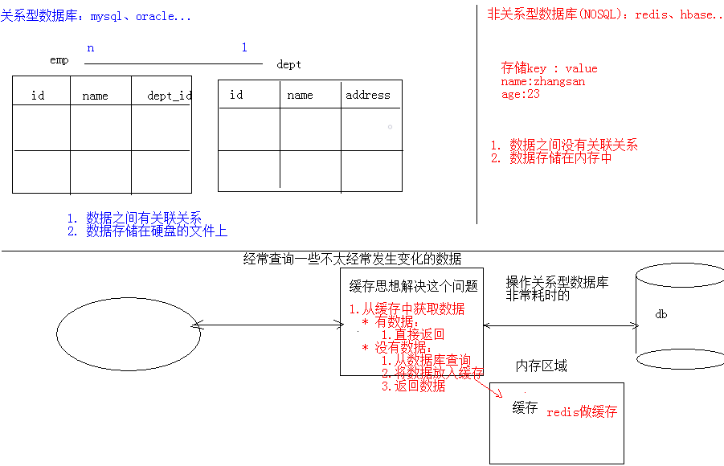
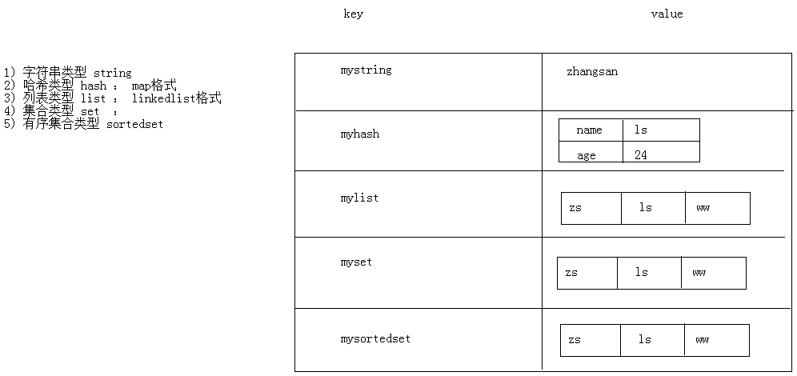
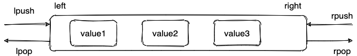
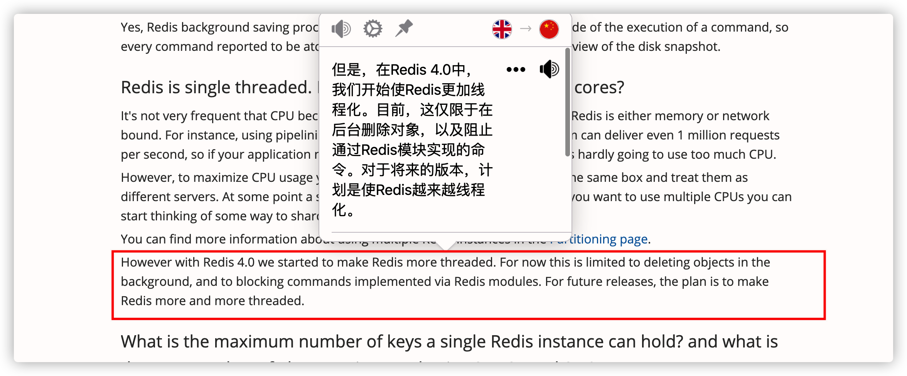

# Redis
参考： 
[我和面试官的博弈：Redis 篇 - 蛙课网的文章 - 知乎](https://zhuanlan.zhihu.com/p/118561398)

## 简单介绍一下 Redis 呗!

**Redis是C语言开发的一个开源的（遵从BSD协议）高性能键值对（key-value）的内存数据库，可以用作数据库、缓存、消息中间件等。它是一种NoSQL（not-only sql，泛指非关系型数据库）的数据库。**



**Redis作为一个内存数据库。**

**1、性能优秀，数据在内存中，读写速度非常快，支持并发10W QPS；  
2、单进程单线程，是线程安全的，采用IO多路复用机制；  
3、丰富的数据类型，支持字符串（strings）、散列（hashes）、列表（lists）、集合（sets）、有序集合（sorted sets）等；  
4、支持数据持久化。可以将内存中数据保存在磁盘中，重启时加载；  
5、主从复制，哨兵，高可用；  
6、可以用作分布式锁；  
7、可以作为消息中间件使用，支持发布订阅**

## Redis 和 Memcached 的区别和共同点

**共同点** ：

1. 都是基于内存的数据库，一般都用来当做缓存使用。
2. 都有过期策略。
3. 两者的性能都非常高。

**区别** ：

**1、存储方式上：**memcache会把数据全部存在内存之中，断电后会挂掉，数据不能超过内存大小。redis有部分数据存在硬盘上，这样能保证数据的持久性。

**2、数据支持类型上：**memcache对数据类型的支持简单，只支持简单的key-value，，而redis支持五种数据类型。

**3、使用底层模型不同：**它们之间底层实现方式以及与客户端之间通信的应用协议不一样。redis直接自己构建了VM机制，因为一般的系统调用系统函数的话，会浪费一定的时间去移动和请求。

**4、value的大小：**redis可以达到1GB，而memcache只有1MB。

1. **Redis 支持更丰富的数据类型（支持更复杂的应用场景）**。Redis 不仅仅支持简单的 k/v 类型的数据，同时还提供 list，set，zset，hash 等数据结构的存储。Memcached 只支持最简单的 k/v 数据类型。
2. **Redis 支持数据的持久化，可以将内存中的数据保持在磁盘中，重启的时候可以再次加载进行使用,而 Memecache 把数据全部存在内存之中。**
3. **Redis 有灾难恢复机制。** 因为可以把缓存中的数据持久化到磁盘上。
4. **Redis 在服务器内存使用完之后，可以将不用的数据放到磁盘上。但是，Memcached 在服务器内存使用完之后，就会直接报异常。**
5. **Memcached 没有原生的集群模式，需要依靠客户端来实现往集群中分片写入数据；但是 Redis 目前是原生支持 cluster 模式的.**
6. **Memcached 是多线程，非阻塞 IO 复用的网络模型；Redis 使用单线程的多路 IO 复用模型。** （Redis 6.0 引入了多线程 IO ）
7. **Redis 支持发布订阅模型、Lua 脚本、事务等功能，而 Memcached 不支持。并且，Redis 支持更多的编程语言。**
8. **Memcached过期数据的删除策略只用了惰性删除，而 Redis 同时使用了惰性删除与定期删除。**

## 缓存数据的处理流程是怎样的？


简单来说就是:

1. 如果用户请求的数据在缓存中就直接返回。
2. 缓存中不存在的话就看数据库中是否存在。
3. 数据库中存在的话就更新缓存中的数据。
4. 数据库中不存在的话就返回空数据。

## 为什么要用 Redis/为什么要用缓存？

使用缓存主要是为了提升用户体验以及应对更多的用户。

下面我们主要从“高性能”和“高并发”这两点来看待这个问题。


**高性能** ：

假如用户第一次访问数据库中的某些数据的话，这个过程是比较慢，毕竟是从硬盘中读取的。但是，如果说，用户访问的数据属于高频数据并且不会经常改变的话，那么我们就可以很放心地将该用户访问的数据存在缓存中。

**这样有什么好处呢？** 那就是保证用户下一次再访问这些数据的时候就可以直接从缓存中获取了。操作缓存就是直接操作内存，所以速度相当快。

不过，要保持数据库和缓存中的数据的一致性。 如果数据库中的对应数据改变的之后，同步改变缓存中相应的数据即可！

**高并发：**

一般像 MySQL 这类的数据库的 QPS 大概都在 1w 左右（4 核 8g） ，但是使用 Redis 缓存之后很容易达到 10w+，甚至最高能达到 30w+（就单机 redis 的情况，redis 集群的话会更高）。

> QPS（Query Per Second）：服务器每秒可以执行的查询次数；

所以，直接操作缓存能够承受的数据库请求数量是远远大于直接访问数据库的，所以我们可以考虑把数据库中的部分数据转移到缓存中去，这样用户的一部分请求会直接到缓存这里而不用经过数据库。进而，我们也就提高的系统整体的并发。

## Redis 常见对象以及使用场景分析

redis使用对象来表示数据库中的键和值，每次当我们在redis的数据库中新创建一个键值对时，我们至少会创建两个对象，一个对象用作键值对的键(键对象)，另一个对象用作键值对的值(值对象)。 

   	redis的每种对象都由**对象结构**(redisObject)与对应编码的**数据结构**组合而成，**redis支持5种对象类型，分别是字符串(string)、列表(list)、哈希(hash)、集合(set)、有序集合(zset)**

​	redis中的键和值都是由对象组成的，而对象是由**对象结构**和**数据结构**共同组成的。redis中的键，都是用字符串来存储的，即对于redis数据库中的键值对来说，**键总是一个字符串对象**，而**值可以是字符串对象、列表对象、哈希对象、集合对象或者有序集合对象中的其中一种。**

[参考](https://developer.aliyun.com/article/710228)



### string

1. **介绍** ：string 数据结构是简单的 key-value 类型。虽然 Redis 是用 C 语言写的，但是 Redis 并没有使用 C 的字符串表示，而是自己构建了一种 **简单动态字符串**（simple dynamic string，**SDS**）。相比于 C 的原生字符串，Redis 的 SDS 不光可以保存文本数据还可以保存二进制数据，并且获取字符串长度复杂度为 O(1)（C 字符串为 O(N)）,除此之外,Redis 的 SDS API 是安全的，不会造成缓冲区溢出。
2. **常用命令:** `set,get,strlen,exists,dect,incr,setex` 等等。
3. **应用场景** ：一般常用在需要计数的场景，比如用户的访问次数、热点文章的点赞转发数量等等。

下面我们简单看看它的使用！

**普通字符串的基本操作：**

``` bash
127.0.0.1:6379> set key value #设置 key-value 类型的值
OK
127.0.0.1:6379> get key # 根据 key 获得对应的 value
"value"
127.0.0.1:6379> exists key  # 判断某个 key 是否存在
(integer) 1
127.0.0.1:6379> strlen key # 返回 key 所储存的字符串值的长度。
(integer) 5
127.0.0.1:6379> del key # 删除某个 key 对应的值
(integer) 1
127.0.0.1:6379> get key
(nil)
```

**批量设置** :

``` bash
127.0.0.1:6379> mset key1 value1 key2 value2 # 批量设置 key-value 类型的值
OK
127.0.0.1:6379> mget key1 key2 # 批量获取多个 key 对应的 value
1) "value1"
2) "value2"
```

**计数器（字符串的内容为整数的时候可以使用）：**

``` bash

127.0.0.1:6379> set number 1
OK
127.0.0.1:6379> incr number # 将 key 中储存的数字值增一
(integer) 2
127.0.0.1:6379> get number
"2"
127.0.0.1:6379> decr number # 将 key 中储存的数字值减一
(integer) 1
127.0.0.1:6379> get number
"1"
```

**过期**：

``` bash
127.0.0.1:6379> expire key  60 # 数据在 60s 后过期
(integer) 1
127.0.0.1:6379> setex key 60 value # 数据在 60s 后过期 (setex:[set] + [ex]pire)
OK
127.0.0.1:6379> ttl key # 查看数据还有多久过期
(integer) 56
```

### list

1. **介绍** ：**list** 即是 **链表**。链表是一种非常常见的数据结构，特点是易于数据元素的插入和删除并且且可以灵活调整链表长度，但是链表的随机访问困难。许多高级编程语言都内置了链表的实现比如 Java 中的 **LinkedList**，但是 C 语言并没有实现链表，所以 Redis 实现了自己的链表数据结构。Redis 的 list 的实现为一个 **双向链表**，即可以支持反向查找和遍历，更方便操作，不过带来了部分额外的内存开销。
2. **常用命令:** `rpush,lpop,lpush,rpop,lrange、llen` 等。
3. **应用场景:** 发布与订阅或者说消息队列、慢查询。

下面我们简单看看它的使用！

**通过 `rpush/lpop` 实现队列：**

``` bash
127.0.0.1:6379> rpush myList value1 # 向 list 的头部（右边）添加元素
(integer) 1
127.0.0.1:6379> rpush myList value2 value3 # 向list的头部（最右边）添加多个元素
(integer) 3
127.0.0.1:6379> lpop myList # 将 list的尾部(最左边)元素取出
"value1"
127.0.0.1:6379> lrange myList 0 1 # 查看对应下标的list列表， 0 为 start,1为 end
1) "value2"
2) "value3"
127.0.0.1:6379> lrange myList 0 -1 # 查看列表中的所有元素，-1表示倒数第一
1) "value2"
2) "value3"
```

**通过 `rpush/rpop` 实现栈：**

``` bash
127.0.0.1:6379> rpush myList2 value1 value2 value3
(integer) 3
127.0.0.1:6379> rpop myList2 # 将 list的头部(最右边)元素取出
"value3"
```

我专门花了一个图方便小伙伴们来理解：



**通过 `lrange` 查看对应下标范围的列表元素：**

``` bash
127.0.0.1:6379> rpush myList value1 value2 value3
(integer) 3
127.0.0.1:6379> lrange myList 0 1 # 查看对应下标的list列表， 0 为 start,1为 end
1) "value1"
2) "value2"
127.0.0.1:6379> lrange myList 0 -1 # 查看列表中的所有元素，-1表示倒数第一
1) "value1"
2) "value2"
3) "value3"
```

通过 `lrange` 命令，你可以基于 list 实现分页查询，性能非常高！

**通过 `llen` 查看链表长度：**

``` bash
127.0.0.1:6379> llen myList
(integer) 3
```

### hash

1. **介绍** ：hash 类似于 JDK1.8 前的 HashMap，内部实现也差不多(数组 + 链表)。不过，Redis 的 hash 做了更多优化。另外，hash 是一个 string 类型的 field 和 value 的映射表，**特别适合用于存储对象**，后续操作的时候，你可以直接仅仅修改这个对象中的某个字段的值。 比如我们可以 hash 数据结构来存储用户信息，商品信息等等。
2. **常用命令：** `hset,hmset,hexists,hget,hgetall,hkeys,hvals` 等。
3. **应用场景:** 系统中对象数据的存储。

下面我们简单看看它的使用！

``` bash
127.0.0.1:6379> hset userInfoKey name "guide" description "dev" age "24"
OK
127.0.0.1:6379> hexists userInfoKey name # 查看 key 对应的 value中指定的字段是否存在。
(integer) 1
127.0.0.1:6379> hget userInfoKey name # 获取存储在哈希表中指定字段的值。
"guide"
127.0.0.1:6379> hget userInfoKey age
"24"
127.0.0.1:6379> hgetall userInfoKey # 获取在哈希表中指定 key 的所有字段和值
1) "name"
2) "guide"
3) "description"
4) "dev"
5) "age"
6) "24"
127.0.0.1:6379> hkeys userInfoKey # 获取 key 列表
1) "name"
2) "description"
3) "age"
127.0.0.1:6379> hvals userInfoKey # 获取 value 列表
1) "guide"
2) "dev"
3) "24"
127.0.0.1:6379> hset userInfoKey name "GuideGeGe" # 修改某个字段对应的值
127.0.0.1:6379> hget userInfoKey name
"GuideGeGe"
```

### set

1. **介绍 ：** set 类似于 Java 中的 `HashSet` 。Redis 中的 set 类型是一种无序集合，集合中的元素没有先后顺序。当你需要存储一个列表数据，又不希望出现重复数据时，set 是一个很好的选择，并且 set 提供了判断某个成员是否在一个 set 集合内的重要接口，这个也是 list 所不能提供的。可以基于 set 轻易实现交集、并集、差集的操作。比如：你可以将一个用户所有的关注人存在一个集合中，将其所有粉丝存在一个集合。Redis 可以非常方便的实现如共同关注、共同粉丝、共同喜好等功能。这个过程也就是求交集的过程。
2. **常用命令：** `sadd,spop,smembers,sismember,scard,sinterstore,sunion` 等。
3. **应用场景:** 需要存放的数据不能重复以及需要获取多个数据源交集和并集等场景

下面我们简单看看它的使用！

``` bash
127.0.0.1:6379> sadd mySet value1 value2 # 添加元素进去
(integer) 2
127.0.0.1:6379> sadd mySet value1 # 不允许有重复元素
(integer) 0
127.0.0.1:6379> smembers mySet # 查看 set 中所有的元素
1) "value1"
2) "value2"
127.0.0.1:6379> scard mySet # 查看 set 的长度
(integer) 2
127.0.0.1:6379> sismember mySet value1 # 检查某个元素是否存在set 中，只能接收单个元素
(integer) 1
127.0.0.1:6379> sadd mySet2 value2 value3
(integer) 2
127.0.0.1:6379> sinterstore mySet3 mySet mySet2 # 获取 mySet 和 mySet2 的交集并存放在 mySet3 中
(integer) 1
127.0.0.1:6379> smembers mySet3
1) "value2"
```

### sorted set

1. **介绍：** 和 set 相比，sorted set 增加了一个权重参数 score，使得集合中的元素能够按 score 进行有序排列，还可以通过 score 的范围来获取元素的列表。有点像是 Java 中 HashMap 和 TreeSet 的结合体。
2. **常用命令：** `zadd,zcard,zscore,zrange,zrevrange,zrem` 等。
3. **应用场景：** 需要对数据根据某个权重进行排序的场景。比如在直播系统中，实时排行信息包含直播间在线用户列表，各种礼物排行榜，弹幕消息（可以理解为按消息维度的消息排行榜）等信息。

``` bash
127.0.0.1:6379> zadd myZset 3.0 value1 # 添加元素到 sorted set 中 3.0 为权重
(integer) 1
127.0.0.1:6379> zadd myZset 2.0 value2 1.0 value3 # 一次添加多个元素
(integer) 2
127.0.0.1:6379> zcard myZset # 查看 sorted set 中的元素数量
(integer) 3
127.0.0.1:6379> zscore myZset value1 # 查看某个 value 的权重
"3"
127.0.0.1:6379> zrange  myZset 0 -1 # 顺序输出某个范围区间的元素，0 -1 表示输出所有元素
1) "value3"
2) "value2"
3) "value1"
127.0.0.1:6379> zrange  myZset 0 1 # 顺序输出某个范围区间的元素，0 为 start  1 为 stop
1) "value3"
2) "value2"
127.0.0.1:6379> zrevrange  myZset 0 1 # 逆序输出某个范围区间的元素，0 为 start  1 为 stop
1) "value1"
2) "value2"
```

## Redis 单线程模型详解

**Redis 基于 Reactor 模式来设计开发了自己的一套高效的事件处理模型** （Netty 的线程模型也基于 Reactor 模式，Reactor 模式不愧是高性能 IO 的基石），这套事件处理模型对应的是 Redis 中的文件事件处理器（file event handler）。由于文件事件处理器（file event handler）是单线程方式运行的，所以我们一般都说 Redis 是单线程模型。

**既然是单线程，那怎么监听大量的客户端连接呢？**

Redis 通过**IO 多路复用程序** 来监听来自客户端的大量连接（或者说是监听多个 socket），它会将感兴趣的事件及类型(读、写）注册到内核中并监听每个事件是否发生。

这样的好处非常明显： **I/O 多路复用技术的使用让 Redis 不需要额外创建多余的线程来监听客户端的大量连接，降低了资源的消耗**（和 NIO 中的 `Selector` 组件很像）。

另外， Redis 服务器是一个事件驱动程序，服务器需要处理两类事件： 1. 文件事件; 2. 时间事件。

时间事件不需要多花时间了解，我们接触最多的还是 **文件事件**（客户端进行读取写入等操作，涉及一系列网络通信）。

《Redis 设计与实现》有一段话是如是介绍文件事件的，我觉得写得挺不错。

> Redis 基于 Reactor 模式开发了自己的网络事件处理器：这个处理器被称为文件事件处理器（file event handler）。文件事件处理器使用 I/O 多路复用（multiplexing）程序来同时监听多个套接字，并根据 套接字目前执行的任务来为套接字关联不同的事件处理器。
>
> 当被监听的套接字准备好执行连接应答（accept）、读取（read）、写入（write）、关 闭（close）等操作时，与操作相对应的文件事件就会产生，这时文件事件处理器就会调用套接字之前关联好的事件处理器来处理这些事件。
>
> **虽然文件事件处理器以单线程方式运行，但通过使用 I/O 多路复用程序来监听多个套接字**，文件事件处理器既实现了高性能的网络通信模型，又可以很好地与 Redis 服务器中其他同样以单线程方式运行的模块进行对接，这保持了 Redis 内部单线程设计的简单性。

可以看出，文件事件处理器（file event handler）主要是包含 4 个部分：

* 多个 socket（客户端连接）
* IO 多路复用程序（支持多个客户端连接的关键）
* 文件事件分派器（将 socket 关联到相应的事件处理器）
* 事件处理器（连接应答处理器、命令请求处理器、命令回复处理器）


<p style="text-align:right; font-size:14px; color:gray">《Redis设计与实现：12章》</p>

## Redis 没有使用多线程？为什么不使用多线程？

虽然说 Redis 是单线程模型，但是， 实际上，**Redis 在 4.0 之后的版本中就已经加入了对多线程的支持。**



不过，Redis 4.0 增加的多线程主要是针对一些大键值对的删除操作的命令，使用这些命令就会使用主处理之外的其他线程来“异步处理”。

大体上来说，**Redis 6.0 之前主要还是单线程处理。**

**那，Redis6.0 之前 为什么不使用多线程？**

我觉得主要原因有下面 3 个：

1. 单线程编程容易并且更容易维护；
2. Redis 的性能瓶颈不再 CPU ，主要在内存和网络；
3. 多线程就会存在死锁、线程上下文切换等问题，甚至会影响性能。

## Redis6.0 之后为何引入了多线程？

**Redis6.0 引入多线程主要是为了提高网络 IO 读写性能**，因为这个算是 Redis 中的一个性能瓶颈（Redis 的瓶颈主要受限于内存和网络）。

虽然，Redis6.0 引入了多线程，但是 Redis 的多线程只是在网络数据的读写这类耗时操作上使用了， 执行命令仍然是单线程顺序执行。因此，你也不需要担心线程安全问题。

Redis6.0 的多线程默认是禁用的，只使用主线程。如需开启需要修改 redis 配置文件 `redis.conf` ：

``` bash
io-threads-do-reads yes
```

开启多线程后，还需要设置线程数，否则是不生效的。同样需要修改 redis 配置文件 `redis.conf` :

``` bash
io-threads 4 #官网建议4核的机器建议设置为2或3个线程，8核的建议设置为6个线程
```

推荐阅读：

1. [Redis 6.0 新特性-多线程连环 13 问！](https://mp.weixin.qq.com/s/FZu3acwK6zrCBZQ_3HoUgw)
2. [为什么 Redis 选择单线程模型](https://draveness.me/whys-the-design-redis-single-thread/)

## Redis 给缓存数据设置过期时间有啥用？

一般情况下，我们设置保存的缓存数据的时候都会设置一个过期时间。为什么呢？

因为内存是有限的，如果缓存中的所有数据都是一直保存的话，分分钟直接Out of memory。

Redis 自带了给缓存数据设置过期时间的功能，比如：

``` bash
127.0.0.1:6379> exp key  60 # 数据在 60s 后过期
(integer) 1
127.0.0.1:6379> setex key 60 value # 数据在 60s 后过期 (setex:[set] + [ex]pire)
OK
127.0.0.1:6379> ttl key # 查看数据还有多久过期
(integer) 56
```

注意：**Redis中除了字符串类型有自己独有设置过期时间的命令 `setex` 外，其他方法都需要依靠 `expire` 命令来设置过期时间 。另外， `persist` 命令可以移除一个键的过期时间： **

**过期时间除了有助于缓解内存的消耗，还有什么其他用么？**

很多时候，我们的业务场景就是需要某个数据只在某一时间段内存在，比如我们的短信验证码可能只在1分钟内有效，用户登录的 token 可能只在 1 天内有效。

如果使用传统的数据库来处理的话，一般都是自己判断过期，这样更麻烦并且性能要差很多。

## Redis是如何判断数据是否过期的呢？

Redis 通过一个叫做过期字典（可以看作是hash表）来保存数据过期的时间。过期字典的键指向Redis数据库中的某个key(键)，过期字典的值是一个long long类型的整数，这个整数保存了key所指向的数据库键的过期时间（毫秒精度的UNIX时间戳）。 


过期字典是存储在redisDb这个结构里的：

``` c
typedef struct redisDb {
    ...
    
    dict *dict;     //数据库键空间,保存着数据库中所有键值对
    dict *expires   // 过期字典,保存着键的过期时间
    ...
} redisDb;
```

## 过期的数据的删除策略了解么？

如果假设你设置了一批 key 只能存活 1 分钟，那么 1 分钟后，Redis 是怎么对这批 key 进行删除的呢？

常用的过期数据的删除策略就两个（重要！自己造缓存轮子的时候需要格外考虑的东西）：

1. **惰性删除** ：只会在取出key的时候才对数据进行过期检查。这样对CPU最友好，但是可能会造成太多过期 key 没有被删除。
2. **定期删除** ： 每隔一段时间抽取一批 key 执行删除过期key操作。并且，Redis 底层会通过限制删除操作执行的时长和频率来减少删除操作对CPU时间的影响。

定期删除对内存更加友好，惰性删除对CPU更加友好。两者各有千秋，所以Redis 采用的是 **定期删除+惰性/懒汉式删除** 。

但是，仅仅通过给 key 设置过期时间还是有问题的。因为还是可能存在定期删除和惰性删除漏掉了很多过期  key 的情况。这样就导致大量过期 key 堆积在内存里，然后就Out of memory了。

怎么解决这个问题呢？答案就是： **Redis 内存淘汰机制。**

## Redis 内存淘汰机制了解么？

> 相关问题：MySQL 里有 2000w 数据，Redis 中只存 20w 的数据，如何保证 Redis 中的数据都是热点数据?

Redis 提供 6 种数据淘汰策略：

1. **volatile-lru（least recently used）**：从已设置过期时间的数据集（server.db[i].expires）中挑选最近最少使用的数据淘汰
2. **volatile-ttl**：从已设置过期时间的数据集（server.db[i].expires）中挑选将要过期的数据淘汰
3. **volatile-random**：从已设置过期时间的数据集（server.db[i].expires）中任意选择数据淘汰
4. **allkeys-lru（least recently used）**：当内存不足以容纳新写入数据时，在键空间中，移除最近最少使用的 key（这个是最常用的）
5. **allkeys-random**：从数据集（server.db[i].dict）中任意选择数据淘汰
6. **no-eviction**：禁止驱逐数据，也就是说当内存不足以容纳新写入数据时，新写入操作会报错。这个应该没人使用吧！

4.0 版本后增加以下两种：

7. **volatile-lfu（least frequently used）**：从已设置过期时间的数据集(server.db[i].expires)中挑选最不经常使用的数据淘汰
8. **allkeys-lfu（least frequently used）**：当内存不足以容纳新写入数据时，在键空间中，移除最不经常使用的 key

## Redis 持久化机制(怎么保证 Redis 挂掉之后再重启数据可以进行恢复)

redis为了保证效率，数据缓存在了内存中，但是会周期性的把更新的数据写入磁盘或者把修改操作写入追加的记录文件中，以保证数据的持久化。Redis的持久化策略有两种：**1、RDB：**快照形式是直接把内存中的数据保存到一个dump的文件中，定时保存，保存策略。**2、AOF：把**所有的对Redis的服务器进行修改的命令都存到一个文件里，命令的集合。Redis默认是快照RDB的持久化方式。当Redis重启的时候，它会优先使用AOF文件来还原数据集，因为AOF文件保存的数据集通常比RDB文件所保存的数据集更完整。你甚至可以关闭持久化功能，让数据只在服务器运行时存。

很多时候我们需要持久化数据也就是将内存中的数据写入到硬盘里面，大部分原因是为了之后重用数据（比如重启机器、机器故障之后恢复数据），或者是为了防止系统故障而将数据备份到一个远程位置。

Redis 不同于 Memcached 的很重要一点就是，Redis 支持持久化，而且支持两种不同的持久化操作。**Redis 的一种持久化方式叫快照（snapshotting，RDB），另一种方式是只追加文件（append-only file, AOF）**。这两种方法各有千秋，下面我会详细这两种持久化方法是什么，怎么用，如何选择适合自己的持久化方法。

**快照（snapshotting）持久化（RDB）**

Redis 可以通过创建快照来获得存储在内存里面的数据在某个时间点上的副本。Redis 创建快照之后，可以对快照进行备份，可以将快照复制到其他服务器从而创建具有相同数据的服务器副本（Redis 主从结构，主要用来提高 Redis 性能），还可以将快照留在原地以便重启服务器的时候使用。

快照持久化是 Redis 默认采用的持久化方式，在 Redis.conf 配置文件中默认有此下配置：

``` conf
save 900 1           #在900秒(15分钟)之后，如果至少有1个key发生变化，Redis就会自动触发BGSAVE命令创建快照。

save 300 10          #在300秒(5分钟)之后，如果至少有10个key发生变化，Redis就会自动触发BGSAVE命令创建快照。

save 60 10000        #在60秒(1分钟)之后，如果至少有10000个key发生变化，Redis就会自动触发BGSAVE命令创建快照。
```

**AOF（append-only file）持久化**

与快照持久化相比，AOF 持久化 的实时性更好，因此已成为主流的持久化方案。默认情况下 Redis 没有开启 AOF（append only file）方式的持久化，可以通过 appendonly 参数开启：

``` conf
appendonly yes
```

开启 AOF 持久化后每执行一条会更改 Redis 中的数据的命令，Redis 就会将该命令写入硬盘中的 AOF 文件。AOF 文件的保存位置和 RDB 文件的位置相同，都是通过 dir 参数设置的，默认的文件名是 appendonly.aof。

在 Redis 的配置文件中存在三种不同的 AOF 持久化方式，它们分别是：

``` conf
appendfsync always    #每次有数据修改发生时都会写入AOF文件,这样会严重降低Redis的速度
appendfsync everysec  #每秒钟同步一次，显示地将多个写命令同步到硬盘
appendfsync no        #让操作系统决定何时进行同步
```

为了兼顾数据和写入性能，用户可以考虑 appendfsync everysec 选项 ，让 Redis 每秒同步一次 AOF 文件，Redis 性能几乎没受到任何影响。而且这样即使出现系统崩溃，用户最多只会丢失一秒之内产生的数据。当硬盘忙于执行写入操作的时候，Redis 还会优雅的放慢自己的速度以便适应硬盘的最大写入速度。

**该用哪一个呢？**

如果你非常关心你的数据，但仍然可以承受数分钟内的数据丢失，那么可以只使用RDB持久。AOF将Redis执行的每一条命令追加到磁盘中，处理巨大的写入会降低Redis的性能，不知道你是否可以接受。数据库备份和灾难恢复：定时生成RDB快照非常便于进行数据库备份，并且RDB恢复数据集的速度也要比AOF恢复的速度快。当然了，redis支持同时开启RDB和AOF，系统重启后，redis会优先使用AOF来恢复数据，这样丢失的数据会最少。

**拓展：Redis 4.0 对于持久化机制的优化**

Redis 4.0 开始支持 RDB 和 AOF 的混合持久化（默认关闭，可以通过配置项 `aof-use-rdb-preamble` 开启）。

如果把混合持久化打开，AOF 重写的时候就直接把 RDB 的内容写到 AOF 文件开头。这样做的好处是可以结合 RDB 和 AOF 的优点, 快速加载同时避免丢失过多的数据。当然缺点也是有的， AOF 里面的 RDB 部分是压缩格式不再是 AOF 格式，可读性较差。

**补充内容：AOF 重写**

AOF 重写可以产生一个新的 AOF 文件，这个新的 AOF 文件和原有的 AOF 文件所保存的数据库状态一样，但体积更小。

AOF 重写是一个有歧义的名字，该功能是通过读取数据库中的键值对来实现的，程序无须对现有 AOF 文件进行任何读入、分析或者写入操作。

在执行 BGREWRITEAOF 命令时，Redis 服务器会维护一个 AOF 重写缓冲区，该缓冲区会在子进程创建新 AOF 文件期间，记录服务器执行的所有写命令。当子进程完成创建新 AOF 文件的工作之后，服务器会将重写缓冲区中的所有内容追加到新 AOF 文件的末尾，使得新旧两个 AOF 文件所保存的数据库状态一致。最后，服务器用新的 AOF 文件替换旧的 AOF 文件，以此来完成 AOF 文件重写操作

## Redis 事务

Redis 可以通过 **MULTI，EXEC，DISCARD 和 WATCH**  等命令来实现事务(transaction)功能。

``` bash
> MULTI
OK
> INCR foo
QUEUED
> INCR bar
QUEUED
> EXEC
1) (integer) 1
2) (integer) 1
```

使用 [MULTI](https://redis.io/commands/multi)命令后可以输入多个命令。Redis不会立即执行这些命令，而是将它们放到队列，当调用了[EXEC](https://redis.io/commands/exec)命令将执行所有命令。

Redis官网相关介绍 [https://redis.io/topics/transactions](https://redis.io/topics/transactions) 如下：

但是，Redis 的事务和我们平时理解的关系型数据库的事务不同。我们知道事务具有四大特性： **1. 原子性**，**2. 隔离性**，**3. 持久性**，**4. 一致性**。

1. **原子性（Atomicity）：** 事务是最小的执行单位，不允许分割。事务的原子性确保动作要么全部完成，要么完全不起作用；
2. **隔离性（Isolation）：** 并发访问数据库时，一个用户的事务不被其他事务所干扰，各并发事务之间数据库是独立的；
3. **持久性（Durability）：** 一个事务被提交之后。它对数据库中数据的改变是持久的，即使数据库发生故障也不应该对其有任何影响。
4. **一致性（Consistency）：** 执行事务前后，数据保持一致，多个事务对同一个数据读取的结果是相同的；

**Redis 是不支持 roll back 的，因而不满足原子性的（而且不满足持久性）。**

Redis官网也解释了自己为啥不支持回滚。简单来说就是Redis开发者们觉得没必要支持回滚，这样更简单便捷并且性能更好。Redis开发者觉得即使命令执行错误也应该在开发过程中就被发现而不是生产过程中。


你可以将Redis中的事务就理解为 ：**Redis事务提供了一种将多个命令请求打包的功能。然后，再按顺序执行打包的所有命令，并且不会被中途打断。**

**相关issue** :[issue452: 关于 Redis 事务不满足原子性的问题](https://github.com/Snailclimb/JavaGuide/issues/452) ，推荐阅读：[https://zhuanlan.zhihu.com/p/43897838](https://zhuanlan.zhihu.com/p/43897838) 。

## 缓存穿透

### 什么是缓存穿透？

缓存穿透说简单点就是大量请求的 key 根本不存在于缓存中，导致请求直接到了数据库上，根本没有经过缓存这一层。举个例子：某个黑客故意制造我们缓存中不存在的 key 发起大量请求，导致大量请求落到数据库。

### 缓存穿透情况的处理流程是怎样的？

如下图所示，用户的请求最终都要跑到数据库中查询一遍。


### 有哪些解决办法？

最基本的就是首先做好参数校验，一些不合法的参数请求直接抛出异常信息返回给客户端。比如查询的数据库 id 不能小于 0、传入的邮箱格式不对的时候直接返回错误消息给客户端等等。

**1）缓存无效 key**

如果缓存和数据库都查不到某个 key 的数据就写一个到 Redis 中去并设置过期时间，具体命令如下： `SET key value EX 10086` 。这种方式可以解决请求的 key 变化不频繁的情况，如果黑客恶意攻击，每次构建不同的请求 key，会导致 Redis 中缓存大量无效的 key 。很明显，这种方案并不能从根本上解决此问题。如果非要用这种方式来解决穿透问题的话，尽量将无效的 key 的过期时间设置短一点比如 1 分钟。

另外，这里多说一嘴，一般情况下我们是这样设计 key 的： `表名:列名:主键名:主键值` 。

如果用 Java 代码展示的话，差不多是下面这样的：

``` java
public Object getObjectInclNullById(Integer id) {
    // 从缓存中获取数据
    Object cacheValue = cache.get(id);
    // 缓存为空
    if (cacheValue == null) {
        // 从数据库中获取
        Object storageValue = storage.get(key);
        // 缓存空对象
        cache.set(key, storageValue);
        // 如果存储数据为空，需要设置一个过期时间(300秒)
        if (storageValue == null) {
            // 必须设置过期时间，否则有被攻击的风险
            cache.expire(key, 60 * 5);
        }
        return storageValue;
    }
    return cacheValue;
}
```

**2）布隆过滤器**

布隆过滤器是一个非常神奇的数据结构，通过它我们可以非常方便地判断一个给定数据是否存在于海量数据中。我们需要的就是判断 key 是否合法，有没有感觉布隆过滤器就是我们想要找的那个“人”。

具体是这样做的：把所有可能存在的请求的值都存放在布隆过滤器中，当用户请求过来，先判断用户发来的请求的值是否存在于布隆过滤器中。不存在的话，直接返回请求参数错误信息给客户端，存在的话才会走下面的流程。

加入布隆过滤器之后的缓存处理流程图如下。


但是，需要注意的是布隆过滤器可能会存在误判的情况。总结来说就是： **布隆过滤器说某个元素存在，小概率会误判。布隆过滤器说某个元素不在，那么这个元素一定不在。**

_为什么会出现误判的情况呢? 我们还要从布隆过滤器的原理来说！_

我们先来看一下，**当一个元素加入布隆过滤器中的时候，会进行哪些操作：**

1. 使用布隆过滤器中的哈希函数对元素值进行计算，得到哈希值（有几个哈希函数得到几个哈希值）。
2. 根据得到的哈希值，在位数组中把对应下标的值置为 1。

我们再来看一下，**当我们需要判断一个元素是否存在于布隆过滤器的时候，会进行哪些操作：**

1. 对给定元素再次进行相同的哈希计算；
2. 得到值之后判断位数组中的每个元素是否都为 1，如果值都为 1，那么说明这个值在布隆过滤器中，如果存在一个值不为 1，说明该元素不在布隆过滤器中。

然后，一定会出现这样一种情况：**不同的字符串可能哈希出来的位置相同。** （可以适当增加位数组大小或者调整我们的哈希函数来降低概率）

更多关于布隆过滤器的内容可以看我的这篇原创：[《不了解布隆过滤器？一文给你整的明明白白！》](https://github.com/Snailclimb/JavaGuide/blob/master/docs/dataStructures-algorithms/data-structure/bloom-filter.md) ，强烈推荐，个人感觉网上应该找不到总结的这么明明白白的文章了。

## 缓存雪崩

### 什么是缓存雪崩？

我发现缓存雪崩这名字起的有点意思，哈哈。

实际上，缓存雪崩描述的就是这样一个简单的场景：**缓存在同一时间大面积的失效，后面的请求都直接落到了数据库上，造成数据库短时间内承受大量请求。** 这就好比雪崩一样，摧枯拉朽之势，数据库的压力可想而知，可能直接就被这么多请求弄宕机了。

举个例子：系统的缓存模块出了问题比如宕机导致不可用。造成系统的所有访问，都要走数据库。

还有一种缓存雪崩的场景是：**有一些被大量访问数据（热点缓存）在某一时刻大面积失效，导致对应的请求直接落到了数据库上。** 这样的情况，有下面几种解决办法：

举个例子 ：秒杀开始 12 个小时之前，我们统一存放了一批商品到 Redis 中，设置的缓存过期时间也是 12 个小时，那么秒杀开始的时候，这些秒杀的商品的访问直接就失效了。导致的情况就是，相应的请求直接就落到了数据库上，就像雪崩一样可怕。

### 有哪些解决办法？

**针对 Redis 服务不可用的情况：**

1. 采用 Redis 集群，避免单机出现问题整个缓存服务都没办法使用。
2. 限流，避免同时处理大量的请求。

**针对热点缓存失效的情况：**

1. 设置不同的失效时间比如随机设置缓存的失效时间。
2. 缓存永不失效。

## 如何保证缓存和数据库数据的一致性？

细说的话可以扯很多，但是我觉得其实没太大必要（小声BB：很多解决方案我也没太弄明白）。我个人觉得引入缓存之后，如果为了短时间的不一致性问题，选择让系统设计变得更加复杂的话，完全没必要。

下面单独对  **Cache Aside Pattern（旁路缓存模式）** 来聊聊。

Cache Aside Pattern 中遇到写请求是这样的：更新 DB，然后直接删除 cache 。

如果更新数据库成功，而删除缓存这一步失败的情况的话，简单说两个解决方案：

1. **缓存失效时间变短（不推荐，治标不治本）** ：我们让缓存数据的过期时间变短，这样的话缓存就会从数据库中加载数据。另外，这种解决办法对于先操作缓存后操作数据库的场景不适用。
2. **增加cache更新重试机制（常用）**： 如果 cache 服务当前不可用导致缓存删除失败的话，我们就隔一段时间进行重试，重试次数可以自己定。如果多次重试还是失败的话，我们可以把当前更新失败的 key 存入队列中，等缓存服务可用之后，再将 缓存中对应的 key 删除即可。   	

## 说一下Redis主从复制？完整重同步，部分重同步 

### （一）主从复制概述
主从复制，是指将一台Redis服务器的数据，复制到其他的Redis服务器。前者称为主节点(master)，后者称为从节点(slave)；数据的复制是单向的，只能由主节点到从节点。

默认情况下，每台Redis服务器都是主节点；且一个主节点可以有多个从节点(或没有从节点)，但一个从节点只能有一个主节点。

### （二）主从复制的实现原理

主从复制过程大体可以分为3个阶段：**连接建立阶段（即准备阶段）、数据同步阶段、命令传播阶段**；

#### 1. 连接建立阶段

##### 步骤1：保存主节点信息

从节点服务器内部维护了两个字段，即masterhost和masterport字段，用于存储主节点的ip和port信息。

需要注意的是，**slaveof**是异步命令，从节点完成主节点ip和port的保存后，向发送slaveof命令的客户端直接返回OK，实际的复制操作在这之后才开始进行。

##### 步骤2：建立socket连接

从节点每秒1次调用复制定时函数replicationCron()，如果发现了有主节点可以连接，便会根据主节点的ip和port，创建socket连接。如果连接成功，则：

从节点：为该socket建立一个专门处理复制工作的文件事件处理器，负责后续的复制工作，如接收RDB文件、接收命令传播等。

主节点：接收到从节点的socket连接后（即accept之后），为该socket创建相应的客户端状态，**并将从节点看做是连接到主节点的一个客户端，后面的步骤会以从节点向主节点发送命令请求的形式来进行。**

##### 步骤3：发送ping命令

从节点成为主节点的客户端之后，发送ping命令进行首次请求，目的是：检查socket连接是否可用，以及主节点当前是否能够处理请求。
##### 步骤4：身份验证
如果从节点中设置了masterauth选项，则从节点需要向主节点进行身份验证；
##### 步骤5：发送从节点端口信息
身份验证之后，从节点会向主节点发送其监听的端口号

#### 2. 数据同步阶段

* 主从节点之间的连接建立以后，便可以开始进行数据同步，该阶段可以理解为从节点数据的初始化。具体执行的方式是：从节点向主节点发送psync命令（Redis2.8以前是sync命令），开始同步。

* 数据同步阶段是主从复制最核心的阶段，根**据主从节点当前状态的不同，可以分为全量复制和部分复制**，下面会有一章专门讲解这两种复制方式以及psync命令的执行过程，这里不再详述。

* 需**要注意的是，在数据同步阶段之前，从节点是主节点的客户端，主节点不是从节点的客户端；而到了这一阶段及以后，主从节点互为客户端。**原因在于：在此之前，主节点只需要响应从节点的请求即可，不需要主动发请求，而在数据同步阶段和后面的命令传播阶段，主节点需要主动向从节点发送请求（如推送缓冲区中的写命令），才能完成复制。

#### 3. 命令传播阶段
  数据同步阶段完成后，主从节点进入命令传播阶段；在这个阶段主节点将自己执行的写命令发送给从节点，从节点接收命令并执行，从而保证主从节点数据的一致性。

### （三）【数据同步阶段】全量复制和部分复制以及psync命令

* 在Redis2.8以前，从节点向主节点发送sync命令请求同步数据，此时的同步方式是全量复制；

* 在Redis2.8及以后，从节点可以发送**psync**命令请求同步数据，此时根据主从节点当前状态的不同，同步方式可能是全量复制或部分复制。
	* 1. 全量复制：用于初次复制或其他无法进行部分复制的情况，将主节点中的所有数据都发送给从节点，是一个非常重型的操作。
	* 2. 部分复制：用于网络中断等情况后的复制，**只将中断期间主节点执行的写命令发送给从节点，**与全量复制相比更加高效。需要注意的是，如果网络中断时间过长，导致主节点没有能够完整地保存中断期间执行的写命令，则无法进行部分复制，仍使用全量复制。

#### 1. 全量复制

Redis通过psync命令进行全量复制的过程如下：

（1）从节点判断无法进行部分复制，向主节点发送全量复制的请求；或从节点发送部分复制的请求，但主节点判断无法进行部分复制；具体判断过程需要在讲述了部分复制原理后再介绍。

（2）主节点收到全量复制的命令后，执行bgsave，在后台生成RDB文件，并使用一个缓冲区（称为复制缓冲区）记录从现在开始执行的所有写命令

（3）主节点的bgsave执行完成后，将RDB文件发送给从节点；**从节点首先清除自己的旧数据，然后载入接收的RDB文件**，将数据库状态更新至主节点执行bgsave时的数据库状态

（4）主节点将前述复制缓冲区中的所有写命令发送给从节点，从节点执行这些写命令，将数据库状态更新至主节点的最新状态

（5）如果从节点开启了AOF，则会触发bgrewriteaof的执行，从而保证AOF文件更新至主节点的最新状态

#### 2. 部分复制

由于全量复制在主节点数据量较大时效率太低，因此Redis2.8开始提供部分复制，用于处理网络中断时的数据同步。

部分复制的实现，依赖于三个重要的概念：

#### （1）复制偏移量

主节点和从节点分别维护一个复制偏移量（offset），代表的是**主节点向从节点传递的字节数**；主节点每次向从节点传播N个字节数据时，主节点的offset增加N；从节点每次收到主节点传来的N个字节数据时，从节点的offset增加N。

offset用于判断主从节点的数据库状态是否一致：

* 如果二者offset相同，则一致；
* 如果offset不同，则不一致，此时可以根据两个offset找出从节点缺少的那部分数据。例如，如果主节点的offset是1000，而从节点的offset是500，那么部分复制就需要将offset为501-1000的数据传递给从节点。而**offset为501-1000的数据存储的位置，就是下面要介绍的复制积压缓冲区。**

#### （2）复制积压缓冲区

**复制积压缓冲区是由主节点维护的、固定长度的、先进先出(FIFO)队列，默认大小1MB；当主节点开始有从节点时创建，其作用是备份主节点最近发送给从节点的数据。注意，无论主节点有一个还是多个从节点，都只需要一个复制积压缓冲区。**

在命令传播阶段，主节点除了将写命令发送给从节点，还会发送一份给复制积压缓冲区，作为写命令的备份；除了存储写命令，复制积压缓冲区中还存储了其中的每个字节对应的复制偏移量（offset）。由于复制积压缓冲区定长且是先进先出，所以它保存的是主节点最近执行的写命令；时间较早的写命令会被挤出缓冲区。

由于该缓冲区长度固定且有限，因此可以备份的写命令也有限，当主从节点offset的差距过大超过缓冲区长度时，将无法执行部分复制，只能执行全量复制。反过来说，为了提高网络中断时部分复制执行的概率，可以根据需要增大复制积压缓冲区的大小(通过配置repl-backlog-size)；例如如果网络中断的平均时间是60s，而主节点平均每秒产生的写命令(特定协议格式)所占的字节数为100KB，则复制积压缓冲区的平均需求为6MB，保险起见，可以设置为12MB，来保证绝大多数断线情况都可以使用部分复制。

**从节点将offset发送给主节点后，主节点根据offset和缓冲区大小决定能否执行部分复制：**

- **如果offset偏移量之后的数据，仍然都在复制积压缓冲区里，则执行部分复制；**
- **如果offset偏移量之后的数据已不在复制积压缓冲区中（数据已被挤出），则执行全量复制。**

#### （3）服务器运行ID(runid)

每个Redis节点(无论主从)，在启动时都会自动生成一个随机ID(每次启动都不一样)，由40个随机的十六进制字符组成；runid用来唯一识别一个Redis节点。通过info Server命令，可以查看节点的runid：


**主从节点初次复制时，主节点将自己的runid发送给从节点，从节点将这个runid保存起来；当断线重连时，从节点会将这个runid发送给主节点；主节点根据runid判断能否进行部分复制：**

- 如果从节点保存的runid与主节点现在的runid相同，说明主从节点之前同步过，主节点会继续尝试使用部分复制(到底能不能部分复制还要看offset和复制积压缓冲区的情况)；

- 如果从节点保存的runid与主节点现在的runid不同，说明从节点在断线前同步的Redis节点并不是当前的主节点，只能进行全量复制。

 #### 3. psync命令的执行

   在了解了复制偏移量、复制积压缓冲区、节点运行id之后，本节将介绍psync命令的参数和返回值，从而说明psync命令执行过程中，**主从节点是如何确定使用全量复制还是部分复制的。**

   psync命令的执行过程可以参见下图（图片来源：《Redis设计与实现》）：

    

   （1）首先，从节点根据当前状态，决定如何调用psync命令：

   - 如果从节点之前未执行过slaveof或最近执行了slaveof no one，则从节点发送命令为psync ? -1，向主节点请求全量复制；
   - 如果从节点之前执行了slaveof，则发送命令为psync <runid> <offset>，其中runid为上次复制的主节点的runid，offset为上次复制截止时从节点保存的复制偏移量。

   （2）主节点根据收到的psync命令，及当前服务器状态，决定执行全量复制还是部分复制：

   - 如果主节点版本低于Redis2.8，则返回-ERR回复，此时从节点重新发送sync命令执行全量复制；
   - 如果主节点版本够新，且runid与从节点发送的runid相同，且从节点发送的offset之后的数据在复制积压缓冲区中都存在，则回复+CONTINUE，表示将进行部分复制，从节点等待主节点发送其缺少的数据即可；
   - 如果主节点版本够新，但是runid与从节点发送的runid不同，或从节点发送的offset之后的数据已不在复制积压缓冲区中(在队列中被挤出了)，则回复+FULLRESYNC <runid> <offset>，表示要进行全量复制，其中runid表示主节点当前的runid，offset表示主节点当前的offset，从节点保存这两个值，以备使用。

   [参考](https://www.cnblogs.com/kismetv/p/9236731.html)

## Redis主从数据不一致情况？

###  **(一) 常见的数据库集群架构如何？**

**答**：一主多从，主从同步，读写分离。


如上图：

（1）一个**主库提供写服务**

（2）多个**从库提供读服务**，可以增加从库提升读性能

（3）主从之间同步数据

*画外音：任何方案不要忘了本心，加**从库的本心，是提升读性能**。*

### **（二）为什么会出现不一致？**

**答**：主从同步有时延，这个时延期间读从库，可能读到不一致的数据。


如上图：

（1）服务发起了一个写请求

（2）服务又发起了一个读请求，此时同步未完成，读到一个不一致的脏数据

（3）数据库主从同步最后才完成

*画外音：任何数据冗余，必将引发一致性问题。*

### **（三）如何避免这种主从延时导致的不一致？** 

**方案一：忽略**

任何脱离业务的架构设计都是耍流氓，绝大部分业务，例如：百度搜索，淘宝订单，QQ消息，58帖子都允许短时间不一致。

*画外音：如果业务能接受，最推崇此法。*

 

如果业务能够接受，别把系统架构搞得太复杂。

 

**方案二：强制读主**


如上图：

（1）使用一个高可用主库提供数据库服务

（2）读和写都落到主库上

（3）采用**缓存来提升系统读性能**

这是很常见的微服务架构，可以避免数据库主从一致性问题。

**方案三：选择性读主**

强制读主过于粗暴，毕竟只有少量写请求，很短时间，可能读取到脏数据。

 

有没有可能实现，只有这一段时间，**可能读到从库脏数据的读请求读主，平时读从**呢？

 

可以利用一个**缓存记录必须读主的数据（少量写请求发生的时候）**。


如上图，当写请求发生时：

（1）写主库

（2）将哪个库，哪个表，哪个主键三个信息拼装一个key设置到cache里，这条记录的超时时间，设置为“主从同步时延”

*画外音：key的格式为“db:table:PK”，假设主从延时为1s，这个key的cache超时时间也为1s。*

 


如上图，当读请求发生时：

这是要读哪个库，哪个表，哪个主键的数据呢，也将这三个信息拼装一个key，到cache里去查询，如果，

（1）**cache里有这个key**，说明1s内刚发生过写请求，数据库主从同步可能还没有完成，此时就应该去主库查询

（2）**cache里没有这个key**，说明最近没有发生过写请求，此时就可以去从库查询

以此，保证读到的一定不是不一致的脏数据。

[参考](https://blog.csdn.net/john1337/article/details/98850192)


## Redis穿透，雪崩。出现的情况和解决的办法 

### (一)  缓存雪崩

**缓存雪崩**是指缓存同一时间大面积的失效，所以，后面的请求都会落到数据库上，造成数据库短时间内承受大量请求而崩掉。

**解决方案**

1. 缓存数据的**过期时间设置随机**，防止同一时间大量数据过期现象发生。
2. 一般并发量不是特别多的时候，使用最多的解决方案是**加锁排队**。
3. 给每一个缓存数据增加相应的缓存标记，记录缓存的是否失效，如果缓存标记失效，则**更新数据缓存**。

### (二) 缓存穿透

**缓存穿透**是指缓存和数据库中都没有的数据，导致所有的请求都落到数据库上，造成数据库短时间内承受大量请求而崩掉。

**解决方案**

1. 接口层增加校验，如用户鉴权校验，id做基础校验，id<=0的**直接拦截**；
2. 从缓存取不到的数据，在数据库中也没有取到，这时也可以将**key-value对写为key-null**，缓存有效时间可以设置短点，如30秒（设置太长会导致正常情况也没法使用）。这样可以防止攻击用户反复用同一个id暴力攻击
3. 采用**布隆过滤器**，将所有可能存在的数据哈希到一个足够大的 bitmap 中，一个一定不存在的数据会被这个 bitmap 拦截掉，从而避免了对底层存储系统的查询压力

**附加**

对于空间的利用到达了一种极致，那就是Bitmap和布隆过滤器(Bloom Filter)。

* Bitmap： 典型的就是哈希表
  缺点是，Bitmap对于每个元素只能记录1bit信息，如果还想完成额外的功能，恐怕只能靠牺牲更多的空间、时间来完成了。

* 布隆过滤器（推荐）
  * 就是引入了k(k>1)个相互独立的哈希函数，保证在给定的空间、误判率下，完成元素判重的过程。
  * **优点：**是空间效率和查询时间都远远超过一般的算法，缺点是有一定的误识别率和删除困难。
  * **Bloom-Filter算法的核心思想：**就是利用多个不同的Hash函数来解决“冲突”。
    Hash存在一个冲突（碰撞）的问题，用同一个Hash得到的两个URL的值有可能相同。**为了减少冲突，我们可以多引入几个Hash，如果通过其中的一个Hash值我们得出某元素不在集合中，那么该元素肯定不在集合中。只有在所有的Hash函数告诉我们该元素在集合中时，才能确定该元素存在于集合中。这便是Bloom-Filter的基本思想。**
  * Bloom-Filter一般用于在大数据量的集合中判定某元素是否存在。

### (三)  缓存击穿

**缓存击穿**是指缓存中没有但数据库中有的数据（一般是缓存时间到期），这时由于并发用户特别多，同时读缓存没读到数据，又同时去数据库去取数据，引起数据库压力瞬间增大，造成过大压力。**和缓存雪崩不同的是，缓存击穿指并发查同一条数据，缓存雪崩是不同数据都过期了，很多数据都查不到从而查数据库。**

**解决方案**

1. 设置**热点数据**永远不过期。
2. 加互斥锁，互斥锁

### (四)  缓存预热

**缓存预热**就是系统上线后，**将相关的缓存数据直接加载到缓存系统**。这样就可以避免在用户请求的时候，先查询数据库，然后再将数据缓存的问题！用户直接查询事先被预热的缓存数据！

**解决方案**

1. 直接写个缓存刷新页面，上线时手工操作一下；
2. 数据量不大，可以在项目启动的时候自动进行加载；
3. 定时刷新缓存；

###  (五）缓存降级

当访问量剧增、服务出现问题（如响应时间慢或不响应）或非核心服务影响到核心流程的性能时，仍然需要保证服务还是可用的，即使是有损服务。系统可以根据一些关键数据进行自动降级，也可以配置开关实现人工降级。

**缓存降级**的最终目的是保证核心服务可用，即使是有损的。而且有些服务是无法降级的（如加入购物车、结算）。

在进行降级之前要对系统进行梳理，看看系统是不是可以丢卒保帅；从而梳理出哪些必须誓死保护，哪些可降级；比如可以参考日志级别设置预案：

1. 一般：比如有些服务偶尔因为网络抖动或者服务正在上线而超时，可以自动降级；
2. 警告：有些服务在一段时间内成功率有波动（如在95~100%之间），可以自动降级或人工降级，并发送告警；
3. 错误：比如可用率低于90%，或者数据库连接池被打爆了，或者访问量突然猛增到系统能承受的最大阀值，此时可以根据情况自动降级或者人工降级；
4. 严重错误：比如因为特殊原因数据错误了，此时需要紧急人工降级。

服务降级的目的，是为了防止Redis服务故障，导致数据库跟着一起发生雪崩问题。因此，对于不重要的缓存数据，**可以采取服务降级策略，例如一个比较常见的做法就是，Redis出现问题，不去数据库查询，而是直接返回默认值给用户。**

###  (六) 热点数据和冷数据

* 热点数据，缓存才有价值，**访问多**

* 对于冷数据而言，大部分数据可能还没有再次访问到就已经被挤出内存，不仅占用内存，而且价值不大。**频繁修改的数据，看情况考虑使用缓存。**

**数据更新前至少读取两次，缓存才有意义。这个是最基本的策略，如果缓存还没有起作用就失效了，那就没有太大价值了。**

那存不存在，修改频率很高，但是又不得不考虑缓存的场景呢？有！比如，这个读取接口对数据库的压力很大，但是又是热点数据，这个时候就需要考虑通过缓存手段，减少数据库的压力，比如我们的某助手产品的，点赞数，收藏数，分享数等是非常典型的热点数据，但是又不断变化，此时**就需要将数据同步保存到Redis缓存，减少数据库压力。**

### (六) 缓存热点key

缓存中的一个Key(比如一个促销商品)，**在某个时间点过期的时候**，恰好在这个时间点对这个Key有大量的并发请求过来，这些请求发现缓存过期一般都会从后端DB加载数据并回设到缓存，这个时候大并发的请求可能会瞬间把后端DB压垮。

**解决方案**

**对缓存查询加锁，如果KEY不存在，就加锁，然后查DB入缓存，然后解锁**；其他进程如果发现有锁就等待，然后等解锁后返回数据或者进入DB查询

[参考](https://blog.csdn.net/ThinkWon/article/details/103402008)

