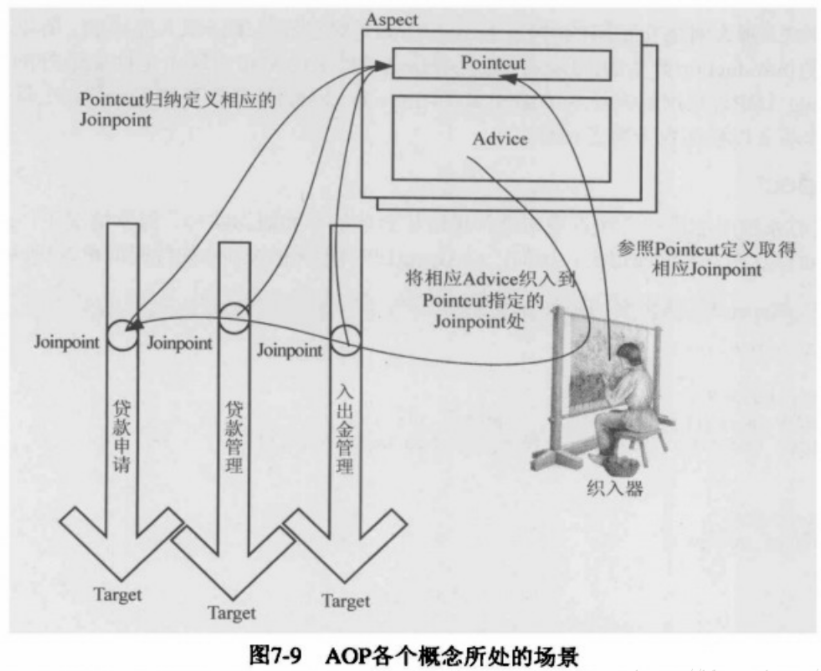
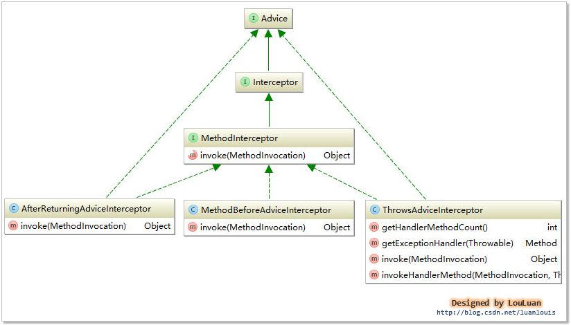
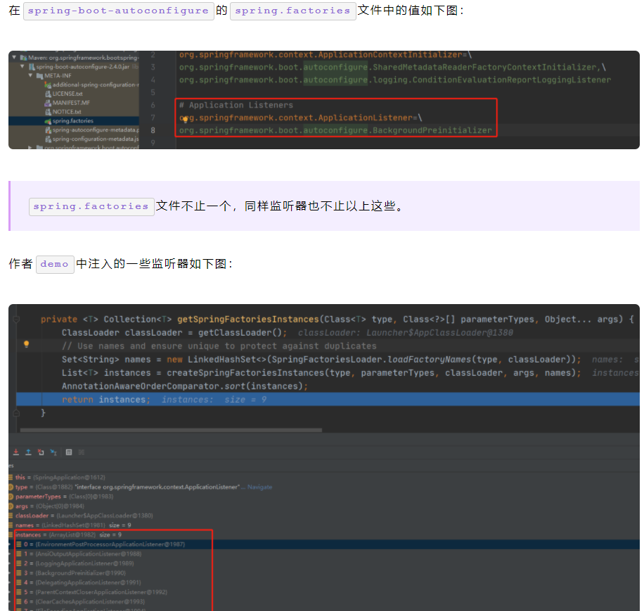

# Spring
## Spring bean的生命周期?

   对于普通的Java对象，当new的时候创建对象，当它没有任何引用的时候被垃圾回收机制回收。而由Spring IoC容器托管的对象，它们的生命周期完全由容器控制。

   Bean 的生命周期概括起来就是 **4 个阶段**：

   1. 实例化（Instantiation）

   	* 实例化Bean 

   2. 属性赋值（Populate）

      * 设置对象属性（依赖注入）

   3. 初始化（Initialization）
   
      * 初始化前
        * 注入Aware接口（通过让bean 实现 Aware 接口，则能在 bean 中获得相应的 Spring 容器资源。）
        * BeanPostProcessor前置处理
      * 初始化操作
         * 是否实现InitializingBean接口（接口实现写初始化逻辑）
         * 是否配置自定义的init-method（指定初始化方法）
   	 * 初始化后
           * BeanPostProcessor后置处理
   4. 销毁（Destruction）
       * 是否实现Disposablebean接口
       * 配置自定义的destroy-method

   

   [参考博客](https://chaycao.github.io/2020/02/15/%E5%A6%82%E4%BD%95%E8%AE%B0%E5%BF%86Spring-Bean%E7%9A%84%E7%94%9F%E5%91%BD%E5%91%A8%E6%9C%9F/)

   [参考博客](https://www.zhihu.com/question/38597960)


## PostConstruct注解 

   用途：@PostConstruct主要应用场景是在初始化Servlet时加载一些缓存数据等。

   PostConstruct 注释用于在**依赖关系注入完成之后**需要执行的方法上，以执行任何初始化。此方法必须在将**类放入服务之前（init方法，初始化**）调用。

   顺序 Constructo（构造方法）>> @Autowired（依赖注入） >> @PostConstruct（生成对象时完成某些初始化操作）

   

   [参考博客](https://www.jianshu.com/p/98cf7d8b9ec3)

   [参考博客](https://blog.csdn.net/wo541075754/article/details/52174900)


## Spring的循环依赖问题 

* **循环依赖**其实就是循环引用，也就是两个或者两个以上的bean互相持有对方，最终形成闭环。比如A依赖于B，B依赖于C，C又依赖于A。

* **Spring中循环依赖场景**有：

  1. 构造器的循环依赖(无法解决，只能拋出BeanCurrentlyInCreationException异常)

  2. field属性的循环依赖

     * setter方式单例，默认方式其中

       先将Bean对象实例化【依赖无参构造函数】--->再设置对象属性的,不会出来循环的问题

     * setter方式原型，prototype

       Spring容器无法完成依赖注入，因为“prototype”作用域的Bean，Spring容器不进行缓存，因此无法提前暴露一个创建中的Bean。

* Spring怎么解决循环依赖

  Spring解决循环依赖的诀窍就在于singletonFactories这个三级cache, 发生在**createBeanInstance(实例化)**之后，也就是说单例对象此时已经被创建出来(调用了构造器)。这个对象已经被生产出来了，虽然还不完美（还没有进行初始化的第二步和第三步），但是已经能被人认出来了（根据对象引用能定位到堆中的对象），所以Spring此时将这个对象提前曝光出来让大家认识，让大家使用。
  
## 问Spring启动过程中发生了什么，聊自己的理解？ 

   Spring 的启动流程主要是定位 -> 加载 -> 注册 -> 实例化

   - *定位 - 获取配置文件路径*

   - *加载 - 把配置文件读取成 BeanDefinition*

   - *注册 - 存储 BeanDefinition*

   - *实例化 - 根据 BeanDefinition 创建实例*

     [参考](https://blog.leapmie.com/archives/390/#2-%E5%AF%BB%E6%89%BE%E5%85%B3%E9%94%AE%E5%85%A5%E5%8F%A3%E6%96%B9%E6%B3%95refresh)

## mybatis #{} ${}的区别

* **#将传入的数据都当成一个字符串**，会对自动传入的数据加一个双引号。

  如：order by #user_id#，如果传入的值是111,那么解析成sql时的值为order by "111", 如果传入的值是id，则解析成的sql为order by "id".
   **$将传入的数据直接显示生成在sql中**。如：order by $user_id$，如果传入的值是111,那么解析成sql时的值为order by user_id, 如果传入的值是id，则解析成的sql为order by id.

* **\#方式能够很大程度防止sql注入。$方式无法防止Sql注入。**

  \#类似jdbc中的PreparedStatement，对于传入的参数，在预处理阶段会使用?代替，比如：

  ```sql
  select * from student where id = ?;
  ```

  待真正查询的时候即在数据库管理系统中（DBMS）才会代入参数。

  ${}则是**简单的替换**，如下：

  ```sql
  select * from student where id = 2;
  ```

## Spring 注入方式，注解，平时xml使用的多么

控制反转（**Inversion of Control**），是一种设计思想，而依赖注入（**DI**)是一种实现的方法。原本对象的创建是依靠程序员来创建，通过依赖注入的方法来改造后，对象的创建是依赖IOC容器,对象的属性依赖IOC容器注入。
**依赖注入：**set注入
**依赖：**Bean对象的创建依赖容器
**注入：**Bean对象所有属性由容器注入

### Set方式注入（Setter Injection）

Setter方法注入实例化bean之后，**调用该bean的setter方法，即实现了基于setter的依赖注入。**

### 构造器注入（Constructor Injection）

构造器依赖注入通过容器触发一个类的构造器来实现的

### 注解方式

@Autowired默认按类型装配
@Qualifier和Autowired配合使用，指定bean的名称
@Resource默认按名称装配，当找不到与名称匹配的bean时，才会按类型装配。

[参考](https://segmentfault.com/a/1190000023309818)


## springmvc过程，注解，具体注解的作用是什么，springboot和spring与springmvc的关系是什么

### SpringMVC过程


**SpringMVC执行流程:**
 1.用户发送请求至前端控制器DispatcherServlet
 2.DispatcherServlet收到请求调用处理器映射器HandlerMapping。
 3.处理器映射器HandlerMapping根据请求url**找到具体的处理器**，生成处理器执行链HandlerExecutionChain(包括处理器对象和处理器拦截器)一并返回给DispatcherServlet。
 4.DispatcherServlet根据处理器Handler获取处理器适配器HandlerAdapter执行HandlerAdapter处理一系列的操作，如：参数封装，数据格式转换，数据验证等操作
 5.执行处理器Handler(Controller，也叫页面控制器)。
 6.Handler执行完成返回ModelAndView
 7.HandlerAdapter将Handler执行结果ModelAndView返回到DispatcherServlet
 8.DispatcherServlet将ModelAndView传给ViewReslover视图解析器
 9.ViewReslover解析后返回具体View
 10.DispatcherServlet对View进行渲染视图（即将模型数据model填充至视图中）。
 11.DispatcherServlet响应用户。

**组件介绍:**

1.DispatcherServlet：前端控制器。用户请求到达前端控制器，它就相当于mvc模式中的c，dispatcherServlet是整个流程控制的中心，由它调用其它组件处理用户的请求，dispatcherServlet的存在降低了组件之间的耦合性,系统扩展性提高。由框架实现
 2.HandlerMapping：处理器映射器。HandlerMapping负责根据用户请求的url找到Handler即处理器，springmvc提供了不同的映射器实现不同的映射方式，根据一定的规则去查找,例如：xml配置方式，实现接口方式，注解方式等。由框架实现
 3.Handler：处理器。Handler 是继DispatcherServlet前端控制器的后端控制器，在DispatcherServlet的控制下Handler对具体的用户请求进行处理。由于Handler涉及到具体的用户业务请求，所以一般情况需要程序员根据业务需求开发Handler。
 4.HandlAdapter：处理器适配器。通过HandlerAdapter对处理器进行执行，这是适配器模式的应用，通过扩展适配器可以对更多类型的处理器进行执行。由框架实现。
 5.ModelAndView是springmvc的封装对象，将model和view封装在一起。
 6.ViewResolver：视图解析器。ViewResolver负责将处理结果生成View视图，ViewResolver首先根据逻辑视图名解析成物理视图名即具体的页面地址，再生成View视图对象，最后对View进行渲染将处理结果通过页面展示给用户。
 7 View:是springmvc的封装对象，是一个接口, springmvc框架提供了很多的View视图类型，包括：jspview，pdfview,jstlView、freemarkerView、pdfView等。一般情况下需要通过页面标签或页面模版技术将模型数据通过页面展示给用户，需要由程序员根据业务需求开发具体的页面。

[参考](https://www.jianshu.com/p/8a20c547e245)

### SpringMVC 具体注解及其作用

#### @Controller

SpringMVC 中，控制器Controller 负责处理由DispatcherServlet 分发的请求，它把用户请求的数据经过业务处理层处理之后封装成一个Model ，然后再把该Model 返回给对应的View 进行展示。在SpringMVC 中提供了一个非常简便的定义Controller 的方法，你无需继承特定的类或实现特定的接口，只需使用@Controller 标记一个类是Controller 

#### @RequestMapping

RequestMapping是一个用来处理请求地址映射的注解，可用于类或方法上。用于类上，表示类中的所有响应请求的方法都是以该地址作为父路径。

#### @Resource和@Autowired

@Resource和@Autowired都是做bean的注入时使用，其实@Resource并不是Spring的注解，它的包是javax.annotation.Resource，需要导入，但是Spring支持该注解的注入。

#### @PathVariable

用于将请求URL中的模板变量映射到功能处理方法的参数上，即取出uri模板中的变量作为参数

#### @ResponseBody

作用： 该注解用于将Controller的方法返回的对象，通过适当的HttpMessageConverter转换为指定格式后，写入到Response对象的body数据区,使用时机：返回的数据不是html标签的页面，而是其他某种格式的数据时（如json、xml等）使用；

```java
 @ResponseBody  
    @RequestMapping("/pay/tenpay")  
    public String tenpayReturnUrl(HttpServletRequest request, HttpServletResponse response) throws Exception {  
        unpackCookie(request, response);  
        payReturnUrl.payReturnUrl(request, response);  
        return "pay/success";  
    }  
```

[参考](https://blog.csdn.net/fuyuwei2015/article/details/71486842)

[参考](https://www.cnblogs.com/leskang/p/5445698.html)

### Springboot和spring与springmvc的关系是什么

Spring 最初利用“工厂模式”（DI）和“代理模式”（AOP）解耦应用组件。

大家觉得挺好用，于是按照这种模式搞了一个 MVC框架（一些用Spring 解耦的组件），用开发 web 应用（ SpringMVC ）。Spring MVC提供了一种轻度耦合的方式来开发web应用。Spring MVC是Spring的一个模块，式一个web框架

然后有发现每次开发都写很多样板代码，为了简化工作流程，于是开发出了一些“懒人整合包”（starter），这套就是 Spring Boot。Spring Boot实现了自动配置


## 简单介绍springIOC容器思想
### （一）IoC是什么
**Ioc—Inversion of Control，即“控制反转”，不是什么技术，而是一种设计思想。**在Java开发中，Ioc意味着将你设计好的对象交给容器控制，而不是传统的在你的对象内部直接控制。如何理解好Ioc呢？理解好Ioc的关键是要明确 **1）谁控制谁，控制什么**，**2）为何是反转**（有反转就应该有正转了），哪些方面反转了”，那我们来深入分析一下：

　　●**谁控制谁，控制什么**：传统Java SE程序设计，我们直接在对象内部通过new进行创建对象，是程序主动去创建依赖对象；而IoC是有专门一个容器来创建这些对象，即由Ioc容器来控制对 象的创建；**谁控制谁？当然是IoC 容器控制了对象；控制什么？那就是主要控制了外部资源获取（不只是对象包括比如文件等）。**

　　●**为何是反转，哪些方面反转了**：有反转就有正转，传统应用程序是由我们自己在对象中主动控制去直接获取依赖对象，也就是正转；而**反转则是由容器来帮忙创建及注入依赖对象；为何是反转？因为由容器帮我们查找及注入依赖对象，对象只是被动的接受依赖对象，所以是反转；哪些方面反转了？依赖对象的获取被反转了。**
  * **IoC对于spring框架（进一步理解)：IoC，对于spring框架来说，就是由spring来负责控制对象的生命周期和对象间的关系。**

    ```java
    举个简单的例子，我们是如何找女朋友的？常见的情况是，我们到处去看哪里有长得漂亮身材又好的mm，然后打听她们的兴趣爱好、qq号、电话号、ip号、iq号………，想办法认识她们，投其所好送其所要，然后嘿嘿……这个过程是复杂深奥的，我们必须自己设计和面对每个环节。传统的程序开发也是如此，在一个对象中，如果要使用另外的对象，就必须得到它（自己new一个，或者从JNDI中查询一个），使用完之后还要将对象销毁（比如Connection等），对象始终会和其他的接口或类藕合起来。
    
    　　那么IoC是如何做的呢？有点像通过婚介找女朋友，在我和女朋友之间引入了一个第三者：婚姻介绍所。婚介管理了很多男男女女的资料，我可以向婚介提出一个列表，告诉它我想找个什么样的女朋友，比如长得像李嘉欣，身材像林熙雷，唱歌像周杰伦，速度像卡洛斯，技术像齐达内之类的，然后婚介就会按照我们的要求，提供一个mm，我们只需要去和她谈恋爱、结婚就行了。简单明了，如果婚介给我们的人选不符合要求，我们就会抛出异常。整个过程不再由我自己控制，而是有婚介这样一个类似容器的机构来控制。
    ```

    **Spring所倡导的开发方式**就是如此，**所有的类都会在spring容器中登记，告诉spring你是个什么东西，你需要什么东西，然后spring会在系统运行到适当的时候，把你要的东西主动给你，同时也把你交给其他需要你的东西。所有的类的创建、销毁都由 spring来控制，也就是说控制对象生存周期的不再是引用它的对象，而是spring。对于某个具体的对象而言，以前是它控制其他对象，现在是所有对象都被spring控制，所以这叫控制反转。**


### （二）IoC能做什么

IoC 不是一种技术，只是一种思想，一个重要的面向对象编程的法则，它能指导我们如何设计出松耦合、更优良的程序。传统应用程序都是由我们在类内部主动创建依赖对象，从而导致类与类之间高耦合，难于测试；有了IoC容器后，把创建和查找依赖对象的控制权交给了容器，由容器进行注入组合对象，所以对象与对象之间是 松散耦合，这样也方便测试，利于功能复用，更重要的是使得程序的整个体系结构变得非常灵活。

　　其实**IoC对编程带来的最大改变不是从代码上，而是从思想上，发生了“主从换位”的变化。应用程序原本是老大，要获取什么资源都是主动出击，但是在IoC/DI思想中，应用程序就变成被动的了，被动的等待IoC容器来创建并注入它所需要的资源了。**

　　**IoC很好的体现了面向对象设计法则之一—— 好莱坞法则：“别找我们，我们找你”；即由IoC容器帮对象找相应的依赖对象并注入，而不是由对象主动去找。**
### (三) DI(依赖注入)

​		**IoC的一个重点是在系统运行中，动态的向某个对象提供它所需要的其他对象。这一点是通过DI（Dependency Injection，依赖注入）来实现的**。比如对象A需要操作数据库，以前我们总是要在A中自己编写代码来获得一个Connection对象，有了 spring我们就只需要告诉spring，**A中需要一个Connection**，至于这个Connection怎么构造，何时构造，A不需要知道。在系统运行时，**spring会在适当的时候制造一个Connection，然后像打针一样，注射到A当中**，这样就完成了对各个对象之间关系的控制。A需要依赖 Connection才能正常运行，而这个**Connection是由spring注入到A中的，依赖注入的名字就这么来的。**那么DI是如何实现的呢？ **Java 1.3之后一个重要特征是反射（reflection），它允许程序在运行的时候动态的生成对象、执行对象的方法、改变对象的属性，spring就是通过反射来实现注入的。**

### (四) IoC和DI

​	**DI—Dependency Injection，即“依赖注入”**：**组件之间依赖关系**由容器在运行期决定，形象的说，即**由容器动态的将某个依赖关系注入到组件之中**。**依赖注入的目的并非为软件系统带来更多功能，而是为了提升组件重用的频率，并为系统搭建一个灵活、可扩展的平台。**通过依赖注入机制，我们只需要通过简单的配置，而无需任何代码就可指定目标需要的资源，完成自身的业务逻辑，而不需要关心具体的资源来自何处，由谁实现。

　　理解DI的关键是：“谁依赖谁，为什么需要依赖，谁注入谁，注入了什么”，那我们来深入分析一下：

　　●**谁依赖于谁：**当然是**应用程序依赖于IoC容器**；

　　●**为什么需要依赖：应用程序需要IoC容器来提供对象需要的外部资源**；

　　●**谁注入谁：**很明显是**IoC容器注入应用程序某个对象，应用程序依赖的对象**；

　　**●注入了什么：**就是**注入某个对象所需要的外部资源（包括对象、资源、常量数据）**。

　　**IoC和DI由什么关系呢？**其实它们是**同一个概念的不同角度描述**，由于**控制反转**概念比较含糊（可能只是理解为**容器控制对象**这一个层面，很难让人想到谁来维护对象关系），所以2004年大师级人物Martin Fowler又给出了一个新的名字：“**依赖注入**”，相对IoC 而言，“**依赖注入”明确描述了“被注入对象依赖IoC容器配置依赖对象”。**

[参考](https://www.cnblogs.com/xdp-gacl/p/4249939.html)

## Spring bean的生命周期（Spring容器控制对象的生命周期）?

### （一）过程描述   

 对于普通的Java对象，当new的时候创建对象，当它没有任何引用的时候被垃圾回收机制回收。而由Spring IoC容器托管的对象，它们的生命周期完全由容器控制。

   Bean 的生命周期概括起来就是 **4 个阶段**：

   1. 实例化（Instantiation）

      * 实例化Bean 

   2. 属性赋值（Populate）

      * 设置对象属性（依赖注入）

   3. 初始化（Initialization）
   
      * 初始化前
        * 注入Aware接口（通过让bean 实现 Aware 接口，则能在 bean 中获得相应的 Spring 容器资源。）
        * BeanPostProcessor前置处理
      * 初始化操作
         * 是否实现InitializingBean接口（接口实现写初始化逻辑）
         * 是否配置自定义的init-method（指定初始化方法）
   	 * 初始化后
           * BeanPostProcessor后置处理
   4. 销毁（Destruction）
       * 是否实现Disposablebean接口
       * 配置自定义的destroy-method

   

   [参考博客](https://chaycao.github.io/2020/02/15/%E5%A6%82%E4%BD%95%E8%AE%B0%E5%BF%86Spring-Bean%E7%9A%84%E7%94%9F%E5%91%BD%E5%91%A8%E6%9C%9F/)

   [参考博客](https://www.zhihu.com/question/38597960)

### （二） 原理分析

#### 1 对应方法doCreate()方法

实例化 -> 属性赋值 -> 初始化 -> 销毁

主要逻辑都在**doCreate()**方法中，逻辑很清晰，就是顺序调用以下三个方法，这三个方法与三个生命周期阶段一一对应，非常重要，在后续扩展接口分析中也会涉及。

1. createBeanInstance() -> 实例化
2. populateBean() -> 属性赋值
3. initializeBean() -> 初始化

    ```java
// 忽略了无关代码
protected Object doCreateBean(final String beanName, final RootBeanDefinition mbd, final @Nullable Object[] args)
      throws BeanCreationException {

   // Instantiate the bean.
   BeanWrapper instanceWrapper = null;
   if (instanceWrapper == null) {
       // 实例化阶段！
      instanceWrapper = createBeanInstance(beanName, mbd, args);
   }

   // Initialize the bean instance.
   Object exposedObject = bean;
   try {
       // 属性赋值阶段！
      populateBean(beanName, mbd, instanceWrapper);
       // 初始化阶段！
      exposedObject = initializeBean(beanName, exposedObject, mbd);
   }

   
   }
   ```

至于销毁，是在容器关闭时调用的，详见`ConfigurableApplicationContext#close()`

#### 2 常用扩展点

#####  第一大类：影响多个Bean的接口

实现了**这些接口的Bean会切入到多个Bean的生命周期中**。正因为如此，这些接口的功能非常强大，Spring内部扩展也经常使用这些接口，例如自动注入以及AOP的实现都和他们有关。

- BeanPostProcessor
- InstantiationAwareBeanPostProcessor

这两兄弟可能是Spring扩展中**最重要**的两个接口！Instantiation（实例化的意思）AwareBeanPostProcessor作用于**实例化**阶段的前后，BeanPostProcessor作用于**初始化**阶段的前后。正好和第一、第三个生命周期阶段对应。通过图能更好理解：

 

**InstantiationAwareBeanPostProcessor实际上继承了BeanPostProcessor接口**，严格意义上来看他们不是两兄弟，而是两父子。但是从**生命周期角度我们重点关注其特有的对实例化阶段**的影响

**InstantiationAwareBeanPostProcessor源码分析：**

- postProcessBeforeInstantiation调用点，忽略无关代码：

```java
@Override
    protected Object createBean(String beanName, RootBeanDefinition mbd, @Nullable Object[] args)
            throws BeanCreationException {

        try {
            // Give BeanPostProcessors a chance to return a proxy instead of the target bean instance.
            // postProcessBeforeInstantiation方法调用点，这里就不跟进了，
            // 有兴趣的同学可以自己看下，就是for循环调用所有的InstantiationAwareBeanPostProcessor
            Object bean = resolveBeforeInstantiation(beanName, mbdToUse);
            if (bean != null) {
                return bean;
            }
        }
        
        try {   
            // 上文提到的doCreateBean方法，可以看到
            // postProcessBeforeInstantiation方法在创建Bean之前调用
            Object beanInstance = doCreateBean(beanName, mbdToUse, args);
            if (logger.isTraceEnabled()) {
                logger.trace("Finished creating instance of bean '" + beanName + "'");
            }
            return beanInstance;
        }
        
    }

```

**postProcessBeforeInstantiation在doCreateBean之前调用**，也就是在bean实例化之前调用的，英文源码注释解释道该方法的**返回值会替换原本的Bean作为代理，这也是Aop等功能实现的关键点。**

- postProcessAfterInstantiation调用点，忽略无关代码：

  ```java
  protected void populateBean(String beanName, RootBeanDefinition mbd, @Nullable BeanWrapper bw) {
  
     // Give any InstantiationAwareBeanPostProcessors the opportunity to modify the
     // state of the bean before properties are set. This can be used, for example,
     // to support styles of field injection.
     boolean continueWithPropertyPopulation = true;
      // InstantiationAwareBeanPostProcessor#postProcessAfterInstantiation()
      // 方法作为属性赋值的前置检查条件，在属性赋值之前执行，能够影响是否进行属性赋值！
     if (!mbd.isSynthetic() && hasInstantiationAwareBeanPostProcessors()) {
        for (BeanPostProcessor bp : getBeanPostProcessors()) {
           if (bp instanceof InstantiationAwareBeanPostProcessor) {
              InstantiationAwareBeanPostProcessor ibp = (InstantiationAwareBeanPostProcessor) bp;
              if (!ibp.postProcessAfterInstantiation(bw.getWrappedInstance(), beanName)) {
                 continueWithPropertyPopulation = false;
                 break;
              }
           }
        }
     }
  
     // 忽略后续的属性赋值操作代码
  }
  ```

  **可以看到该方法在属性赋值方法内，但是在真正执行赋值操作之前。其返回值为boolean，返回false时可以阻断属性赋值阶段**（`continueWithPropertyPopulation = false;`）。

  plus: BeanPostProcessor执行阶段的源码穿插在下文Aware接口的调用时机分析中,记住**BeanPostProcessor在初始化前后调用就可以了**

##### 第二大类：只调用一次的接口

第二大类中又可以分为两类：

1. Aware类型的接口

2. 生命周期接口

* **无所不知的Aware(Aware类型的接口)**

     Aware类型的接口的作用就是让我们能够拿到Spring容器中的一些资源。**基本都能够见名知意，Aware之前的名字就是可以拿到什么资源**，例如`BeanNameAware`可以拿到BeanName，以此类推。调用时机需要注意：所有的Aware方法都是在**初始化阶段之前调用**的！

  Aware接口具体可以分为两组

  * Aware Group1
    1. BeanNameAware
    2. BeanClassLoaderAware
    3. BeanFactoryAware

  * Aware Group2

    1. EnvironmentAware

    2. EmbeddedValueResolverAware 这个知道的人可能不多，实现该接口能够获取Spring EL解析器，用户的自定义注解需要支持spel表达式的时候可以使用，非常方便。

    3. ApplicationContextAware(ResourceLoaderAware\ApplicationEventPublisherAware\MessageSourceAware) 这几个接口可能让人有点懵，实际上这几个接口可以一起记，其返回值**实质上都是当前的ApplicationContext对象**，因为ApplicationContext是一个复合接口。

* ##### Aware调用时机源码分析

  详情如下，忽略了部分无关代码。代码位置就是我们上文提到的**initializeBean方法（初始化）**详情，这也说明了Aware都是在初始化阶段之前调用的！

  ```java
     // 见名知意，初始化阶段调用的方法
      protected Object initializeBean(final String beanName, final Object bean, @Nullable RootBeanDefinition mbd) {
  
          // 这里调用的是Group1中的三个Bean开头的Aware
          invokeAwareMethods(beanName, bean);
  
          Object wrappedBean = bean;
          
          // 这里调用的是Group2中的几个Aware，
          // 而实质上这里就是前面所说的BeanPostProcessor的调用点！
          // 也就是说与Group1中的Aware不同，这里是通过BeanPostProcessor（ApplicationContextAwareProcessor）实现的。
          wrappedBean = applyBeanPostProcessorsBeforeInitialization(wrappedBean, beanName);
          // 下文即将介绍的InitializingBean调用点
          invokeInitMethods(beanName, wrappedBean, mbd);
          // BeanPostProcessor的另一个调用点
          wrappedBean = applyBeanPostProcessorsAfterInitialization(wrappedBean, beanName);
  
          return wrappedBean;
      }
  ```

  可以看到并不是所有的Aware接口都使用同样的方式调用。

  * Bean××Aware都是在代码中直接调用的
  * 而ApplicationContext相关的Aware都是通过BeanPostProcessor#postProcessBeforeInitialization()实现的。感兴趣的可以自己看一下ApplicationContextAwareProcessor这个类的源码，就是判断当前创建的Bean是否实现了相关的Aware方法，如果实现了会调用回调方法将资源传递给Bean。

  BeanPostProcessor的调用时机也能在这里体现，包围住invokeInitMethods方法，也就说明了在初始化阶段的前后执行。

  **关于Aware接口的执行顺序，其实只需要记住第一组在第二组执行之前就行了。**

* ##### 简单的两个生命周期接口

  * InitializingBean 对应生命周期的初始化阶段，在上面源码的`invokeInitMethods(beanName, wrappedBean, mbd);`方法中调用。
     有一点需要注意，因为Aware方法都是执行在初始化方法之前，**所以可以在初始化方法中放心大胆的使用Aware接口获取的资源，这也是我们自定义扩展Spring的常用方式。**

  * DisposableBean 类似于InitializingBean，对应生命周期的销毁阶段，以ConfigurableApplicationContext#close()方法作为入口，实现是通过循环取所有实现了**DisposableBean接口的Bean然后调用其destroy()方法 。**

##### 补充: BeanPostProcessor 注册时机与执行顺序
**注册时机**

我们知道BeanPostProcessor也会注册为Bean，那么Spring是如何保证BeanPostProcessor在我们的业务Bean之前初始化完成呢？

**refresh方法（SpringIOC容器启动的入口）**

```java
@Override
    public void refresh() throws BeansException, IllegalStateException {
        synchronized (this.startupShutdownMonitor) {

            try {
                // Allows post-processing of the bean factory in context subclasses.
                postProcessBeanFactory(beanFactory);

                // Invoke factory processors registered as beans in the context.
                invokeBeanFactoryPostProcessors(beanFactory);

                // Register bean processors that intercept bean creation.
                // 所有BeanPostProcesser初始化的调用点
                registerBeanPostProcessors(beanFactory);

                // Initialize message source for this context.
                initMessageSource();

                // Initialize event multicaster for this context.
                initApplicationEventMulticaster();

                // Initialize other special beans in specific context subclasses.
                onRefresh();

                // Check for listener beans and register them.
                registerListeners();

                // Instantiate all remaining (non-lazy-init) singletons.
                // 所有单例非懒加载Bean的调用点
                finishBeanFactoryInitialization(beanFactory);

                // Last step: publish corresponding event.
                finishRefresh();
            }

    }
```

可以看出，Spring是先执行registerBeanPostProcessors()进行BeanPostProcessors的注册，然后再执行finishBeanFactoryInitialization初始化我们的单例非懒加载的Bean。

[参考](https://www.jianshu.com/p/1dec08d290c1)


##  ApplicationContext 和 BeanFactory 的关系(Spring的容器)

Spring中的容器类可以分为两大类。

- **一类是由BeanFactory接口定义的核心容器**。BeanFactory位于整个容器类体系结构的顶端,其基本实现类为DefaultListableBeanFactory。之所以称其为核心容器,是因为该类**容器实现IOC的核心功能**:

  - 比如配置文件的加载解析
  - Bean依赖的注入
  - 生命周期的管理等

  BeanFactory作为Spring框架的基础设施,面向Spring框架本身,一般不会被用户直接使用。

- **另一类则是由ApplicationContext接口定义的容器,**通常译为应用上下文,不过称其为应用容器可能更形象些。它在BeanFactory提供的核心IOC功能之上作了扩展。通常ApplicationContext的实现类内部都持有一个BeanFactory的实例,IOC容器的核心功能会交由它去完成。而**ApplicationContext本身,则专注于在应用层对BeanFactory作扩展：**

  - 比如提供对国际化的支持
  - 支持框架级的事件监听机制
  - 增加了很多对应用环境的适配等。

  ApplicationContext面向的是使用Spring框架的开发者。开发中经常使用的ClassPathXmlApplicationContext就是典型的Spring的应用容器。

 

### BeanFactory

 

### ApplicationContext

 `ClassPathXmlApplicationContext` 和 `AnnotationConfigApplicationContext` 的继承树如下所示。两者都继承自 `AbstractApplicationContext`。


[参考](https://www.cnblogs.com/takumicx/p/9757492.html)

### 二者区别

1**.BeanFactroy采用的是延迟加载形式来注入Bean的**，即只有在使用到某个Bean时(调用getBean())，才对该Bean进行加载实例化，这样，我们就不能发现一些存在的Spring的配置问题。而ApplicationContext则相反，它是在容器启动时，一次性创建了所有的Bean。这样，在容器启动时，我们就可以发现Spring中存在的配置错误。 相对于基本的BeanFactory，ApplicationContext 唯一的不足是占用内存空间。当应用程序配置Bean较多时，程序启动较慢。

BeanFacotry延迟加载,如果Bean的某一个属性没有注入，BeanFacotry加载后，直至第一次使用调用getBean方法才会抛出异常；而**ApplicationContext则在初始化自身是检验，这样有利于检查所依赖属性是否注入；所以通常情况下我们选择使用 ApplicationContext。**
应用上下文则会在上下文启动后预载入所有的单实例Bean。通过预载入单实例bean ,确保当你需要的时候，你就不用等待，因为它们已经创建好了。

2.BeanFactory和ApplicationContext都支持BeanPostProcessor、BeanFactoryPostProcessor的使用，但两者之间的区别是：BeanFactory需要手动注册，而ApplicationContext则是自动注册。（Applicationcontext比 beanFactory 加入了一些更好使用的功能。而且 beanFactory 的许多功能需要通过编程实现而 Applicationcontext 可以通过配置实现。比如后处理 bean ， Applicationcontext 直接配置在配置文件即可而 beanFactory 这要在代码中显示的写出来才可以被容器识别。 ）

3.beanFactory主要是面对与 spring 框架的基础设施，面对 spring 自己。而 Applicationcontex 主要面对与 spring 使用的开发者。基本都会使用 Applicationcontex 并非 beanFactory 。

[参考(https://www.cnblogs.com/xiaoxi/p/5846416.html)

## Spring IOC 容器启动流程分析

### 0 简单回答


第一步读取bean配置信息

第二步根据bean注册表实例化Bean

第三步将Bean实例放到容器中

第四步使用Bean


**容器启动过程中常用的三个容器类**

- AbstractApplicationContext
  * ApplicationContext接口的抽象实现类
  * 能够自动检测并注册各种后置处理器(PostProcessor)和事件监听器(Listener)
  * 以模板方法模式定义了一些容器的通用方法,比如**启动容器的真正方法refresh()就是在该类中定义的。**
- AbstractRefreshableApplicationContext
  - 继承AbstractApplicationContext的抽象类。
  - **内部持有一个DefaultListableBeanFactory 的实例,**使得继承AbstractRefreshableApplicationContext的Spring的应用容器内部默认有一个Spring的核心容器,那么Spring容器的一些核心功能就可以**委托给内部的核心容器**去完成。
  - AbstractRefreshableApplicationContext在内部定义了**创建,销毁以及刷新核心容器**BeanFactory的方法。
- ClassPathXmlApplicationContext
  * 最常用的Spring的应用容器之一。在启动时会加载类路径下的xml文件作为容器的配置信息。

启动Spring容器,本质上是创建并初始化一个具体的容器类的过程,以常见的容器类**ClassPathXmlApplicationContext为**例,启动一个Spring容器可以用以下代码表示

```java
ClassPathXmlApplicationContext ctx = new ClassPathXmlApplicationContext("applicationContext.xml");
```

进入ClassPathXmlApplicationContext的构造方法,首先调用了**重载构造函数**

```java
/**
 * Create a new ClassPathXmlApplicationContext, loading the definitions
 * from the given XML file and automatically refreshing the context.
 * @param configLocation resource location
 * @throws BeansException if context creation failed
 */
public ClassPathXmlApplicationContext(String configLocation) throws BeansException {
   this(new String[] {configLocation}, true, null);
}
```

这里有两点需要注意下 (构造函数的三个参数 ):

- 1.创建ClassPathXmlApplicationContext时需要指定**xml文件的路径**作为参数,尽管我们在创建时只指定了一个,但其实可以同时指定多个。

- 2.Spring容器**有父子容器**的概念,通过HierarchicalBeanFactory接口定义了具有层级关系的容器体系。而在抽象实现类AbstractApplicationContext类的内部,有一个表示父容器的成员变量

  ```java
  /** Parent context */
  private ApplicationContext parent;
  ```

* 3.表示要创建的ClassPathXmlApplicationContext的**父容器**,不过这里只需要设置为null。关于Spring的父子容器,还有一些独特的访问规则,子容器可以访问父容器中的Bean,父容器不可以访问子容器中的Bean。

继续跟进源码

```java
//设置父容器
super(parent);
//设置xml文件的路径参数
setConfigLocations(configLocations);
if (refresh) { //默认为true
    //启动Spring容器
    refresh();
}
```

设置完父容器和xml文件的路径信息后,终于看到了**refresh()方法,这是真正启动Spring容器的方法**

###  1.启动容器的真正入口refresh()

* **refresh()**是定义在**AbstractApplicationContext类中的模板方法**,**定义了容器启动的基本流程**,并留下钩子方法供子类进行扩展。
* 启动容器的方法之所以用refresh(刷新)来命名,是为了形象的表达**容器可以被重启**这层含义。
* 为了防止并发环境下多个线程同时启动IOC容器,整个过程使用**同步代码块来进行同步**。

refresh方法每步加了注释

**重点研究refresh的内容**

*  prepareRefresh();	(refresh的开头) 容器启动前准备工作
* obtainFreshBeanFactory(); ，这一步是把配置文件解析成一个个Bean，并且注册到BeanFactory
* finishBeanFactoryInitialization(beanFactory);初始化所有的 singleton beans（单例bean），懒加载（non-lazy-init）的除外

```java
@Override
public void refresh() throws BeansException, IllegalStateException {
   //首先是一个synchronized加锁，当然要加锁，不然你先调一次refresh()然后这次还没处理完又调一次，就会乱套了； 
   synchronized (this.startupShutdownMonitor) {
      // Prepare this context for refreshing. 容器启动前准备工作
      //接着往下看prepareRefresh();这个方法是做准备工作的，记录容器的启动时间、标记“已启动”状态、处理配置文件中的占位符 
      prepareRefresh();

      // Tell the subclass to refresh the internal bean factory.
      //这个就很重要了，这一步是把配置文件解析成一个个Bean，并且注册到BeanFactory中，注意这里只是注册进去，并没有初始化。
      ConfigurableListableBeanFactory beanFactory = obtainFreshBeanFactory();

      // Prepare the bean factory for use in this context.
      //设置 BeanFactory 的类加载器，添加几个 BeanPostProcessor，手动注册几个特殊的 bean，这里都是spring里面的特殊处理 
      prepareBeanFactory(beanFactory);

      try {
         // Allows post-processing of the bean factory in context subclasses.
         //提供给子类的扩展点，到这里的时候，所有的 Bean 都加载、注册完成了，但是都还没有初始化，具体的子类可以在这步的时候添加一些特殊的 BeanFactoryPostProcessor 的实现类，来完成一些其他的操作。
         postProcessBeanFactory(beanFactory);

         // Invoke factory processors registered as beans in the context.
         //是调用 BeanFactoryPostProcessor 各个实现类的 postProcessBeanFactory(factory)方法  
         invokeBeanFactoryPostProcessors(beanFactory);

         // Register bean processors that intercept bean creation.
         //这个方法调用的其实是PostProcessorRegistrationDelegate类的registerBeanPostProcessors方法；这个类里面有个内部类BeanPostProcessorChecker，BeanPostProcessorChecker里面有两个方法postProcessBeforeInitialization和postProcessAfterInitialization，这两个方法分别在 Bean 初始化之前和初始化之后得到执行
         registerBeanPostProcessors(beanFactory);
		 //方法是初始化当前 ApplicationContext 的 MessageSource，国际化处理，继续往下	
         // Initialize message source for this context.
         initMessageSource();

         // Initialize event multicaster for this context.
         //方法初始化当前 ApplicationContext 的事件广播器继续往下 
         initApplicationEventMulticaster();

         // Initialize other special beans in specific context subclasses.
         //方法初始化一些特殊的 Bean（在初始化 singleton beans 之前）；继续往下 
         onRefresh();

         // Check for listener beans and register them.
         //注册事件监听器，监听器需要实现 ApplicationListener 接口；继续往下 
         registerListeners();
		
          //初始化所有的 singleton beans（单例bean），懒加载（non-lazy-init）的除外
         // Instantiate all remaining (non-lazy-init) singletons.(初始化Bean的入口)
         finishBeanFactoryInitialization(beanFactory);

         // Last step: publish corresponding event.
         //广播事件，ApplicationContext 初始化完成 
         finishRefresh();
      }

      catch (BeansException ex) {
         if (logger.isWarnEnabled()) {
            logger.warn("Exception encountered during context initialization - " +
                  "cancelling refresh attempt: " + ex);
         }

         // Destroy already created singletons to avoid dangling resources.
         destroyBeans();

         // Reset 'active' flag.
         cancelRefresh(ex);

         // Propagate exception to caller.
         throw ex;
      }

      finally {
         // Reset common introspection caches in Spring's core, since we
         // might not ever need metadata for singleton beans anymore...
         resetCommonCaches();
      }
   }
}

```

### 2 容器启动流程的不同阶段


### 3 容器启动前的准备工作（refresh的start）

容器启动前的准备工作定义在下面的方法中

```java
//主要是对容器状态进行标记,初始化环境变量信息并对必要的环境变量进行校验。
prepareRefresh();
```
进去一探究竟

```java
/**
 * Prepare this context for refreshing, setting its startup date and
 * active flag as well as performing any initialization of property sources.
 */
protected void prepareRefresh() {
    //记录容器的启动时间
    this.startupDate = System.currentTimeMillis();
    //将容器的关闭标志置位false
    this.closed.set(false);
    //将容器的启动标记置位true
    this.active.set(true);

    if (logger.isInfoEnabled()) {
        logger.info("Refreshing " + this);
    }

    // Initialize any placeholder property sources in the context environment
    //空实现的钩子方法,供子类重写
    initPropertySources();

    // Validate that all properties marked as required are resolvable
    // see ConfigurablePropertyResolver#setRequiredProperties
    //对必须的系统环境变量进行校验,如果不存在将抛出异常
    getEnvironment().validateRequiredProperties();

    // Allow for the collection of early ApplicationEvents,
    // to be published once the multicaster is available...
    this.earlyApplicationEvents = new LinkedHashSet<ApplicationEvent>();
}
```

* 首先记录了容器的启动时间和对容器的状态进行了标记。

* 之后来到了容器为用户提供的第一个扩展点:**initPropertySources();**

  ```java
  protected void initPropertySources() {
     // For subclasses: do nothing by default.
  }
  
  ```

  这是一个默认空实现的钩子方法,用户在自定义IOC容器时可以重写,完成一些环境变量属性的初始化工作。

* 之后会对一些必要的环境变量信息进行校验

  ```java
  getEnvironment().validateRequiredProperties();
  ```

    如果必须的环境变量信息不存在,则会抛出异常

   ```java
  @Override
  public void validateRequiredProperties() {
     MissingRequiredPropertiesException ex = new MissingRequiredPropertiesException(); //异常信息集合
     for (String key : this.requiredProperties) {
        if (this.getProperty(key) == null) {
           ex.addMissingRequiredProperty(key); //加入异常信息
        }
     }
     if (!ex.getMissingRequiredProperties().isEmpty()) {
        throw ex;  //抛出异常信息集合
     }
  }
   ```

  [参考](https://www.cnblogs.com/takumicx/p/9757492.html)

### 4  配置文件解析成一个个Bean，并且注册到BeanFactory中

ConfigurableListableBeanFactory beanFactory = obtainFreshBeanFactory()： 作用是把配置文件解析成一个个Bean，并且注册到BeanFactory中


* 这个方法中第一步**refreshBeanFactory():**方法的作用是关闭旧的 BeanFactory (如果有)，创建新的 BeanFactory，加载 Bean 定义、注册 Bean 等。
* 然后**getBeanFactory()**: 就是返回刚刚创建的 BeanFactory，

#### **4.1 refreshBeanFactory():**

* 我们进入**refreshBeanFactory();**方法，在AbstractRefreshableApplicationContext类中

* 这个refreshBeanFactory()方法首先如果 ApplicationContext 中已经加载过 BeanFactory了，销毁所有 Bean，关闭 BeanFactory；这里指的是当前ApplicationContext 是否有 BeanFactory。

* 然后createBeanFactory();初始化一个DefaultListableBeanFactory，这个DefaultListableBeanFactory是很重的一个类，为什么重要呢？可以看文章开头的BeanFactory继承图，DefaultListableBeanFactory是位于最下面的，他往上能走完BeanFactory继承图所有，所以他可以说是**功能最大的BeanFactory。**

* beanFactory.setSerializationId(getId());方法用于 BeanFactory 的序列化

* **customizeBeanFactory(beanFactory);方法设置 BeanFactory 的两个配置属性：是否允许 Bean 覆盖、是否允许循环引用**

* **loadBeanDefinitions(beanFactory);这个方法很重要：加载 Bean 到 BeanFactory 中**

  

  * loadBeanDefinitions(beanFactory) 方法，这个方法将根据配置，加载各个 Bean，然后放到 BeanFactory 中。先贴上源码：AbstractXmlApplicationContext类中

    

    * 重点看**loadBeanDefinitions(beanDefinitionReader);**

      

      * 可以看到2个**reader.loadBeanDefinitions()**

        AbstractBeanDefinitionReader类中：

        这个方法里面，for循环每一个文件是一个resource，最终返回 counter，表示总共加载了多少的 BeanDefinition。

        

        * 进入**loadBeanDefinitions(resource);方法**

          XmlBeanDefinitionReader类中的：

          

          * **doLoadBeanDefinitions(inputSource, encodedResource.getResource());**继续进源码：

            最后......

            **是真正的解析xml parseBeanDefinitions(root, this.delegate)，Bean容器就已经算是初始化完成.**

            **将bean定义信息解析为BeanDefinition类，不管bean信息是定义在xml中，还是通过@Bean注解标注，都能通过不同的BeanDefinitionReader转为BeanDefinition类。**

            [参考](https://www.jianshu.com/p/a0b553529fb9)

### 5  初始化bean的入口

**前提**

整个IOC容器的启动过程都包含在容器抽象类`AbstractApplicationContext`的模板方法`refresh()`中
在这之前已经创建了核心容器BeanFactory,完成了bean定义信息的加载解析和注册,对于用户定义的每一个bean,创建一个对应的BeanDefinition,**以beanName为key,Definition为value保存在核心容器beanFactory的map中。**

**Now**

这个时候还没有真正创建Bean,而是创建了一个Bean的设计图——BeanDefinition,之后可以根据这个BeanDefinition创建真正的Bean实例。完成核心容器的创建后,还会注册一些容器的基础组件,之后才会来到启动容器最重要的阶段——初始化bean的阶段,这部分的入口在refresh方法中里`finishBeanFactoryInitialization(beanFactory)`方法中


进入finishBeanFactoryInitialization(beanFactory)方法,在真正**进行初始化动作前还会有一些准备工作**（不重要）


* 容器提前初始化了两类特殊的bean
  * **一类是ConversionService**,可以进行属性值的转化,比如将前端传过来的特定格式的时间字符串转化为Date对象,功能和PropertyEditor类似;
  * **另一类则是实现了LoadTimeWeaverAware接口的Bean**,这部分和Spring中的LTW(LoadTimeWeaving)相关,尽管也是AOP,但并不是Spring AOP中的默认实现。初始化时通过调用BeanFactory的getBean(..)方法实现的,这个方法其实才是初始化bean的真正入口,不过后面还会碰到,这里就跳过。

* **进入箭头所指的方法**,从方法名可以得知,下面这部分还是属于准备阶段的次要内容

  * 这里会拿到之前注册的所有BeanDefinition
  * 进行初始化的条件判断,**如果Bean被设置为单例(scope=singleton)且非懒加载(lazy-init=false)**则会开始真正的初始化流程
    * 如果这其中任一条件不满足,则在容器启动的过程中是不会初始化这个bean的。
    * 如果满足，之后的处理逻辑根据bean是否为FactoryBean类型而有所不同,但最后多会调用**getBean()方法,这个方法其实才是初始化bean的真正的入口方法。**

  ```java
  //获取所有BeanDefinition的beanName
  List<String> beanNames = new ArrayList<>(this.beanDefinitionNames);
  
  // Trigger initialization of all non-lazy singleton beans...
  //遍历所有beanName
  for (String beanName : beanNames) {
     RootBeanDefinition bd = getMergedLocalBeanDefinition(beanName);
  
     //如果bean不是抽象的且单例且非懒加载则通过if条件
     if (!bd.isAbstract() && bd.isSingleton() && !bd.isLazyInit()) {
  
        if (isFactoryBean(beanName)) {
           //如果是实现FactoryBean接口的bean
           Object bean = getBean(FACTORY_BEAN_PREFIX + beanName);
           if (bean instanceof FactoryBean) {
              final FactoryBean<?> factory = (FactoryBean<?>) bean;
              boolean isEagerInit;
              if (System.getSecurityManager() != null && factory instanceof SmartFactoryBean) {
                 isEagerInit = AccessController.doPrivileged((PrivilegedAction<Boolean>)
                             ((SmartFactoryBean<?>) factory)::isEagerInit,
                       getAccessControlContext());
              }
              else {
                 isEagerInit = (factory instanceof SmartFactoryBean &&
                       ((SmartFactoryBean<?>) factory).isEagerInit());
              }
              if (isEagerInit) {
                 //初始化bean的真正入口
                 getBean(beanName);
              }
           }
        }
        else {
           //不是FactoryBean则执行这里,这是初始化bean的真正入口
           getBean(beanName);
        }
     }
  }
  ```

###  6 尝试从当前容器及其父容器的缓存中获取bean

getBean()方法,这个方法其实才是初始化bean的真正的入口方法。

```java
@Override
public Object getBean(String name) throws BeansException {
   return doGetBean(name, null, null, false);
}
```

这其实是一个相当通用的方法,它的真正含义其实是供客户端从容器中获取bean,若客户端想要的bean不存在,容器当然会创建并初始化它,**但bean可能已经创建好并缓存在容器中,那么直接把缓存的对象返回给客户端就好,所以这个方法的前缀是get而不是create。**

进入内部的doGetBean()方法

#### 6.1 获取真正的beanName

这是transformedBeanName(name)做的工作

```java
//对原始的beanName进行转化,获取真实的beanName,如果是FactoryBean则去除前缀'&',如果是别名则通过
//别名获取真实的名称
final String beanName = transformedBeanName(name);
Object bean;
```

#### 6.2  尝试从当前容器的缓存中获取bean

```java
// 从缓存中获取bean若全局缓存中不存在则从其ObjectFactory中获取,若ObjectFactory不存在则返回null
Object sharedInstance = getSingleton(beanName);
```

**getSingleton(beanName)和spring解决bean循环依赖的方式有关。**

详细看**getSingleton(beanName)**

```java
@Nullable
protected Object getSingleton(String beanName, boolean allowEarlyReference) {

   //先尝试从singletonObjects这个缓存map中获取,这是个全局的缓存,里面存放着真正创建完成的bean
   //单例的bean只会被创建一次,之后便会缓存在这个map中供客户端重复获取
   Object singletonObject = this.singletonObjects.get(beanName);
   //如果缓存中不存在该name的bean且该bean正在创建过程中
   if (singletonObject == null && isSingletonCurrentlyInCreation(beanName)) {
      //同步
      synchronized (this.singletonObjects) {
         //尝试从earlySingletonObjects这个缓存map中获取bean,这个map中的bean并未真正创建完成
         //但是提前暴露出来用来解决依赖问题

         singletonObject = this.earlySingletonObjects.get(beanName);
         if (singletonObject == null && allowEarlyReference) {
            //若依旧未获取到则从singletonFactories这个map中获取其工厂
            ObjectFactory<?> singletonFactory = this.singletonFactories.get(beanName);
            if (singletonFactory != null) {
               //成功获取该bean的工厂实例
               //调用工厂方法获取bean
               singletonObject = singletonFactory.getObject();
               //将该bean加入earlySingletonObjects这个map中
               this.earlySingletonObjects.put(beanName, singletonObject);
               //将创建该bean的工厂从singletonFactories中移除
               this.singletonFactories.remove(beanName);
            }
         }
      }
   }
   return singletonObject;
}
```

从缓存中获取bean的流程并不复杂,但是因为涉及到**3个Map,**所以逻辑有点绕。

* **全局缓存singletonObjects**

  ```java
  /**
   * Cache of singleton objects: bean name to bean instance.
   */
  private final Map<String, Object> singletonObjects = new ConcurrentHashMap<>(256);
  ```

  这个map用来缓存真正创建完成的bean,真正创建完成是指对象存在且所有属性/依赖已经注入且所有初始化操作已经完成。

* **提前暴露bean的缓存earlySingletonObjects**

  ```java
  /**
   * Cache of early singleton objects: bean name to bean instance.
   */
  private final Map<String, Object> earlySingletonObjects = new HashMap<>(16);
  ```
  这个map中的bean并未真正创建完成,但是提前放在这个map中暴露出来,主要是为了解决循环依赖问题。
  
* **bean工厂缓存singletonFactories**

  ```java
  /**
   * Cache of singleton factories: bean name to ObjectFactory.
   */
  private final Map<String, ObjectFactory<?>> singletonFactories = new HashMap<>(16);
  ```

  这个map中缓存的是用来**获取bean的工厂ObjectFactopry,**这个工厂中有一个刚创建完成但是未注入属性也未进行初始化的bean,当从工厂中取出这个bean后,该bean会缓存到earlySingletonObjects这个map中,并且对应的工厂会从singletonFactories移除。

  **3个Map和Spring解决bean之间的循环依赖的思路有关:**

  * **Spring在创建Bean A时**如果发现A依赖于B会先去创建B,这个发现的时机其实是在为A注入属性时,此时bean A其实已经被创建,但是还未进行任何属性赋值和初始化操作,此时会将这个原始的bean A封装在一个ObjectFactory工厂中,保存在singletonFactories缓存
  * **之后在创建B**的过程中如果又需要创建A则会从缓存中获取A的工厂,调用其getObject()方法获取其实例,并将实例对象A放入earlySingletonObjects这个缓存中,之后将对应的ObjectFactory从singletonFactories中移除。

  **因而`getSingleton()`的逻辑就是根据beanName先从全局缓存中查找bean,没找到再从工厂缓存查找其工厂,找到就从工厂中取出,没找到上的话则返回null。**

  ```java
  // 从缓存中获取bean若缓存中不存在则从其ObjectFactory中获取,若ObjectFactory不存在则返回null
  Object sharedInstance = getSingleton(beanName);
  ```

#### 6.3  从父容器中查找bean

这里我们假设之前没有从当前容器的缓存中找到bean,这样比较符合初始化语境。这时候sharedInstance为null,接着会**尝试从当前容器的父容器中去获取**

逻辑可以简化为:获取当前容器的父容器并递归调用getBean()方法进行查找

```java
// Check if bean definition exists in this factory.
//获取父容器,尝试从父容器中获取
BeanFactory parentBeanFactory = getParentBeanFactory();
if (parentBeanFactory != null && !containsBeanDefinition(beanName)) {
   // Not found -> check parent.
   String nameToLookup = originalBeanName(name);
   if (parentBeanFactory instanceof AbstractBeanFactory) {
      //递归从父容器中获取想要的bean
      return ((AbstractBeanFactory) parentBeanFactory).doGetBean(
            nameToLookup, requiredType, args, typeCheckOnly);
   }
   else if (args != null) {
      // Delegation to parent with explicit args.
      return (T) parentBeanFactory.getBean(nameToLookup, args);
   }
   else if (requiredType != null) {
      // No args -> delegate to standard getBean method.
      return parentBeanFactory.getBean(nameToLookup, requiredType);
   }
   else {
      return (T) parentBeanFactory.getBean(nameToLookup);
   }
}

if (!typeCheckOnly) {
   markBeanAsCreated(beanName);
}
```

#### 6.4  解析bean的依赖

* 这里有解析bean依赖的操作,只是为了**保证当前bean的所有依赖bean已经初始化完毕。**

* 真正开始解析bean之间的依赖关系其实是在后面为bean注入属性时,当发现bean A依赖于bean B时,**会暂停A的属性注入和初始化操作转而去创建B。**

  ```java
  // Guarantee initialization of beans that the current bean depends on.
  //保证该bean所有依赖的bean已经初始化完毕
  String[] dependsOn = mbd.getDependsOn();
  if (dependsOn != null) {
     for (String dep : dependsOn) {
        if (isDependent(beanName, dep)) {
           throw new BeanCreationException(mbd.getResourceDescription(), beanName,
                 "Circular depends-on relationship between '" + beanName + "' and '" + dep + "'");
        }
        //记录与当前bean有关的依赖关系
        registerDependentBean(dep, beanName);
        try {
           //先尝试获取该bean所依赖的bean
           getBean(dep);
        }
        catch (NoSuchBeanDefinitionException ex) {
           throw new BeanCreationException(mbd.getResourceDescription(), beanName,
                 "'" + beanName + "' depends on missing bean '" + dep + "'", ex);
        }
     }
  }
  ```

#### 6.5 再一次尝试从缓存中获取（即将创建Bean了）

**再一次调用了getSingleton()方法,**不过这次传递了一个**实现ObjectFactory接口的匿名内部类**(lambda语法简化),

```java
// Create bean instance.
if (mbd.isSingleton()) {
   //走到这里说明bean的定义是单实例的

   //尝试从全局缓存中获取bean,若没获取到则通过BeanDefinition信息创建bean,并清理相关缓存
   sharedInstance = getSingleton(beanName, () -> {
      try {
         return createBean(beanName, mbd, args);
      }
      catch (BeansException ex) {
         // Explicitly remove instance from singleton cache: It might have been put there
         // eagerly by the creation process, to allow for circular reference resolution.
         // Also remove any beans that received a temporary reference to the bean.
         destroySingleton(beanName);
         throw ex;
      }
   });
   //从FactoryBean中获取真正的bean实例
   bean = getObjectForBeanInstance(sharedInstance, name, beanName, mbd);
}
```

* **调用getSingleton()方法**

  - 首先还是会尝试从全局缓存中获取bean
  - 如果不存在**才会调用工厂的getObject()方法去创建该bean,这个匿名内部类的getObject()方法又调用了createBean()**方法,这个方法定义在`AbstractBeanFactory`这个抽象工厂类中,不过具体实现在其子类`AbstractAutowireCapableBeanFactory`,这个类中的createBean()才是真正创建Bean的方法

  

* **实现ObjectFactory接口的匿名内部类**

  

### 7 . 真正创建Bean的方法createBean() 【实例化Bean结合Bean的生命周期】

最重要的真正创建bean的方法,来到这个方法,**说明从缓存中获取bean的尝试失败,转为真正创建并初始化它。**

**从依赖注入的一幅图理解初始化单实例bean的过程**


#### 7.1 实例化bean的前置处理

初始化bean的流程中第一个允许用户进行回调的扩展点。
后置处理器——InstantiationAwareBeanPostProcessor
它扩展自BeanPostProcessor


它内部定义了三个回调方法,其中比较重要的是下面这个

```java
@Nullable
default Object postProcessBeforeInstantiation(Class<?> beanClass, String beanName) throws BeansException {
   return null;
}
```

在对象实例化前回调,可以通过回调该方法返回一个代理对象来替代默认的对象实例化过程

```java
try {
   // Give BeanPostProcessors a chance to return a proxy instead of the target bean instance.
   //实例化bean之前的处理,会获取所有的InstantiationAwareBeanPostProcessor,执行其回调方法
   //这部分和Spring AOP相关
   Object bean = resolveBeforeInstantiation(beanName, mbdToUse);
   //短路控制,实例化bean之前的前置处理过程返回的bean如果不为空,则直接返回该bean
   if (bean != null) {
      return bean;
   }
}
```
获取后处理器并回调的逻辑封装在resolveBeforeInstantiation()方法中,注意这里的返回值,如果返回值不为null,直接return,不走后面的实例化流程了。
```java
/**
 * Apply before-instantiation post-processors, resolving whether there is a
 * before-instantiation shortcut for the specified bean.
 * @param beanName the name of the bean
 * @param mbd the bean definition for the bean
 * @return the shortcut-determined bean instance, or {@code null} if none
 */
@Nullable
protected Object resolveBeforeInstantiation(String beanName, RootBeanDefinition mbd) {
   Object bean = null;
   //尚未被解析
   if (!Boolean.FALSE.equals(mbd.beforeInstantiationResolved)) {
      // Make sure bean class is actually resolved at this point.
      if (!mbd.isSynthetic() && hasInstantiationAwareBeanPostProcessors()) {
         Class<?> targetType = determineTargetType(beanName, mbd);
         if (targetType != null) {
            // 执行实例化前置方法
            bean = applyBeanPostProcessorsBeforeInstantiation(targetType, beanName);
            if (bean != null) {
               //执行实例化后置方法
               bean = applyBeanPostProcessorsAfterInitialization(bean, beanName);
            }
         }
      }
      mbd.beforeInstantiationResolved = (bean != null);
   }
   return bean;
}
```


```java
@Nullable
protected Object applyBeanPostProcessorsBeforeInstantiation(Class<?> beanClass, String beanName) {
   for (BeanPostProcessor bp : getBeanPostProcessors()) {
      if (bp instanceof InstantiationAwareBeanPostProcessor) {
         InstantiationAwareBeanPostProcessor ibp = (InstantiationAwareBeanPostProcessor) bp;
         Object result = ibp.postProcessBeforeInstantiation(beanClass, beanName);
         if (result != null) {
            return result;
         }
      }
   }
   return null;
}
```

当resolveBeforeInstantiation)()方法返回的结果为null,会执行后续的常规实例化操作。

```java
try {
   Object beanInstance = doCreateBean(beanName, mbdToUse, args);
   if (logger.isTraceEnabled()) {
      logger.trace("Finished creating instance of bean '" + beanName + "'");
   }
   return beanInstance;
}
```

**doCreateBean是实例化bean的核心方法**

#### 7.2 选择合适的策略创建bean实例

```java
// Instantiate the bean.
BeanWrapper instanceWrapper = null;

if (mbd.isSingleton()) {
   instanceWrapper = this.factoryBeanInstanceCache.remove(beanName);
}
if (instanceWrapper == null) {
   //实例化bean,这里根据BeanDefinition创建BeanWrapper
   instanceWrapper = createBeanInstance(beanName, mbd, args);
}

```

createBeanInstance()里面是创建bean实例(准确来说是个bean的wrapper对象)的过程,这个过程设计两类策略的选择

- 1. 选择合适的构造器
  这部分内容比较长,就不贴源码了,核心思想是：如果设置了factory-method属性,则使用工厂方法创建实例,否则根据参数的个数和类型选择构造器进行实例化,这里因为解析构造器比较花时间所以做了缓存处理,使得整个逻辑变得更加复杂。

- 2. 选择实例化策略实例化对象
     选择了合适的构造器后,容器会根据bean的定义中是否存在需要动态改变的方法(lookup-method,replace-method)选择不同的实例化策略:不存在则直接使用反射创建对象;存在则使用cglib生成子类的方式动态的进行方法替换。

     ```java
     @Override
     public Object instantiate(RootBeanDefinition bd, @Nullable String beanName, BeanFactory owner,
           final Constructor<?> ctor, Object... args) {
     
        //判断是否有需要动态改变(lookup-method动态重写,replace-method动态替换)的方法
        if (!bd.hasMethodOverrides()) {
           if (System.getSecurityManager() != null) {
              // use own privileged to change accessibility (when security is on)
              AccessController.doPrivileged((PrivilegedAction<Object>) () -> {
                 ReflectionUtils.makeAccessible(ctor);
                 return null;
              });
           }
           //不存在需要动态改变的方法,直接使用反射创建对象
           return BeanUtils.instantiateClass(ctor, args);
        }
        else {
           //存在需要动态改变的方法,使用cglib生成子类的方式动态替换原有方法
           return instantiateWithMethodInjection(bd, beanName, owner, ctor, args);
        }
     }
     ```

     

#### 7.3 填充bean的属性,解析依赖,递归创建依赖的bean

之前只是创建了一个空的bean,为bean的属性进行赋值通过下面的方法完成

```java
populateBean(beanName, mbd, instanceWrapper);
```

整个过程可以分为4步:

1. 获取所有的InstantiationAwareBeanPostProcessor,执行其postProcessAfterInstantiation方法,只要其中一个处理器返回false,将终止属性填充直接返回,这部分代码在下面

   ```java
   //调用InstantiationAwareBeanPostProcessor的实例化后置处理方法
   if (!mbd.isSynthetic() && hasInstantiationAwareBeanPostProcessors()) {
      for (BeanPostProcessor bp : getBeanPostProcessors()) {
         if (bp instanceof InstantiationAwareBeanPostProcessor) {
            InstantiationAwareBeanPostProcessor ibp = (InstantiationAwareBeanPostProcessor) bp;
            if (!ibp.postProcessAfterInstantiation(bw.getWrappedInstance(), beanName)) {
               //其中一个处理器的回调方法返回false,则跳出循环
               continueWithPropertyPopulation = false;
               break;
            }
         }
      }
   }
   
   if (!continueWithPropertyPopulation) {
      //不执行后续的属性填充操作,直接返回
      return;
   }
   ```

2. 根据注入类型,递归初始化依赖的bean

   ```java
   //根据名称或者类型进行依赖注入
   if (mbd.getResolvedAutowireMode() == AUTOWIRE_BY_NAME || mbd.getResolvedAutowireMode() == AUTOWIRE_BY_TYPE) {
      MutablePropertyValues newPvs = new MutablePropertyValues(pvs);
      // Add property values based on autowire by name if applicable.
      //按名称进行依赖注入
      if (mbd.getResolvedAutowireMode() == AUTOWIRE_BY_NAME) {
         autowireByName(beanName, mbd, bw, newPvs);
      }
      // Add property values based on autowire by type if applicable.
      //按类型进行依赖注入
      if (mbd.getResolvedAutowireMode() == AUTOWIRE_BY_TYPE) {
         autowireByType(beanName, mbd, bw, newPvs);
      }
      pvs = newPvs;
   }
   ```

   这里尝试为bean注入依赖,可以按名称或者按类型进行注入。这里才是真正开始进行依赖解析并递归创建bean的地方,以autowireByName()为入口一探究竟

   

    ```java
   public void registerDependentBean(String beanName, String dependentBeanName) {
      String canonicalName = canonicalName(beanName);
   
      //dependentBeanMap<String(beanName),Set<String>(依赖于前者的所有beanName集合)>
      synchronized (this.dependentBeanMap) {
         Set<String> dependentBeans =
               this.dependentBeanMap.computeIfAbsent(canonicalName, k -> new LinkedHashSet<>(8));
         if (!dependentBeans.add(dependentBeanName)) {
            //已经存在
            return;
         }
      }
   
      //dependenciesForBeanMap<String(beanName), Set<String>(被前者依赖的所有beanName集合)>
      synchronized (this.dependenciesForBeanMap) {
         Set<String> dependenciesForBean =
               this.dependenciesForBeanMap.computeIfAbsent(dependentBeanName, k -> new LinkedHashSet<>(8));
         dependenciesForBean.add(canonicalName);
      }
   }
    ```

   dependentBeanMap:value为依赖于当前bean的所有bean的beanName集合
   dependenciesForBeanMap:value为当前bean所依赖的所有bean的beanName集合

3. 将所有待填充的属性保存在PropertyValues中,进一步处理
   主要是获取所有的InstantiationAwareBeanPostProcessor并回调其postProcessPropertyValues方法

   ```java
   for (BeanPostProcessor bp : getBeanPostProcessors()) {
      if (bp instanceof InstantiationAwareBeanPostProcessor) {
         InstantiationAwareBeanPostProcessor ibp = (InstantiationAwareBeanPostProcessor) bp;
         PropertyValues pvsToUse = ibp.postProcessProperties(pvs, bw.getWrappedInstance(), beanName);
         if (pvsToUse == null) {
            if (filteredPds == null) {
               filteredPds = filterPropertyDescriptorsForDependencyCheck(bw, mbd.allowCaching);
            }
            pvsToUse = ibp.postProcessPropertyValues(pvs, filteredPds, bw.getWrappedInstance(), beanName);
            if (pvsToUse == null) {
               return;
            }
         }
         pvs = pvsToUse;
      }
   }
   
   ```

4. 执行属性填充

   ```java
   if (pvs != null) {
      applyPropertyValues(beanName, mbd, bw, pvs);
   }
   ```

   这步执行完毕,bean的所有依赖就都已经注入,所有属性都已经填充完毕了

#### 7.4 初始化bean

```java
exposedObject = initializeBean(beanName, exposedObject, mbd);
```


1. 如果bean实现了相关Aware接口:BeanNameAware,BeanClassLoaderAware,BeanFactoryAware,则回调其相应的set方法

```java
private void invokeAwareMethods(final String beanName, final Object bean) {
   if (bean instanceof Aware) {
      if (bean instanceof BeanNameAware) {
         ((BeanNameAware) bean).setBeanName(beanName);
      }
      if (bean instanceof BeanClassLoaderAware) {
         ClassLoader bcl = getBeanClassLoader();
         if (bcl != null) {
            ((BeanClassLoaderAware) bean).setBeanClassLoader(bcl);
         }
      }
      if (bean instanceof BeanFactoryAware) {
         ((BeanFactoryAware) bean).setBeanFactory(AbstractAutowireCapableBeanFactory.this);
      }
   }
}
```

2. .回调BeanPostProcessor的初始化前置方法

   

   ```java
   @Override
   public Object applyBeanPostProcessorsBeforeInitialization(Object existingBean, String beanName)
         throws BeansException {
   
      Object result = existingBean;
      for (BeanPostProcessor processor : getBeanPostProcessors()) {
         //回调其初始化前置方法
         Object current = processor.postProcessBeforeInitialization(result, beanName);
         if (current == null) {
            return result;
         }
         result = current;
      }
      return result;
   }
   
   ```

   3. 执行初始化方法

   这里的初始化方法有两种,一种是用户在定义bean时配置的init-method,一种是InitialLizingBean接口的的afterProperties()方法

   

   4. 回调BeanPostProcessor的初始化后置方法

      ```java
      @Override
      public Object applyBeanPostProcessorsAfterInitialization(Object existingBean, String beanName)
            throws BeansException {
      
         Object result = existingBean;
         for (BeanPostProcessor processor : getBeanPostProcessors()) {
            //回调初始化后置方法
            Object current = processor.postProcessAfterInitialization(result, beanName);
            if (current == null) {
               return result;
            }
            result = current;
         }
         return result;
      }
      ```

      **IOC容器创建bean的流程就结束了**

[参考](https://www.cnblogs.com/takumicx/p/9757492.html) [参考](https://www.cnblogs.com/takumicx/p/10162811.html#6-%E5%8F%82%E8%80%83%E8%B5%84%E6%96%99)

## 代理模式（AOP前置设计模式）

Java中两种常见的动态代理方式：**JDK原生动态代理和CGLIB动态代理**。

### JDK原生动态代理

**先从静态代理说起**

假设我们有一个接口`Hello`和一个简单实现`HelloImp`：

```Java
// 接口
interface Hello{
	String sayHello(String str);
}
// 实现
class HelloImp implements Hello{
	@Override
	public String sayHello(String str) {
        //日志
		return "HelloImp: " + str;
	}
}
```

如果我们想通过日志记录对`sayHello()`的调用，使用静态代理可以这样做：

```Java
// 静态代理方式
//实现同样的接口
//将被代理对象传入
class StaticProxiedHello implements Hello{
	...
	private Hello hello = new HelloImp();
	@Override
	public String sayHello(String str) {
        //增强语句
		logger.info("You said: " + str);
		return hello.sayHello(str);
	}
}
```

上例中静态代理类`StaticProxiedHello`作为`HelloImp`的代理，实现了相同的`Hello`接口

**用Java动态代理可以这样做：**

1. 首先实现一个**InvocationHandler**，方法调用会被**转发到该类的invoke()方法**。
2. 然后在需要使用Hello的时候，通过JDK动态代理获取Hello的代理对象。

```java
// Java Proxy
// 1. 首先实现一个InvocationHandler，方法调用会被转发到该类的invoke()方法。
class LogInvocationHandler implements InvocationHandler{
	...
	private Hello hello;
	public LogInvocationHandler(Hello hello) {
		this.hello = hello;
	}
	@Override
	public Object invoke(Object proxy, Method method, Object[] args) throws Throwable {
		if("sayHello".equals(method.getName())) {
			logger.info("You said: " + Arrays.toString(args));
		}
		return method.invoke(hello, args);
	}
}
// 2. 然后在需要使用Hello的时候，通过JDK动态代理获取Hello的代理对象。
Hello hello = (Hello)Proxy.newProxyInstance(
    getClass().getClassLoader(), // 1. 类加载器
    new Class<?>[] {Hello.class}, // 2. 代理需要实现的接口，可以有多个
    new LogInvocationHandler(new HelloImp()));// 3. 方法调用的实际处理者
System.out.println(hello.sayHello("I love you!"));
```

运行上述代码输出结果：

```shell
日志信息: You said: [I love you!]
HelloImp: I love you!
```

上述代码的关键是`Proxy.newProxyInstance(ClassLoader loader, Class<?>[] interfaces, InvocationHandler handler)`方法，该方法会根据指定的参数动态创建代理对象。三个参数的意义如下：

1. `loader`，指定代理对象的类加载器；
2. `interfaces`，代理对象需要实现的接口，可以同时指定多个接口；
3. `handler`，方法调用的实际处理者，**代理对象的方法调用都会转发到这里（注意1）**。

`newProxyInstance()`会返回一个实现了指定接口的代理对象，对该对象的所有方法调用都会转发给`InvocationHandler.invoke()`方法。理解上述代码需要对Java反射机制有一定了解。动态代理神奇的地方就是：

1. **代理对象是在程序运行时产生的，而不是编译期；**
2. **对代理对象的所有接口方法调用都会转发到`InvocationHandler.invoke()`方法**，在`invoke()`方法里我们可以加入任何逻辑，比如修改方法参数，加入日志功能、安全检查功能等；之后我们通过某种方式执行真正的方法体，示例中通过反射调用了Hello对象的相应方法，还可以通过RPC调用远程方法。

注意1：对于从Object中继承的方法，JDK Proxy会把`hashCode()`、`equals()`、`toString()`这三个非接口方法转发给`InvocationHandler`，其余的Object方法则不会转发。

如果对JDK代理后的对象类型进行深挖，可以看到如下信息：

```shell
# Hello代理对象的类型信息
class=class jdkproxy.$Proxy0
superClass=class java.lang.reflect.Proxy
interfaces: 
interface jdkproxy.Hello
invocationHandler=jdkproxy.LogInvocationHandler@a09ee92
```

**代理对象**的类型是`jdkproxy.$Proxy0`，这是个动态生成的类型，类名是形如$ProxyN的形式；**父类是**`java.lang.reflect.Proxy`，所有的JDK动态代理都会继承这个类；**同时实现**了`Hello`接口，也就是我们接口列表中指定的那些接口。

如果你还对`jdkproxy.$Proxy0`具体实现感兴趣，它大致长这个样子：

```java
// JDK代理类具体实现
public final class $Proxy0 extends Proxy implements Hello
{
  ...
  public $Proxy0(InvocationHandler invocationhandler)
  {
    super(invocationhandler);
  }
  ...
  @Override
  public final String sayHello(String str){
    ...
    return super.h.invoke(this, m3, new Object[] {str});// 将方法调用转发给invocationhandler
    ...
  }
  ...
}
```

###  CGLIB动态代理

[CGLIB](https://github.com/cglib/cglib)(*Code Generation Library*)是一个基于[ASM](http://www.baeldung.com/java-asm)的字节码生成库，它允许我们在**运行时对字节码进行修改和动态生成**。CGLIB**通过继承方式实现代理。**

假设我们有一个没有实现任何接口的类`HelloConcrete`：

```java
public class HelloConcrete {
	public String sayHello(String str) {
		return "HelloConcrete: " + str;
	}
}
```

因为没有实现接口该类无法使用JDK代理，通过CGLIB代理实现如下：

1. 首先实现一个MethodInterceptor，方法调用会被转发到该类的intercept()方法。
2. 然后在需要使用HelloConcrete的时候，通过CGLIB动态代理获取代理对象。

```java
// CGLIB动态代理
// 1. 首先实现一个MethodInterceptor，方法调用会被转发到该类的intercept()方法。
class MyMethodInterceptor implements MethodInterceptor{
  ...
	@Override
	public Object intercept(Object obj, Method method, Object[] args, MethodProxy proxy) throws Throwable {
		logger.info("You said: " + Arrays.toString(args));
		return proxy.invokeSuper(obj, args);
	}
}
// 2. 然后在需要使用HelloConcrete的时候，通过CGLIB动态代理获取代理对象。
Enhancer enhancer = new Enhancer();
enhancer.setSuperclass(HelloConcrete.class);
enhancer.setCallback(new MyMethodInterceptor());

HelloConcrete hello = (HelloConcrete)enhancer.create();
System.out.println(hello.sayHello("I love you!"));
```

运行上述代码输出结果：

```shell
日志信息: You said: [I love you!]
HelloConcrete: I love you!
```

上述代码中，我们通过CGLIB的`Enhancer`来指定要代理的目标对象、实际处理代理逻辑的对象，最终通过调用`create()`方法得到代理对象，**对这个对象所有非final方法的调用都会转发给`MethodInterceptor.intercept()`方法**，在`intercept()`方法里我们可以加入任何逻辑，比如修改方法参数，加入日志功能、安全检查功能等；通过调用`MethodProxy.invokeSuper()`方法，我们将调用转发给原始对象，具体到本例，就是`HelloConcrete`的具体方法。CGLIG中[MethodInterceptor](http://cglib.sourceforge.net/apidocs/net/sf/cglib/proxy/MethodInterceptor.html)的作用跟JDK代理中的`InvocationHandler`很类似，都是方法调用的中转站。

注意：对于从Object中继承的方法，CGLIB代理也会进行代理，如`hashCode()`、`equals()`、`toString()`等，但是`getClass()`、`wait()`等方法不会，因为它是final方法，CGLIB无法代理。

如果对CGLIB代理之后的对象类型进行深挖，可以看到如下信息：

```shell
# HelloConcrete代理对象的类型信息
class=class cglib.HelloConcrete$$EnhancerByCGLIB$$e3734e52
superClass=class lh.HelloConcrete
interfaces: 
interface net.sf.cglib.proxy.Factory
invocationHandler=not java proxy class
```

我们看到使用CGLIB代理之后的对象类型是`cglib.HelloConcrete$$EnhancerByCGLIB$$e3734e52`，这是CGLIB动态生成的类型；父类是`HelloConcrete`，印证了CGLIB是通过**继承实现代理**；同时实现了`net.sf.cglib.proxy.Factory`接口，这个接口是CGLIB自己加入的，包含一些工具方法。

注意，既然是继承就不得不考虑final的问题。我们知道final类型不能有子类，所以CGLIB不能代理final类型，遇到这种情况会抛出类似如下异常：

```shell
java.lang.IllegalArgumentException: Cannot subclass final class cglib.HelloConcrete
```

同样的，final方法是不能重载的，所以也不能通过CGLIB代理，遇到这种情况不会抛异常，而是会跳过final方法只代理其他方法。

如果你还对代理类`cglib.HelloConcrete$$EnhancerByCGLIB$$e3734e52`具体实现感兴趣，它大致长这个样子：

```java
// CGLIB代理类具体实现
public class HelloConcrete$$EnhancerByCGLIB$$e3734e52
  extends HelloConcrete
  implements Factory
{
  ...
  private MethodInterceptor CGLIB$CALLBACK_0; // ~~
  ...
  
  public final String sayHello(String paramString)
  {
    ...
    MethodInterceptor tmp17_14 = CGLIB$CALLBACK_0;
    if (tmp17_14 != null) {
	  // 将请求转发给MethodInterceptor.intercept()方法。
      return (String)tmp17_14.intercept(this, 
              CGLIB$sayHello$0$Method, 
              new Object[] { paramString }, 
              CGLIB$sayHello$0$Proxy);
    }
    return super.sayHello(paramString);
  }
  ...
}
```

上述代码我们看到，当调用代理对象的`sayHello()`方法时，首先会尝试转发给`MethodInterceptor.intercept()`方法，如果没有`MethodInterceptor`就执行父类的`sayHello()`。

## Spring的AOP理解
 ### AOP定义（百度）

在软件业，AOP为Aspect Oriented Programming的缩写，**意为：面向切面编程**，通过预编译方
式和运行期动态代理实现程序功能的统一维护的一种技术。AOP是OOP的延续，是软件开发中的一个
热点，也是Spring框架中的一个重要内容，是函数式编程的一种衍生范型。利用AOP可以对业务逻辑
的各个部分进行隔离，从而使得业务逻辑各部分之间的耦合度降低，提高程序的可重用性，同时提高
了开发的效率。

### 引出切面（Aspect）和切点（Pointcut）的实际编程例子

我们一般做活动的时候，一般对每一个接口都会做**活动的有效性校验（是否开始、是否结束等等）**、以及这个接口**是不是需要用户登录**。

按照正常的逻辑，我们可以这么做。


这有个问题就是，有多少接口，就要多少次代码copy。对于一个“懒人”，这是不可容忍的。好，**提出一个包含公共方法的公共接口，每个接口都来调用这个公共接口的公共方法。这里有点切面的味道了（相当于切面）。**


同样有个问题，我虽然不用每次都copy代码了，但是，每个接口总得要调用这个方法吧。于是就有了切面的概念，我将公共方法注入到接口调用的**某个地方（切点：注意是多个地方）。**

**红框处，就是面向切面编程。**


### AOP的相关概念

- `切面(Aspect)`： Aspect 声明类似于 Java 中的类声明，事务管理是AOP一个最典型的应用。在AOP中，切面一般使用 `@Aspect` 注解来使用，在XML 中，可以使用 **`<aop:aspect>`** 来定义一个切面，Aspect 声明类似于 Java 中的类声明。
- `连接点(Join Point)`: 一个在程序执行期间的某一个操作，就像是执行一个方法或者处理一个异常。在Spring AOP中，一个连接点就代表了一个方法的执行。（表示在程序中明确定义的点，典型的包括方法调用，对类成员的访问以及异常处理程序块的执行等等）
- `切入点(Pointcut):`表示**一组连接点**，通知与切入点表达式有关，并在切入点匹配的任何连接点处运行(例如执行具有特定名称的方法)。**由切入点表达式匹配的连接点的概念是AOP的核心，Spring默认使用AspectJ切入点表达式语言。**表示一组 joint point，这些 joint point 或是通过逻辑关系组合起来，或是通过通配、正则表达式等方式集中起来，它定义了相应的 Advice 将要发生的地方。
- `通知(增强)(Advice):`在切面中(类)的某个连接点(方法出)采取的动作，会有四种不同的通知方式： **around(环绕通知)，before(前置通知)，after(后置通知)， exception(异常通知)，return(返回通知)**。许多AOP框架（包括Spring）将建议把通知作为为拦截器，并在连接点周围维护一系列拦截器。
- `目标对象(Target Object):` 由一个或者多个切面代理的对象。也被称为"切面对象"。由于Spring AOP是使用运行时代理实现的，因此该对象始终是代理对象。
- `织入(Weaving):` 是指把增强应用到目标对象来创建新的代理对象的过程，它(例如 AspectJ 编译器)可以在编译时期，加载时期或者运行时期完成。与其他纯Java AOP框架一样，Spring AOP在运行时进行织入。
- `AOP代理(AOP proxy):` 由AOP框架创建的对象，在Spring框架中，AOP代理对象有两种：**JDK动态代理和CGLIB代理**



**Spring AOP 中通知的分类**

- 前置通知(Before Advice): 在目标方法被调用前调用通知功能；相关的类`org.springframework.aop.MethodBeforeAdvice`
- 后置通知(After Advice): 在目标方法被调用之后调用通知功能；相关的类`org.springframework.aop.AfterReturningAdvice`
- 返回通知(After-returning): 在目标方法成功执行之后调用通知功能；
- 异常通知(After-throwing): 在目标方法抛出异常之后调用通知功能；相关的类`org.springframework.aop.ThrowsAdvice`
- 环绕通知(Around): 把整个目标方法包裹起来，在**被调用前和调用之后分别调用通知功能**相关的类`org.aopalliance.intercept.MethodInterceptor`

**Spring AOP 中织入的三种时期**

- `编译期:` 切面在目标类编译时被织入，这种方式需要特殊的编译器。**AspectJ 的织入编译器就是以这种方式织入切面的。**
- `类加载期:` 切面在目标类加载到 JVM 时被织入，这种方式需要特殊的类加载器( ClassLoader )，它可以在目标类引入应用之前增强目标类的字节码。
- `运行期:` 切面在应用运行的某个时期被织入。一般情况下，在织入切面时，AOP容器会为目标对象动态创建一个代理对象，**Spring AOP 采用的就是这种织入方式。**

### AOP的两种实现方式

AOP 采用了两种实现方式：**静态织入(AspectJ 实现)和动态代理(Spring AOP实现)**
**AspectJ**
AspectJ 是一个采用Java 实现的AOP框架，它能够对代码进行**编译(一般在编译期进行)**，让代码具有AspectJ 的 AOP 功能，AspectJ 是目前实现 AOP 框架中最成熟，功能最丰富的语言。ApectJ 主要采用的是编译期静态织入的方式。在这个期间使用 AspectJ 的 acj 编译器(类似 javac)把 aspect 类编译成 class 字节码后，在 java 目标类编译时织入，即先编译 aspect 类再编译目标类。


**Spring AOP 实现**

Spring AOP 是通过**动态代理技术实现**的，而动态代理是基于反射设计的。Spring AOP 采用了两种混合的实现方式：**JDK 动态代理和 CGLib 动态代理**，分别来理解一下


[参考](https://www.cnblogs.com/cxuanBlog/p/13060510.html)  [参考](https://blog.csdn.net/q982151756/article/details/80513340)


## Spring的AOP的实现原理

### Spring内部创建代理对象的过程(手写理解过程)

   在Spring的底层，如果我们配置了代理模式，Spring会为每一个Bean创建一个对应的ProxyFactoryBean的FactoryBean来创建某个对象的代理对象。

假定我们现在有一个接口TicketService及其**实现类RailwayStation（被代理类）**，我们打算创建一个代理类，在执行TicketService的方法时的各个阶段，插入对应的业务代码。

```java
//被代理类和代理类的接口
package org.luanlouis.meditations.thinkinginspring.aop;
 
/**
 * 售票服务
 * Created by louis on 2016/4/14.
 */
public interface TicketService {
 
    //售票
    public void sellTicket();
 
    //问询
    public void inquire();
 
    //退票
    public void withdraw();

}
```

```java
package org.luanlouis.meditations.thinkinginspring.aop;
 
/**
 * RailwayStation 实现 TicketService
 * Created by louis on 2016/4/14.
 */
//被代理类
public class RailwayStation implements TicketService {
 
    public void sellTicket(){
        System.out.println("售票............");
    }
 
    public void inquire() {
        System.out.println("问询.............");
    }
 
    public void withdraw() {
        System.out.println("退票.............");
    }
}
```

通知的定义（各种增强）

```java

package org.luanlouis.meditations.thinkinginspring.aop;

import org.springframework.aop.MethodBeforeAdvice;

import java.lang.reflect.Method;

/**
 * 执行RealSubject对象的方法之前的处理意见
 * Created by louis on 2016/4/14.
 */
public class TicketServiceBeforeAdvice implements MethodBeforeAdvice {

    public void before(Method method, Object[] args, Object target) throws Throwable {
        System.out.println("BEFORE_ADVICE: 欢迎光临代售点....");
    }
}
```
```java
package org.luanlouis.meditations.thinkinginspring.aop;

import org.springframework.aop.AfterReturningAdvice;

import java.lang.reflect.Method;

/**
 * 返回结果时后的处理意见
 * Created by louis on 2016/4/14.
 */
public class TicketServiceAfterReturningAdvice implements AfterReturningAdvice {
    @Override
    public void afterReturning(Object returnValue, Method method, Object[] args, Object target) throws Throwable {
        System.out.println("AFTER_RETURNING：本次服务已结束....");
    }
}
```
```java
package org.luanlouis.meditations.thinkinginspring.aop;

import org.springframework.aop.ThrowsAdvice;

import java.lang.reflect.Method;

/**
 * 抛出异常时的处理意见
 * Created by louis on 2016/4/14.
 */
public class TicketServiceThrowsAdvice implements ThrowsAdvice {

    public void afterThrowing(Exception ex){
        System.out.println("AFTER_THROWING....");
    }
    public void afterThrowing(Method method, Object[] args, Object target, Exception ex){
        System.out.println("调用过程出错啦！！！！！");
    }

} 
```
```java
package org.luanlouis.meditations.thinkinginspring.aop;

import org.aopalliance.intercept.MethodInterceptor;
import org.aopalliance.intercept.MethodInvocation;
import org.springframework.aop.aspectj.AspectJAroundAdvice;

/**
 *
 * AroundAdvice
 * Created by louis on 2016/4/15.
 */
public class TicketServiceAroundAdvice implements MethodInterceptor {
    @Override
    public Object invoke(MethodInvocation invocation) throws Throwable {
        System.out.println("AROUND_ADVICE:BEGIN....");
        Object returnValue = invocation.proceed();
        System.out.println("AROUND_ADVICE:END.....");
        return returnValue;
    }
}
```

**要实现目标**


现在，我们来手动使用***ProxyFactoryBean***来创建***Proxy***对象，并将相应的几种不同的***Advice***加入这个***proxy***对应的各个执行阶段中：

```java
/**
 * 通过ProxyFactoryBean 手动创建 代理对象
 * Created by louis on 2016/4/14.
 */
public class App {
 
    public static void main(String[] args) throws Exception {
 
        //1.针对不同的时期类型，提供不同的Advice
        Advice beforeAdvice = new TicketServiceBeforeAdvice();
        Advice afterReturningAdvice = new TicketServiceAfterReturningAdvice();
        Advice aroundAdvice = new TicketServiceAroundAdvice();
        Advice throwsAdvice = new TicketServiceThrowsAdvice();
 
        RailwayStation railwayStation = new RailwayStation();
 
        //2.创建ProxyFactoryBean,用以创建指定对象的Proxy对象
        ProxyFactoryBean proxyFactoryBean = new ProxyFactoryBean();
       //3.设置Proxy的接口
        proxyFactoryBean.setInterfaces(TicketService.class);
        //4. 设置RealSubject
        proxyFactoryBean.setTarget(railwayStation);
        //5.使用JDK基于接口实现机制的动态代理生成Proxy代理对象，如果想使用CGLIB，需要将这个flag设置成true
        proxyFactoryBean.setProxyTargetClass(true);
 
        //6. 添加不同的Advice
 
        proxyFactoryBean.addAdvice(afterReturningAdvice);
        proxyFactoryBean.addAdvice(aroundAdvice);
        proxyFactoryBean.addAdvice(throwsAdvice);
        proxyFactoryBean.addAdvice(beforeAdvice);
        proxyFactoryBean.setProxyTargetClass(false);
        //7通过ProxyFactoryBean生成Proxy对象
        TicketService ticketService = (TicketService) proxyFactoryBean.getObject();
        ticketService.sellTicket();
 
    }
 

}
```

我们成功地创建了一个通过一个**ProxyFactoryBean**和 真实的实例对象创建出了对应的代理对象，并将各个Advice加入到proxy代理对象中。

你会发现，在调用RailwayStation的sellticket()之前，成功插入了BeforeAdivce逻辑，而调用RailwayStation的sellticket()之后，AfterReturning逻辑也成功插入了。

AroundAdvice也成功包裹了sellTicket()方法。


### Spring AOP的核心---ProxyFactoryBean(生产代理对象)

我们需要为***ProxyFactoryBean***提供了如下信息：

1). Proxy应该感兴趣的**Adivce列表**；

2). 真正的实例对象引用ticketService**（目标对象）**;

3). Proxy应该具备的Interface接口：TicketService**（目标对象接口）**;

4).告诉ProxyFactoryBean使用基于接口实现的JDK动态代理机制实现proxy: 

根据这些信息，***ProxyFactoryBean***就能给我们提供我们想要的Proxy对象了

>对于生成Proxy的工厂Bean而言，它要知道对其感兴趣的Advice信息，而这类的信息，被维护到Advised中。Advised可以根据特定的类名和方法名返回对应的AdviceChain，用以表示需要执行的Advice串。


***ProxyFactoryBean***帮我们做了什么？

Spring 使用工厂Bean模式**创建每一个Proxy**，对应每一个不同的Class类型，在Spring中都会有一个相对应的***ProxyFactoryBean***.

*  **基于JDK面向接口的动态代理JdkDynamicAopProxy生成代理对象**(源码如下)

  JdkDynamicAopProxy类实现了AopProxy，能够返回Proxy，并且，其自身也实现了InvocationHandler角色。也就是说，当我们使用proxy时，我们对proxy对象调用的方法，都最终被转到这个类的invoke()方法中。

  * getProxy:返回代理实例对象
  *  invoke: 对当前proxy调用其上的任何方法，都将转到这个方法上

```java
final class JdkDynamicAopProxy implements AopProxy, InvocationHandler, Serializable {
        //省略若干...
	/** Proxy的配置信息，这里主要提供Advisor列表，并用于返回AdviceChain */
	private final AdvisedSupport advised;
 
	/**
	 * Construct a new JdkDynamicAopProxy for the given AOP configuration.
	 * @param config the AOP configuration as AdvisedSupport object
	 * @throws AopConfigException if the config is invalid. We try to throw an informative
	 * exception in this case, rather than let a mysterious failure happen later.
	 */
	public JdkDynamicAopProxy(AdvisedSupport config) throws AopConfigException {
		Assert.notNull(config, "AdvisedSupport must not be null");
		if (config.getAdvisors().length == 0 && config.getTargetSource() == AdvisedSupport.EMPTY_TARGET_SOURCE) {
			throw new AopConfigException("No advisors and no TargetSource specified");
		}
		this.advised = config;
	}
 
 
	@Override
	public Object getProxy() {
		return getProxy(ClassUtils.getDefaultClassLoader());
	}
        //返回代理实例对象
	@Override
	public Object getProxy(ClassLoader classLoader) {
		if (logger.isDebugEnabled()) {
			logger.debug("Creating JDK dynamic proxy: target source is " + this.advised.getTargetSource());
		}
		Class<?>[] proxiedInterfaces = AopProxyUtils.completeProxiedInterfaces(this.advised);
		findDefinedEqualsAndHashCodeMethods(proxiedInterfaces);
                //这里的InvocationHandler设置成了当前实例对象，即对这个proxy调用的任何方法，都会调用这个类的invoke()方法
                //这里的invoke方法被调用，动态查找Advice列表，组成ReflectMethodInvocation
		return Proxy.newProxyInstance(classLoader, proxiedInterfaces, this);
	}
	/**
	 * 对当前proxy调用其上的任何方法，都将转到这个方法上
         * Implementation of {@code InvocationHandler.invoke}.
	 * <p>Callers will see exactly the exception thrown by the target,
	 * unless a hook method throws an exception.
	 */
	@Override
	public Object invoke(Object proxy, Method method, Object[] args) throws Throwable {
		MethodInvocation invocation;
		Object oldProxy = null;
		boolean setProxyContext = false;
 
		TargetSource targetSource = this.advised.targetSource;
		Class<?> targetClass = null;
		Object target = null;
 
		try {
			if (!this.equalsDefined && AopUtils.isEqualsMethod(method)) {
				// The target does not implement the equals(Object) method itself.
				return equals(args[0]);
			}
			if (!this.hashCodeDefined && AopUtils.isHashCodeMethod(method)) {
				// The target does not implement the hashCode() method itself.
				return hashCode();
			}
			if (!this.advised.opaque && method.getDeclaringClass().isInterface() &&
					method.getDeclaringClass().isAssignableFrom(Advised.class)) {
				// Service invocations on ProxyConfig with the proxy config...
				return AopUtils.invokeJoinpointUsingReflection(this.advised, method, args);
			}
 
			Object retVal;
 
			if (this.advised.exposeProxy) {
				// Make invocation available if necessary.
				oldProxy = AopContext.setCurrentProxy(proxy);
				setProxyContext = true;
			}
 
			// May be null. Get as late as possible to minimize the time we "own" the target,
			// in case it comes from a pool.
			target = targetSource.getTarget();
			if (target != null) {
				targetClass = target.getClass();
			}
 
			// Get the interception chain for this method.获取当前调用方法的拦截链
			List<Object> chain = this.advised.getInterceptorsAndDynamicInterceptionAdvice(method, targetClass);
 
			// Check whether we have any advice. If we don't, we can fallback on direct
			// reflective invocation of the target, and avoid creating a MethodInvocation.
                        //如果没有拦截链，则直接调用Joinpoint连接点的方法。
			if (chain.isEmpty()) {
				// We can skip creating a MethodInvocation: just invoke the target directly
				// Note that the final invoker must be an InvokerInterceptor so we know it does
				// nothing but a reflective operation on the target, and no hot swapping or fancy proxying.
				Object[] argsToUse = AopProxyUtils.adaptArgumentsIfNecessary(method, args);
				retVal = AopUtils.invokeJoinpointUsingReflection(target, method, argsToUse);
			}
			else {
				// We need to create a method invocation...
                                //根据给定的拦截链和方法调用信息，创建新的MethodInvocation对象，整个拦截链的工作逻辑都在这个ReflectiveMethodInvocation里 
				invocation = new ReflectiveMethodInvocation(proxy, target, method, args, targetClass, chain);
				// Proceed to the joinpoint through the interceptor chain.
				retVal = invocation.proceed();
			}
 
			// Massage return value if necessary.
			Class<?> returnType = method.getReturnType();
			if (retVal != null && retVal == target && returnType.isInstance(proxy) &&
					!RawTargetAccess.class.isAssignableFrom(method.getDeclaringClass())) {
				// Special case: it returned "this" and the return type of the method
				// is type-compatible. Note that we can't help if the target sets
				// a reference to itself in another returned object.
				retVal = proxy;
			}
			else if (retVal == null && returnType != Void.TYPE && returnType.isPrimitive()) {
				throw new AopInvocationException(
						"Null return value from advice does not match primitive return type for: " + method);
			}
			return retVal;
		}
		finally {
			if (target != null && !targetSource.isStatic()) {
				// Must have come from TargetSource.
				targetSource.releaseTarget(target);
			}
			if (setProxyContext) {
				// Restore old proxy.
				AopContext.setCurrentProxy(oldProxy);
			}
		}
	}
}
```

* **基于Cglib子类继承方式的动态代理CglibAopProxy生成代理对象**(源码略)

  ```java
  @SuppressWarnings("serial")
  class CglibAopProxy implements AopProxy, Serializable {
  ```

### 各种Advice是的执行顺序是如何和方法调用进行结合的？

* JdkDynamicAopProxy 和CglibAopProxy只是创建代理方式的两种方式而已，实际上我们为方法调用添加的各种Advice的执行逻辑都是统一的。

* 在Spring的底层，会把我们定义的各个**Adivce**分别 包裹成一个 **MethodInterceptor**,这些Advice按照加入Advised顺序，构成一个AdivseChain.

  ```java
          //5. 添加不同的Advice
   
          proxyFactoryBean.addAdvice(afterReturningAdvice);
          proxyFactoryBean.addAdvice(aroundAdvice);
          proxyFactoryBean.addAdvice(throwsAdvice);
          proxyFactoryBean.addAdvice(beforeAdvice);
          proxyFactoryBean.setProxyTargetClass(false);
          //通过ProxyFactoryBean生成
          TicketService ticketService = (TicketService) proxyFactoryBean.getObject();
          ticketService.sellTicket();
  ```

  当我们调用 ticketService.sellTicket()时，Spring会把**这个方法调用**转换成一个**MethodInvocation**对象，然后结合上述的我们添加的各种Advice,组成一个**ReflectiveMethodInvocation**

  

  各种Advice本质而言是一个**方法调用拦截器(MethodInterceptor)**，现在让我们看看各个Advice拦截器都干了什么？

  

  

  ```java
  /**
   * 包裹MethodBeforeAdvice的方法拦截器
   * Interceptor to wrap am {@link org.springframework.aop.MethodBeforeAdvice}.
   * Used internally by the AOP framework; application developers should not need
   * to use this class directly.
   *
   * @author Rod Johnson
   */
  @SuppressWarnings("serial")
  public class MethodBeforeAdviceInterceptor implements MethodInterceptor, Serializable {
   
  	private MethodBeforeAdvice advice;
   
   
  	/**
  	 * Create a new MethodBeforeAdviceInterceptor for the given advice.
  	 * @param advice the MethodBeforeAdvice to wrap
  	 */
  	public MethodBeforeAdviceInterceptor(MethodBeforeAdvice advice) {
  		Assert.notNull(advice, "Advice must not be null");
  		this.advice = advice;
  	}
   
  	@Override
  	public Object invoke(MethodInvocation mi) throws Throwable {
  		//在调用方法之前，先执行BeforeAdvice
  		this.advice.before(mi.getMethod(), mi.getArguments(), mi.getThis() );
  		return mi.proceed();
  	}
   
  }
  ```

  同理：AfterReturningAdviceInterceptor ，ThrowsAdviceInterceptor 

  **问题：**

  **在拦截器串中，每个拦截器最后都会调用MethodInvocation的proceed()方法**。如果按照简单的拦截器的执行串来执行的话，MethodInvocation的proceed()方法至少要执行N次(N表示拦截器Interceptor的个数)，因为每个拦截器都会调用一次proceed()方法。更直观地讲，比如我们调用了ticketService.sellTicket()方法，那么，按照这个逻辑，我们会打印出四条记录：

  ```java
  售票............
  售票............
  售票............
  售票............
  ```

  **真实Spring:**

  这样我们肯定不是我们需要的结果！！！！因为按照我们的理解，只应该有一条"售票............"才对。真实的Spring的方法调用过程能够控制这个逻辑按照我们的思路执行，Spring将这个整个方法调用过程连同若干个Advice组成的拦截器链组合成**ReflectiveMethodInvocation**对象，让我们来看看这一执行逻辑是怎么控制的：

  * 源码( 略)：

    ```java
    public class ReflectiveMethodInvocation implements ProxyMethodInvocation, Cloneable {
     
    	protected final Object proxy;
     
    	protected final Object target;
     
    	protected final Method method;
     
    	protected Object[] arguments;
     
    	private final Class<?> targetClass;
     
    	/**
    	 * Lazily initialized map of user-specific attributes for this invocation.
    	 */
    	private Map<String, Object> userAttributes;
     
    	/**
    	 * List of MethodInterceptor and InterceptorAndDynamicMethodMatcher
    	 * that need dynamic checks.
    	 */
    	protected final List<?> interceptorsAndDynamicMethodMatchers;
     
    	/**
    	 * Index from 0 of the current interceptor we're invoking.
    	 * -1 until we invoke: then the current interceptor.
    	 */
    	private int currentInterceptorIndex = -1;
     
     
    	/**
    	 * Construct a new ReflectiveMethodInvocation with the given arguments.
    	 * @param proxy the proxy object that the invocation was made on
    	 * @param target the target object to invoke
    	 * @param method the method to invoke
    	 * @param arguments the arguments to invoke the method with
    	 * @param targetClass the target class, for MethodMatcher invocations
    	 * @param interceptorsAndDynamicMethodMatchers interceptors that should be applied,
    	 * along with any InterceptorAndDynamicMethodMatchers that need evaluation at runtime.
    	 * MethodMatchers included in this struct must already have been found to have matched
    	 * as far as was possibly statically. Passing an array might be about 10% faster,
    	 * but would complicate the code. And it would work only for static pointcuts.
    	 */
    	protected ReflectiveMethodInvocation(
    			Object proxy, Object target, Method method, Object[] arguments,
    			Class<?> targetClass, List<Object> interceptorsAndDynamicMethodMatchers) {
     
    		this.proxy = proxy;//proxy对象
    		this.target = target;//真实的realSubject对象
    		this.targetClass = targetClass;//被代理的类类型
    		this.method = BridgeMethodResolver.findBridgedMethod(method);//方法引用
    		this.arguments = AopProxyUtils.adaptArgumentsIfNecessary(method, arguments);//调用参数
    		this.interceptorsAndDynamicMethodMatchers = interceptorsAndDynamicMethodMatchers;//Advice拦截器链
    	}
     
     
    	@Override
    	public final Object getProxy() {
    		return this.proxy;
    	}
     
    	@Override
    	public final Object getThis() {
    		return this.target;
    	}
     
    	@Override
    	public final AccessibleObject getStaticPart() {
    		return this.method;
    	}
     
    	/**
    	 * Return the method invoked on the proxied interface.
    	 * May or may not correspond with a method invoked on an underlying
    	 * implementation of that interface.
    	 */
    	@Override
    	public final Method getMethod() {
    		return this.method;
    	}
     
    	@Override
    	public final Object[] getArguments() {
    		return (this.arguments != null ? this.arguments : new Object[0]);
    	}
     
    	@Override
    	public void setArguments(Object... arguments) {
    		this.arguments = arguments;
    	}
     
     
    	@Override
    	public Object proceed() throws Throwable {
    		//	没有拦截器，则直接调用Joinpoint上的method，即直接调用MethodInvocation We start with an index of -1 and increment early.
    		if (this.currentInterceptorIndex == this.interceptorsAndDynamicMethodMatchers.size() - 1) {
    			return invokeJoinpoint();
    		}
                    // 取得第拦截器链上第N个拦截器 
    		Object interceptorOrInterceptionAdvice =
    				this.interceptorsAndDynamicMethodMatchers.get(++this.currentInterceptorIndex);
    		//PointcutInterceptor会走这个逻辑
                    if (interceptorOrInterceptionAdvice instanceof InterceptorAndDynamicMethodMatcher) {
    			// Evaluate dynamic method matcher here: static part will already have
    			// been evaluated and found to match.
    			InterceptorAndDynamicMethodMatcher dm =
    					(InterceptorAndDynamicMethodMatcher) interceptorOrInterceptionAdvice;
    			//当前拦截器是符合拦截规则，每个拦截器可以定义是否特定的类和方法名是否符合拦截规则
                            //实际上PointCut定义的方法签名最后会转换成这个MethodMatcher，并置于拦截器中
                            if (dm.methodMatcher.matches(this.method, this.targetClass, this.arguments)) {
    			     //符合拦截规则，调用拦截器invoke()	
                                 return dm.interceptor.invoke(this);
    			}
    			else {
    				// Dynamic matching failed.
    				// Skip this interceptor and invoke the next in the chain.
                                    // 当前方法不需要拦截器操作，则直接往前推进
                                    return proceed();
    			}
    		}
    		else {
    			// It's an interceptor, so we just invoke it: The pointcut will have
    			// been evaluated statically before this object was constructed.
                            //直接调用拦截器，
                            return ((MethodInterceptor) interceptorOrInterceptionAdvice).invoke(this);
    		}
    	}
     
    	/**
    	 * Invoke the joinpoint using reflection.
    	 * Subclasses can override this to use custom invocation.
    	 * @return the return value of the joinpoint
    	 * @throws Throwable if invoking the joinpoint resulted in an exception
    	 */
    	protected Object invokeJoinpoint() throws Throwable {
    		return AopUtils.invokeJoinpointUsingReflection(this.target, this.method, this.arguments);
    	}
    ```

  * 流程图

    

  * 实例分析

    根据上面的执行链上的逻辑，我们将我们上面举的例子的输出结果在整理一下：

    Advice拦截器的添加顺序:

    ```java
    proxyFactoryBean.addAdvice(afterReturningAdvice);
    proxyFactoryBean.addAdvice(aroundAdvice);
    proxyFactoryBean.addAdvice(throwsAdvice);
    proxyFactoryBean.addAdvice(beforeAdvice);
    ```

    ***第一个拦截器：AfterReturningAdvice***

    

    ***第二个拦截器：AroundAdvice***

    

    ***第三个拦截器：AroundAdvice***

    

    ***第四个拦截器：AroundAdvice***

    


### PointCut与Advice的结合------Adivce的条件执行

面我们提供了几个Adivce，你会发现，这些Advice是无条件地加入了我们创建的对象中。无论调用Target的任何方法，这些Advice都会被触发到。

那么，**我们可否告诉Advice，只让它对特定的方法或特定类起作用呢？** 这个实际上是要求我们**添加一个过滤器**，如果满足条件，则Advice生效，否则无效。Spring将这个过滤器抽象成如下的接口：

```java

public interface MethodMatcher {
 
	/**
	 * 提供方法签名和所属的Class类型，判断是否支持 
         * Perform static checking whether the given method matches. If this
	 * returns {@code false} or if the {@link #isRuntime()} method
	 * returns {@code false}, no runtime check (i.e. no.
	 * {@link #matches(java.lang.reflect.Method, Class, Object[])} call) will be made.
	 * @param method the candidate method
	 * @param targetClass the target class (may be {@code null}, in which case
	 * the candidate class must be taken to be the method's declaring class)
	 * @return whether or not this method matches statically
	 */
	boolean matches(Method method, Class<?> targetClass);
 
	/**
	 * Is this MethodMatcher dynamic, that is, must a final call be made on the
	 * {@link #matches(java.lang.reflect.Method, Class, Object[])} method at
	 * runtime even if the 2-arg matches method returns {@code true}?
	 * <p>Can be invoked when an AOP proxy is created, and need not be invoked
	 * again before each method invocation,
	 * @return whether or not a runtime match via the 3-arg
	 * {@link #matches(java.lang.reflect.Method, Class, Object[])} method
	 * is required if static matching passed
	 */
	boolean isRuntime();
 
	/**
	 * Check whether there a runtime (dynamic) match for this method,
	 * which must have matched statically.
	 * <p>This method is invoked only if the 2-arg matches method returns
	 * {@code true} for the given method and target class, and if the
	 * {@link #isRuntime()} method returns {@code true}. Invoked
	 * immediately before potential running of the advice, after any
	 * advice earlier in the advice chain has run.
	 * @param method the candidate method
	 * @param targetClass the target class (may be {@code null}, in which case
	 * the candidate class must be taken to be the method's declaring class)
	 * @param args arguments to the method
	 * @return whether there's a runtime match
	 * @see MethodMatcher#matches(Method, Class)
	 */
	boolean matches(Method method, Class<?> targetClass, Object... args);
 
 
	/**
	 * Canonical instance that matches all methods.
	 */
	MethodMatcher TRUE = TrueMethodMatcher.INSTANCE;
 
}


```

**将这个匹配器MethodMatcher和拦截器Interceptor 结合到一起，就构成了一个新的类InterceptorAndDynamicMethodMatcher** 

```java
/**
 * Internal framework class, combining a MethodInterceptor instance
 * with a MethodMatcher for use as an element in the advisor chain.
 *
 * @author Rod Johnson
 */
class InterceptorAndDynamicMethodMatcher {
 
	final MethodInterceptor interceptor;
 
	final MethodMatcher methodMatcher;
 
	public InterceptorAndDynamicMethodMatcher(MethodInterceptor interceptor, MethodMatcher methodMatcher) {
		this.interceptor = interceptor;
		this.methodMatcher = methodMatcher;
	}
 
}
```

**上述的包含整个拦截器执行链逻辑的ReflectiveMethodInvocation实现的核心代码在过一遍：**

```java
	@Override
	public Object proceed() throws Throwable {
		//	We start with an index of -1 and increment early.
		if (this.currentInterceptorIndex == this.interceptorsAndDynamicMethodMatchers.size() - 1) {
			return invokeJoinpoint();
		}
 
		Object interceptorOrInterceptionAdvice =
				this.interceptorsAndDynamicMethodMatchers.get(++this.currentInterceptorIndex);
		//起到一定的过滤作用，如果不匹配，则直接skip
                if (interceptorOrInterceptionAdvice instanceof InterceptorAndDynamicMethodMatcher) {
			// Evaluate dynamic method matcher here: static part will already have
			// been evaluated and found to match.
			InterceptorAndDynamicMethodMatcher dm =
					(InterceptorAndDynamicMethodMatcher) interceptorOrInterceptionAdvice;
			//满足匹配规则，则拦截器Advice生效
                        if (dm.methodMatcher.matches(this.method, this.targetClass, this.arguments)) {
				return dm.interceptor.invoke(this);
			}
			else {
				// Dynamic matching failed.
				// Skip this interceptor and invoke the next in the chain.
                                //拦截器尚未生效，直接skip
                                return proceed();
			}
		}
		else {
			// It's an interceptor, so we just invoke it: The pointcut will have
			// been evaluated statically before this object was constructed.
			return ((MethodInterceptor) interceptorOrInterceptionAdvice).invoke(this);
		}
	}
```

[参考](https://blog.csdn.net/luanlouis/article/details/51155821)

### AOP实现分成两部分（简答）

1. 代理的创建

- 首先，需要创建**代理工厂 (ProxyFactoryBean)**，代理工厂需要 3 个重要的信息：拦截器数组，目标对象接口数组，目标对象。
- 创建代理工厂时，默认会在拦截器数组尾部再增加一个默认拦截器(**MethodInvocation**) —— 用于最终的调用目标方法。
- 当调用 getProxy 方法的时候，会根据接口数量大余 0 条件返回一个代理对象（JDK or Cglib）。
- 注意：创建代理对象时，同时会创建一个外层拦截器(**ReflectiveMethodInvocation**)，这个拦截器就是 Spring 内核的拦截器。用于控制整个 AOP 的流程。

2. 代理的调用

- 当对代理对象进行调用时，就会触发外层拦截器（(**ReflectiveMethodInvocation**)）。
- 外层拦截器根据代理配置信息，创建内层拦截器链（**MethodInterceptor链**）。创建的过程中，会根据表达式判断(**InterceptorAndDynamicMethodMatcher**)当前拦截是否匹配这个拦截器。而这个拦截器链设计模式就是职责链模式。
- 当整个链条执行到最后时，就会触发创建代理时那个尾部的默认拦截器，从而调用目标方法。最后返回。

[参考](http://thinkinjava.cn/2018/10/07/2018/2018-10-07-%E9%9D%A2%E8%AF%95%E9%97%AE%E7%83%82%E7%9A%84%20Spring%20AOP%20%E5%8E%9F%E7%90%86%E3%80%81SpringMVC%20%E8%BF%87%E7%A8%8B/)


##  SpringBoot的启动流程

SpringBoot的启动很简单，通用的代码如下：

```java
@SpringBootApplication
public class SpringBootDemoApplication {
    public static void main(String[] args) {
        SpringApplication.run(SpringBootDemoApplication.class, args);
    }
}
```

`SpringApplication`中的静态`run()`方法并不是一步完成的, `SpringApplication.run`方法实际执行的方法如下：

```java
public static ConfigurableApplicationContext run(Object[] sources, String[] args) {
    return new SpringApplication(sources).run(args);
}
```

很显然分为两个步骤，分别是**创建SpringApplication**和执行**run()**方法，下面将分为这两个部分介绍。

* 如何创建SpringbootApplication?
* 如何运行SpringbootApplication

### (一) 创建SpringbootApplication

创建即是`new`对象了，`DEBUG`跟进代码，最终执行的`SpringApplication`构造方法如下图：


创建过程**重点的其实分为2,3,4 这三个阶段**

####  设置应用类型

这个过程非常重要，直接决定了项目的类型，应用类型分为三种，都在`WebApplicationType`这个枚举类中，如下：

1. `NONE`：顾名思义，什么都没有，正常流程走，不额外启动`web容器`。
2. `SERVLET`：基于`servlet`的web程序，需要启动内嵌的`servlet`web容器，比如`Tomcat`。
3. `REACTIVE`：基于`reactive`的web程序，需要启动内嵌`reactive`web容器，

```java
static WebApplicationType deduceFromClasspath() {
  if (ClassUtils.isPresent(WEBFLUX_INDICATOR_CLASS, null) && !ClassUtils.isPresent(WEBMVC_INDICATOR_CLASS, null)
    && !ClassUtils.isPresent(JERSEY_INDICATOR_CLASS, null)) {
   return WebApplicationType.REACTIVE;
  }
  for (String className : SERVLET_INDICATOR_CLASSES) {
   if (!ClassUtils.isPresent(className, null)) {
    return WebApplicationType.NONE;
   }
  }
  return WebApplicationType.SERVLET;
 }
```

这里我引入了`spring-boot-starter-web`,肯定是`Servlet`的web程序。

#### 设置初始化器(Initializer)

初始化器`ApplicationContextInitializer`是个好东西，**用于IOC容器刷新之前初始化一些组件**，比如`ServletContextApplicationContextInitializer`。

* **那么如何获取初始化器呢？**

  在`SpringApplication`中的如下图中的方法：

  

  * 获取初始化器的名称

    这个肯定是`全类名`了，详细源码肯定在`loadFactoryNames()`方法中了，跟着源码进入，最终调用的是`#SpringFactoriesLoader.loadSpringFactories()`方法。

    **`loadSpringFactories()`方法就不再详细解释了，其实就是从类路径`META-INF/spring.factories`中加载`ApplicationContextInitializer`的值。**

     在`spring-boot-autoconfigure`的`spring.factories`文件中的值如下图：

    

    >上图中的只是一部分初始化器，因为`spring.factories`文件不止一个。
    >
    >

  ​           					
#### 设置监听器(Listener)

监听器（`ApplicationListener`）这个概念在`Spring`中就已经存在，主要用于监听特定的事件(`ApplicationEvent`)，比如IOC容器刷新、容器关闭等。

`Spring Boot`扩展了`ApplicationEvent`构建了`SpringApplicationEvent`这个抽象类，**主要用于`Spring Boot`启动过程中触发的事件，比如程序启动中、程序启动完成等。**

* **监听器如何获取？**

  从源码中知道其实和初始化器(`ApplicationContextInitializer`)执行的是同一个方法，同样是从`META-INF/spring.factories`文件中获取。

  >

  

  

#### 总结

`SpringApplication`的构建都是为了`run()`方法启动做铺垫。**最重要的部分就是设置应用类型、设置初始化器、设置监听器。**

**「注意」**：初始化器和这里的监听器都要放置在`spring.factories`文件中才能在这一步骤加载，否则不会生效，因为此时`IOC容器`还未创建，即使将其注入到`IOC容器`中也是不会生效的。


### （二）运行SpringbootApplication（执行run方法）

#### 观察者模式（补充）

subject中有ObserverA,ObserverB,ObserverC,一旦Subject的状态改变，就通知Observer进行update(相当于subject欠钱，等有钱了通知Observer再来取)


初始化SpringApplication完成之后，调用`run`方法运行：

```java
public ConfigurableApplicationContext run(String... args) {
    StopWatch stopWatch = new StopWatch();    // 构造一个任务执行观察者
    stopWatch.start();    // 开始执行，记录开始时间
    ConfigurableApplicationContext context = null;
    FailureAnalyzers analyzers = null;
    configureHeadlessProperty();
    // 获取SpringApplicationRunListeners，内部只有一个EventPublishingRunListener
    SpringApplicationRunListeners listeners = getRunListeners(args);
    // 封装成SpringApplicationEvent事件然后广播出去给SpringApplication中的listeners所监听
    // 这里接受ApplicationStartedEvent事件的listener会执行相应的操作
    listeners.starting();
    try {
        // 构造一个应用程序参数持有类
        ApplicationArguments applicationArguments = new DefaultApplicationArguments(args);
        // 准备并配置环境
        ConfigurableEnvironment environment = prepareEnvironment(listeners, applicationArguments);
        // 打印banner图形
        Banner printedBanner = printBanner(environment);
        // 创建Spring容器
        context = createApplicationContext();
        analyzers = new FailureAnalyzers(context);
        // 配置Spring容器
        prepareContext(context, environment, listeners, applicationArguments, printedBanner);
        // 容器上下文刷新，详见Spring的启动分析
        refreshContext(context);
        
        // 容器创建完成之后调用afterRefresh方法
        afterRefresh(context, applicationArguments);
        // 调用监听器，广播Spring启动结束的事件
        listeners.finished(context, null);
        // 停止任务执行观察者
        stopWatch.stop();
        if (this.logStartupInfo) {
            new StartupInfoLogger(this.mainApplicationClass).logStarted(getApplicationLog(), stopWatch);
        }
        return context;
    }
    catch (Throwable ex) {
        handleRunFailure(context, listeners, analyzers, ex);
        throw new IllegalStateException(ex);
    }
}
```

#### 1 获取启动过程监听器(SpringApplicationRunListeners)  

**SpringApplicationRunListeners（相当于Subject）**内部持有**SpringApplicationRunListener(相当于观察者)集合**和1个Log日志类。用于SpringApplicationRunListener监听器的**批量执行（通知观察者的批量操作）**。


**SpringApplicationRunListener**用于**监听SpringApplication的run方法**的执行，它定义了5个步骤：  

1. starting：run方法执行的时候立马执行，对应的**事件类型是ApplicationStartedEvent**
2. environmentPrepared：ApplicationContext创建之前并且环境信息准备好的时候调用，对应的**事件类型是ApplicationEnvironmentPreparedEvent**
3. contextPrepared：ApplicationContext创建好并且在source加载之前调用一次，没有具体的对应事件
4. contextLoaded：ApplicationContext创建并加载之后并在refresh之前调用，对应的**事件类型是ApplicationPreparedEvent**
5. finished：run方法结束之前调用，**对应事件的类型是ApplicationReadyEvent或ApplicationFailedEvent**

**如何获取运行监听器(SpringApplicationRunListeners)？**

getRunListeners

```java
//获取SpringApplicationRunListeners，内部只有一个EventPublishingRunListener
private SpringApplicationRunListeners getRunListeners(String[] args) {
    Class<?>[] types = new Class<?>[] { SpringApplication.class, String[].class };
    return new SpringApplicationRunListeners(logger, getSpringFactoriesInstances(
            SpringApplicationRunListener.class, types, this, args));
}
```

listeners.starting()

SpringApplicationRunListeners把监听的过程封装成了**SpringApplicationEvent事件**并让内部属性ApplicationEventMulticaster接口的实现类SimpleApplicationEventMulticaster广播出去给**ApplicationListener**执行对应的方法。

```java
public void starting() {
    for (SpringApplicationRunListener listener : this.listeners) {
        listener.starting();
    }
}
```

>这一步其实就是广播了`ApplicationStartingEvent`事件来触发监听这个事件的`ApplicationListener`

#### 2 环境构建

`prepareEnvironment`方法内部广播了`ApplicationEnvironmentPreparedEvent`事件

```java
private ConfigurableEnvironment prepareEnvironment(
        SpringApplicationRunListeners listeners,
        ApplicationArguments applicationArguments) {
    // 创建应用程序的环境信息。如果是web程序，创建StandardServletEnvironment；否则，创建StandardEnvironment
    ConfigurableEnvironment environment = getOrCreateEnvironment();
    // 配置环境信息。比如profile，命令行参数
    configureEnvironment(environment, applicationArguments.getSourceArgs());
    // 广播出ApplicationEnvironmentPreparedEvent事件给相应的监听器执行
    listeners.environmentPrepared(environment);
    // 环境信息的校对
    if (!this.webEnvironment) {
        environment = new EnvironmentConverter(getClassLoader())
                .convertToStandardEnvironmentIfNecessary(environment);
    }
    return environment;
}
```

#### 3 创建IOC容器 

```java
protected ConfigurableApplicationContext createApplicationContext() {
    Class<?> contextClass = this.applicationContextClass;
    if (contextClass == null) {
        try {
            // 判断是否是web应用，
            // 如果是则创建AnnotationConfigEmbeddedWebApplicationContext，否则创建AnnotationConfigApplicationContext
            contextClass = Class.forName(this.webEnvironment
                    ? DEFAULT_WEB_CONTEXT_CLASS : DEFAULT_CONTEXT_CLASS);
        }
        catch (ClassNotFoundException ex) {
            throw new IllegalStateException(
                    "Unable create a default ApplicationContext, "
                            + "please specify an ApplicationContextClass",
                    ex);
        }
    }
    return (ConfigurableApplicationContext) BeanUtils.instantiate(contextClass);
}
```

>这一步仅仅是创建了`IOC容器`

#### 4 IOC 容器的前置操作 

```java
private void prepareContext(ConfigurableApplicationContext context,
        ConfigurableEnvironment environment, SpringApplicationRunListeners listeners,
        ApplicationArguments applicationArguments, Banner printedBanner) {
    // 设置Spring容器上下文的环境信息
    context.setEnvironment(environment);
    // Spring容器创建之后做一些额外的事
    postProcessApplicationContext(context);
    // SpringApplication的初始化器开始工作
    applyInitializers(context);
    // 遍历调用SpringApplicationRunListener的contextPrepared方法。目前只是将这个事件广播器注册到Spring容器中
    listeners.contextPrepared(context);
    if (this.logStartupInfo) {
        logStartupInfo(context.getParent() == null);
        logStartupProfileInfo(context);
    }

    // 把应用程序参数持有类注册到Spring容器中，并且是一个单例
    context.getBeanFactory().registerSingleton("springApplicationArguments",
            applicationArguments);
    if (printedBanner != null) {
        context.getBeanFactory().registerSingleton("springBootBanner", printedBanner);
    }

    // 加载sources，sources是main方法所在的类
    Set<Object> sources = getSources();
    Assert.notEmpty(sources, "Sources must not be empty");
    // 将sources加载到应用上下文中。最终调用的是AnnotatedBeanDefinitionReader.registerBean方法
    load(context, sources.toArray(new Object[sources.size()]));
    // 广播出ApplicationPreparedEvent事件给相应的监听器执行
    // 执行EventPublishingRunListener.contextLoaded方法
    listeners.contextLoaded(context);
}
```

#### 5 刷新容器 

刷新容器完全是`Spring`的功能了，比如初始化资源，初始化上下文广播器等，这个就不再详细介绍，有兴趣可以看看`Spring`的源码。

```java
protected void refresh(ApplicationContext applicationContext) {
```

#### 6 IOC容器的后置处理 

```java
protected void afterRefresh(ConfigurableApplicationContext context,
        ApplicationArguments args) {
    callRunners(context, args);
}

private void callRunners(ApplicationContext context, ApplicationArguments args) {
    List<Object> runners = new ArrayList<Object>();
    // 找出Spring容器中ApplicationRunner接口的实现类
    runners.addAll(context.getBeansOfType(ApplicationRunner.class).values());
    // 找出Spring容器中CommandLineRunner接口的实现类
    runners.addAll(context.getBeansOfType(CommandLineRunner.class).values());
    // 对runners进行排序
    AnnotationAwareOrderComparator.sort(runners);
    // 遍历runners依次执行
    for (Object runner : new LinkedHashSet<Object>(runners)) {
        if (runner instanceof ApplicationRunner) {
            callRunner((ApplicationRunner) runner, args);
        }
        if (runner instanceof CommandLineRunner) {
            callRunner((CommandLineRunner) runner, args);
        }
    }
}
```

####  7 发出结束执行的事件

```java
// 调用监听器，广播Spring启动结束的事件
listeners.finished(context, null);
```


同样是`EventPublishingRunListener`这个监听器，广播`ApplicationStartedEvent`事件。

> 但是这里广播事件和前几次不同，并不是广播给`SpringApplication`中的监听器（在构建过程中从`spring.factories`文件获取的监听器）。因此在`IOC容器`中注入的监听器（使用`@Component`等方式注入的）也能够生效。前面几个事件只有在`spring.factories`文件中设置的监听器才会生效。

#### 执行runners


#### 总结

 

 

[参考](https://blog.wangqi.love/articles/Spring/SpringBoot%E5%90%AF%E5%8A%A8%E8%BF%87%E7%A8%8B.html#id3)

[参考](https://www.cnblogs.com/Chenjiabing/p/14005575.html)