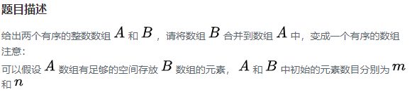
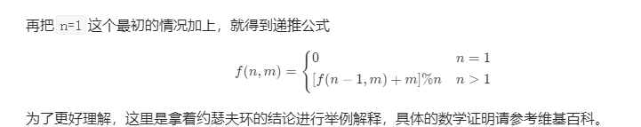
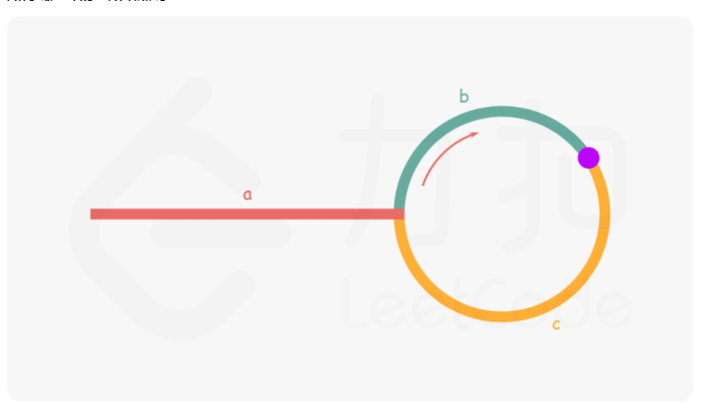

# 数据结构
## 1 栈和队列的区别

* 队列先进先出，栈先进后出。
* 栈的插入和删除操作都是在一端进行的，而队列的操作却是在两端进行的。
* 栈只允许在表尾一端进行插入和删除，而队列只允许在表尾一端进行插入，在表头一端进行删除。

## 2 二叉树的遍历方式有哪几种,口诉层序遍历

前序，中序，后序，层序

## 3 快排,及其时间复杂度

**快排思路：**
1.选择基准值：在待排序列中，按照某种方式挑出一个元素，作为基准值。
2.分割操作：以该基准值在序列中的实际位置，把序列分成两个子序列，一边是比它大的值，另外一边是比它小的值。
3.递归：对两个子序列进行快排，直到序列为空或者只有一个元素。
时间复杂度：平均O(nlogn),最坏O(n2)，最好O(nlogn)

```java
1.	public class QuickSort {  
2.	public static void main(String[] args) {  
3.	    int[] arr = new int[] {9,4,6,8,3,10,4,6};  
4.	    quickSort(arr,0,arr.length - 1);  
5.	    System.out.println(Arrays.toString(arr));  
6.	      
7.	}  
8.	public static void quickSort(int[] arr,int low,int high) {  
9.	    int p,i,j,temp;  
10.	      
11.	    if(low >= high) {  
12.	        return;  
13.	    }  
14.	    //p就是基准数,这里就是每个数组的第一个  
15.	    p = arr[low];  
16.	    i = low;  
17.	    j = high;  
18.	    while(i < j) {  
19.	        //右边当发现小于p的值时停止循环  
20.	        while(arr[j] >= p && i < j) {  
21.	            j--;  
22.	        }  
23.	                          
24.	        //这里一定是右边开始，上下这两个循环不能调换   
25.	  
26.	        //左边当发现大于p的值时停止循环  
27.	        while(arr[i] <= p && i < j) {  
28.	            i++;  
29.	        }  
30.	            temp = arr[j];  
31.	            arr[j] = arr[i];  
32.	            arr[i] = temp;  
33.	    }  
34.	    arr[low] = arr[i];//这里的arr[i]一定是停小于p的，经过i、j交换后i处的值一定是小于p的(j先走)  
35.	    arr[i] = p;   
36.	    quickSort(arr,low,j-1);  //对左边快排  
37.	    quickSort(arr,j+1,high); //对右边快排  
38.	      
39.	    }  
40.	} 
```

[参考](https://blog.csdn.net/pange1991/article/details/85460755)

## **4 平衡二叉树（AVL树）**

（没有具体说考察的平衡二叉树的哪一方面）

* 产生原因：

  二叉树的深度会影响搜索的效率，有时存储的序列非常有序，可能会退化成单链表形式，查找效率为O(N)，而平衡二叉树以一种高度平衡的结构，使二叉树的深度保持在一个很短的范围内，查找效率为O(logN)。

  [参考](https://zhuanlan.zhihu.com/p/56066942)

* 定义：

  它是一棵空树或它的左右两个子树的高度差的绝对值不超过1，并且左右两个子树都是一棵平衡二叉树   

* 衍生：（LeetCode110）**判断平衡二叉树** 

  解法：[自顶向下的递归或自顶向上的递归](https://leetcode-cn.com/problems/balanced-binary-tree/solution/ping-heng-er-cha-shu-by-leetcode-solution/)

   ```java
  class Solution {
      public boolean isBalanced(TreeNode root) {
          if(root==null){
              return true;
          }
  
          if(Math.abs(getHight(root.left,0)-getHight(root.right,0))<=1){
              return isBalanced(root.left)&&isBalanced(root.right);
          }else{
              return false;
          }
      }
  
  
      public int getHight(TreeNode root,int height){
          if(root==null){
              return 0;
          }
          return Math.max(getHight(root.left,0),getHight(root.right,0))+1;
      }
  }
   ```

* 增、删

  **平衡因子：**某一个节点左右子树的**高度差**。值为0,1，-1，对应等高，左比右搞，右比左高。如果平衡因子绝对值超过1，则失衡。

  **最小失衡子树：**在新插入的结点向上查找，以第一个平衡因子的绝对值超过 1 的结点为根的子树称为最小不平衡子树。

   **增加节点：**

  先寻找**最小不平衡树**，然后寻找所属的不平衡类别，再**根据4种类别进行固定化程序的操作。**

  LL | 在 A 的左子树根节点的左子树上插入节点而破坏平衡 | 右旋转

  RR | 在 A 的右子树根节点的右子树上插入节点而破坏平衡 | 左旋转

  LR | 在A的左子树根节点的右子树上插入节点而破坏平衡 | 先左旋后右旋

  RL | 在 A 的右子树根节点的左子树上插入节点而破坏平衡 | 先右旋后左旋

  具体如何旋转：[参考](https://zhuanlan.zhihu.com/p/56066942)

   **删除节点**

  注意：插入操作后只需要对插入栈中的弹出的第一个非平衡节点进行修正，而**删除操作需要修正栈中的所有非平衡节点**。

  对于删除操作造成的非平衡状态的修正，可以这样理解：对左或者右子树的删除操作相当于对右或者左子树的插入操作，然后再对应上插入的四种情况选择相应的旋转就好了。
  [参考](https://zhuanlan.zhihu.com/p/56066942)

  具体删除代码可参考下面的博客。
  [参考](https://blog.csdn.net/fxkcsdn/article/details/81674653)

* 优缺点：
  由于维护这种高度平衡所付出的代价比从中获得的效率收益还大，故而实际的应用不多，更多的地方是用追求局部而不是非常严格整体平衡的红黑树。当然，如果**应用场景**中对插入删除不频繁，只是对查找要求较高，那么AVL还是较优于红黑树。

  （简短:优点是查找速度快，缺点是旋转代价高）
   [参考](https://marian5211.github.io/2018/03/09/B%E6%A0%91%E3%80%81B-%E6%A0%91%E3%80%81AVL%E6%A0%91%E3%80%81Trie%E6%A0%91%E5%8F%8A%E5%85%B6%E5%BA%94%E7%94%A8%E5%9C%BA%E6%99%AF/)

  

# 算法题: 
## 合并两个数组 NC22

   

  **方法：遍历数组，依次比较**
  **解题思路**：先定义一个数组res用来存放A和B中的元素。遍历数组A、B中元素，如果A[i]<=B[j]则将A的元素加入res中，如果A[i]>B[j]则将B的元素加入res中。如果A，B其中有一个遍历完，另一个没遍历完，则将未遍历完的数组中的元素全部加入res中，最后再将res中的数据存入数组A中。

  ```java
  1.	public class Solution {  
  2.	    public void merge(int A[], int m, int B[], int n) {  
  3.	        int[] res = new int[m+n];    
  4.	        int i=0,j=0,r=0;  
  5.	        while(i<m && j<n){      //遍历A.B中的元素  
  6.	            if(A[i]<=B[j]){    //如果A<=B,A先放  
  7.	                res[r++] = A[i++];  
  8.	            }else{             //如果A>B，B先放  
  9.	                res[r++] = B[j++];  
  10.	            }  
  11.	        }  
  12.	        //如果A，B其中有一个遍历完，另一个没遍历完，则将未遍历完的数组中的元素全部加入res中  
  13.	        while(i<m){     //当A中的元素未遍历完时，将A中剩下的元素全部放入res中  
  14.	            res[r++]=A[i++];  
  15.	        }  
  16.	        while(j<n){     //当B中的元素未遍历完时，将B中剩下的元素全部放入res中  
  17.	            res[r++]=B[j++];  
  18.	        }  
  19.	        for(int k=0;k<res.length;k++){ //最后将数组res中的元素全部存入数组A中  
  20.	            A[k]=res[k];  
  21.	        }  
  22.	    }  
  23.	}  
  ```
  [参考](https://blog.nowcoder.net/n/ae6927468572437aa47131e2c052e677)


## [leetcode54](https://leetcode-cn.com/problems/spiral-matrix/) 

   二维数组，环形输出，白板编程，自己写测试输入输出样例

   ```java
   class Solution {
    public List<Integer> spiralOrder(int[][] matrix) {
           List result=new LinkedList<Integer>();
           int startcol=0;
           int endcol=matrix[0].length-1;
           int startrow=0;
           int endrow=matrix.length-1;
           while(true){
               //---->
               for(int j=startcol;j<=endcol;j++){
                   result.add(matrix[startrow][j]);
               }
              if(++startrow>endrow){
                  break;
              }
               //|上到下
               for(int i=startrow;i<=endrow;i++){
                       result.add(matrix[i][endcol]);
               }
               if(--endcol<startcol){
                   break;
               }
               //<----从左往右
               for(int j=endcol;j>=startcol;j--){
                       result.add(matrix[endrow][j]);
               }
              if(--endrow<startrow){
                   break;
               }
               //| 从下到上
               for(int i=endrow;i>=startrow;i--){
                       result.add(matrix[i][startcol]);
               }
               if(++startcol>endcol){
                   break;
               }
           }
           return result;
   
       }
   
   }
   
   ```

## 222. [完全二叉树的节点个数](https://leetcode-cn.com/problems/count-complete-tree-nodes/)

```java
   class Solution {
       int count=0;
       public int countNodes(TreeNode root) {
   
           DFS(root,1);
           return count;
       }
   
       public void DFS(TreeNode root,int index){
           if(root==null){
               return;
           }else{
               if(index>count){
                   count=index;
               }
               
           }
   
           DFS(root.right,2*index+1);
           DFS(root.left,2*index);
       }
   }
```

## [反转链表](https://www.nowcoder.com/practice/75e878df47f24fdc9dc3e400ec6058ca?tpId=117&&tqId=23286)

```java
/*
public class ListNode {
    int val;
    ListNode next = null;

    ListNode(int val) {
        this.val = val;
    }
}*/
public class Solution {
    public ListNode ReverseList(ListNode head) {
        //判断链表是否为空，或者链表长度为1
        if(head == null || head.next == null){
            return head;
        }
        ListNode pre = null; //当前节点的前一个节点
        ListNode next = null; //当前节点的下一个节点
        while(head != null){
            next = head.next; //记录当前节点的下一个节点
            head.next = pre; //让当前节点的next指针指向前一个节点，完成反转
            pre = head; //pre往右走
            head = next; //当前节点继续往右走
        }
        return pre;
    }
}
```

## [二分查找有序重复数组](https://www.nowcoder.com/practice/7bc4a1c7c371425d9faa9d1b511fe193?tpId=117&&tqId=1024577)
  - 追问， 如果有很多重复数字怎么办？
  - 解决方案 继续二分

```java
import java.util.*;

public class Solution {
    public int upper_bound_ (int n, int v, int[] a) {
        // 升序数组中所有的数都比给定的数字小
        if(a[n-1] < v){
            return n + 1;
        }
        int left = 0;
        int right = n-1;
        while(left < right){
            int mid = left + (right - left)/2; //中间点
            if(a[mid] >= v){
                right = mid;
            }else{
                left = mid + 1;
            }
        }
        return left + 1; //输出位置是从1
        
    }
}
```


## [计算类似"(1+2)*3+4/5"的题目](https://www.nowcoder.com/practice/c215ba61c8b1443b996351df929dc4d4?tpId=117&&tqId=1076787)
  - 以及判定是否合法 
  - 口述 + 伪代码

```java
import java.util.*;

public class Solution {
    public int solve(String s) {
    Stack<Integer> stack = new Stack<>();//使用栈来存储
    int sum = 0; //和
    int number = 0; //运算数字
    char sign = '+';
    char[] charArray = s.toCharArray(); //把字符串变成字符数组
    //遍历表达式
    for (int i = 0; i < charArray.length; i++) {
        char c = charArray[i];
        //遇到小括号时，递归
        if (c == '(') {
            int j = i + 1;
            int counterPar = 1; //记录左括号的个数
            while (counterPar > 0) { //一直寻找到匹配的右括号。注意是while不是if
                if (charArray[j] == '(') {
                    counterPar++;
                }
                if (charArray[j] == ')') {
                    counterPar--;
                }
                j++; //j用来计算右括号持续到哪一位。注意最后一次j到达右括号下一位了
            }
            number = solve(s.substring(i + 1, j - 1));//对括号内的计算式进行递归
            i = j - 1; //右括号之后的下一位
        }
        //如果该字符是数字
        if (Character.isDigit(c)) {
            number = number * 10 + c - '0'; //将char变成int
        }
        //如果该字符不是数字,或者已经到了末尾
        if (!Character.isDigit(c) || i == charArray.length - 1) {
            if (sign == '+') {//如果是+，不要计算，push进去
                stack.push(number); 
            } else if (sign == '-') {
                stack.push(-1 * number); //如果是-，push进去负的当前数
            } else if (sign == '*') { //如果是×、÷，pop出一个运算数和当前数作计算
                stack.push(stack.pop() * number);
            } else if (sign == '/') {
                stack.push(stack.pop() / number);
            }
            number = 0;//运算数字位清零
            sign = c; //注意：是进栈之后再后切换标志位
        }
    }
    while (!stack.isEmpty()) {//注意是while不是if
        sum += stack.pop();//相加
    }
    return sum;
}
}
```


## [写个类似 atoi (ascii to integer)的代码](https://www.nowcoder.com/practice/44d8c152c38f43a1b10e168018dcc13f?tpId=117)

  （是C/C++中的函数，将字符串转化为整型）


1. 处理空字符串
2. 忽略前置空格
3. 保存符号
4. 处理非法输入
5. 处理溢出

```java
import java.util.*;

public class Solution {
    public int atoi (String str) {
        char[] charArray = str.toCharArray();
        int idx = 0; //记录字符串的索引
        int sign = 1; //标志位，记录正负
        int val = 0;
        //1.空字符串
        if(str.length() == 0) {return 0;}
        //2.忽略前置空格
        while(charArray[idx] == ' ') {idx++;}
        //3.记录符号
        if(charArray[idx] == '-'){
            sign = -1;
            idx++;
        }
        if(charArray[idx] == '+'){idx++;}
        while(idx < charArray.length){
            //4.处理非法值
            if( charArray[idx] > '9'){break;}
            //5.处理溢出.Integer.MAX_VALUE=2147483647,Integer.MIN_VALUE=-2147483648.
            //第一种情况是val > Integer.MAX_VALUE / 10，不除以10的话将在下一个语句的时候溢出
            //第二种情况是val = Integer.MAX_VALUE /10，这里证明val和最大值的十位数和之前的都相等
            //需要再比较一下--个位数，如果个位数比最大值的个位数更大，就会溢出
            if (val > Integer.MAX_VALUE / 10 || (val == Integer.MAX_VALUE / 10 && charArray[idx] - '0' > Integer.MAX_VALUE % 10)){
                return sign == 1? Integer.MAX_VALUE: Integer.MIN_VALUE;
            }
            val = val * 10 + charArray[idx] - '0';
            idx++;
        }
        return val * sign;
    }
}
```

## [206. 反转链表](https://leetcode-cn.com/problems/reverse-linked-list/)

>反转一个单链表。
>
>**示例:**
>
>```
>输入: 1->2->3->4->5->NULL
>输出: 5->4->3->2->1->NULL
>```

```java
class Solution {
    public ListNode reverseList(ListNode head) {
        //特例
         if (head==null|| head.next == null)
            return head;
        //1(head)->    2(head.next)-->3
        //head<--2(head.next)<---3(newhead)
        ListNode newhead = reverseList(head.next);
        head.next.next = head;
		head.next = null;
        return newhead;
    }
}
```

## [232. 用栈实现队列](https://leetcode-cn.com/problems/implement-queue-using-stacks/)

>请你仅使用两个栈实现先入先出队列。队列应当支持一般队列的支持的所有操作（push、pop、peek、empty）：
>
>实现 MyQueue 类：
>
>void push(int x) 将元素 x 推到队列的末尾
>int pop() 从队列的开头移除并返回元素
>int peek() 返回队列开头的元素
>boolean empty() 如果队列为空，返回 true ；否则，返回 false
>
>
>说明：
>
>你只能使用标准的栈操作 —— 也就是只有 push to top, peek/pop from top, size, 和 is empty 操作是合法的。
>你所使用的语言也许不支持栈。你可以使用 list 或者 deque（双端队列）来模拟一个栈，只要是标准的栈操作即可。
>
>1 2 3
>
>instack 
>
>outstack 3  2 1

```java
class MyQueue {

    /** Initialize your data structure here. */
    LinkedList<Integer> instack;
    LinkedList<Integer> outstack;
    public MyQueue() {
         instack=new LinkedList<>();
         outstack=new LinkedList<>();
    }
    
    /** Push element x to the back of queue. */
    public void push(int x) {
        instack.addFirst(x);
    }
    
    /** Removes the element from in front of queue and returns that element. */
    public int pop() {
        if(!outstack.isEmpty()){
            return outstack.removeFirst();
        }
        while(!instack.isEmpty()){
            outstack.addFirst(instack.removeFirst());
        }
        return outstack.removeFirst();
    }
    
    /** Get the front element. */
    public int peek() {
         if(!outstack.isEmpty()){
            return outstack.peekFirst();
        }
        while(!instack.isEmpty()){
            outstack.addFirst(instack.removeFirst());
        }
        return outstack.peekFirst();

    }
    
    /** Returns whether the queue is empty. */
    public boolean empty() {
        return instack.isEmpty()&&outstack.isEmpty();
    }
}
```

## [旋转打印M*N二维数组](https://www.nowcoder.com/practice/7edf70f2d29c4b599693dc3aaeea1d31?tpId=117&tqId=693&tab=answerKey)

   题目主要是找出螺旋的规律即可,其他就是边界的判断

```java
import java.util.*;
//   1  2  3  4    螺旋： 1 2 3 4 8 12 11 10 9 5 6 7
//   5  6  7  8
//   9 10 11 12
public class Solution {
    public ArrayList<Integer> spiralOrder(int[][] matrix) {
        ArrayList<Integer> list = new ArrayList<>();
        //上下左右四个边界
        int top = 0, bottom = matrix.length-1;    //上=0，下=二维数组行数-1
        int left = 0, right = matrix[0].length-1; //左=0，右=二维数组列数-1
        
        //若输入为空
        if(matrix.length == 0)
            return list;
       
        //循环条件(边界判断)：还没有到达中间位置
        //循环一次：左->右，上->下，右->左，下->上
        while( top < (matrix.length+1)/2 && left < (matrix[0].length+1)/2 ){
            //上面  左到右
            for(int i = left; i <= right; i++){
                list.add(matrix[top][i]);
            }
            //右边 上到下
            for(int i = top+1; i <= bottom; i++){
                list.add(matrix[i][right]);
            }
            //下面  右到左   排除一行
            for(int i = right-1; top!=bottom && i>=left; i--){
                list.add(matrix[bottom][i]);
            }
            //左边 下到上   排除一列
            for(int i = bottom-1; left!=right && i>=top+1; i--){
                list.add(matrix[i][left]);
            }
            ++top;
            --bottom;
            ++left;
            --right;
        }
        return list;
    }
}

```

## 实现 double sqrt()函数

   如果**不得调用其他库函数**：二分法 和 牛顿递归法。


二分法：用二分的方法，在一个区间中，每次拿**中间数的平方来试验**，如果大了，就再试左区间的中间数；如果小了，就再拿右区间的中间数来试。比如求sqrt(16)的结果，你先试（0+16）/2=8，8*8=64，64比16大，然后就向左移，试（0+8）/2=4，4*4=16刚好，你得到了正确的结果sqrt(16)=4。但是浮点数因精度的原因，无法判断两个浮点数是否完全相等，只能说两者的差值绝对值小于某个精度，所以在二分查找时，需要一定的技巧。

```java
//double sqrt(int x)
public double mySqrt_binarysearch(int x) 
{
    //判断输入的值是否为负数或0
	if(x <= 0)	return 0; 
 
	double begin = 1;
	double end = x/2+1; //数学公式推导
	double mid, lastmid;
 
	mid = begin + (end-begin)/2;
	do{
		if(mid < x/mid) begin = mid;
		else	end = mid;
 
		lastmid = mid;
		mid = begin + (end-begin)/2;
	}
	while(ABS(lastmid-mid) > FLT_MIN);
	
	return mid;
}
```

## [剑指 Offer 62. 圆圈中最后剩下的数字](https://leetcode-cn.com/problems/yuan-quan-zhong-zui-hou-sheng-xia-de-shu-zi-lcof/)

### 递归公式的推导

[参考](https://leetcode-cn.com/problems/yuan-quan-zhong-zui-hou-sheng-xia-de-shu-zi-lcof/solution/huan-ge-jiao-du-ju-li-jie-jue-yue-se-fu-huan-by-as/)



```java
class Solution {
    public int lastRemaining(int n, int m) {
        if(n==1)
            return 0;
            
            return (lastRemaining(n-1,m)+m)%n;
            
    }
}
```


##  [141. 环形链表](https://leetcode-cn.com/problems/linked-list-cycle/)

>给定一个链表，判断链表中是否有环。
>
>如果链表中有某个节点，可以通过连续跟踪 next 指针再次到达，则链表中存在环。 为了表示给定链表中的环，我们使用整数 pos 来表示链表尾连接到链表中的位置（索引从 0 开始）。 如果 pos 是 -1，则在该链表中没有环。注意：pos 不作为参数进行传递，仅仅是为了标识链表的实际情况。
>
>如果链表中存在环，则返回 true 。 否则，返回 false 。



快慢指针，只要进了环，每次差一步，**绝对能相遇**

```java
public class Solution {
    public boolean hasCycle(ListNode head) {
        if (head == null) {
            return false;
        }
        ListNode slow = head, fast = head;
        boolean flag = false;
        while (slow.next != null && fast.next != null) {
            slow = slow.next;
            if (fast.next.next != null) {
                fast = fast.next.next;
            } else {
                break;
            }
            if (fast == slow) {
                flag = true;
                break;
            }
        }
        return flag;
    }
}
```
## 判断链表是否是回文链表

[题目:回文链表](https://www.nowcoder.com/practice/3fed228444e740c8be66232ce8b87c2f?tpId=117&tab=answerKey)

利用栈结构，从左到右遍历链表，遍历的过程中把每个节点依次压入栈中。因为栈是先进后出的，所以遍历完成后从栈顶到栈的节点值顺序会与原链表从左到右的值是顺序反过来的。那么如果一个链表是回文结构的话逆序之后值出现的顺序是一样的，如果不是回文结构，顺序就肯定对不上。

链表：1 2 3 3 2 1                                                     1 2 3 4

栈：（栈底）1 2 3 3 2 1  ----  1 2 3 3 2 1                1 2 3 4 ---- 4 3 2 1   

```java
public class Solution {
        public boolean isPail (ListNode head) {
        Stack<ListNode> stack=new Stack<ListNode>();
        ListNode cur = head; //记录当前节点的位置
        //把所有链表节点压入栈
        while(cur!=null){
            stack.push(cur);
            cur=cur.next;
        }
        //开始比较
        while(head!=null){
            //若链表从头到尾的顺序与栈中元素出栈的顺序不同，则返回false
            if(head.val!=stack.pop().val){
                return false; 
            }
            head=head.next; 
        }
        return true;
    }
}
```


## 跳台阶那种 动态规划问题

[题目:青蛙跳台阶](https://www.nowcoder.com/practice/8c82a5b80378478f9484d87d1c5f12a4?tpId=117&tab=answerKey)：一只青蛙一次可以跳上1级台阶，也可以跳上2级台阶。求该青蛙跳上一个 n 级的台阶总共有多少种跳法。

当成动态规划问题来想的话：首先分析问题，它最终解是由前面的解累积起来的解，如何缩小问题的规模？

第一阶有只能一步，只有一种；

第二阶可以两次一步、一次两步，有两种

- 若楼梯阶级 n = 3
  - 跳 2 步到 3：剩下的是第一步没跳，起始跳到第一步只有一种
  - 跳 1 步到 3：剩下的是第二步没跳，起始跳到第二步有两种

通过分类讨论，问题规模就减少了:

- 若楼梯阶级 n = n
  - 跳 2 步到 n：剩下的是第 n - 2 步没跳，起始跳到第 n - 2 步设它为 pre2 种
  - 跳 1 步到 n：剩下的是第 n - 1 步没跳，起始跳到第 n - 1 步设它为 pre1 种

同时可以发现第 n 阶的解法，只要用到 n - 1 和 n - 2 阶是多少，其他的不用考虑，因此用两个变量临时存下来即可，dp(n) = dp(n-2) + dp(n-1)

和斐波那契数列的公式很像：

%3D%0A%5Cbegin%7Bcases%7D%0A1%26%2C%20%20%5Ctext%7Bn%3D1%7D%20%5C%5C%0A2%20%26%2C%5Ctext%7Bn%3D2%7D%20%5C%5C%0Af(n-1)%20%2B%20f(n-2)%20%26%2C%5Ctext%7Bn%3E2%7D%0A%5Cend%7Bcases%7D%0A&preview=true)

(线上答题可以通过，但是面试别写型，时间复杂度 &preview=true))

```java
//递推写法
public class Solution {
    public int jumpFloor(int target) {
        if (target <= 0) {
            return -1;
        } else if (target == 1) {
            return 1;
        } else if (target ==2) {
            return 2;
        } else {
            return  jumpFloor(target-1)+jumpFloor(target-2);
        }
    }
}
```


自底向上型循环求解，时间复杂度为 &preview=true)。

```java
public class Solution {
    public int jumpFloor(int target) {
        if (target <= 0) {//非法输入
            return -1;
        }else if(target <= 2){//小于等于2步时
            return target;
        }
        int[] dp = new int[target + 1]; //空间复杂度为O(N)
        dp[1] = 1;
        dp[2] = 2;
        for(int i = 3; i <= target; i++ ){
            dp[i] = dp[i-1] + dp[i-2];
        }
        return dp[target];
    }
}
```


```java
public class Solution {
    public int jumpFloor(int target) {
        if (target <= 0) {
            return -1;
        }else if(target <= 2){ 
            return target;
        }
        //仿照斐波那契数列优化后的写法，空间复杂度变为O(1)
        //发现计算f[5]的时候只用到了f[4]和f[3], 没有用到f[2]...f[0]
        //所以保存f[2]..f[0]是浪费了空间。只需要用3个变量即可。
        int pre2 = 1, pre1 = 2,cur = 0; 
        for (int i = 3; i <= target; i++){
            cur = pre2 + pre1;
            pre2 = pre1;
            pre1 = cur;
        }
        return cur;
    }
}
```


   
