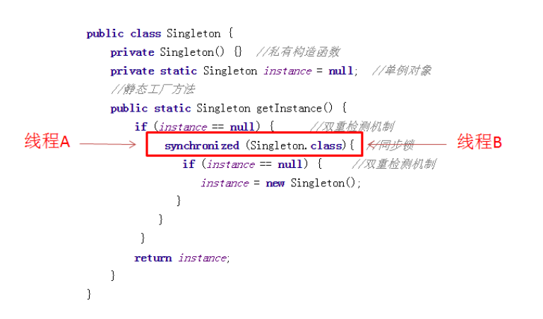
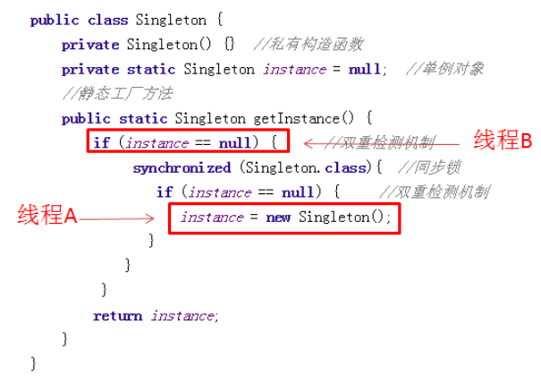
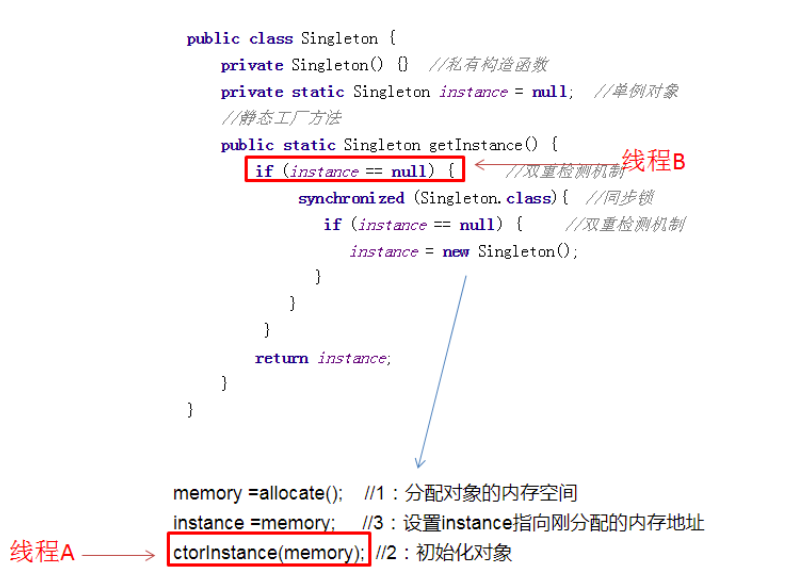

# 设计模式
## 单例模式
了解哪些设计模式？写一个双重检测的单例模式，为什么要加synchronized？因为要考虑线程安全，加在类方法和普通方法有什么区别？加在类方法是锁住类的class对象，而普通方法是锁住类的对象。

### （一）懒汉式单例

懒汉式单例模式在第一次调用的时候进行实例化。

#### 1、适用于单线程环境（线程不安全）

>* 要想让一个类只能构建一个对象，自然不能让它随便去做new操作，因此Signleton的构造方法是私有的。
>* instance是Singleton类的静态成员，也是我们的单例对象。它的初始值可以写成Null，也可以写成new Singleton()。
>    * 如果单例初始值是null，还未构建，则构建单例对象并返回。这个写法属于单例模式当中的**懒汉模式。**
>    * 如果单例对象一开始就被new Singleton()主动构建，则不再需要判空操作，这种写法属于**饿汉模式。**
>* getInstance是获取单例对象的方法。

```java
public class Singleton{

    private static Singleton instance = null; //私有构造函数
	
    //私有构造函数
    private Singleton() {
    }

    /**
     * 1、适用于单线程环境（不推荐）
     */
    //静态工厂方法
    public static Singleton1 getInstance() {
        if (null == instance) {
            instance = new Singleton();
        }
        return instance;
    }
}
```
**为什么线程不安全？**

假设Singleton类刚刚被初始化，instance对象还是空，这时候两个线程同时访问getInstance方法


显然instance被构建了两次

> 此方式在单线程的时候工作正常，但在多线程的情况下就有问题了。如果两个线程同时运行到判断instance是否为null的if语句，并且instance的确没有被创建时，那么两个线程都会创建一个实例，此时类型Singleton就不再满足单例模式的要求了。

#### 2、适用于多线程环境（效率不高）

>为了保证在多线程环境下我们还是只能得到该类的一个实例，只需要在getInstance()方法加上同步关键字sychronized，就可以了。**但**每次调用getInstance()方法时都被synchronized关键字锁住了，会引起线程阻塞，影响程序的性能。

```java
public class Singleton{

    private static Singleton instance = null;

    private Singleton() {
    }

    /**
     * 2、适用于多线程环境，但效率不高（不推荐）
     */
    public static synchronized Singleton getInstance() {
        if (instance == null) {
            instance = new Singleton();
        }
        return instance;
    }
  
}

```
#### 3、双重检验锁（存在指令重排问题）

>为了在多线程环境下，不影响程序的性能，不让线程每次调用getInstance()方法时都加锁，而只是在实例未被创建时再加锁，在加锁处理里面还需要判断一次实例是否已存在。

```java
public class Singleton{
	//单例对象
    private static Singleton instance = null;
	
    //私有构造函数
    private Singleton() {
    }

    /**
     * 3、双重检查加锁（推荐）
     */
    //静态工厂方法
    public static Singleton getInstance() {
        // 先判断实例是否存在，若不存在再对类对象进行加锁处理
        if (instance == null) { //双重检测机制
            synchronized (Singleton.class) { //同步锁
                if (instance == null) { //双重检测机制
                    instance = new Singleton();
                }
            }
        }
        return instance;
    }
}
```
* 为了防止new Singleton被执行多次，因此在new操作之前加上Synchronized 同步锁，**锁住整个类（注意，这里不能使用对象锁）。**

* 进入Synchronized 临界区以后，还要再做一次判空。因为当两个线程同时访问的时候，线程A构建完对象，**线程B也已经通过了最初的判空验证**，不做第二次判空的话，线程B还是会再次构建instance对象。

* 正确流程

  

  

  

  

  

  **为什么存在指令重排问题？**

  假设这样的场景，当两个线程一先一后访问getInstance方法的时候，当A线程正在构建对象，B线程刚刚进入方法：

  

  * 要么Instance还没被线程A构建，线程B执行 if（instance == null）的时候得到true；
  * 要么Instance已经被线程A构建完成，线程B执行 if（instance == null）的时候得到false。

  * 但是由于**指令重排**会出现**Instance还没被线程A构建完成**，但线程B执行 if（instance == null）的时候得到**false**,从而**返回半成品。**

指令重排是什么意思呢？

比如java中简单的一句 instance = new Singleton()，会被编译器编译成如下JVM指令：

```java
memory =allocate(); //1：分配对象的内存空间

ctorInstance(memory); //2：初始化对象

instance =memory; //3：设置instance指向刚分配的内存地址
```

但是这些指令顺序并非一成不变，有可能会经过JVM和CPU的优化，**指令重排成下面的顺序**：

```java
memory =allocate(); //1：分配对象的内存空间

instance =memory; //3：设置instance指向刚分配的内存地址

ctorInstance(memory); //2：初始化对象
```

当线程A执行完1,3,时，instance对象还未完成初始化，但已经不再指向null。此时如果线程B抢占到CPU资源，执行 if（instance == null）的结果会是false，从而返回一个**没有初始化完成的instance对象**。




#### 4、双重校验volatile方式（解决指令重排问题）

在instance对象前面增加一个修饰符**volatile。**

```java
public class Singleton {
    private Singleton() {}  //私有构造函数
    private volatile static Singleton instance = null;  //单例对象
    //静态工厂方法
    public static Singleton getInstance() {
          if (instance == null) {      //双重检测机制
         synchronized (Singleton.class){  //同步锁
           if (instance == null) {     //双重检测机制
             instance = new Singleton();
                }
             }
          }
          return instance;
      }
}
```

经过volatile的修饰，当线程A执行instance = new Singleton( )的时候，JVM执行顺序是什么样？始终保证是下面的顺序：

```java
memory =allocate(); //1：分配对象的内存空间

ctorInstance(memory); //2：初始化对象

instance =memory; //3：设置instance指向刚分配的内存地址
```

**如此在线程B看来，instance对象的引用要么指向null，要么指向一个初始化完毕的Instance，而不会出现某个中间态，保证了安全。**

#### 5、静态内部类方式（存在反射重复构建对象的问题）

```java
public class SingleTon{
  private SingleTon(){}
 
  private static class SingleTonHoler{
     private static SingleTon INSTANCE = new SingleTon();
 }
 
  public static SingleTon getInstance(){
    return SingleTonHoler.INSTANCE;
  }
}
```

静态内部类的优点是：外部类加载时并不需要立即加载内部类，内部类不被加载则不去初始化INSTANCE，故而不占内存。即当SingleTon第一次被加载时，并不需要去加载SingleTonHoler，只有当getInstance()方法第一次被调用时，才会去初始化INSTANCE,第一次调用getInstance()方法会导致虚拟机加载SingleTonHoler类，这种方法不仅**能确保线程安全，也能保证单例的唯一性，同时也延迟了单例的实例化。**

* **延迟了单例的实例化。**即当SingleTon第一次被加载时，并不需要去加载SingleTonHoler，只有当getInstance()方法第一次被调用时，虚拟机加载SingleTonHoler类。

  **静态内部类就属于被动引用**

  类加载时机：JAVA虚拟机在有且仅有的5种场景下会对类进行初始化。
  1.遇到new、getstatic、setstatic或者invokestatic这4个字节码指令时，对应的java代码场景为：new一个关键字或者一个实例化对象时、读取或设置一个静态字段时(final修饰、已在编译期把结果放入常量池的除外)、调用一个类的静态方法时。
  2.使用java.lang.reflect包的方法对类进行反射调用的时候，如果类没进行初始化，需要先调用其初始化方法进行初始化。
  3.当初始化一个类时，如果其父类还未进行初始化，会先触发其父类的初始化。
  4.当虚拟机启动时，用户需要指定一个要执行的主类(包含main()方法的类)，虚拟机会先初始化这个类。
  5.当使用JDK 1.7等动态语言支持时，如果一个java.lang.invoke.MethodHandle实例最后的解析结果REF_getStatic、REF_putStatic、REF_invokeStatic的方法句柄，并且这个方法句柄所对应的类没有进行过初始化，则需要先触发其初始化。
  这5种情况被称为是类的主动引用，注意，**这里《虚拟机规范》中使用的限定词是"有且仅有"，那么，除此之外的所有引用类都不会对类进行初始化，称为被动引用。静态内部类就属于被动引用的行列。**

* **保证单例的唯一性**

  我们再回头看getInstance()方法，调用的是SingleTonHoler.INSTANCE，取的是SingleTonHoler里的INSTANCE对象，不管多少个线程去调用getInstance()方法，取的都是同一个INSTANCE对象，而不用去重新创建。当getInstance()方法被调用时，SingleTonHoler才在SingleTon的运行时常量池里，把符号引用替换为直接引用（类加载过程的 `解析` 阶段），这时静态对象INSTANCE也真正被创建，然后再被getInstance()方法返回出去。

* **保证线程安全**

   虚拟机会保证一个类的<clinit>()方法在多线程环境中被正确地加锁、同步，如果多个线程同时去初始化一个类，那么只会有一个线程去执行这个类的<clinit>()方法，其他线程都需要阻塞等待，直到活动线程执行<clinit>()方法完毕。如果在一个类的<clinit>()方法中有耗时很长的操作，就可能造成多个进程阻塞(需要注意的是，其他线程虽然会被阻塞，但如果执行<clinit>()方法后，其他线程唤醒之后不会再次进入<clinit>()方法。同一个加载器下，一个类型只会初始化一次。

  >`<clinit>()` 方法是由编译器按照语句在源文件中出现的顺序，依次自动收集类中的所有**类变量**的赋值动作和静态代码块中的语句合并产生的

[参考](https://blog.csdn.net/mnb65482/article/details/80458571)

**如何通过反射打破单例模式只能构建一个对象实例的约束（单例模式共同问题）？**

第一步，获得单例类的构造器。

第二步，把构造器设置为可访问。

第三步，使用newInstance方法构造对象。

```java
//获得构造器
Constructor con = SingleTon.class.getDeclaredConstructor();
//设置为可访问
con.setAccessible(true);
//构造两个不同的对象
SingleTon singleton1 = (SingleTon)con.newInstance();
SingleTon singleton2 = (SingleTon)con.newInstance();
//验证是否是不同对象 比较结果是false。
System.out.println(singleton1.equals(singleton2));
```

### （二）饿汉式单例

> 饿汉式单例类:在类初始化时，已经自行实例化。

#### 1、 普通

```java
public class Singleton2 {

    private static final Singleton2 instance = new Singleton2();

    private Singleton2() {
    }

    public static Singleton2 getInstance() {
        return instance;
    }
}
```

#### 2、枚举方式（解决反射和序列化的问题） 

```java
public enum EnumSingleton {
    INSTANCE;    
}
```

使用枚举实现的单例模式，不但可以防止利用**反射强行构建单例对象**，而且可以在枚举类对象被**反序列化**的时候，保证反序列的返回结果是同一对象。

**反射攻击**

```java
public class Singleton implements Serializable {  
    private static Singleton instance = new Singleton();  
    private Singleton (){}  
    public static Singleton getInstance() {  
    	return instance;  
    }  
}

public class Main {

    public static void main(String[] args) throws Exception {
        Singleton s = Singleton.getInstance();

        // 拿到所有的构造函数，包括非public的
        Constructor<Singleton> constructor = Singleton.class.getDeclaredConstructor();
        constructor.setAccessible(true);
        // 使用空构造函数new一个实例。即使它是private的~~~
        Singleton sReflection = constructor.newInstance();

        System.out.println(s); //com.fsx.bean.Singleton@1f32e575
        System.out.println(sReflection); //com.fsx.bean.Singleton@279f2327
        System.out.println(s == sReflection); // false
    }

}
```

**序列化反序列化攻击**

```java
public class Main {

    public static void main(String[] args) throws Exception {
        Singleton s = Singleton.getInstance();

        byte[] serialize = SerializationUtils.serialize(s);
        Object deserialize = SerializationUtils.deserialize(serialize);


        System.out.println(s); //com.fsx.bean.Singleton@452b3a41
        System.out.println(deserialize); //com.fsx.bean.Singleton@6193b845
        System.out.println(s == deserialize); //false

    }

}
```

**枚举防御反射攻击**

```java
public class Main {

    public static void main(String[] args) throws Exception {
        EnumSingleton s = EnumSingleton.INSTANCE;

        // 拿到所有的构造函数，包括非public的
        Constructor<EnumSingleton> constructor = EnumSingleton.class.getDeclaredConstructor(String.class, int.class);// 拿到有参的构造器
        constructor.setAccessible(true);
        // 使用空构造函数new一个实例。即使它是private的~~~
        System.out.println("拿到了构造器：" + constructor);
        EnumSingleton sReflection = constructor.newInstance("testInstance", 1);

        System.out.println(s); 
        System.out.println(sReflection); 
        System.out.println(s == sReflection); 
    }

}
```

运行报错

```javascript
拿到了构造器：private com.fsx.bean.EnumSingleton(java.lang.String,int)
Exception in thread "main" java.lang.IllegalArgumentException: Cannot reflectively create enum objects
	at java.lang.reflect.Constructor.newInstance(Constructor.java:417)
	at com.fsx.maintest.Main.main(Main.java:22)
```

第一句输出了，表示我们是成功拿到了构造器`Constructor`对象的，只是在执行`newInstance`时候报错了。并且也提示报错在`Constructor`的417行，看看`Constructor`的源码处：

```java
public final class Constructor<T> extends Executable {
	...
    public T newInstance(Object ... initargs) throws InstantiationException, IllegalAccessException, IllegalArgumentException, InvocationTargetException {
		...
        if ((clazz.getModifiers() & Modifier.ENUM) != 0)
            throw new IllegalArgumentException("Cannot reflectively create enum objects");
		...
	}
	...
}
```

主要是这一句：`(clazz.getModifiers() & Modifier.ENUM) != 0`。说明：`反射在通过newInstance创建对象时，会检查该类是否ENUM修饰，如果是则抛出异常，反射失败`，因此**枚举类型对反射是绝对安全的。**

**枚举防御序列化问题**

```java
public class Main {

    public static void main(String[] args) {
        EnumSingleton s = EnumSingleton.INSTANCE;

        byte[] serialize = SerializationUtils.serialize(s);
        Object deserialize = SerializationUtils.deserialize(serialize);
        System.out.println(s == deserialize); //true
    }

}
```

**其他单例防御序列化攻击必须实现readResolve方法**

当把 MySingleton对象(通过getInstance方法获得的那个单例对象)序列化后再从内存中读出时, 就有一个全新但跟原来一样的MySingleton对象存在了

```java
public final class MySingleton implements Serializable {
     private MySingleton() { }
     private static final MySingleton INSTANCE = new MySingleton();
     public static MySingleton getInstance() { return INSTANCE; }
}
```
这样当JVM从内存中反序列化地"组装"一个新对象时,就**会自动调用这个 readResolve方法来返回我们指定好的对象了, 单例规则也就得到了保证.**
```java
public final class MySingleton implements Serializable{
    private MySingleton() { }
    private static final MySingleton INSTANCE = new MySingleton();
    public static MySingleton getInstance() { return INSTANCE; }
    private Object readResolve() throws ObjectStreamException {
       // instead of the object we're on,
       // return the class variable INSTANCE
      return INSTANCE;
   }
}
```

[参考](https://blog.csdn.net/huangbiao86/article/details/6896565)

[参考](https://cloud.tencent.com/developer/article/1497592)

[参考](https://blog.csdn.net/u011595939/article/details/79972371)  [参考](https://zhuanlan.zhihu.com/p/33102022)