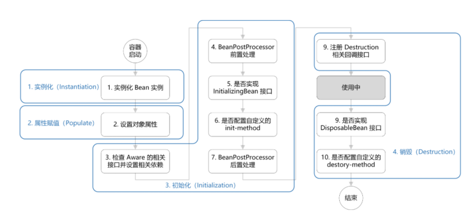
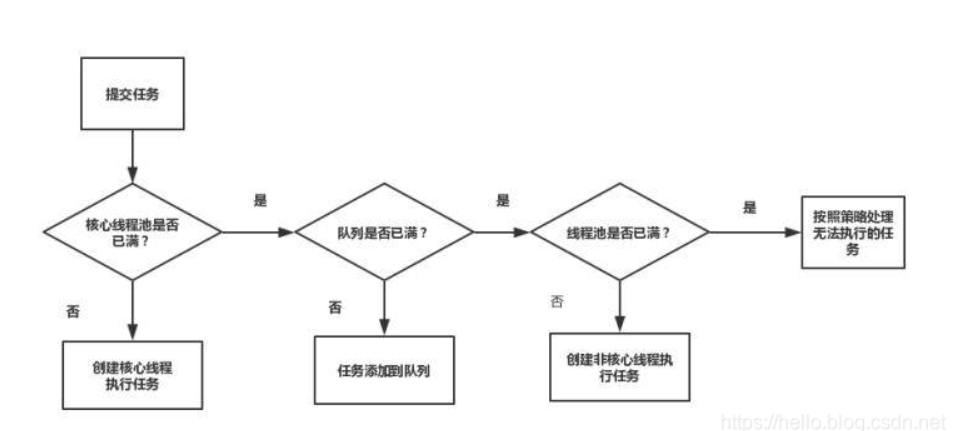

# 1/21[快手面经](https://www.nowcoder.com/discuss/589953)

## 12.25北京快手实习数据中台一面(60mins)

1. Spring bean的生命周期?

   对于普通的Java对象，当new的时候创建对象，当它没有任何引用的时候被垃圾回收机制回收。而由Spring IoC容器托管的对象，它们的生命周期完全由容器控制。

   Bean 的生命周期概括起来就是 **4 个阶段**：

   1. 实例化（Instantiation）

   	* 实例化Bean 

   2. 属性赋值（Populate）

      * 设置对象属性（依赖注入）

   3. 初始化（Initialization）
   
      * 初始化前
        * 注入Aware接口（通过让bean 实现 Aware 接口，则能在 bean 中获得相应的 Spring 容器资源。）
        * BeanPostProcessor前置处理
      * 初始化操作
         * 是否实现InitializingBean接口（接口实现写初始化逻辑）
         * 是否配置自定义的init-method（指定初始化方法）
   	 * 初始化后
           * BeanPostProcessor后置处理
   4. 销毁（Destruction）
       * 是否实现Disposablebean接口
       * 配置自定义的destroy-method
   
   
   
   [参考博客](https://chaycao.github.io/2020/02/15/%E5%A6%82%E4%BD%95%E8%AE%B0%E5%BF%86Spring-Bean%E7%9A%84%E7%94%9F%E5%91%BD%E5%91%A8%E6%9C%9F/)
   
   [参考博客](https://www.zhihu.com/question/38597960)


2. PostConstruct注解 

   用途：@PostConstruct主要应用场景是在初始化Servlet时加载一些缓存数据等。

   PostConstruct 注释用于在**依赖关系注入完成之后**需要执行的方法上，以执行任何初始化。此方法必须在将**类放入服务之前（init方法，初始化**）调用。

   顺序 Constructo（构造方法）>> @Autowired（依赖注入） >> @PostConstruct（生成对象时完成某些初始化操作）

   

   [参考博客](https://www.jianshu.com/p/98cf7d8b9ec3)

   [参考博客](https://blog.csdn.net/wo541075754/article/details/52174900)

3. hashmap的实现，hashmap线程不安全的具体场景 

   * 通过hash的方法，通过put和get存储和获取对象。

   * 存储对象时，我们将K/V传给put方法时，它调用hashCode计算hash从而得到bucket位置；进一步存储，HashMap会根据当前bucket的占用情况自动调整容量(超过Load Facotr【桶填满的程度】则resize为原来的2倍)。

   * 获取对象时，我们将K传给get，它调用hashCode计算hash从而得到bucket位置，并进一步调用equals()方法确定键值对。如果发生碰撞的时候，Hashmap通过链表将产生碰撞冲突的元素组织起来，在Java 8中，如果一个bucket中碰撞冲突的元素超过某个限制(默认是8)，则使用红黑树来替换链表，从而提高速度。

     [参考博客](https://yikun.github.io/2015/04/01/Java-HashMap%E5%B7%A5%E4%BD%9C%E5%8E%9F%E7%90%86%E5%8F%8A%E5%AE%9E%E7%8E%B0/)

     1.在jdk1.7中，在多线程环境下，扩容时会造成环形链或数据丢失。

     2.在jdk1.8中，在多线程环境下，会发生数据覆盖的情况。

     [参考博客](https://www.cnblogs.com/aspirant/p/11450839.html)

4. NIO和BIO的区别 

   * IO的方式通常分为几种，同步阻塞的BIO、同步非阻塞的NIO、异步非阻塞的AIO。
   * BIO全称是Blocking IO，是JDK1.4之前的传统IO模型，本身是同步阻塞模式。 线程发起IO请求后，一直阻塞IO，直到缓冲区数据就绪后，再进入下一步操作。

   * NIO也叫Non-Blocking IO 是同步非阻塞的IO模型。线程发起io请求后，立即返回（非阻塞io）。**同步**指的是必须等待IO缓冲区内的数据就绪，而**非阻塞**指的是，用户线程不原地等待IO缓冲区，可以先做一些其他操作，但是要**定时轮询检查IO缓冲区数据**是否就绪。IO多路复用模型中，将检查IO数据是否就绪的任务，**交给系统级别的select或epoll模型**，由系统进行监控，减轻用户线程负担。

   * BIO只能接收一个连接，无法处理大量连接。NIO单线程处理多个连接。

     [参考博客](https://juejin.cn/post/6844903985158045703)

5. NIO的BIO的适用场景 

   * BIO方式适用于连接数目比较少且固定的架构，这种方式对服务器资源要求比较高，并发局限于应用中，JDK1.4以前的唯一选择，程序只管简单易理解。

   * NIO方式适用于连接数目多且比较短的架构，比如聊天服务器，并发局限于应用中，编程比较复杂，JDK1.4开始支持。

     [参考博客](https://my.oschina.net/u/4006148/blog/3163873)

6. NIO的性能瓶颈在哪?
    网络IO往往是性能瓶颈,CPU和磁盘或许仍然会比网络速度快几个数量级。在这种情况下，你绝对不希望让异常快速的CPU等待相对缓慢的网络。
    [参考博客](http://arganzheng.life/java-nio.html)

7. Spring的循环依赖问题 

    * **循环依赖**其实就是循环引用，也就是两个或者两个以上的bean互相持有对方，最终形成闭环。比如A依赖于B，B依赖于C，C又依赖于A。

    * **Spring中循环依赖场景**有：

      1. 构造器的循环依赖(无法解决，只能拋出BeanCurrentlyInCreationException异常)
      2. field属性的循环依赖

          * setter方式单例，默认方式其中

            先将Bean对象实例化【依赖无参构造函数】--->再设置对象属性的,不会出来循环的问题

          * setter方式原型，prototype
          
            Spring容器无法完成依赖注入，因为“prototype”作用域的Bean，Spring容器不进行缓存，因此无法提前暴露一个创建中的Bean。
      
    * Spring怎么解决循环依赖

      Spring解决循环依赖的诀窍就在于singletonFactories这个三级cache, 发生在**createBeanInstance(实例化)**之后，也就是说单例对象此时已经被创建出来(调用了构造器)。这个对象已经被生产出来了，虽然还不完美（还没有进行初始化的第二步和第三步），但是已经能被人认出来了（根据对象引用能定位到堆中的对象），所以Spring此时将这个对象提前曝光出来让大家认识，让大家使用

8. ConcurrentHashMap 具体实现，cas和synchronize具体如何用的 
      * ConcurrentHashMap同样也分为 1.7 、1.8 版，两者在实现上略有不同。	
      
      * Base 1.7
        * 是由 Segment 数组、HashEntry 组成，和 HashMap 一样，仍然是数组加链表。
	  		* Segment 数组，存放数据时首先需要定位到具体的 Segment 中 。
      		* HashEntry 和 HashMap 中的 HashEntry 作用一样，真正存放数据的桶，唯一的区别就是其中的核心数据如 value ，以及链表都是 volatile 修饰的，保证了获取时的可见性。
        * ConcurrentHashMap 采用了分段锁技术，其中 **Segment 继承于 ReentrantLock**。不会像 HashTable 那样不管是 put 还是 get 操作都需要做同步处理，理论上 ConcurrentHashMap 支持 CurrencyLevel (Segment 数组数量)的线程并发。每当一个线程占用锁访问一个 Segment 时，不会影响到其他的 Segment。
      	* put 方法
        	* 首先是通过 key 定位到 Segment，之后在对应的 Segment 中进行具体的 put。
        	*  虽然 HashEntry 中的 value 是用 volatile 关键词修饰的，但是并不能保证并发的原子性，所以 **put 操作时仍然需要加锁处理。**
        * get 方法
            * 只需要将 Key 通过 Hash 之后定位到具体的 Segment ，再通过一次 Hash 定位到具体的元素上。
            *  由于 HashEntry 中的 value 属性是用 volatile 关键词修饰的，保证了内存可见性，所以每次获取时都是最新值。**因为整个过程都不需要加锁**。
        
      *  Base 1.8
      
        * 抛弃了原有的 Segment 分段锁，而采用了 **`CAS + synchronized`** 来保证并发安全性。
      
        * 也将 1.7 中存放数据的 HashEntry 改为 Node，但作用都是相同的。
      
        * 其中的 `val next` 都用了 volatile 修饰，保证了可见性。
      
        * put方法
      
          * 根据 key 计算出 hashcode 。
          * 判断是否需要进行初始化。
          * `f` 即为当前 key 定位出的 Node，如果为空表示当前位置可以写入数据，利用 **CAS 尝试写入，失败则自旋保证成功**。
          * 如果当前位置的 `hashcode == MOVED == -1`,则需要进行扩容。
          * 如果都不满足，则利用 **synchronized 锁写入数据**。
          * 如果数量大于 `TREEIFY_THRESHOLD` 则要转换为红黑树。
      
        * get 方法
        * 根据计算出来的 hashcode 寻址，如果就在桶上那么直接返回值。
          * 如果是红黑树那就按照树的方式获取值。
          * 都不满足那就按照链表的方式遍历获取值
        
        [参考](https://crossoverjie.top/2018/07/23/java-senior/ConcurrentHashMap/)
      
9. 实现一个线程池 

      线程池的执行
   
   ​	创建完成ThreadPoolExecutor之后，当向线程池提交任务时，通常使用execute方法。execute方法的执行流程图如下：
   
   
   
   - 如果线程池中存活的核心线程数小于线程数corePoolSize时，线程池会创建一个核心线程去处理提交的任务。
   - 如果线程池核心线程数已满，即线程数已经等于corePoolSize，一个新提交的任务，会被放进任务队列workQueue排队等待执行。
   - 当线程池里面存活的线程数已经等于corePoolSize了,并且任务队列workQueue也满，判断线程数是否达到maximumPoolSize，即最大线程数是否已满，如果没到达，创建一个非核心线程执行提交的任务。
   - 如果当前的线程数达到了maximumPoolSize，还有新的任务过来的话，直接采用拒绝策略处理。

##  1.8北京快手实习数据中台二面（50mins） 

1. 问Spring启动过程中发生了什么，聊自己的理解？ 

   Spring 的启动流程主要是定位 -> 加载 -> 注册 -> 实例化

   - *定位 - 获取配置文件路径*

   - *加载 - 把配置文件读取成 BeanDefinition*

   - *注册 - 存储 BeanDefinition*

   - *实例化 - 根据 BeanDefinition 创建实例*

     [参考](https://blog.leapmie.com/archives/390/#2-%E5%AF%BB%E6%89%BE%E5%85%B3%E9%94%AE%E5%85%A5%E5%8F%A3%E6%96%B9%E6%B3%95refresh)

2. [leetcode54](https://leetcode-cn.com/problems/spiral-matrix/) 二维数组，环形输出，白板编程，自己写测试输入输出样例

   ```java
   class Solution {
    public List<Integer> spiralOrder(int[][] matrix) {
           List result=new LinkedList<Integer>();
           int startcol=0;
           int endcol=matrix[0].length-1;
           int startrow=0;
           int endrow=matrix.length-1;
           while(true){
               //---->
               for(int j=startcol;j<=endcol;j++){
                   result.add(matrix[startrow][j]);
               }
              if(++startrow>endrow){
                  break;
              }
               //|上到下
               for(int i=startrow;i<=endrow;i++){
                       result.add(matrix[i][endcol]);
               }
               if(--endcol<startcol){
                   break;
               }
               //<----从左往右
               for(int j=endcol;j>=startcol;j--){
                       result.add(matrix[endrow][j]);
               }
              if(--endrow<startrow){
                   break;
               }
               //| 从下到上
               for(int i=endrow;i>=startrow;i--){
                       result.add(matrix[i][startcol]);
               }
               if(++startcol>endcol){
                   break;
               }
           }
           return result;
   
       }
   
   }
   
   ```

   

#### 222. [完全二叉树的节点个数](https://leetcode-cn.com/problems/count-complete-tree-nodes/)

```java
   class Solution {
       int count=0;
       public int countNodes(TreeNode root) {
   
           DFS(root,1);
           return count;
       }
   
       public void DFS(TreeNode root,int index){
           if(root==null){
               return;
           }else{
               if(index>count){
                   count=index;
               }
               
           }
   
           DFS(root.right,2*index+1);
           DFS(root.left,2*index);
       }
   }
```

   

   


##  1.13北京快手实习数据中台三面（50mins） 

1. 取三个0-1之间的数和小于1的概率 

   做空间直角坐标系XYZ
   分别用x、y、z表示个随i机数
   那么x、y、z都属于（0，1）
   在空间dao画出范围zhuan就是一个边长为1的正立方体
   做平面x+y+z<=1，即与3个轴相交于点（1,0,0）（0,1,0）（0,0,1），下面是一个三棱锥
   所求概率=三棱锥的体积/立方体的体积
   =（1/3）（1\*1/2）\*1/1
   =1/6
   所以3个数不大于1的概率是1/6

2. #### [1020. 飞地的数量](https://leetcode-cn.com/problems/number-of-enclaves/)

   ```java
   public int numEnclaves(int[][] A) {
           int count=0;
           int[][] visited=new int[A.length][A[0].length];
           //遍历四条边
           //上
           for(int i=0;i<A[0].length;i++){
               if(A[0][i]==1){
                   DFS(A,0,i,visited);
               }
           }
           //下
           for(int i=0;i<A[0].length;i++){
               if(A[A.length-1][i]==1){
                   DFS(A,A.length-1,i,visited);
               }
           }
           //左
           for(int i=1;i<A.length-1;i++){
               if(A[i][0]==1){
                   DFS(A,i,0,visited);
               }
           }
           //右
           for(int i=1;i<A.length-1;i++){
               if(A[i][A[0].length-1]==1){
                   DFS(A,i,A[0].length-1,visited);
               }
           }
           for(int i=0;i<A.length;i++){
               for(int j=0;j<A[0].length;j++){
                   if(A[i][j]==1&&visited[i][j]==0){
                      System.out.println(i+" "+j);
                       count++;
                   }
               }
           }
           return count;
       }
   
       public void DFS(int[][] A,int i,int j,int[][] visited){
           if(visited[i][j]==1||A[i][j]==0){
               return;
           }
   
           visited[i][j]=1;
           //上
           if(isArea(A,i-1,j)){
               DFS(A,i-1,j,visited);
           }
           //下
           if(isArea(A,i+1,j)){
               DFS(A,i+1,j,visited);
           }
   
           //左
           if(isArea(A,i,j-1)){
               DFS(A,i,j-1,visited);
           }
   
           //右
           if(isArea(A,i,j+1)){
               DFS(A,i,j+1,visited);
           }
       }
   
       public boolean isArea(int[][] A,int i,int j){
           if(i<=A.length-1&&i>=0&&j>=0&&j<=A[0].length-1){
               return true;
           }else{
               return false;
           }
       }
   ```

   

3. #### [1027. 最长等差数列](https://leetcode-cn.com/problems/longest-arithmetic-subsequence/)

 